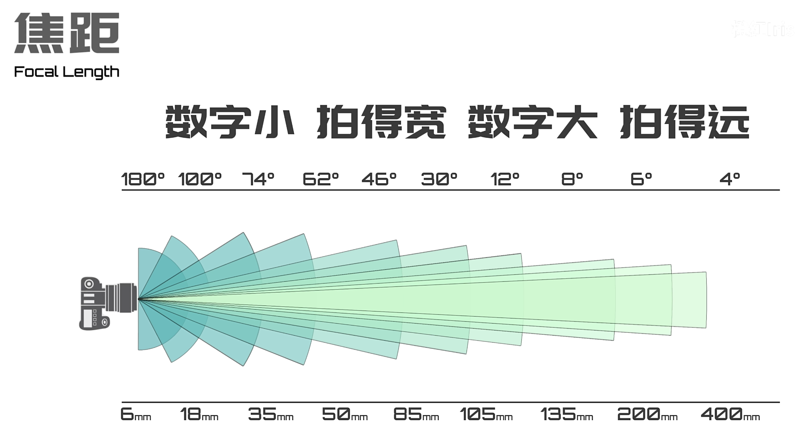
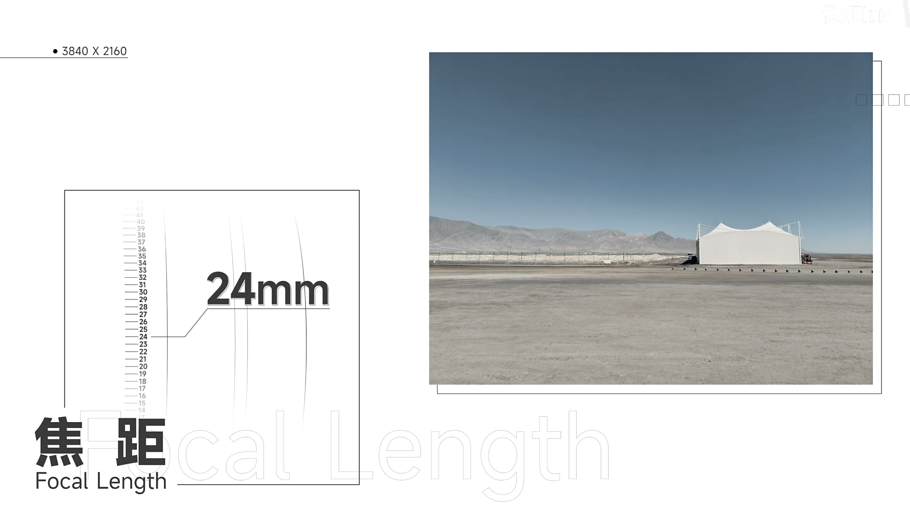
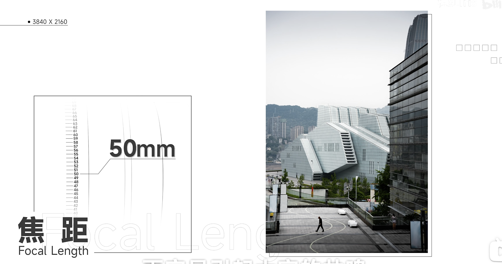
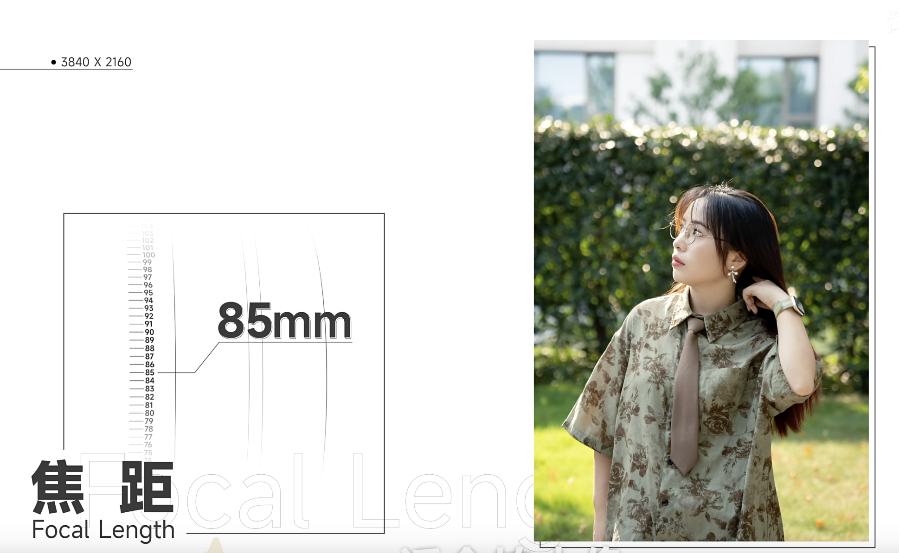
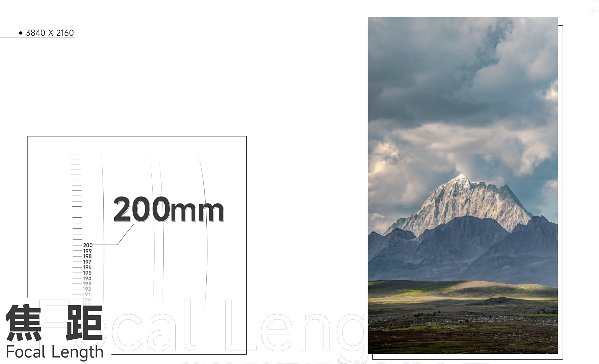
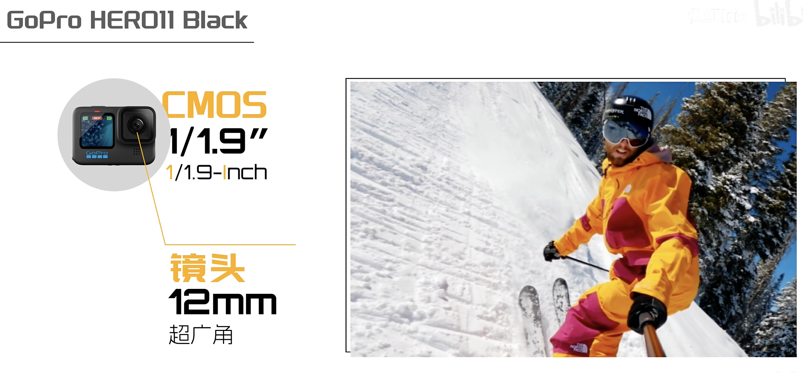
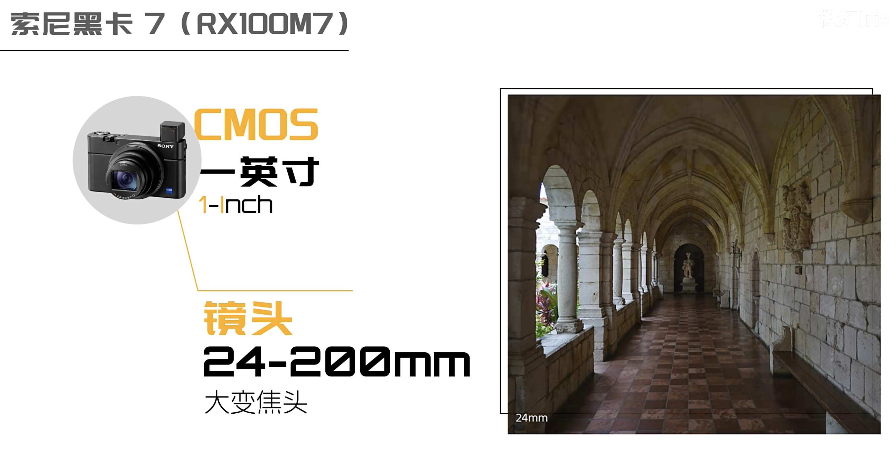
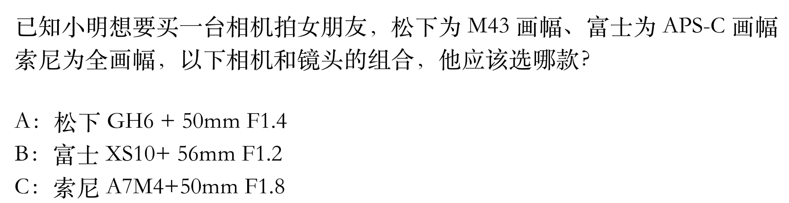
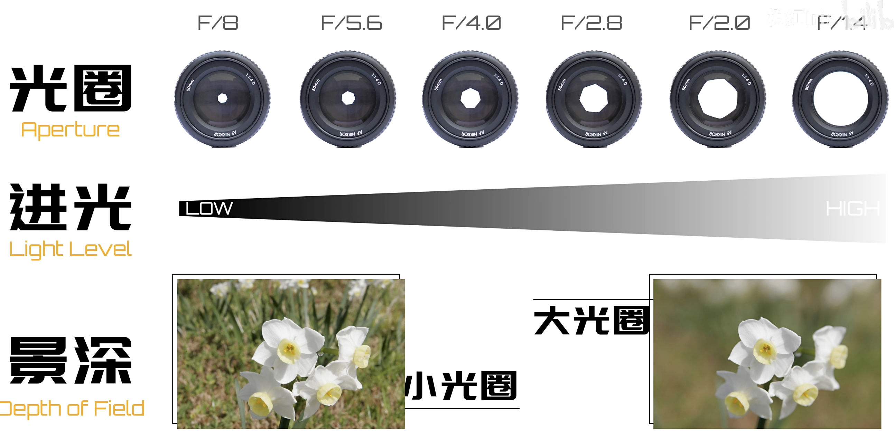

# 认识相机
感光元件 CMOS + 镜头 组成

1. 感光元件 决定画质
2. 镜头决定 视角

### 焦距

> 数字小、拍的宽；数字大，拍的远。

{ style="display: block; width: 400px; margin: 0 auto;" }

- 大而全的广角镜头（比如焦距24mm）：适合拍摄自然风光
{ style="display: block; width: 400px; margin: 0 auto;" }

- 和人眼接近的视角（比如焦距50mm）：和人眼视角接近，被称为人文视角
{ style="display: block; width: 400px; margin: 0 auto;" }

- 中长焦（比如焦距85mm）：突出人物、背景虚化，适合拍人像
{ style="display: block; width: 400px; margin: 0 auto;" }

- 更长焦（比如焦距200mm）：适合拍摄野生动物（打鸟），
{ style="display: block; width: 400px; margin: 0 auto;" }

### CMOS、画幅、底

分母越大，传感器越小！

以全画幅（Full Frame）大小为基准（36mm × 24mm），对角线/1.5就是半画幅（也叫 APS-C画幅、残幅），对角线/2就是M4/3画幅，再往下还有卡片机常用的1英寸（1/2.72全画幅）。手机上普遍是1/2到1英寸。

相机就是以画幅来区分低、中、高端的。

底越大越能容纳更多的像素，暗处的噪点也会更少，还能有更好的虚化效果。

| 画幅规格 | 实际尺寸 | 裁切系数 | 面积(相对全画幅) | 定位 |
| :------- | :------- | :------- | :--------------- | :--- |
| 全画幅 | 36×24mm | 1.0× | 100% | 专业顶级 |
| 半画幅(APS-C) | 23.6×15.7mm | 1.5× | 43% | 主流均衡 |
| M4/3 | 17.3×13mm | 2.0× | 26% | 轻便便携 |
| 1英寸 | 13.2×8.8mm | 2.7× | 13% | 卡片机/高端手机 |
| 1/1.9英寸 | 6.4×5.6mm | 5.0× | 4% | GoPro/运动相机 |

举例：

- Go-Pro，底很小，画质肯定不如手机了；但是焦距很小，可以拍的很宽。

{ style="display: block; width: 400px; margin: 0 auto;" }

- 索尼黑卡7，底1英寸，镜头覆盖24-200mm，覆盖日常大部分场景。

>    注意哦，因为这个底是1英寸的，所以本身由于 CMOS 带来的2.72倍的裁切系数，原本对于全画幅来说需要24mm 的物理焦距，在1英寸上，就只需要24/2.72=8.82mm，200mm 的等效焦距，物理焦距是200/2.72=73.5mm。

{ style="display: block; width: 400px; margin: 0 auto;" }

因此引申到了裁切系数和等效焦距

1. CMOS 的底，比如全画幅，裁切系数为1；APS-C 画幅，裁切系数为1.5；M4/3画幅，裁切系数为2；一英寸的裁切系数为2.72。也就是说底是1/x"，x 就是裁切系数。

{ style="display: block; width: 400px; margin: 0 auto;" }

等效焦距（拍人像适合85mm，裁切系数×物理焦距）：
A. 2\*50 = 100mm
B. 1.5\*56 = 84mm
C. 1\*50 = 50mm

因此，对于本题，选择 B。

### 光圈

> f/x，x小，光圈越大。光圈越大、背景虚化越明显、进光量也更大，夜景噪点就更少啦。

{ style="display: block; width: 400px; margin: 0 auto;" }

$等效虚化 = 物理光圈 × 裁切系数$

举例：有一堆相机，都用 f/2.8 的物理光圈

| 画幅规格        | 裁切系数 | 实际物理光圈 | 等效全画幅虚化光圈 | 虚化效果       | 代表设备                  |
|-----------------|----------|--------------|--------------------|----------------|---------------------------|
| 全画幅          | 1.0×     | f/2.8        | f/2.8              | 强，奶油虚化   | 索尼A7、佳能R系列、尼康Z  |
| 半画幅（APS-C） | 1.5×     | f/2.8        | f/4.2              | 中等，有虚化   | 富士XT、索尼ZVE-10、佳能M |
| M4/3            | 2.0×     | f/2.8        | f/5.6              | 较弱，层次一般 | 松下GH、奥林巴斯OM-D     |
| 1英寸（黑卡7）| 2.7×     | f/2.8        | f/7.6              | 很弱，轻微虚化 | 索尼黑卡RX100M7、部分卡片机 |
| 1/1.9英寸（GoPro） | 5.0×  | f/2.8        | f/14               | 几乎无虚化     | GoPro HERO系列、运动相机  |

所以，对于手机，即使光圈很大，但是由于底很小，导致虚化效果就很差。

能快速拍出大众意义上的好照片，从而积累信心，才有兴趣不断学习，脱离糖水片，进而钻研构图、影调等更深的学问。
