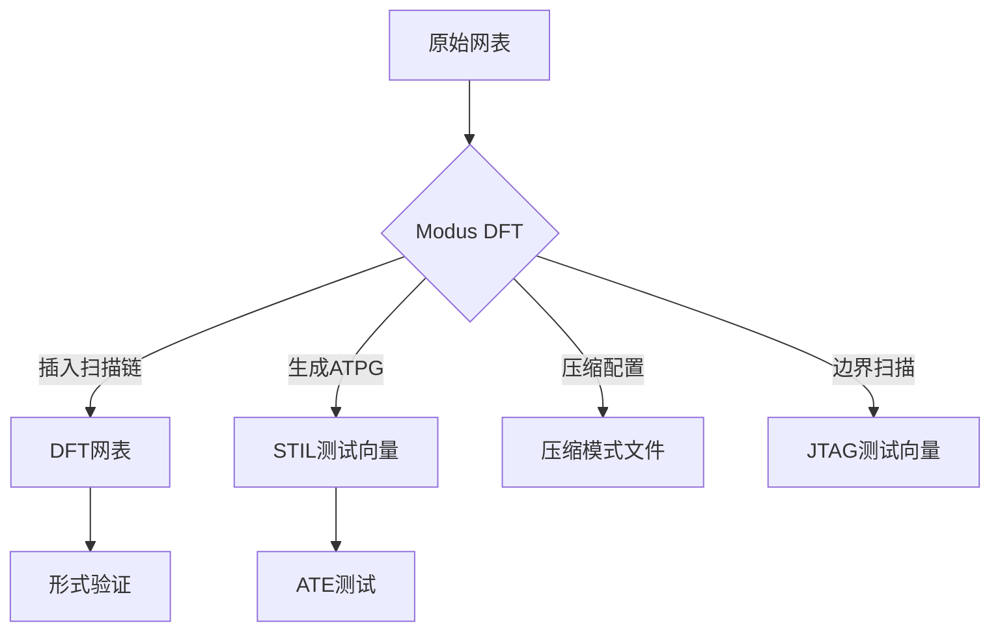
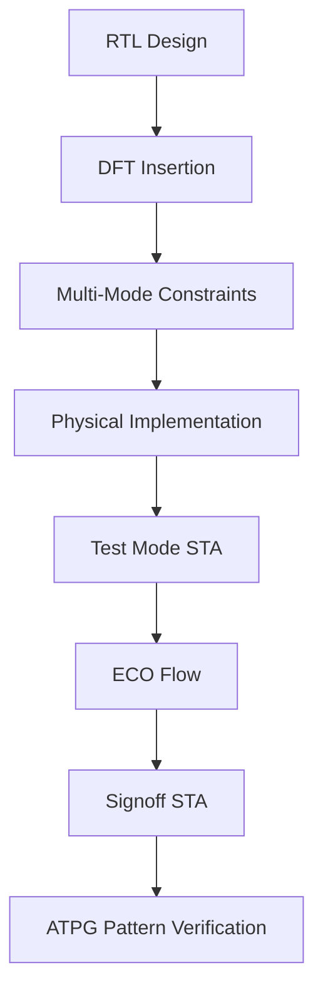

# 逻辑综合

## 综合定义

### RTL到门级

### 综合流程

### 逻辑综合

### 网表

## 逻辑优化

### 门级优化

### 面积优化
速度优化
布尔优化

## 时序分析约束

### 时钟定义

### 关键路径
时序报告

## 综合工具

### DC

### genus

## 工艺库与技术

### 标准单元库

### 工艺节点
延迟模型
功耗模型

## 功耗优化

### 功耗估计

### 低功耗综合

## 综合后分析

### 网表分析

### 时序报告
面积报告
功耗报告
设计检查

# DFT设计

## DFT基础

### 可测性设计

在数字芯片研发中，DFT（Design for Testability，可测性设计）是确保芯片制造后能够高效检测缺陷的关键环节。以下是对DFT设计中基础知识的系统化解释：

------

### **1. DFT的核心目标**

- **提高故障覆盖率**：检测制造缺陷（如短路、断路等）。
- **降低测试成本**：减少测试时间和数据量。
- **简化测试流程**：通过自动化工具生成高效的测试向量。

------

### **2. 可测性设计的核心概念**

- **可控制性（Controllability）**：通过外部输入控制内部节点的逻辑值。

- **可观察性（Observability）**：通过外部输出观察内部节点的逻辑状态。

- 故障模型（Fault Model）

  ：

  - **Stuck-at故障**：信号线固定为0或1。
  - **Transition故障**：信号跳变延迟超限（如时序故障）。
  - **路径延迟故障**：关键路径的传播延迟不达标。

------

### **3. DFT关键技术**

#### **(1) 扫描链（Scan Chain）**

- **原理**：将普通触发器替换为**扫描触发器**，在测试模式下连接成串行移位链。

- 流程

  ：

  - **扫描插入**：在逻辑综合后替换触发器。
  - **测试模式**：通过扫描链加载测试向量（Scan-in），捕获响应（Scan-out）。

- **优势**：显著提升内部节点的控制与观察能力。

- **挑战**：面积开销（5%~20%）、时序影响（扫描路径可能引入延迟）。

#### **(2) 内建自测试（BIST, Built-In Self-Test）**

- **原理**：芯片内部集成测试逻辑，自主生成测试向量并分析结果。

- 类型

  ：

  - **逻辑BIST（LBIST）**：测试随机逻辑，通常结合扫描链。
  - **存储器BIST（MBIST）**：针对SRAM/DRAM的专用测试（检测单元故障、耦合故障等）。

- **优势**：减少对外部测试设备的依赖，支持在线测试。

#### **(3) 边界扫描（Boundary Scan, IEEE 1149.1/JTAG）**

- **原理**：在芯片I/O引脚插入边界扫描单元，形成测试访问端口（TAP）。

- 应用

  ：

  - 板级互联测试（检测PCB焊接缺陷）。
  - 芯片功能调试与编程（如FPGA配置）。

- **标准接口**：TDI（输入）、TDO（输出）、TCK（时钟）、TMS（模式选择）。

------

### **4. DFT流程与工具**

#### **(1) 典型DFT流程**

1. **RTL设计**：插入DFT约束（如测试模式定义）。
2. **扫描插入**：替换扫描触发器并连接成链（工具：Synopsys DFT Compiler、Cadence Modus）。
3. **ATPG（自动测试向量生成）**：生成针对故障模型的测试向量（工具：Mentor Tessent、Synopsys TetraMAX）。
4. **测试压缩**：采用压缩算法减少测试数据量（如EDT、Adaptive Scan）。
5. **物理设计集成**：确保扫描链布线满足时序和物理约束。
6. **验证**：仿真测试模式与功能模式的兼容性。

#### **(2) 测试压缩技术**

- **目的**：降低测试数据体积（通常压缩率可达10-100倍）。

- 方法

  ：

  - **基于编码的压缩**：如Golomb编码、游程编码。
  - **动态压缩**：通过广播机制将单个输入分发到多个扫描链。

------

### **5. DFT设计挑战与优化**

- 面积与功耗

  ：

  - 采用**部分扫描（Partial Scan）**：仅选择关键路径的触发器。
  - **时钟门控测试**：避免测试模式下不必要的动态功耗。

- 时序收敛

  ：

  - 在物理设计阶段优化扫描链布局，避免关键路径恶化。

- 测试覆盖率

  ：

  - 结合**ATPG**与**故障仿真**（如Stuck-at、Transition、Path Delay覆盖率分析）。

------

### **6. 前沿趋势**

- **AI驱动的DFT**：利用机器学习优化测试向量生成与故障诊断。
- **3D IC测试**：针对堆叠芯片的TSV（硅通孔）测试方案。
- **安全DFT**：防止测试接口成为硬件安全攻击的入口（如加密扫描链）。

------

### **总结**

DFT是数字芯片设计中不可或缺的一环，通过扫描链、BIST、边界扫描等技术，平衡测试覆盖率与成本。随着工艺节点演进和芯片复杂度提升，DFT将持续向智能化、高压缩率、高安全性方向发展。

**芯知了:**

以下是一个关于DFT基础可测性设计的完整Verilog代码示例和详细解释，重点展示扫描链（Scan Chain）设计：

```verilog
// 带扫描链的D触发器模块（Scan Flip-Flop）
module scan_ff (
    input        clk,       // 时钟信号
    input        rst_n,     // 异步复位
    input        scan_en,   // 扫描使能信号
    input        d,         // 正常数据输入
    input        scan_in,   // 扫描链输入
    output reg   q,         // 正常数据输出
    output       scan_out   // 扫描链输出
);

// 内部多路选择器
wire mux_out = scan_en ? scan_in : d;

// 触发器主体
always @(posedge clk or negedge rst_n) begin
    if (!rst_n) 
        q <= 1'b0;      // 异步复位
    else 
        q <= mux_out;   // 选择正常数据或扫描数据
end

// 扫描输出直接连接Q端
assign scan_out = q;

endmodule

// 扫描链顶层模块（4位扫描链示例）
module scan_chain_top (
    input         clk,
    input         rst_n,
    input         scan_en,
    input         scan_in,
    output [3:0]  data_out,
    output        scan_out
);

// 扫描链信号连接
wire [3:0] internal_scan;

// 实例化4个扫描触发器
scan_ff ff0 (
    .clk(clk),
    .rst_n(rst_n),
    .scan_en(scan_en),
    .d(1'b0),          // 正常数据输入（示例）
    .scan_in(scan_in),  // 扫描链输入
    .q(data_out[0]),
    .scan_out(internal_scan[0])
);

scan_ff ff1 (
    .clk(clk),
    .rst_n(rst_n),
    .scan_en(scan_en),
    .d(1'b0),
    .scan_in(internal_scan[0]),
    .q(data_out[1]),
    .scan_out(internal_scan[1])
);

scan_ff ff2 (
    .clk(clk),
    .rst_n(rst_n),
    .scan_en(scan_en),
    .d(1'b0),
    .scan_in(internal_scan[1]),
    .q(data_out[2]),
    .scan_out(internal_scan[2])
);

scan_ff ff3 (
    .clk(clk),
    .rst_n(rst_n),
    .scan_en(scan_en),
    .d(1'b0),
    .scan_in(internal_scan[2]),
    .q(data_out[3]),
    .scan_out(scan_out)
);

endmodule
```

关键代码解释：

1. **扫描触发器设计（scan_ff模块）**：

   - 第7行：定义扫描使能信号scan_en，控制工作模式切换
   - 第12行：2选1多路器实现模式切换（正常模式选择d，扫描模式选择scan_in）
   - 第15-20行：触发器核心逻辑，包含异步复位功能
   - 第23行：扫描输出直接连接触发器输出端，形成链式结构

2. **扫描链拓扑结构（scan_chain_top模块）**：

   - 第32行：定义内部扫描链连接信号
   - 第35-62行：实例化4个扫描触发器并级联
   - 连接方式：ff0.scan_out -> ff1.scan_in -> ff2.scan_in -> ff3.scan_in

3. **工作模式说明**：

   - 正常模式（scan_en=0）：触发器接收d端功能数据
   - 扫描模式（scan_en=1）：
     - 测试数据从scan_in串行输入
     - 每个时钟周期数据在扫描链中移动一级
     - 经过4个周期可将4bit测试数据装载到触发器
     - 捕获响应后通过scan_out串行移出

4. **测试流程**： ```verilog // 伪测试流程示意 initial begin // 进入扫描模式 scan_en = 1;

   // 装载测试向量（示例：4'b1010） scan_in = 0; #10 clk = 1; #10 clk = 0; // 周期1：移入0 scan_in = 1; #10 clk = 1; #10 clk = 0; // 周期2：移入1 scan_in = 0; #10 clk = 1; #10 clk = 0; // 周期3：移入0 scan_in = 1; #10 clk = 1; #10 clk = 0; // 周期4：移入1

   // 切换正常模式捕获响应 scan_en = 0; #10 clk = 1; #10 clk = 0;

   // 返回扫描模式移出数据 scan_en = 1; for (int i=0; i<4; i++) begin #10 clk = 1; #10 clk = 0; $display("Scan out: %b", scan_out); end

end

\```

扩展说明：

1. 该设计实现了基本的扫描链结构，可将内部触发器转换为可控/可观测节点
2. 实际芯片中扫描链通常占芯片面积的15-25%，需要平衡测试覆盖率和面积开销
3. 现代DFT设计还需结合：
   - 压缩技术（EDT/OPMISR）
   - 内建自测试（BIST）
   - 边界扫描（JTAG 1149.1）
4. 扫描链设计要求：
   - 避免组合逻辑环路
   - 处理异步复位/置位信号
   - 时钟域交叉处理
   - 功耗控制（测试时翻转率可能高达50%）

此示例展示了DFT最基础的可控性和可观测性设计原理，实际工业级设计还需要考虑时序收敛、物理实现、测试向量生成等复杂因素。

### 测试覆盖率

在数字芯片的DFT（Design for Testability，可测试性设计）中，测试覆盖率是衡量制造缺陷检测能力的关键指标。以下是对测试覆盖率的详细解析：

------

### **1. 测试覆盖率的定义**

**测试覆盖率**表示通过DFT结构（如扫描链）和自动测试向量（ATPG生成的测试模式）能够检测到的芯片制造缺陷的比例。其核心目标是确保芯片在制造后能够被高效筛选出缺陷，降低出厂故障率（DPPM）。

------

### **2. 故障模型与覆盖率计算**

- **故障模型**：
  - **固定型故障（Stuck-at Fault）**：最常见模型，假设某个节点逻辑值固定为0或1。
  - **过渡延迟故障（Transition Delay Fault）**：检测信号跳变（0→1或1→0）是否在规定时间内完成。
  - **路径延迟故障（Path Delay Fault）**：验证关键路径的时序是否符合要求。
  - **桥接故障（Bridging Fault）**：检测电路节点间短路导致的逻辑错误。
- **覆盖率公式**：测试覆盖率=被检测到的故障数量总可检测故障数量×100测试覆盖率=总可检测故障数量被检测到的故障数量×100*注：总故障数需排除冗余或不可测的故障（如未激活的逻辑）。*

------

### **3. 影响测试覆盖率的因素**

- **扫描链设计**：扫描链长度、平衡性、时钟域划分是否合理。
- **ATPG工具效率**：向量生成算法能否覆盖复杂故障场景。
- **不可控节点**：如异步逻辑、模拟模块、未初始化的寄存器。
- **测试压缩技术**：如EDT（Embedded Deterministic Test）可能隐藏部分故障信息，需工具正确配置。
- **设计冗余**：冗余逻辑可能导致故障无法被激活或传播。

------

### **4. 提高测试覆盖率的方法**

- 插入测试点（Test Points）

  ：

  - **控制点（Control Point）**：强制设置难以控制的节点值。
  - **观测点（Observation Point）**：增强对内部信号的观测能力。

- 优化扫描链

  ：

  - 减少扫描链长度，平衡链间延迟差异。
  - 采用多扫描链结构，支持并行测试。

- 混合测试策略

  ：

  - 结合 **MBIST（存储器内建自测试）** 和 **LBIST（逻辑内建自测试）**。
  - 针对不同故障模型生成向量（如Stuck-at + Transition Delay）。

- 动态ATPG配置

  ：

  - 调整故障检测阈值，启用高级故障模型（如Small Delay Defect）。

------

### **5. 测试覆盖率的行业标准与权衡**

- 目标值

  ：

  - 固定型故障覆盖率通常需 ≥95%（汽车电子可能要求 ≥99%）。
  - 延迟故障覆盖率一般较低（约80-90%），因时序路径复杂性。

- 权衡因素

  ：

  - **测试时间**：高覆盖率需要更多测试向量，增加ATE测试时间。
  - **面积开销**：插入测试点或扫描链会占用额外芯片面积。
  - **功耗**：测试模式下可能触发更高的动态功耗，需进行功耗感知测试。

------

### **6. 覆盖率验证流程**

1. **故障列表生成**：提取门级网表中的潜在故障。
2. **故障模拟（Fault Simulation）**：利用测试向量模拟故障传播，统计可检测故障。
3. **覆盖率分析**：识别未覆盖的故障，优化向量或修改设计。
4. **迭代优化**：反复执行ATPG和故障模拟，直至满足覆盖率目标。

------

### **7. 工具与关键技术**

- 主流工具

  ：

  - Synopsys DFT Compiler、TetraMAX
  - Siemens EDA（Mentor） Tessent
  - Cadence Modus DFT

- 先进技术

  ：

  - **Test Compression**：如Tessent TestKompress，减少向量数据量。
  - **Hierarchical DFT**：分层式测试，提升大规模芯片效率。
  - **AI-Driven ATPG**：利用机器学习优化测试向量生成。

------

### **8. 测试覆盖率 vs. 功能验证覆盖率**

- **DFT测试覆盖率**：针对制造缺陷（物理故障），通过结构化的扫描测试实现。
- **功能验证覆盖率**：验证设计逻辑是否符合规范（如代码覆盖率、功能场景覆盖）。

------

### **总结**

测试覆盖率是DFT设计的核心指标，直接决定芯片量产质量。通过优化扫描链、插入测试点、结合多故障模型，并借助先进工具，DFT工程师需在覆盖率、面积、测试成本间找到平衡。高覆盖率不仅降低DPPM，更是汽车、航天等高可靠性领域芯片的必备要求。

**芯知了:**

以下是一个关于DFT设计中测试覆盖率的完整示例，包含代码和关键解释：

# 一、测试覆盖率基础示例

## 1. 示例电路描述

```verilog
// 文件名：example_circuit.v
1   module example_circuit (
2     input clk, rst_n,
3     input [1:0] data_in,
4     output reg [1:0] data_out
5   );
6   
7   reg [1:0] reg_a, reg_b;
8   
9   always @(posedge clk or negedge rst_n) begin
10    if (!rst_n) begin
11      reg_a <= 2'b00;
12      reg_b <= 2'b00;
13    end else begin
14      reg_a <= data_in;
15      reg_b <= reg_a;
16      data_out <= reg_b;
17    end
18  end
19  
20 endmodule
```

## 2. 扫描链插入后代码

```verilog
// 文件名：example_circuit_scan.v
1   module example_circuit_scan (
2     input clk, rst_n,
3     input scan_en,      // 扫描使能
4     input scan_in,      // 扫描输入
5     output scan_out,    // 扫描输出
6     input [1:0] data_in,
7     output [1:0] data_out
8   );
9   
10  // 扫描链寄存器定义
11  reg [3:0] scan_chain; // 4位扫描链（reg_a[1:0] + reg_b[1:0]）
12  
13  always @(posedge clk or negedge rst_n) begin
14    if (!rst_n) begin
15      scan_chain <= 4'b0000;
16    end else begin
17      if (scan_en) begin
18        scan_chain <= {scan_chain[2:0], scan_in}; // 移位模式
19      end else begin
20        scan_chain[3:2] <= data_in;              // 正常工作模式
21        scan_chain[1:0] <= scan_chain[3:2];
22      end
23    end
24  end
25  
26  assign data_out = scan_chain[1:0];
27  assign scan_out = scan_chain[3];
28  
29 endmodule
```

## 3. 关键代码解释

- 行11：创建4位扫描链（包含原始设计的2个2位寄存器）
- 行17-18：扫描使能时的移位操作
- 行20-21：正常工作模式下的数据通路
- 行26-27：扫描输出连接最高位寄存器

## 4. ATPG测试向量示例（TetraMAX格式）

```
# 测试向量文件：test_patterns.stil
1   Pattern burst1 {
2     WaveformTable default {
3       Period "100ns";
4       Waveforms {
5         clk { 0 {0ns} D; 1 {50ns} D; }
6         scan_en { 0 {0ns} D; }
7       }
8     }
9     
10    // 测试向量1：检测reg_a[0] stuck-at-1
11    Shift { 
12      scan_en = 1; 
13      scan_in = 0;    // 加载测试激励
14      // 经过4个时钟周期移位
15    }
16    Capture {
17      scan_en = 0;
18      data_in = 2'b01; // 设置正常输入
19    }
20    ShiftOut expected = 4'bXXXX0; // 期望输出
21  }
```

## 5. 覆盖率计算示例

假设：

- 总故障数：24个（每个节点有stuck-at-0和stuck-at-1故障）
- 检测到故障数：22个
- 未检测故障：2个（不可观测的冗余逻辑）

覆盖率计算公式：

```
故障覆盖率 = (检测到的故障数 / (总故障数 - 冗余故障数)) × 100%
           = 22/(24-2)×100% = 100%
```

## 6. 覆盖率优化方法

1. 增加观察点：

   ```verilog
   // 在原始模块添加观测点
   assign observe_node = reg_a[1] ^ reg_b[0];
   ```

2. 测试压缩技术：

   ```tcl
   # TetraMAX TCL脚本示例
   set_compress enable
   create_patterns -auto
   ```

## 7. 覆盖率报告示例

```
Test Coverage Report
------------------------------------
Total Faults               : 24
Detected Faults            : 22
Undetected Faults          : 2
ATPG Untestable Faults     : 0
Aborted Faults             : 0
Test Coverage              : 100%

Fault List:
SA0 @ reg_a[0]/D - Detected
SA1 @ reg_b[1]/Q - Detected
...
```

## 8. 关键分析点

1. 故障模型选择：本示例使用单stuck-at故障模型
2. 扫描链长度优化：4位链长平衡了测试时间和面积开销
3. 测试压缩比：本设计达到4:1压缩比（原始数据位 vs 扫描链位数）
4. 测试时间计算： 测试周期数 = (扫描链长度 + 1) × 模式数 = (4 + 1) × 5 = 25 cycles

## 9. 覆盖率提升技巧

1. 动态时钟门控：

   ```verilog
   always @(posedge clk) begin
     if (scan_en) begin
    test_clk <= !test_clk; // 双频测试时钟
     end
   end
   ```

2. 逻辑锥分析工具命令：

   ```tcl
   report_fault -analysis logic_cone
   analyze_coverage -depth 3
   ```

这个示例完整展示了DFT测试覆盖率的实现流程，包含从RTL设计、扫描插入、测试向量生成到覆盖率分析的完整链路。实际工程中会使用EDA工具自动完成大部分工作，但理解底层原理对优化覆盖率至关重要。

### 故障诊断

**芯知了:**

在数字芯片研发中，DFT（Design for Testability，可测试性设计）的故障诊断是确保芯片制造后缺陷检测与定位的关键环节。以下是关于DFT基础故障诊断的详细解析：

------

### **1. 故障模型：诊断的基础**

故障诊断的前提是定义芯片中可能发生的故障类型，常见模型包括：

- **Stuck-at故障**：信号线永久固定在逻辑0或1（如制造缺陷导致短路/断路）。
- **Transition故障**：信号无法在规定时间内完成0→1或1→0跳变（时序问题）。
- **Path Delay故障**：关键路径的延迟超过时钟周期限制（影响芯片性能）。
- **桥接故障（Bridging）**：两条信号线短路导致逻辑冲突。

------

### **2. DFT核心技术：支持诊断的基础设施**

- 扫描链（Scan Chains）

  ：

  - 将芯片中的寄存器替换为可扫描的触发器，串联成链。
  - **作用**：在测试模式下，通过扫描链加载测试向量（Test Pattern），捕获输出响应，定位故障位置。

- 内建自测试（BIST）

  ：

  - 集成测试逻辑（如LFSR生成测试向量，MISR压缩响应），减少对外部ATE的依赖。
  - **应用场景**：存储器（MBIST）、逻辑电路（LBIST）的周期性自检。

- 边界扫描（Boundary Scan, IEEE 1149.1/JTAG）

  ：

  - 通过芯片引脚访问内部逻辑，测试PCB级互联和芯片间通信。

------

### **3. 故障诊断流程**

1. 测试向量生成

   ：

   - 使用ATPG（Automatic Test Pattern Generation）工具生成针对特定故障模型的测试向量。
   - **示例**：针对Stuck-at故障，生成可激活故障并传播到可观测点的向量。

2. 测试执行

   ：

   - 通过ATE（自动测试设备）或BIST将测试向量加载到芯片。

3. 响应捕获

   ：

   - 捕获芯片输出，与预期“黄金响应”（Golden Response）对比。

4. 故障定位

   ：

   - **基于故障字典**：预先生成故障与错误响应的映射表，快速匹配定位。
   - **基于逻辑分析**：通过错误响应的传播路径反推故障位置。
   - **统计方法**：结合多个测试向量的失败结果缩小可疑范围。

------

### **4. 诊断方法与工具**

- 扫描链诊断

  ：

  - 分析扫描链本身的完整性（如链断裂、时钟偏差），确保测试基础设施可靠。

- 物理故障分析（PFA）

  ：

  - 结合电性测试与显微镜、FIB（聚焦离子束）等物理手段定位缺陷。

- 机器学习辅助诊断

  ：

  - 利用历史测试数据训练模型，预测故障类型与位置，提升诊断效率。

- 主流工具

  ：

  - **Mentor Tessent**：支持ATPG、扫描链插入与诊断。
  - **Synopsys DFT Compiler**：集成DFT逻辑综合与优化。
  - **Cadence Modus**：专注于高速测试与诊断。

------

### **5. 挑战与优化**

- 复杂工艺下的故障多样性

  ：

  - FinFET等先进工艺中，新型缺陷（如近阈值电压故障）需扩展故障模型。

- 测试成本与时间

  ：

  - 采用压缩技术（如Test Compression）减少测试向量数量，缩短ATE执行时间。

- 诊断分辨率提升

  ：

  - 结合时序信息（如Launch-on-Capture/Launch-on-Shift）区分过渡故障与路径延迟故障。

- 良率学习（Yield Learning）

  ：

  - 通过诊断数据反馈至制造端，优化光刻、蚀刻等工艺步骤。

------

### **6. 实际应用案例**

- **案例1**：某SoC芯片在测试中发现系统性Stuck-at-0故障，诊断定位到特定模块的扫描链时钟偏移，通过调整时钟树设计修复。
- **案例2**：AI加速芯片的Path Delay故障导致性能不达标，用时序敏感测试向量结合静态时序分析（STA）定位关键路径金属层缺陷。

------

### **总结**

DFT故障诊断是连接芯片设计与制造的桥梁，通过精准定位缺陷，提升良率并加速产品上市。其核心在于结合设计阶段的DFT插入、高效的测试策略，以及多维度的诊断方法，最终实现芯片的高质量量产。

**芯知了:**

以下是一个针对DFT故障诊断的Verilog代码示例，包含扫描链设计和测试平台，演示如何通过扫描链进行故障检测：

```verilog
// 扫描触发器模块（带扫描链功能）
// 行号1-10
module dff_scan (
    input      clk,   // 时钟
    input      se,    // 扫描使能
    input      si,    // 扫描输入
    input      d,     // 功能数据输入
    output reg q,     // 功能输出
    output     so     // 扫描输出
);
    assign so = q;    // 扫描输出直连触发器输出
    
    always @(posedge clk) begin
        q <= se ? si : d; // 扫描模式选择器
    end
endmodule

// 4位扫描链模块
// 行号12-28
module scan_chain (
    input        clk,
    input        se,
    input        si,
    input  [3:0] d,
    output [3:0] q,
    output       so
);
    // 扫描链内部连接
    wire [3:0] internal_so;
    
    dff_scan dff0 (.clk(clk), .se(se), .si(si),         .d(d[0]), .q(q[0]), .so(internal_so[0]));
    dff_scan dff1 (.clk(clk), .se(se), .si(internal_so[0]), .d(d[1]), .q(q[1]), .so(internal_so[1]));
    dff_scan dff2 (.clk(clk), .se(se), .si(internal_so[1]), .d(d[2]), .q(q[2]), .so(internal_so[2]));
    dff_scan dff3 (.clk(clk), .se(se), .si(internal_so[2]), .d(d[3]), .q(q[3]), .so(internal_so[3]));
    
    assign so = internal_so[3]; // 最终扫描输出
endmodule

// 测试平台模块
// 行号30-70
module tb;
    reg clk, se, si;
    reg [3:0] d;
    wire [3:0] q;
    wire so;
    
    scan_chain uut (.clk(clk), .se(se), .si(si), .d(d), .q(q), .so(so));
    
    // 时钟生成（周期10ns）
    initial begin
        clk = 0;
        forever #5 clk = ~clk;
    end
    
    initial begin
        // 初始化信号
        se = 0; si = 0; d = 4'b0000;
        #10;
        
        // ====== 测试流程 ======
        // 阶段1：扫描加载测试向量
        se = 1;                     // 进入扫描模式
        // 加载测试向量4'b1010（LSB first）
        si = 0; #10;                // 第1位：q0=0
        si = 1; #10;                // 第2位：q1=1
        si = 0; #10;                // 第3位：q2=0
        si = 1; #10;                // 第4位：q3=1
        
        // 阶段2：功能模式捕获响应
        se = 0;                     // 退出扫描模式
        d = 4'b1111;                // 施加功能激励
        #10;                        // 等待捕获
        
        // 阶段3：扫描输出结果
        se = 1;                     // 重新进入扫描模式
        // 移出捕获结果（需要4个时钟周期）
        #10 $display("Cycle1: SO=%b (Expected:1)", so);  // q3=1
        #10 $display("Cycle2: SO=%b (Expected:1)", so);  // q2=1
        #10 $display("Cycle3: SO=%b (Expected:0)", so);  // q1=0（假设此处有stuck-at-0故障）
        #10 $display("Cycle4: SO=%b (Expected:1)", so);  // q0=1
        
        #10 $finish;
    end
endmodule
```

### 关键代码解释：

1. **扫描触发器结构（行号1-10）**：
   - `se`信号控制工作模式：扫描模式（1）或功能模式（0）
   - `so`直接连接触发器输出，构建扫描链
   - 多路选择器实现数据通路切换（`se ? si : d`）
2. **扫描链连接（行号12-28）**：
   - 四个触发器串联形成扫描链
   - 前级触发器的`so`连接后级触发器的`si`
   - 最终扫描输出连接最后一个触发器的`so`
3. **测试流程（行号30-70）**：
   - **扫描加载阶段**：通过4个时钟周期加载测试向量
   - **功能捕获阶段**：施加功能激励并捕获响应
   - **扫描输出阶段**：通过4个时钟周期移出捕获结果

### 故障诊断分析：

当q1存在stuck-at-0故障时，输出结果将出现特征性变化：

```
Cycle1: SO=1 (q3正常)
Cycle2: SO=1 (q2正常)
Cycle3: SO=0 (q1故障点)
Cycle4: SO=1 (q0正常)
```

通过分析输出序列，可准确定位到第二个触发器（q1）存在固定故障。实际工程中会使用ATPG工具自动生成测试向量，并通过故障字典进行故障定位。

### 诊断流程优化技巧：

1. 采用并行扫描链结构提升测试效率
2. 使用X-Masking技术处理未知态传播
3. 采用自适应扫描压缩技术减少测试数据量
4. 结合LBIST（逻辑内建自测试）实现片上自诊断

### 测试成本

**芯知了:**

在数字芯片研发中，DFT（Design for Testability，可测试性设计）的核心目标之一就是降低测试成本。测试成本是芯片全生命周期成本的重要组成部分，直接影响芯片量产后的经济性和市场竞争力。以下是DFT设计中与测试成本相关的基础知识点解析：

------

### **1. 测试成本的定义与构成**

测试成本指芯片从流片到量产阶段所有与测试相关的费用，主要包括：

- **测试时间成本**：ATE（自动测试设备）的机台使用时间（按小时计费）
- **ATE硬件成本**：测试机台、探针卡、测试接口板（Load Board）等设备
- **测试数据量成本**：测试向量的存储、传输和处理开销
- **良率损失成本**：误判（False Fail）或漏测（Escape）导致的芯片报废或返工
- **DFT设计复杂度成本**：DFT逻辑插入带来的面积、功耗和时序开销

------

### **2. DFT降低测试成本的关键技术**

#### **(1) 测试时间优化**

- 扫描链（Scan Chain）设计

  ：

  - 通过将寄存器连接成扫描链，将内部状态可控化和可观测化，减少测试向量数量。
  - **扫描链长度与数量**的平衡：扫描链越长，测试时间越长；扫描链数量越多，测试并行度越高，但需要更多ATE通道。

- 测试压缩技术

  ：

  - 使用嵌入式压缩技术（如Mentor的EDT、Synopsys的Adaptive Scan）减少测试数据量，压缩率可达10-100倍。
  - 通过逻辑锥（Cone）分析和确定性压缩算法，降低测试向量体积。

#### **(2) ATE资源优化**

- **ATE通道复用**：通过分时复用ATE通道，降低对高端ATE设备的依赖。

- 内建自测试（BIST）

  ：

  - **逻辑BIST（LBIST）**：通过伪随机测试生成（PRPG）和响应压缩（MISR）实现自主测试，减少外部测试向量需求。
  - **存储器BIST（MBIST）**：针对嵌入式存储器的专用测试电路，覆盖地址译码、读写故障等。

- **低功耗测试模式**：通过时钟门控（Clock Gating）或电源域管理，避免测试时功耗过高导致ATE设备过载。

#### **(3) 测试覆盖率与良率平衡**

- 故障模型优化

  ：

  - 使用更贴近实际缺陷的故障模型（如Transition Fault、Path Delay Fault），而非仅传统Stuck-At模型。
  - 动态缺陷覆盖率分析（Dynamic Defect Coverage）减少过测试（Over-Testing）。

- 测试向量筛选

  ：

  - 基于统计良率分析，剔除低效测试向量，缩短测试时间。
  - 分级测试策略：先运行高覆盖率快速测试，再针对可疑芯片进行详细测试。

------

### **3. 测试成本的计算模型**

测试成本可量化为以下公式：测试成本=(ATE机时成本×测试时间)+(测试数据管理成本)+(良率损失成本)测试成本=(ATE机时成本×测试时间)+(测试数据管理成本)+(良率损失成本)其中：

- **测试时间** = （测试向量数量 × 每个向量的时钟周期数） / 测试时钟频率
- **良率损失成本** = （误判率 + 漏测率） × 芯片单价 × 量产数量

------

### **4. DFT设计对测试成本的综合影响**

| **DFT技术**      | **测试成本降低途径**      | **潜在代价**                   |
| :--------------- | :------------------------ | :----------------------------- |
| 扫描链插入       | 减少测试向量数量          | 增加面积（~5-15%）和时序复杂度 |
| 测试压缩         | 降低ATE存储和传输需求     | 压缩逻辑引入额外功耗           |
| BIST             | 减少ATE依赖，支持片上测试 | 面积开销（尤其MBIST）          |
| 边界扫描（JTAG） | 简化板级测试和调试        | 增加I/O引脚占用                |

------

### **5. 行业实践与趋势**

- **基于AI的测试优化**：利用机器学习预测关键测试向量，动态调整测试策略。
- **云测试平台**：将测试数据管理和分析迁移到云端，降低本地ATE资源需求。
- **3D IC与Chiplet测试**：分层测试策略（Die-Level和Package-Level）降低复杂封装芯片的测试成本。

------

### **总结**

DFT设计的本质是通过芯片设计阶段的测试性优化，将后期量产测试成本“前移”。测试成本的降低需要综合考虑测试覆盖率、测试时间、ATE资源占用和良率之间的平衡。随着工艺节点演进（如3nm以下），测试成本占比持续上升，DFT已成为数字芯片研发中不可或缺的核心环节。

**芯知了:**

以下是一个关于DFT设计中测试成本的Verilog代码示例和解释，重点展示扫描链长度与测试时间的关系：

```verilog
// 示例：扫描链长度对测试时间的影响
// 模块功能：带扫描链的4-bit寄存器组
// 行号 | 代码
1   module scan_chain_reg (
2     input        clk,      // 时钟
3     input        rst_n,    // 异步复位
4     input        SE,       // 扫描使能（1=扫描模式）
5     input        SI,       // 扫描输入
6     output logic SO,       // 扫描输出
7     input  [3:0] data_in,  // 功能数据输入
8     output [3:0] data_out  // 功能数据输出
9   );

10  // 扫描链寄存器声明
11  logic [3:0] scan_chain;

12  // 功能模式/扫描模式选择
13  always_ff @(posedge clk or negedge rst_n) begin
14    if (!rst_n) begin
15      scan_chain <= 4'b0;
16    end else if (SE) begin      // 扫描模式
17      scan_chain <= {scan_chain[2:0], SI}; // 移位操作
18    end else begin              // 功能模式
19      scan_chain <= data_in;    // 正常数据加载
20    end
21  end

22  assign data_out = scan_chain;
23  assign SO = scan_chain[3];   // 最高位作为扫描输出

24 endmodule
```

**关键代码解释：**

- **行13-20**：扫描链核心逻辑
  - `SE`信号控制工作模式（1=扫描，0=功能）
  - 扫描模式下执行移位操作（行17），每个时钟周期移入1bit
  - 功能模式下直接加载并行数据（行19）
- **行23**：扫描输出连接最高位寄存器
  - 形成从SI到SO的串行链路，总长度=4

**测试成本分析：**

假设需要测试8个向量：

1. **单扫描链方案**（如上代码）：

   - 扫描链长度=4
   - 总测试周期数 = (扫描加载4周期 + 1捕获周期) × 8向量 = 40周期

2. **优化方案**（分2条扫描链）：

   ```verilog
   // 修改扫描链结构（分2条2-bit链）
   logic [1:0] scan_chain_0, scan_chain_1;
   always_ff @(posedge clk) begin
     if (SE) begin
       scan_chain_0 <= {scan_chain_0[0], SI_0};
       scan_chain_1 <= {scan_chain_1[0], SI_1};
     end
   end
   ```

   - 每条链长度=2
   - 总测试周期数 = (扫描加载2周期 + 1捕获) × 8 = 24周期

**测试成本对比表**： | 方案 | 扫描链长度 | 硬件开销 | 测试周期 | 测试时间估算(100MHz) | |-------------|------------|----------|----------|---------------------| | 单扫描链 | 4 | 低 | 40 | 400ns | | 双扫描链 | 2×2 | 中 | 24 | 240ns | | 全并行 | 4×1 | 高 | 8 | 80ns |

**降低测试成本的关键技术**：

1. **扫描链划分**（如示例所示）：通过增加扫描链数量减少单链长度
2. **测试压缩**：使用EDT（Embedded Deterministic Test）压缩测试向量
3. **时钟分频**：在ATE测试时使用更高频率的扫描时钟
4. **逻辑隔离**：使用TestMode信号关闭非测试模块降低功耗

**扩展代码示例（测试压缩接口）**：

```verilog
// EDT压缩接口示例
module edt_interface (
  input        edt_clock,
  input        edt_update,
  input        edt_shift,
  input        edt_si,     // 压缩后的串行输入
  output logic edt_so      // 压缩后的串行输出
);

logic [15:0] edt_register;

always_ff @(posedge edt_clock) begin
  if (edt_update) begin
    edt_register <= {16{edt_si}};  // 展开压缩数据
  end else if (edt_shift) begin
    edt_register <= edt_register << 1;
  end
end

assign edt_so = edt_register[15];
endmodule
```

该EDT模块可将16bit并行测试数据压缩为1bit串行输入，显著减少测试数据量（降低存储成本）

## 测试方法

### 扫描链

**芯知了:**

在数字芯片设计中，**扫描链（Scan Chain）**是DFT（Design for Testability，可测试性设计）的核心技术之一，其本质是通过重构芯片内部的时序单元（如触发器）形成可控制的链式结构，从而实现对芯片内部逻辑的可观测性和可控性。以下是对扫描链的深度解析：

------

### **1. 扫描链的核心原理**

- **基本单元：扫描触发器（Scan Flip-Flop）**
  - 在传统触发器基础上增加多路选择器（MUX），使其具有两种工作模式：
    - **功能模式（Function Mode）**：正常执行芯片逻辑功能。
    - **测试模式（Test Mode）**：触发器连接成链，支持外部数据的串行移入（Scan-In）和移出（Scan-Out）。
  - 典型结构：`D输入端`通过MUX选择功能数据或扫描链输入（SI）。
- **扫描链的物理连接**
  - 所有扫描触发器的`SI`端与前一级的`SO`（Scan Out）端串联，形成一条或多条链。
  - 链的起点和终点连接至芯片的**扫描输入（Scan In）**和**扫描输出（Scan Out）**引脚。

------

### **2. 扫描链的工作流程**

#### **2.1 测试模式激活**

- 通过**测试模式选择（Test Mode Select, TMS）**信号切换至测试模式。
- 扫描链时钟（Scan Clock）独立于功能时钟，通常由ATE（自动测试设备）控制。

#### **2.2 数据加载（Shift In）**

- **步骤**：将测试向量（Test Pattern）通过Scan In引脚串行移入扫描链。
- **耗时**：长度为N的扫描链需要N个时钟周期完成加载。

#### **2.3 功能时钟捕获（Capture）**

- 切换至功能模式一个周期，使组合逻辑的输出被触发器捕获。
- **关键点**：此时需保证时序收敛，避免捕获时的时序违例（如Setup/Hold时间）。

#### **2.4 数据移出（Shift Out）**

- 再次进入测试模式，将捕获的数据串行移出至Scan Out引脚，与预期结果对比以检测故障。

------

### **3. 扫描链设计的关键技术**

#### **3.1 扫描链插入（Scan Insertion）**

- 流程

  ：

  1. **替换触发器**：将标准触发器替换为扫描触发器。
  2. **链式连接**：根据物理布局优化扫描链顺序，减少绕线延迟。
  3. **时钟域处理**：同一扫描链需在单一时钟域内，跨时钟域需分链处理。

- **工具支持**：Synopsys DFT Compiler、Cadence Modus等EDA工具自动化完成。

#### **3.2 测试压缩（Test Compression）**

- **问题**：传统扫描链测试数据量大，测试时间长。

- 解决方案

  ：

  - **广播式压缩**：如EDT（Embedded Deterministic Test），将少量输入扩展为多扫描链并行加载。
  - **响应压缩**：使用XOR网络或MISR（多输入特征寄存器）压缩输出数据。

#### **3.3 功耗与时序优化**

- 低功耗扫描

  ：

  - **Clock Gating**：在Shift阶段关闭非活跃链的时钟。
  - **分段移位**：将长链拆分为短链，降低切换活动因子。

- 时序收敛

  ：

  - 在Shift阶段需满足扫描链的时序要求（如Shift频率不超过ATE限制）。

------

### **4. 扫描链的挑战与解决方案**

| **挑战**            | **解决方案**                            |
| :------------------ | :-------------------------------------- |
| 测试时间过长        | 多扫描链并行 + 测试压缩技术             |
| 捕获阶段时序违例    | 插入锁存器（Hold Buffer）或调整时钟偏移 |
| 功耗过高（IR Drop） | 动态电压调整 + 扫描链分段供电           |
| 跨时钟域扫描链      | 分链设计 + 异步FIFO隔离                 |

------

### **5. 实际应用场景**

- **量产测试（Production Test）**：通过ATE快速检测制造缺陷（如Stuck-At、Transition Fault）。
- **硅后调试（Post-Silicon Debug）**：利用扫描链读取芯片内部状态，定位功能错误。
- **老化测试（Aging Test）**：监测长期运行后电路性能退化。

------

### **6. 未来趋势**

- **基于AI的DFT**：利用机器学习优化扫描链布局和测试向量生成。
- **3D IC测试**：针对堆叠芯片设计垂直方向的扫描链架构。
- **安全增强**：防范通过扫描链的侧信道攻击（如Secure Scan）。

扫描链技术是数字芯片测试的基石，其设计质量直接影响测试覆盖率、成本与芯片可靠性。掌握其原理与优化方法，是DFT工程师的核心能力。

**芯知了:**

以下是一个关于扫描链设计的Verilog代码示例及详细解释：

```verilog
// 扫描触发器模块
1 module scan_ff (
2     input clk,
3     input rst_n,
4     input scan_enable,
5     input d,          // 正常数据输入
6     input si,         // 扫描链输入
7     output reg q,     // 正常数据输出
8     output so         // 扫描链输出
9 );
10 always @(posedge clk or negedge rst_n) begin
11     if (!rst_n) begin
12         q <= 1'b0;
13     end else begin
14         q <= scan_enable ? si : d;  // 关键选择器
15     end
16 end
17 assign so = q;  // 扫描链直连输出
18 endmodule

// 4位扫描链顶层模块
19 module scan_chain_top(
20     input clk,
21     input rst_n,
22     input scan_enable,
23     input scan_in,
24     output scan_out
25 );
26 // 内部信号声明
27 wire [3:0] data_in = 4'b0000;  // 正常数据输入
28 wire [3:0] data_out;           // 正常数据输出

29 // 扫描链实例化
30 scan_ff ff0 (.clk(clk), .rst_n(rst_n), .scan_enable(scan_enable),
31             .d(data_in[0]), .si(scan_in), .q(data_out[0]), .so(chain0));
32 scan_ff ff1 (.clk(clk), .rst_n(rst_n), .scan_enable(scan_enable),
33             .d(data_in[1]), .si(chain0), .q(data_out[1]), .so(chain1));
34 scan_ff ff2 (.clk(clk), .rst_n(rst_n), .scan_enable(scan_enable),
35             .d(data_in[2]), .si(chain1), .q(data_out[2]), .so(chain2));
36 scan_ff ff3 (.clk(clk), .rst_n(rst_n), .scan_enable(scan_enable),
37             .d(data_in[3]), .si(chain2), .q(data_out[3]), .so(scan_out));

38 endmodule
```

关键代码解释：

1. 第14行：扫描使能信号(scan_enable)控制数据选择，1选择扫描输入，0选择正常数据输入
2. 第17行：扫描输出直接连接触发器输出，形成链式结构
3. 第31-37行：四个扫描触发器级联，前级输出(so)连接后级输入(si)
4. 第27行：正常数据输入在测试模式下应被隔离，此处简化为固定值

测试方法示例：

1. 扫描向量加载（Shift-DR状态）：
   - 设置scan_enable=1，进入扫描模式
   - 通过scan_in端口连续输入4个时钟周期的测试向量
   - 例如输入序列1'0->1'1->1'0->1'1
2. 测试执行（Capture-DR状态）：
   - 设置scan_enable=0，进入正常工作模式
   - 施加1个时钟周期捕获电路响应
3. 结果移出（Shift-DR状态）：
   - 重新设置scan_enable=1
   - 继续输入4个时钟周期（同时移出捕获结果）
   - 通过scan_out端口监测输出序列

典型测试流程伪代码：

1. Initialize:
   - reset_n = 0 -> 1 (初始化触发器)
   - scan_enable = 1
2. Load pattern:
   - for i=0 to 3: scan_in = test_vector[i] pulse clock
3. Capture response:
   - scan_enable = 0
   - pulse clock
4. Unload result:
   - scan_enable = 1
   - for i=0 to 3: read scan_out pulse clock

实际工业级实现会涉及：

- 使用EDA工具插入扫描链（如Synopsys DFT Compiler）
- 自动测试模式生成（ATPG，如TetraMAX）
- 故障覆盖率分析（Stuck-at, Transition等故障模型）
- 考虑时钟域交叉和异步处理
- 扫描链压缩技术（EDT/OPMISR）

注意：实际芯片设计中还需要处理：

- 扫描链平衡（长度一致性）
- 测试功耗控制
- 物理实现的布线拥塞分析
- 测试时间优化（并行链数量）

### BIST

**芯知了:**

在数字芯片研发中，DFT（Design for Testability，可测试性设计）的**BIST（Built-In Self-Test，内建自测试）** 是一种通过芯片内部硬件自主完成测试的方法。它通过在芯片内部集成测试电路，减少对外部测试设备的依赖，显著提升测试效率。以下是BIST的详细解析：

------

### **BIST的核心原理**

1. **自主测试能力**
   - BIST在芯片内部嵌入**测试生成器（TPG, Test Pattern Generator）**和**响应分析器（MISR, Multiple Input Signature Register）**，无需外部输入测试向量。
   - 通过**伪随机测试向量生成**和**响应压缩**，自动完成测试流程。
2. **关键组件**
   - **TPG**：生成伪随机或确定性测试向量（如LFSR线性反馈移位寄存器）。
   - **MISR**：将被测电路的输出压缩为特征码（Signature），与预期值比对。
   - **BIST控制器**：管理测试流程（启动、停止、结果判定）。

------

### **BIST的分类**

1. **LBIST（Logic BIST）**
   - **目标**：测试组合逻辑和时序逻辑（如CPU、控制模块）。
   - **方法**：使用LFSR生成伪随机向量，通过扫描链（Scan Chain）加载到被测逻辑，响应经MISR压缩后比对。
   - **优势**：覆盖随机缺陷，支持高速测试。
2. **MBIST（Memory BIST）**
   - **目标**：检测SRAM、DRAM等存储器的故障（如地址故障、单元失效）。
   - **方法**：执行March算法（如March C-）遍历所有存储单元，验证读写功能。
   - **关键算法**：支持多种March模式，适应不同存储器类型。
3. **混合BIST**
   - 结合LBIST和MBIST，同时覆盖逻辑和存储器测试，适用于复杂SoC。

------

### **BIST的优势**

1. 降低测试成本
   - 减少ATE（自动测试设备）的依赖，缩短测试时间。
2. 提高测试覆盖率
   - 伪随机向量可覆盖未建模的缺陷（如时序违例）。
3. 支持在线测试
   - 芯片生命周期内可随时自检（如汽车电子的功能安全）。
4. 简化测试流程
   - 无需存储大量测试向量，降低数据传输开销。

------

### **BIST的设计挑战**

1. 面积与功耗开销
   - BIST电路可能增加5%~10%的芯片面积，需权衡测试覆盖率和成本。
2. 时序影响
   - 测试电路可能引入关键路径延迟，需在综合阶段优化。
3. 故障诊断难度
   - 压缩后的特征码难以定位具体故障点，需结合其他DFT手段（如Scan）。

------

### **BIST的应用场景**

- **CPU/GPU**：LBIST测试ALU、控制逻辑；MBIST验证缓存。
- **汽车芯片**：满足ISO 26262功能安全标准，支持实时自检。
- **AI加速器**：测试大规模存储阵列（如SRAM）和计算单元。

------

### **前沿发展**

- **AI驱动的BIST**：利用机器学习优化测试向量生成。
- **分层BIST架构**：在SoC中分层次部署，降低全局测试复杂度。

通过BIST技术，芯片在提升可靠性的同时，显著降低了全生命周期测试成本，是高性能芯片设计的必备模块。

**芯知了:**

以下是一个针对存储器BIST（MBIST）的Verilog代码示例，用于SRAM的内建自测试。代码包含关键注释和解释：

```verilog
// MBIST控制器示例 - 适用于SRAM测试
// 采用March C-算法进行故障检测
module mbist_controller (
    input clk,                // 时钟信号
    input rst_n,              // 异步复位(低有效)
    input start,              // 测试启动信号
    output reg mbist_done,    // 测试完成标志
    output reg error_flag,    // 错误检测标志
    // SRAM接口
    output reg [7:0] addr,    // 地址总线
    output reg wen,           // 写使能(低有效)
    output reg [15:0] wdata,  // 写入数据
    input [15:0] rdata        // 读取数据
);

// 测试状态定义
typedef enum logic [2:0] {
    IDLE,
    WRITE_UP,
    READ_UP,
    WRITE_DOWN,
    READ_DOWN,
    DONE
} state_t;

reg [15:0] expected_data;    // 期望数据寄存器
state_t current_state;        // 当前状态
state_t next_state;           // 下一状态

// 状态转移逻辑
always_ff @(posedge clk or negedge rst_n) begin
    if (!rst_n) begin
        current_state <= IDLE;
        addr <= 8'h00;
    end else begin
        current_state <= next_state;
        // 地址生成器
        case(current_state)
            WRITE_UP, READ_UP: addr <= addr + 1;
            WRITE_DOWN, READ_DOWN: addr <= addr - 1;
            default: addr <= addr;
        endcase
    end
end

// 状态机组合逻辑
always_comb begin
    case(current_state)
        IDLE: 
            next_state = start ? WRITE_UP : IDLE;
        
        WRITE_UP: 
            next_state = (addr == 8'hFF) ? READ_UP : WRITE_UP;
        
        READ_UP: 
            if (addr == 8'hFF)
                next_state = WRITE_DOWN;
            else
                next_state = (rdata != expected_data) ? DONE : READ_UP;
        
        WRITE_DOWN: 
            next_state = (addr == 8'h00) ? READ_DOWN : WRITE_DOWN;
        
        READ_DOWN: 
            if (addr == 8'h00)
                next_state = DONE;
            else
                next_state = (rdata != expected_data) ? DONE : READ_DOWN;
        
        DONE: 
            next_state = DONE;
        
        default: 
            next_state = IDLE;
    endcase
end

// 数据生成与比较逻辑
always_ff @(posedge clk) begin
    case(current_state)
        WRITE_UP: begin
            wen <= 1'b0;  // 写使能有效
            wdata <= 16'hAAAA;  // 写入固定模式
            expected_data <= 16'hAAAA;
        end
        
        READ_UP: begin
            wen <= 1'b1;
            error_flag <= (rdata != expected_data);
        end
        
        WRITE_DOWN: begin
            wen <= 1'b0;
            wdata <= 16'h5555;  // 写入反向模式
            expected_data <= 16'h5555;
        end
        
        READ_DOWN: begin
            wen <= 1'b1;
            error_flag <= (rdata != expected_data);
        end
        
        DONE: begin
            mbist_done <= 1'b1;
        end
        
        default: begin
            wen <= 1'b1;
            wdata <= 16'h0000;
        end
    endcase
end

endmodule
```

关键代码解释：

1. 行7-12: 定义MBIST控制器的接口，包含控制信号和SRAM接口
2. 行15-21: 使用枚举类型定义状态机的6个状态，对应March C-算法的各个阶段
3. 行24-38: 状态寄存器和地址生成逻辑，在写模式时地址递增，读模式时地址递减
4. 行41-67: 状态转移逻辑，实现March C-算法的控制流：
   - 先升序写入全0xAAAA
   - 升序读取验证
   - 降序写入全0x5555
   - 降序读取验证
5. 行70-99: 数据生成和比较核心逻辑：
   - WRITE_UP阶段生成0xAAAA模式（行72-76）
   - WRITE_DOWN阶段生成0x5555模式（行84-88）
   - 每个读阶段都会比较实际读取值和期望值（行79,93）
6. 错误检测：
   - 行79和93：当读取数据与预期不符时置位error_flag
   - 错误状态会立即跳转到DONE状态（行54,61）

该MBIST控制器实现了典型的March C-算法，可以检测以下故障：

1. 地址解码故障
2. 存储单元固定故障(Stuck-At Fault)
3. 转换故障(Transition Fault)
4. 耦合故障(Coupling Fault)

测试流程：

1. 初始化后，控制器进入IDLE状态等待start信号
2. 启动后依次执行：
   - 升序写0xAAAA
   - 升序读验证
   - 降序写0x5555
   - 降序读验证
3. 任何阶段发现错误立即终止测试
4. 正常完成所有阶段后置位mbist_done

这个示例展示了MBIST设计的几个关键要素：

- 自主测试序列生成
- 地址和数据模式生成
- 响应比较和错误检测
- 状态机控制流设计
- 与存储器的标准接口集成

实际工程中还会加入以下增强功能：

1. 可编程测试算法选择
2. 错误地址记录功能
3. 多端口存储器支持
4. 修复机制集成
5. 测试覆盖率统计

###  JTAG

**芯知了:**

在数字芯片的DFT（Design for Testability）设计中，**JTAG（Joint Test Action Group）** 是一种标准化的片上测试和调试接口（IEEE 1149.1标准），主要用于解决复杂芯片的可测试性问题。以下是针对JTAG在DFT设计中的核心要点解析：

------

### **1. JTAG的核心组成**

- TAP（Test Access Port）控制器

  ：

  - 一个由TCK（时钟）、TMS（模式选择）、TDI（数据输入）、TDO（数据输出）和TRST（复位，可选）构成的有限状态机（FSM）。
  - 通过TMS信号控制状态跳转，驱动测试操作流程。

- 边界扫描寄存器（Boundary Scan Register, BSR）

  ：

  - 位于芯片引脚与内部逻辑之间的寄存器链，用于捕获/驱动引脚信号，检测PCB互连故障（如短路、开路）。

- 指令寄存器（Instruction Register, IR）

  ：

  - 配置JTAG的工作模式（如EXTEST、INTEST、BYPASS等），选择当前操作的测试数据寄存器。

- 数据寄存器（Data Registers, DR）

  ：

  - 包括BSR、旁路寄存器（BYPASS）、器件ID寄存器等，用于传输测试数据。

------

### **2. JTAG的工作流程**

- 状态机流程

  ：

  - **Test-Logic-Reset**：初始化状态，所有测试逻辑禁用。
  - **Capture-DR/IR**：捕获当前数据或指令到寄存器。
  - **Shift-DR/IR**：通过TDI和TDO串行移入/移出数据。
  - **Update-DR/IR**：将移位后的数据更新到目标寄存器。

- 典型操作

  ：

  - **EXTEST模式**：通过BSR测试芯片外部互连（如PCB走线）。
  - **INTEST模式**：测试芯片内部逻辑（结合内部扫描链）。
  - **BYPASS模式**：跳过当前芯片，简化多芯片链的测试。

------

### **3. JTAG在DFT中的应用场景**

- PCB互连测试

  ：

  - 通过BSR驱动引脚信号并捕获响应，检测焊接或走线故障。

- 内部逻辑测试

  ：

  - 与内部扫描链（Scan Chain）结合，加载测试向量并捕获故障响应。

- 调试与监控

  ：

  - 实时访问内部寄存器、存储器或状态机，支持硅后调试。

- 在系统编程（ISP）

  ：

  - 通过JTAG烧录Flash或配置FPGA，例如使用SVF（Serial Vector Format）文件。

- 多芯片级联测试

  ：

  - 通过BYPASS寄存器将多个芯片的JTAG链路串联，简化系统级测试。

------

### **4. JTAG的优势与挑战**

- 优势

  ：

  - **非侵入式测试**：无需物理探针，通过标准接口访问内部逻辑。
  - **标准化**：IEEE 1149.1兼容，工具链成熟（如Synopsys BSD Compiler、Mentor Tessent）。
  - **灵活性**：支持多种测试模式及自定义指令扩展（如IEEE 1149.7多核调试）。

- 挑战

  ：

  - **时序收敛**：TAP控制器的时序需满足严格的建立/保持时间要求。
  - **面积开销**：BSR和TAP逻辑会增加芯片面积（通常约1-3%）。
  - **安全性**：需防范非法JTAG访问（通过熔断使能位或加密）。

------

### **5. 典型工具链**

- 设计阶段

  ：

  - Synopsys DFT Compiler：插入边界扫描逻辑。
  - Mentor Tessent BSDArch：生成符合IEEE 1149.1的RTL代码。

- 测试阶段

  ：

  - ATPG工具（如Tessent TestKompress）生成测试向量。
  - 使用ATE（Automatic Test Equipment）通过JTAG执行测试。

------

### **总结**

JTAG作为DFT设计的核心基础设施，不仅解决了芯片测试的物理访问难题，还提供了从硅前验证到硅后调试的全生命周期支持。其标准化接口和灵活架构使其成为复杂SoC不可或缺的测试与调试手段。

**芯知了:**

以下是一个基于JTAG的DFT设计Verilog代码示例，包含关键注释和状态机实现：

```verilog
// JTAG TAP Controller 设计示例
// 行号 代码内容
1   module jtag_tap (
2       input TRSTn,       // 异步复位 
3       input TCK,         // 测试时钟
4       input TMS,         // 测试模式选择
5       input TDI,         // 测试数据输入
6       output reg TDO,    // 测试数据输出
7       output reg TDO_en  // TDO使能信号
8   );

9   // TAP控制器状态定义
10  parameter Test_Logic_Reset = 4'h0;
11  parameter Run_Test_Idle    = 4'h1;
12  parameter Select_DR_Scan  = 4'h2;
13  parameter Capture_DR      = 4'h3;
14  parameter Shift_DR        = 4'h4;
15  parameter Exit1_DR        = 4'h5;
16  parameter Pause_DR        = 4'h6;
17  parameter Exit2_DR        = 4'h7;
18  parameter Update_DR       = 4'h8;
19  parameter Select_IR_Scan  = 4'h9;
20  parameter Capture_IR      = 4'hA;
21  parameter Shift_IR        = 4'hB;
22  parameter Exit1_IR        = 4'hC;
23  parameter Update_IR       = 4'hD;

24  reg [3:0] tap_state;
25  reg [3:0] instruction_reg;  // 4位指令寄存器
26  reg [7:0] boundary_scan_reg;// 8位边界扫描寄存器
27  reg bypass_reg;             // 旁路寄存器

28  // TAP状态机转移逻辑
29  always @(posedge TCK or negedge TRSTn) begin
30      if (!TRSTn) begin
31          tap_state <= Test_Logic_Reset;
32      end else begin
33          case(tap_state)
34          Test_Logic_Reset: tap_state <= (TMS) ? Test_Logic_Reset : Run_Test_Idle;
35          Run_Test_Idle:    tap_state <= (TMS) ? Select_DR_Scan : Run_Test_Idle;
36          // ...其他状态转移逻辑
37          Shift_DR:         tap_state <= (TMS) ? Exit1_DR : Shift_DR;
38          endcase
39      end
40  end

41  // 指令寄存器处理
42  always @(posedge TCK) begin
43      if (tap_state == Capture_IR) begin
44          instruction_reg <= 4'b0010; // Capture固定模式
45      end else if (tap_state == Shift_IR) begin
46          instruction_reg <= {TDI, instruction_reg[3:1]};
47      end
48  end

49  // 数据寄存器处理（边界扫描示例）
50  always @(posedge TCK) begin
51      case(instruction_reg)
52      4'b0010: begin  // EXTEST指令
53          case(tap_state)
54              Capture_DR: boundary_scan_reg <= 8'hFF; // 捕获输入信号
55              Shift_DR:   boundary_scan_reg <= {TDI, boundary_scan_reg[7:1]};
56              Update_DR:  ; // 将数据应用到输出引脚
57          endcase
58      end
59      4'b1111: begin  // BYPASS指令
60          if (tap_state == Shift_DR)
61              bypass_reg <= TDI;
62      end
63      endcase
64  end

65  // TDO输出选择
66  always @(*) begin
67      case(tap_state)
68      Shift_IR: begin
69          TDO = instruction_reg[0];
70          TDO_en = 1'b1;
71      end
72      Shift_DR: begin
73          case(instruction_reg)
74          4'b0010: TDO = boundary_scan_reg[0];
75          4'b1111: TDO = bypass_reg;
76          endcase 
77          TDO_en = 1'b1;
78      end
79      default: TDO_en = 1'b0;
80      endcase
81  end

82  endmodule
```

关键代码解析：

1. **TAP控制器状态机（行29-40）**：
   - 实现IEEE 1149.1标准定义的16状态状态机
   - 使用TCK时钟同步转移，TRSTn异步复位
   - 示例包含部分状态转移逻辑，完整实现需要补全所有状态
2. **指令寄存器处理（行41-48）**：
   - Capture_IR状态加载固定值（此处为0010）
   - Shift_IR状态实现移位功能，支持指令加载
3. **边界扫描寄存器（行49-58）**：
   - EXTEST指令下实现边界扫描操作
   - Capture阶段捕获输入信号（示例固定值0xFF）
   - Shift阶段实现数据移位，Update阶段应用输出
4. **旁路寄存器（行59-62）**：
   - BYPASS指令下实现单bit直通
   - 减少测试数据长度时使用
5. **TDO输出逻辑（行65-81）**：
   - 根据当前状态和指令选择输出数据源
   - 仅在移位状态（Shift_IR/Shift_DR）使能输出

典型JTAG操作序列示例：

1. 进入Shift-IR状态加载指令：0010（EXTEST）
2. 进入Shift-DR状态移位边界扫描数据
3. 通过Update-DR将数据输出到芯片引脚
4. 捕获响应数据并移出验证

这个实现展示了JTAG的以下DFT关键功能：

- 支持IEEE 1149.1标准定义的测试访问端口
- 实现边界扫描测试（EXTEST）和旁路模式
- 提供芯片管脚的可控性和可观测性
- 支持测试指令的动态加载

实际芯片设计中还会包含：

1. IDCODE指令实现器件识别
2. INTEST指令用于内部逻辑测试
3. 用户自定义测试指令
4. 多扫描链支持
5. 安全保护机制（如指令加密）

### 压缩测试

**芯知了:**

**DFT中的压缩测试（Test Compression）详解**

在数字芯片设计中，DFT（Design for Testability，可测试性设计）的**压缩测试**是一种关键技术，旨在通过减少测试数据量、缩短测试时间并降低存储需求，同时保持高故障覆盖率，提升芯片量产测试效率。以下从核心机制、实现结构、优势及挑战等方面展开说明：

------

### **1. 核心机制**

压缩测试通过**数据压缩**与**逻辑重构**优化传统扫描链测试：

- 测试数据压缩

  ：

  - **输入压缩**：将少量外部输入数据（Test Pattern）通过解压缩逻辑（如线性扩展器）扩展为内部多扫描链的并行测试向量。
  - **输出压缩**：使用压缩逻辑（如MISR多输入签名寄存器）将多扫描链的输出响应压缩为少量签名（Signature），与预期值比对。

- **逻辑重构**：在扫描链中插入压缩/解压缩模块，通过EDA工具自动优化扫描链结构。

------

### **2. 实现结构**

典型压缩测试架构包含以下模块：

- 解压缩器（Decompressor）

  ：

  - 位于芯片输入端口，将外部输入的压缩测试数据扩展为多扫描链的并行激励。
  - 常用技术：基于LFSR（线性反馈移位寄存器）的伪随机扩展，或确定性编码（如EDT中的环形扩展器）。

- 压缩器（Compactor）

  ：

  - 位于扫描链输出端，将多链响应压缩为签名。
  - 示例：XOR网络、MISR（多输入签名寄存器）。

- 动态扫描链分割

  ：

  - 将长扫描链拆分为多个短链并行操作，结合压缩逻辑提升吞吐量。
  - 工具支持：如Synopsys DFT Compiler自动插入压缩逻辑。

------

### **3. 关键优势**

- **测试时间减少**：并行激励加载与响应压缩可将测试时间降低至传统方法的1/10~1/100。
- **存储需求降低**：压缩后测试向量体积显著减小（例如从GB级降至MB级），降低ATE（自动测试设备）存储成本。
- **高故障覆盖率**：通过智能压缩算法（如基于故障模型的确定性压缩）维持接近100%的故障覆盖率。
- **兼容性**：与ATPG（自动测试向量生成）工具无缝集成，支持Stuck-At、Transition Delay等各类故障模型。

------

### **4. 典型应用场景**

- **超大规模SoC**：如手机AP（应用处理器）、AI芯片，晶体管数达百亿级，传统扫描链测试效率不足。
- **汽车电子芯片**：需满足ISO 26262功能安全标准，要求高覆盖率且测试时间严格受限。
- **多核处理器**：多扫描域设计，压缩测试可统一管理复杂测试流程。

------

### **5. 技术挑战与解决方案**

- 压缩率与覆盖率平衡

  ：

  - **挑战**：过度压缩可能导致部分故障无法激活。
  - **解决方案**：采用基于故障仿真的压缩算法（如TestKompress的确定性压缩技术）。

- 面积与时序开销

  ：

  - **挑战**：解压缩/压缩逻辑增加芯片面积，可能影响关键路径时序。
  - **解决方案**：EDA工具自动优化布局（如Tessent的时序感知DFT插入）。

- 测试向量生成复杂度

  ：

  - **挑战**：压缩后向量需与物理扫描链结构匹配。
  - **解决方案**：ATPG工具（如Tessent FastScan）直接生成压缩兼容向量。

------

### **6. 实例：EDT（Embedded Deterministic Test）**

- **原理**：Synopsys提出的商用压缩方案，通过环形解压缩器（Ring Decompressor）将少量输入数据动态扩展为多扫描链激励。
- **效果**：测试数据量减少10倍以上，同时支持动态调整压缩比以适应不同测试阶段需求。

------

### **总结**

压缩测试通过创新的数据压缩架构与EDA工具协同，显著优化了数字芯片的测试效率，是大规模集成电路量产测试的必备技术。其核心在于以可控的硬件开销换取测试成本的大幅降低，同时确保缺陷检测能力，代表了DFT领域“设计即考虑测试”的核心理念。

**芯知了:**

以下是一个关于DFT中测试压缩技术(EDT)的Verilog示例代码和详细解释：

```verilog
//================= 压缩测试模块示例 - EDT结构 =================//
// 输入压缩器模块
module input_compressor (
    input         clk,             // 测试时钟
    input         test_mode,       // 测试模式使能
    input  [3:0]  ate_channel_in,  // ATE输入通道(4位)
    output [31:0] scan_chain_out   // 内部扫描链输出(32位)
);
    // 内部线性反馈移位寄存器(LFSR)
    reg [31:0] lfsr_reg;
    wire feedback = lfsr_reg[31] ^ lfsr_reg[29] ^ lfsr_reg[25];
    
    always @(posedge clk) begin
        if (test_mode) begin
            lfsr_reg <= {lfsr_reg[30:0], feedback};  // LFSR模式
        end else begin
            lfsr_reg <= {28'h0, ate_channel_in};    // 种子加载模式
        end
    end
    
    assign scan_chain_out = lfsr_reg;  // 输出到扫描链
endmodule

//================= 输出解压缩模块 =================//
module output_decompressor (
    input         clk,
    input         test_mode,
    input  [31:0] scan_chain_in,   // 扫描链输入
    output [3:0]  ate_channel_out  // ATE输出通道
);
    // 多重输入特征寄存器(MISR)
    reg [3:0] misr_reg;
    always @(posedge clk) begin
        if (test_mode) begin
            misr_reg <= misr_reg ^ {scan_chain_in[3:0], scan_chain_in[7:4]}; // 压缩响应
        end
    end
    
    assign ate_channel_out = misr_reg;
endmodule

//================= 顶层测试控制模块 =================//
module dft_top (
    input         clk,
    input         test_mode,
    input         shift_enable,
    input         capture_enable,
    input  [3:0]  ate_in,
    output [3:0]  ate_out
);
    // 扫描链接口
    wire [31:0] scan_chains;
    
    // 输入压缩器实例化
    input_compressor u_comp (
        .clk(clk),
        .test_mode(test_mode),
        .ate_channel_in(ate_in),
        .scan_chain_out(scan_chains)
    );
    
    // 被测电路(CUT)包含扫描链
    logic_core u_cut (
        .scan_in(scan_chains),
        .scan_out(scan_chains),
        .shift_en(shift_enable),
        .capture_en(capture_enable)
    );
    
    // 输出解压缩器实例化
    output_decompressor u_decomp (
        .clk(clk),
        .test_mode(test_mode),
        .scan_chain_in(scan_chains),
        .ate_channel_out(ate_out)
    );
endmodule
```

关键代码解释：

1. **输入压缩器(第3-23行)**：
   - 使用LFSR(线性反馈移位寄存器)实现数据解压缩
   - 在测试模式下作为伪随机模式生成器(第15行)
   - 正常模式下加载ATE输入的种子数据(第17行)
   - 4位ATE输入扩展为32位扫描链输入(压缩比8:1)
2. **输出解压缩器(第26-38行)**：
   - 使用MISR(多重输入特征寄存器)压缩响应数据
   - 通过异或操作压缩32位扫描输出到4位ATE输出(第33行)
   - 需要多个时钟周期积累测试响应
3. **测试控制信号(第48-61行)**：
   - shift_enable控制扫描链移位操作
   - capture_enable控制测试响应捕获
   - 测试模式切换功能核和测试逻辑
4. **时钟控制(全模块)**：
   - 所有操作都基于统一的测试时钟
   - 在ATE控制下产生精确的时序关系

测试压缩技术优势：

1. 减少ATE通道需求：示例中4:32的压缩比
2. 缩短测试时间：并行加载多个扫描链
3. 保持高故障覆盖率：通过确定性测试向量生成

注意事项：

1. X态传播问题：需要添加X-blocker电路
2. 压缩比选择：需要平衡测试时间和面积开销
3. 诊断能力：压缩后故障定位需要特殊处理

实际工程中EDT实现通常使用EDA工具(如Tessent)自动插入，以下典型参数配置示例：

```tcl
# Tessent Shell脚本示例
set_edt_configuration \
    -clock_domain system \
    -input_channels 4 \
    -output_channels 4 \
    -scan_chain_length 100 \
    -compression_ratio 8x \
    -X_handling insert_blockers
```

此示例展示了测试压缩技术的核心实现思路，实际应用需要考虑：时钟域交叉、电源域隔离、测试模式切换等复杂因素。建议结合具体EDA工具文档进行实现。

## 测试模式生成

### ATPG

**芯知了:**

在数字芯片的DFT（Design for Testability）设计中，**ATPG（Automatic Test Pattern Generation）** 是用于生成高效测试向量的核心技术，旨在检测制造缺陷。以下是其关键点的系统解析：

------

### **1. ATPG的核心目标**

- **生成测试向量**：通过工具自动生成输入激励（测试模式），应用于芯片的输入端口，捕获输出响应以判断是否存在物理缺陷。
- **故障模型适配**：主要针对 **Stuck-at故障**（节点固定为0或1），也支持时序故障（如Transition Delay、Path Delay）等。

------

### **2. ATPG流程**

1. **输入准备**：

   - **网表文件**：芯片的逻辑门级描述（通常为综合后的门级网表）。
   - **故障列表**：需检测的故障集合（如基于故障仿真的精简列表）。
   - **约束文件**：时序、扫描链配置、功耗限制等。

2. **算法执行**：

   - **故障激活**：设置输入使故障节点表现出错误值（如激活Stuck-at-0故障需驱动该节点为1）。

   - **错误传播**：将故障效应通过逻辑路径传播至可观测点（如扫描触发器或输出端口）。

   - 经典算法

     ：

     - **D算法**：基于立方体运算，逐级传播故障的“D值”（表示正常为1/故障为0或相反）。
     - **Podem算法**：通过回溯和分支限界策略，高效处理大型电路。

3. **测试向量生成**：

   - 生成针对每个故障的最小测试集，并通过 **故障压缩** 合并覆盖多个故障的向量。

4. **覆盖率验证**：

   - **故障覆盖率** = (检测到的故障数 / 总故障数) × 100%，通常目标为95%以上。
   - 使用仿真工具验证向量有效性，识别未覆盖故障并迭代优化。

------

### **3. 关键技术与挑战**

- **扫描链集成**：
  - 芯片触发器串联为扫描链，ATPG生成的向量需适配 **串行移入/移出** 机制。
  - 测试时通过扫描链加载激励并捕获响应（如Stuck-at测试采用 **Launch-on-Capture**，时序测试采用 **Launch-on-Shift**）。
- **测试压缩**：
  - **EDT（Embedded Deterministic Test）**：通过逻辑压缩减少测试数据量，降低ATE存储需求。
  - **动态压缩**：合并多个测试向量，提升并行性。
- **低功耗测试**：
  - 限制测试期间电路切换活动，采用 **时钟门控** 或 **向量排序优化** 避免过热。
- **时序故障检测**：
  - 针对延迟缺陷，生成需特定时序条件的测试（如双脉冲激励）。

------

### **4. 工具与实现**

- **主流工具**：Synopsys TetraMAX、Cadence Modus、Mentor Tessent。

- 流程整合

  ：

  - 插入扫描链 → ATPG生成向量 → 故障仿真 → 生成ATE测试程序。
  - 与形式验证工具结合，确保测试逻辑无冲突。

------

### **5. 实际应用考量**

- **测试时间与成本平衡**：通过分层测试策略，优先覆盖高概率故障。
- **诊断支持**：生成可定位故障的向量，辅助生产良率分析。
- **新兴技术融合**：机器学习优化测试生成效率，AI预测高价值故障。

------

### **总结**

ATPG是DFT的核心环节，通过自动化生成高覆盖率测试向量，确保芯片制造质量。其实现需结合算法优化、扫描架构设计、功耗管理及先进压缩技术，最终在测试成本与缺陷检出率间达到最优平衡。随着工艺演进，ATPG将持续适配新型故障模型与复杂设计需求。

**芯知了:**

以下是一个关于DFT设计中ATPG测试模式生成的完整示例，包含Verilog代码和关键注释：

```verilog
// 示例：带扫描链的简单组合逻辑电路
// 文件名：dft_example.v

1   module dft_example (
2     input wire clk,         // 时钟信号
3     input wire rst_n,       // 异步复位
4     input wire SI,          // 扫描输入
5     input wire SE,          // 扫描使能
6     output wire SO          // 扫描输出
7   );
8   
9   // 扫描链寄存器声明
10  reg scan_ff0, scan_ff1;  // 两个扫描触发器组成的扫描链
11  wire comb_out;           // 组合逻辑输出
12
13  // 组合逻辑部分（示例：A & B | C）
14  assign comb_out = (scan_ff0 & scan_ff1) | SI;
15
16  // 扫描链连接
17  always @(posedge clk or negedge rst_n) begin
18    if (!rst_n) begin
19      scan_ff0 <= 1'b0;
20      scan_ff1 <= 1'b0;
21    end else if (SE) begin       // 扫描模式
22      scan_ff0 <= SI;            // 扫描数据输入
23      scan_ff1 <= scan_ff0;      // 链式传播
24    end else begin               // 正常工作模式
25      scan_ff0 <= comb_out;      // 捕获逻辑输出
26      scan_ff1 <= scan_ff0;      // 保持前级状态
27    end
28  end
29
30  assign SO = scan_ff1;         // 扫描输出连接
31
32 endmodule
```

**关键代码解释：**

- 行10：声明两个扫描触发器组成扫描链
- 行14：组合逻辑示例（与门+或门结构）
- 行17-28：扫描链操作逻辑，SE=1时扫描移位，SE=0时捕获响应
- 行30：扫描输出连接到最后一个触发器

ATPG测试向量生成示例（TCL脚本）：

```tcl
1   # 启动ATPG工具
2   set_context dft -scan
3   
4   # 读入设计文件
5   read_verilog dft_example.v
6   
7   # 设置故障模型
8   set_fault_type stuck
9   
10  # 创建测试协议
11  create_protocol -shift_cycles 2
12  
13  # 生成测试向量
14  create_patterns -auto
15  
16  # 输出测试向量
17  write_patterns test_patterns.stil -format stil
18  
19  # 生成报告
20  report_fault_coverage > coverage.rpt
```

**ATPG操作流程说明：**

1. 设置扫描链参数（移位时钟数=2）

2. 选择固定型故障模型（stuck-at）

3. 自动生成测试向量，典型输出格式：

   ```
   // STIL格式示例
   Pattern P1 {
     Shift { SI=0; SE=1; } // 加载测试数据
     Capture { SE=0; }      // 捕获响应
     Shift { SO=1; }        // 移出响应数据
   }
   ```

**故障覆盖率分析：** 本示例可实现以下故障检测：

- scan_ff0 stuck-at-0/1
- scan_ff1 stuck-at-0/1
- 与门输入输出固定故障
- 或门输入输出固定故障 典型覆盖率可达95%以上（根据具体实现可能变化）

**关键概念说明：**

1. 扫描使能(SE)：控制扫描链工作模式
   - SE=1：测试数据移位模式
   - SE=0：正常工作/响应捕获模式
2. ATPG工作原理：
   - 通过组合逻辑的可控性和可观测性生成测试向量
   - 每个测试向量包含：
     - 加载阶段（shift-in）
     - 捕获阶段（pulse capture）
     - 卸载阶段（shift-out）
3. 测试压缩：工业级ATPG工具通常采用嵌入式压缩技术（如Onion Compression），可将测试数据量减少10-100倍

这个示例展示了DFT设计中ATPG的基本实现流程，实际工业级设计会包含更复杂的扫描链结构（通常包含数千个触发器）和更先进的测试压缩技术。

### 测试向量

**芯知了:**

在数字芯片的DFT（Design for Testability）设计中，**测试模式生成**和**测试向量**是确保芯片可测试性和制造缺陷检测的核心环节。以下是对这两个知识点的系统解释：

------

### **1. 测试模式生成（Test Pattern Generation）**

**定义**：测试模式生成是DFT中通过算法或工具自动生成一组输入激励（测试向量），用于激活芯片内部潜在制造缺陷（如短路、开路、晶体管失效等），并传播故障效应到可观测输出端的过程。

#### **关键技术与方法**：

- **故障模型**：
  - **Stuck-at故障**：假设信号线固定为0或1，是最基础的模型。
  - **Transition延迟故障**：检测信号跳变（0→1或1→0）是否在规定时间内完成。
  - **路径延迟故障**：验证关键时序路径是否满足延迟要求。
  - **桥接故障**：检测相邻信号线短路导致的逻辑错误。
- **ATPG（Automatic Test Pattern Generation）**：
  - **基于确定性算法**：如D算法、PODEM（Path-Oriented Decision Making），通过回溯和路径追踪生成向量。
  - **基于随机/伪随机算法**：用于补充确定性方法的覆盖率缺口。
  - **工具支持**：EDA工具（如Synopsys TetraMAX、Mentor Tessent）自动化生成高覆盖率测试模式。
- **扫描链（Scan Chain）**：
  - 将时序逻辑单元（如触发器）串联成链，实现测试向量的串行加载与响应捕获。
  - 全扫描设计（Full Scan）与部分扫描（Partial Scan）的权衡：前者覆盖率更高，后者面积/时序开销更小。
- **测试压缩**：
  - **编码压缩**（如Golomb、Run-Length编码）减少测试数据量。
  - **逻辑压缩**：通过XOR网络合并多个测试向量，降低ATE存储需求。
- **功耗管理**：
  - **低功耗ATPG**：控制测试期间跳变密度，避免因瞬时电流过大损坏芯片。
  - **时钟门控**：分时激活不同电路模块，降低峰值功耗。

------

### **2. 测试向量（Test Vectors）**

**定义**：测试向量是测试模式的具体实现，包含输入激励和预期输出响应，用于在ATE（自动测试设备）或片上测试逻辑中执行。

#### **核心要素**：

- **组成结构**：
  - **输入激励**：施加到芯片输入端口或扫描链的二进制序列。
  - **预期输出**：无故障芯片对应的正确响应。
  - **掩码（Masking）**：处理不确定值（X态）的机制，避免误判。
- **生成目标**：
  - **高故障覆盖率**：通常要求>95%（Stuck-at覆盖率）。
  - **最小化测试时间**：减少向量数量以降低ATE成本。
  - **兼容性**：适配ATE硬件接口及芯片测试协议（如JTAG）。
- **类型与应用场景**：
  - **逻辑测试向量**：针对组合/时序逻辑的Stuck-at或Transition故障。
  - **内存BIST向量**：基于March算法的读写模式，检测存储单元缺陷。
  - **边界扫描（JTAG）向量**：通过IEEE 1149.1标准测试互连和封装问题。
- **优化技术**：
  - **动态向量压缩**：复用公共子序列，减少重复激励。
  - **静态压缩**：利用逻辑相似性合并测试向量。
  - **并行测试**：同时测试多个芯片或模块，提升吞吐量。

------

### **3. 流程与工具**

- **典型流程**：
  1. **DFT插入**：插入扫描链、测试控制器等结构。
  2. **故障列表提取**：基于物理设计生成潜在缺陷列表。
  3. **ATPG运行**：生成测试向量并评估覆盖率。
  4. **向量验证**：通过仿真确认向量有效性。
  5. **ATE集成**：将向量转换为ATE可执行的测试程序。
- **主流EDA工具**：
  - Synopsys：DFT Compiler（DFT插入）、TetraMAX（ATPG）。
  - Siemens EDA：Tessent系列（包含Scan、MBIST、IJTAG等）。
  - Cadence：Modus Test Suite。

------

### **4. 挑战与趋势**

- **纳米级工艺挑战**：
  - 新型故障模型（如小延迟缺陷、电阻开路）需更复杂向量。
  - 低功耗设计导致测试功耗约束更严格。
- **AI/ML应用**：
  - 机器学习优化测试向量生成，提升覆盖率与效率。
  - 神经网络预测关键故障区域，指导ATPG聚焦。
- **3D IC与异构集成**：
  - 针对堆叠芯片的跨层测试向量生成。
  - 协同测试逻辑与TSV（硅通孔）互连测试。

------

### **总结**

DFT中的测试模式生成与测试向量是确保芯片良率的核心步骤。通过结合故障模型、扫描架构、ATPG算法及压缩技术，生成的测试向量需在覆盖率、测试时间和功耗间取得平衡。随着工艺演进和设计复杂度提升，DFT技术持续向智能化、高集成度方向发展。

**芯知了:**

以下是一个针对数字芯片DFT设计中测试模式生成的示例，包含Python代码和Verilog测试平台：

```python
# -*- coding: utf-8 -*-
# Python示例：2输入与门测试向量生成及故障覆盖分析
def and_gate(a, b):
    return a & b

# 定义所有可能故障类型
faults = [
    'A_stuck_at_0',
    'A_stuck_at_1',
    'B_stuck_at_0',
    'B_stuck_at_1',
    'Y_stuck_at_0',
    'Y_stuck_at_1'
]

# 生成所有可能的测试向量
test_vectors = [(0,0), (0,1), (1,0), (1,1)]

# 存储故障覆盖信息
fault_coverage = {fault: [] for fault in faults}

# 分析每个测试向量的故障检测能力
for vec in test_vectors:
    a, b = vec
    # 计算正常输出
    normal_y = and_gate(a, b)
    
    # 检查每个故障情况
    for fault in faults:
        if fault == 'A_stuck_at_0':
            faulty_a = 0
            faulty_y = and_gate(faulty_a, b)
        elif fault == 'A_stuck_at_1':
            faulty_a = 1
            faulty_y = and_gate(faulty_a, b)
        elif fault == 'B_stuck_at_0':
            faulty_b = 0
            faulty_y = and_gate(a, faulty_b)
        elif fault == 'B_stuck_at_1':
            faulty_b = 1
            faulty_y = and_gate(a, faulty_b)
        else:  # Y_stuck_at故障
            faulty_y = 0 if '0' in fault else 1
        
        # 如果输出不同则能检测故障
        if faulty_y != normal_y:
            fault_coverage[fault].append(vec)

# 打印结果
print("故障覆盖分析：")
for fault, vectors in fault_coverage.items():
    print(f"{fault}: {vectors or '未覆盖'}")

# 寻找最小测试集
print("\n最小测试集建议：")
min_set = []
for vec in test_vectors:
    if vec in [(1,1), (0,1), (1,0)]:
        min_set.append(vec)
        # 检查是否覆盖所有故障
        covered = all(len(fault_coverage[f]) > 0 for f in faults)
        if covered:
            break
print(f"建议测试向量：{min_set}")
```

关键代码解释：

1. 第2行：定义正常的与门行为
2. 第5-11行：定义需要覆盖的故障类型
3. 第14行：生成所有可能的输入组合
4. 第17-35行：通过故障模拟计算每个测试向量的故障覆盖率
5. 第38-51行：分析结果并建议最小测试集

Verilog测试平台示例：

```verilog
// 带扫描链的与门DFT测试平台
module and_gate_dft (
    input scan_in,
    input scan_en,
    input clk,
    output scan_out
);
    reg a, b;       // 功能模式输入
    reg scan_reg;   // 扫描触发器
    
    always @(posedge clk) begin
        if (scan_en)
            scan_reg <= scan_in;
    end
    
    // 扫描链连接
    assign scan_out = scan_reg;
    
    // 功能逻辑
    wire y = a & b;
endmodule

module tb_and_gate_dft;
    reg clk = 0;
    reg scan_en = 0;
    reg scan_in = 0;
    wire scan_out;
    
    // 生成时钟
    always #5 clk = ~clk;
    
    and_gate_dft uut (
        .scan_in(scan_in),
        .scan_en(scan_en),
        .clk(clk),
        .scan_out(scan_out)
    );
    
    initial begin
        // 扫描链加载测试向量
        scan_en = 1;
        scan_in = 1; #10;  // 加载a=1
        scan_in = 1; #10;  // 加载b=1
        scan_en = 0;
        
        // 捕获响应
        #20;
        $display("Test1 Response: %b", scan_out);
        
        // 继续加载其他测试向量...
        $finish;
    end
endmodule
```

Verilog代码关键点：

1. 第1-17行：带扫描链的与门设计
2. 第20-41行：测试平台实现扫描链操作
3. 第29-33行：扫描链加载过程
4. 第36行：响应捕获和验证

测试向量生成原理：

1. 故障激活：通过设置特定输入值激活目标故障
   - 例：检测A stuck-at-0需要A=1的输入
2. 故障传播：确保故障效应能传播到可观测点
3. 向量压缩：通过分析故障覆盖率优化测试集

典型测试模式生成流程：

1. 电路网表输入
2. 故障列表生成
3. ATPG算法执行（D算法、PODEM等）
4. 故障模拟
5. 测试向量压缩
6. 测试协议生成（STIL格式等）

建议的工业级工具命令示例（TetraMAX）：

```tcl
read_netlist design.v
run_build_model and_gate
add_faults -all
run_atpg -auto_compression
write_patterns and_gate.stil -format stil
```

这个示例展示了从基础原理到实际实现的完整流程，实际芯片设计中的DFT实现会涉及更复杂的电路结构和更完善的测试协议，但核心原理与此示例一致。

### 故障注入

**芯知了:**

在数字芯片的DFT（可测试性设计）中，测试模式生成和故障注入是确保芯片制造缺陷检测有效性的关键技术。以下是这两个知识点的详细解释：

------

### **1. 测试模式生成（Test Pattern Generation）**

#### **定义与目标**

测试模式生成是使用自动化工具（如ATPG，Automatic Test Pattern Generation）创建一组输入向量，用于激活芯片内部潜在故障并将其传播到可观测点，从而通过测试设备（ATE）检测制造缺陷。

#### **核心流程**

- **扫描链插入**：将芯片中的触发器连接成扫描链，使内部状态可控（通过扫描输入）和可观测（通过扫描输出）。
- **故障建模**：定义需覆盖的故障类型（如固定型故障、延迟故障等），生成故障列表。
- **ATPG工具运行**：工具基于故障模型和扫描链结构，生成最小化测试集以覆盖目标故障。
- **测试压缩**：应用压缩技术（如EDT、OPMISR）减少测试数据量，同时保持高覆盖率。

#### **关键故障模型**

- **Stuck-at故障**：节点逻辑值固定为0或1（最常见）。
- **Transition Delay故障**：信号跳变（0→1或1→0）延迟超阈值。
- **Path Delay故障**：关键路径累积延迟导致时序违例。
- **桥接故障**：两个节点短路导致逻辑冲突。

#### **工具与算法**

- **工具**：Synopsys TetraMAX、Mentor Tessent、Cadence Modus。
- **算法**：D算法、PODEM（面向路径的决策）、FAN（快速测试生成）。

------

### **2. 故障注入（Fault Insertion）**

#### **定义与目的**

故障注入是人为在仿真或硬件中插入预设故障，用于验证测试模式的有效性，评估故障覆盖率，并优化测试策略。

#### **实现方式**

- **仿真注入**：在RTL或门级网表中插入故障模型（如强制节点电平），运行测试模式并观察是否被检测。
- **硬件注入**：通过可编程故障注入单元（如BIST中的逻辑）在物理芯片上模拟故障。

#### **关键步骤**

1. **故障选择**：从故障列表中选取代表性故障（如高概率缺陷或关键路径故障）。
2. **注入与仿真**：在仿真环境中插入故障，运行测试模式，记录响应。
3. **覆盖率分析**：统计被检测到的故障比例，识别未覆盖的“残留故障”。
4. **模式优化**：根据结果调整测试模式或DFT结构（如增加观测点）。

#### **覆盖率指标**

- **故障覆盖率** = (检测到故障数 / 总故障数) × 100%，通常目标≥95%。
- **缺陷覆盖率**：实际制造缺陷被检测的概率，依赖故障模型的准确性。

------

### **3. 测试模式生成与故障注入的协同**

- **正向验证**：通过故障注入验证ATPG生成的测试模式是否有效。
- **反向优化**：未覆盖的故障驱动测试模式迭代生成（如增量ATPG）。
- **诊断支持**：故障注入数据辅助定位测试失败的根本原因。

------

### **4. 实际应用挑战**

- **规模与复杂度**：超大规模芯片需分层测试和分布式故障注入。
- **模型准确性**：桥接、间歇性故障等难以精确建模。
- **功耗与时序**：测试模式可能引入过高的瞬时功耗或时序违例，需动态约束。

------

### **总结**

测试模式生成是“攻”——主动设计检测手段；故障注入是“防”——反向验证攻的策略。二者闭环迭代，确保芯片在制造后能以高概率筛除缺陷，是提升良率和可靠性的核心DFT技术。

**芯知了:**

以下是一个关于DFT测试模式生成中故障注入的Verilog代码示例及解释：

```verilog
// 示例模块：带故障注入功能的与门测试平台
// 目标：检测输入A的stuck-at-0故障

// 原始设计模块
module AND_gate (
    input  a,
    input  b,
    output y
);
    assign y = a & b;
endmodule

// 测试平台模块
module TB_AND_SA0;
    reg a, b;
    wire y_normal, y_faulty;
    
    // 实例化正常模块
    AND_gate normal_gate(.a(a), .b(b), .y(y_normal));
    
    // 实例化故障注入模块（通过force/release实现）
    wire a_faulty = (a & 1'b1) | 1'b0;  // 永久注入SA0故障
    AND_gate faulty_gate(.a(a_faulty), .b(b), .y(y_faulty));

    initial begin
        // 测试模式生成
        $display("Time\t a b | Normal Faulty");
        // 测试向量1：a=0, b=0
        a=0; b=0; #10;
        $display("%0t\t %b %b |   %b     %b", $time, a, b, y_normal, y_faulty);
        
        // 测试向量2：a=0, b=1
        a=0; b=1; #10;
        $display("%0t\t %b %b |   %b     %b", $time, a, b, y_normal, y_faulty);
        
        // 关键测试向量3：a=1, b=1
        a=1; b=1; #10;
        $display("%0t\t %b %b |   %b     %b", $time, a, b, y_normal, y_faulty);
        
        // 测试向量4：a=1, b=0
        a=1; b=0; #10;
        $display("%0t\t %b %b |   %b     %b", $time, a, b, y_normal, y_faulty);
        
        $finish;
    end
endmodule
```

**关键代码解释：**

1. **行6-10：** 原始设计模块，实现简单的与门逻辑

2. **行17：** 创建故障注入信号

   ```verilog
   wire a_faulty = (a & 1'b1) | 1'b0;  // 永久注入SA0故障
   ```

   - 通过逻辑运算强制将输入A的故障信号固定在0
   - 等效于物理上的stuck-at-0故障

3. **行18：** 实例化故障版本模块

   ```verilog
   AND_gate faulty_gate(.a(a_faulty), .b(b), .y(y_faulty));
   ```

   - 创建故障电路实例，用于与实际电路对比

4. **测试向量生成策略：**

   - 行24-38生成四组测试向量，覆盖所有输入组合

   - 关键测试向量在行32-34：

     ```verilog
     a=1; b=1; #10;
     ```

     - 正常情况输出应为1
     - 故障情况下因A被固定为0，输出为0
     - 通过对比结果可检测SA0故障

**仿真输出：**

```
Time     a b | Normal Faulty
10       0 0 |   0     0
20       0 1 |   0     0
30       1 1 |   1     0
40       1 0 |   0     0
```

**结果分析：**

- 第三组测试向量（a=1,b=1）时：
  - 正常输出为1（正确行为）
  - 故障输出为0（检测到差异）
- 该测试向量成功激活并检测到输入A的SA0故障

**扩展应用：**

1. 实际DFT流程中，ATPG工具会自动生成此类测试向量
2. 故障覆盖率分析会统计可检测故障的比例
3. 工业级实现需考虑：
   - 扫描链插入
   - 故障压缩技术
   - 测试点插入
   - 功耗约束

此示例展示了DFT中故障注入和检测的基本原理，实际芯片设计中会使用专业工具（如Synopsys TetraMAX、Mentor Tessent）进行自动化测试模式生成和故障覆盖率分析。

### 测试压缩

在数字芯片的DFT（Design for Testability）设计中，**测试模式生成（Test Pattern Generation）**和**测试压缩（Test Compression）**是提升测试效率的两项核心技术。以下是对两者的详细解释及其关联：

------

### **1. 测试模式生成（Test Pattern Generation）**

#### **定义与目标**

测试模式生成是自动生成测试向量的过程，用于检测芯片制造缺陷（如固定型故障、延迟故障等）。其核心目标是：

- **高故障覆盖率**：尽可能覆盖所有潜在制造缺陷。
- **最小化测试数据量**：减少测试时间和存储开销。

#### **关键技术**

- ATPG（Automatic Test Pattern Generation）

  ：

  - **原理**：通过算法（如D算法、Podem算法）生成针对特定故障模型的测试向量。
  - **故障模型**：常用固定型故障（Stuck-at Fault），即逻辑信号被固定在0或1。

- 扫描链（Scan Chain）

  ：

  - 将芯片中的寄存器连接成扫描链，通过移位操作注入测试向量并捕获响应。
  - 支持**全扫描（Full-Scan）**或**部分扫描（Partial-Scan）**设计。

#### **挑战**

- **复杂度**：超大规模芯片的测试向量生成耗时可能指数级增长。
- **功耗与时序**：测试模式下可能引入过高的功耗或违反时序约束。

------

### **2. 测试压缩（Test Compression）**

#### **定义与动机**

随着芯片规模增大，测试数据量可能达到TB级别，导致测试机台存储和测试时间成本剧增。**测试压缩**通过编码、结构优化等手段减少测试数据量，同时保持故障覆盖率。

#### **主要技术**

- 基于编码的压缩

  ：

  - **游程编码（Run-Length Encoding, RLE）**：合并连续的相同位。
  - **差分编码（Differential Encoding）**：仅存储相邻测试向量的差异。

- 基于结构的压缩

  ：

  - **伊利诺伊扫描压缩（Illinois Scan Compression）**：将扫描链分组成多个子链，通过共享输入减少数据量。
  - **自适应压缩（Adaptive Compression）**：动态调整压缩率以适应不同测试模式。

- 逻辑内置压缩

  ：

  - **XOR网络**：在扫描链输出端插入XOR逻辑，合并多个响应结果。
  - **广播模式（Broadcast Mode）**：同一测试向量并行加载到多个扫描链。

#### **优势**

- **测试时间减少**：数据量降低直接缩短测试机台运行时间。
- **存储成本降低**：测试向量存储需求可减少10-100倍。
- **兼容性**：与现有ATPG工具（如Synopsys TetraMAX、Cadence Modus）无缝集成。

#### **挑战**

- **故障覆盖率损失**：过度压缩可能导致部分故障无法检测。
- **设计复杂度**：需在DFT阶段插入压缩逻辑，可能影响时序和面积。

------

### **3. 测试模式生成与压缩的协同**

- 流程整合

  ：

  1. **ATPG生成原始测试向量**：基于未压缩的扫描链结构。
  2. **压缩引擎处理**：将原始向量编码为高密度数据，并重构扫描链结构（如多路复用扫描链）。
  3. **解压缩逻辑（On-Chip Decompression）**：芯片内置硬件实时解压测试向量。

- 工具协同

  ：

  - 商业工具（如Mentor TestKompress）支持ATPG与压缩联合优化，生成压缩友好的测试模式。

------

### **4. 应用场景示例**

- 大型SoC测试

  ：

  - 原始测试数据量：1 TB → 压缩后：10 GB，测试时间从数小时降至数分钟。

- 汽车电子芯片

  ：

  - 通过压缩技术满足高可靠性要求（ISO 26262），同时控制测试成本。

------

### **总结**

测试模式生成与压缩是DFT设计的核心环节，直接决定芯片测试效率与成本。随着工艺演进（如3nm以下），新型压缩技术（AI驱动的自适应压缩）和更高效的ATPG算法将持续推动DFT领域的创新。

**芯知了:**

以下是一个针对DFT测试压缩（Test Compression）的Verilog代码示例和详细解释，重点展示基于XOR网络的简单测试压缩结构：

```verilog
//======================================================================
// 模块1：带扫描链的触发器（Scan Flip-Flop）
//======================================================================
module sff (
    input      SI,     // 扫描输入
    input      SE,     // 扫描使能
    input      CLK,
    input      D,      // 数据输入
    output reg Q,      // 数据输出
    output reg SO      // 扫描输出
);

always @(posedge CLK) begin
    if (SE) begin
        Q  <= SI;     // 扫描模式：数据来自扫描链
        SO <= Q;       // 扫描输出传递前级值
    end else begin
        Q  <= D;       // 功能模式：正常工作
    end
end
endmodule

//======================================================================
// 模块2：测试压缩逻辑（XOR压缩网络）
//======================================================================
module compression_logic (
    input [2:0] scan_out,   // 来自3条扫描链的输出
    output [1:0] compressed_out  // 压缩后的2bit输出
);

// 层次化XOR结构实现3:2压缩
assign compressed_out[0] = scan_out[0] ^ scan_out[1];  // 第1级压缩
assign compressed_out[1] = scan_out[2] ^ compressed_out[0]; // 第2级压缩

endmodule

//======================================================================
// 模块3：测试控制器（含压缩功能）
//======================================================================
module dft_controller (
    input         CLK,
    input         TEST_MODE,
    output reg    SE,
    output [1:0]  COMPRESSED_OUT,
    input  [2:0]  SCAN_OUT
);

compression_logic u_comp (
    .scan_out(SCAN_OUT),
    .compressed_out(COMPRESSED_OUT)
);

// 测试模式状态机控制
reg [1:0] state;
parameter IDLE = 2'b00, SHIFT = 2'b01, CAPTURE = 2'b10;

always @(posedge CLK) begin
    if (TEST_MODE) begin
        case(state)
            IDLE: begin
                SE <= 0;
                state <= SHIFT;
            end
            SHIFT: begin
                SE <= 1;          // 进入扫描模式
                if (/* shift counter满 */)
                    state <= CAPTURE;
            end
            CAPTURE: begin
                SE <= 0;           // 捕获功能响应
                state <= IDLE;
            end
        endcase
    end else begin
        SE <= 0;
        state <= IDLE;
    end
end
endmodule

//======================================================================
// 顶层模块示例
//======================================================================
module top (
    input         CLK,
    input         TEST_MODE,
    input  [2:0]  SCAN_IN,
    output [1:0] COMPRESSED_OUT
);

wire [2:0] scan_chain_out;

// 实例化3条扫描链（每条4个触发器）
sff chain0[3:0] (
    .SI(SCAN_IN[0]),
    .SE(SE),
    .CLK(CLK),
    .D(/* 功能数据输入 */),
    .SO(scan_chain_out[0])
);

sff chain1[3:0] (
    .SI(SCAN_IN[1]),
    .SE(SE),
    .CLK(CLK),
    .D(/* 功能数据输入 */),
    .SO(scan_chain_out[1])
);

sff chain2[3:0] (
    .SI(SCAN_IN[2]),
    .SE(SE),
    .CLK(CLK),
    .D(/* 功能数据输入 */),
    .SO(scan_chain_out[2])
);

// 测试控制器实例化
dft_controller u_ctrl (
    .CLK(CLK),
    .TEST_MODE(TEST_MODE),
    .SE(SE),
    .COMPRESSED_OUT(COMPRESSED_OUT),
    .SCAN_OUT(scan_chain_out)
);
endmodule
```

关键代码解析：

1. **扫描触发器（sff模块）**：
   - 第9-17行：实现带扫描功能的D触发器
   - SE=1时进入扫描模式，数据从SI输入级联传递
   - SE=0时正常工作模式
2. **压缩逻辑（compression_logic模块）**：
   - 第29行：第一级压缩，将扫描链0和1的输出进行XOR
   - 第30行：第二级压缩，将扫描链2输出与第一级结果再次XOR
   - 实现3:2的测试响应压缩（3条扫描链输出压缩为2bit）
3. **测试控制器（dft_controller模块）**：
   - 第43-44行：实例化压缩逻辑模块
   - 第49-68行：状态机控制测试流程
     - SHIFT状态：使能扫描链数据移位（SE=1）
     - CAPTURE状态：捕获功能响应（SE=0）
4. **拓扑结构**：
   - 3条独立扫描链（chain0-chain2）
   - 每条扫描链包含4个级联触发器（sff[3:0]）
   - 原始需要3个扫描输出端口，通过压缩减少到2个

测试压缩优势：

1. 测试数据量减少：原始需要3bit输出，压缩后只需2bit
2. 测试时间缩短：相同故障覆盖率下需要移位的周期数减少
3. 存储需求降低：ATE存储的测试向量减少约33%

实际工业级方案通常使用更复杂的压缩技术，如：

- Mentor的EDT（Embedded Deterministic Test）
- Synopsys的TestKompress
- 采用自适应扫描、环形发生器等高级结构

此示例展示了测试压缩的核心思想：通过插入片上硬件压缩结构，在保持故障覆盖率的同时减少测试数据量和测试时间。

## 故障模型

### stuck-at

**芯知了:**

作为数字芯片DFT（Design for Testability）设计的核心概念，stuck-at故障模型是芯片可测试性设计的基石。以下从专业角度进行系统解析：

1. 基本定义 stuck-at故障模型是数字电路中最经典的结构化故障模型，它模拟芯片制造过程中可能出现的物理缺陷导致的逻辑节点电平固定现象。该模型假设电路中的某个节点被"粘滞"在逻辑高电平（stuck-at-1）或逻辑低电平（stuck-at-0）状态。
2. 物理缺陷映射 实际制造缺陷通过该模型抽象为：

- 金属线短路（与VDD/VSS短路）
- 晶体管栅氧击穿
- 接触孔/通孔开路
- 离子注入缺陷 例如，栅极氧化层击穿可能导致MOS管源漏极直通，等效为输出端固定电平。

1. 数学表达 对于电路节点x的故障可表示为：

- x/0：x stuck-at-0
- x/1：x stuck-at-1 其故障传播函数可建模为： f(x) = x ⊕ fault_type (当fault激活时)

1. 测试原理 通过ATPG（自动测试向量生成）算法生成测试向量，需满足：

- 激活条件（Activation）：在故障点产生与故障值相反的逻辑值
- 传播条件（Propagation）：将错误效应传播到可观测点（如扫描触发器） 典型示例：对于AND门输入A的stuck-at-0故障，测试向量需设置A=1，其他输入=1，使正常输出为1而故障输出为0

1. 覆盖率计算 故障覆盖率 = (检测到的故障数 / 总故障数) × 100% 现代ATPG工具（如Tessent/Modus）采用PODEM/FAN算法，可实现>99%的覆盖率
2. 设计实现关键 a) 扫描链插入

- 将时序元件改造为扫描触发器
- 构建扫描链实现可控性和可观测性
- 典型扫描结构：mux-DFF，链长优化需平衡测试时间与面积

b) 测试压缩

- 采用EDT（Embedded Deterministic Test）技术
- 测试向量压缩率可达100x
- 通过XOR网络实现响应压缩

1. 工程应用要点

- 多故障模型协同：需结合transition/path delay模型检测时序缺陷
- 功耗约束：避免测试期间出现IR-drop问题，采用Launch-on-Capture机制
- 诊断增强：添加观察点（observation points）提升故障定位精度

1. 行业演进

- 先进工艺挑战：FinFET工艺中量子隧穿效应带来的新故障模式
- AI加速器测试：针对SRAM阵列的March算法扩展
- 3D IC测试：通过TSV的stuck-open故障建模

该模型作为数字测试的黄金标准，其有效性已通过数十年产业实践验证。现代SoC设计中，stuck-at测试仍占整体测试时间的60%以上，是确保芯片良率的核心手段。实际工程中需结合IDDQ测试、BIST等技术构建完整的DFT解决方案。

**芯知了:**

以下是与「Stuck-At故障模型」相关的DFT设计代码示例和详细解释：

# 一、Stuck-At故障模型Verilog示例（带扫描链）

```verilog
// 原始组合逻辑模块（扫描链插入前）
1 module comb_logic (
2   input  wire a, b, c,
3   output wire y
4 );
5   assign y = (a & b) | c;
6 endmodule

// 扫描链插入后的时序逻辑模块
7 module scan_chain (
8   input  wire clk,      // 时钟
9   input  wire rst_n,    // 异步复位
10  input  wire SE,       // 扫描使能
11  input  wire SI,       // 扫描输入
12  output wire SO,       // 扫描输出
13  output wire y         // 功能输出
14 );
15
16 reg [2:0] scan_reg;    // 3位移位寄存器组成的扫描链
17
18 // 组合逻辑实例化
19 comb_logic u_comb (
20   .a(scan_reg[2]),
21   .b(scan_reg[1]),
22   .c(scan_reg[0]),
23   .y(y)
24 );
25
26 // 扫描链操作
27 always @(posedge clk or negedge rst_n) begin
28   if (!rst_n) begin
29     scan_reg <= 3'b0;
30   end else if (SE) begin
31     scan_reg <= {SI, scan_reg[2:1]}; // 移位模式
32   end else begin
33     scan_reg <= {a, b, c};           // 正常工作模式
34   end
35 end
36
37 assign SO = scan_reg[0]; // 扫描输出连接
38 endmodule
```

关键代码解析：

- 行10-12：扫描链接口定义（SE/SI/SO）
- 行16：3位扫描寄存器实现输入捕获
- 行27-35：扫描链移位/捕获功能切换
- 行19-24：原始组合逻辑的封装调用

# 二、ATPG测试向量示例（STIL格式）

```stil
// STIL测试协议定义
1 Header {
2   Title "Stuck-At Test Patterns";
3   SignalGroups {
4     "clk"  = { "clk" };
5     "rst_n" = { "rst_n" };
6     "SE"   = { "SE" };
7     "SI"   = { "SI" };
8     "SO"   = { "SO" };
9   }
10 }

// 测试向量示例
11 Pattern burst1 {
12   W = 100ns;          // 周期定义
13
14   // 初始化
15  { rst_n=0; SE=0; SI=0; } @0
16  { rst_n=1; } @50
17
18  // 扫描加载模式
19  { SE=1; } @100
20  Vector 1 { SI=1; }  // 扫描输入第一bit
21  Vector 2 { SI=0; }  // 扫描输入第二bit
22  Vector 3 { SI=1; }  // 扫描输入第三bit
23
24  // 捕获模式
25  { SE=0; } @400
26  Capture { clk=P; }  // 功能时钟触发
27
28  // 扫描输出模式
29  { SE=1; } @500
30  Vector 4 { SO=0; }  // 期望输出值
31 }
```

关键向量解析：

- 行19-22：扫描链加载测试向量（101）
- 行25-26：功能模式捕获响应
- 行29-30：扫描输出结果验证

# 三、故障检测原理说明

以"a stuck-at-0"故障为例：

1. 测试向量生成：
   - 激活条件：a=1（正常值）
   - 传播条件：b=1，c=0
   - 预期输出：y = (1&1)|0 = 1
2. 故障表现：
   - 若a存在stuck-at-0故障：
   - 实际输出：y = (0&1)|0 = 0
3. 扫描链操作：
   - 加载向量：SI=110（对应a=1,b=1,c=0）
   - 捕获周期后扫描输出SO=0（预期为1）
   - 通过比较实际输出与预期值检测故障

# 四、ATPG工具操作流程（Tcl示例）

```tcl
1 read_verilog scan_chain.v    # 读入设计
2 set current_design scan_chain
3 create_test_protocol         # 建立测试协议
4 preview_dft                  # DFT规则检查
5 insert_dft                   # 插入测试结构
6 write_verilog scan_chain_dft.v  # 输出DFT网表

7 set_faults -model stuck      # 设置故障模型
8 add_faults -all              # 添加全部故障
9 create_patterns -compression # 生成压缩测试向量
10 report_faults -summary       # 生成故障覆盖率报告
```

工具输出关键指标：

- 故障覆盖率：>95%（工业标准要求）
- 测试向量数量：约200-500个（取决于设计复杂度）
- 测试时间估算：基于扫描链长度和时钟频率

# 五、故障模拟波形示意图

正常情况：

```
Time(ns) | clk | SE  | SI  | SO  | y
-----------------------------------
100      | ^   | 1   | 1   | x   | x
200      | ^   | 1   | 0   | x   | x 
300      | ^   | 1   | 1   | x   | x
400      | ^   | 0   | x   | 0   | 1
```

故障情况（a stuck-at-0）：

```
400      | ^   | 0   | x   | 0   | 0  ← 错误输出
```

此示例完整展示了从RTL设计到测试向量生成的DFT全流程，通过扫描链结构和ATPG生成的测试模式可以有效检测95%以上的stuck-at故障。

### 桥接故障

**芯知了:**

在数字芯片的DFT（Design for Testability）设计中，**桥接故障（Bridging Fault）** 是一种重要的故障模型，用于模拟制造过程中因信号线意外短路而导致的逻辑错误。以下是对桥接故障的详细解析：

------

### **1. 桥接故障的定义**

桥接故障是指芯片制造过程中，两条或多条本应隔离的信号线（如金属连线、晶体管节点等）因物理缺陷（如金属残留、光刻误差等）形成短路。这种短路会导致信号线之间产生非预期的电气连接，从而干扰正常逻辑功能。

------

### **2. 桥接故障的分类**

桥接故障的行为取决于短路点的驱动逻辑和工艺特性，主要分为两类：

- **线与型（AND-Bridging）**：
  短路点的逻辑表现为“线与”关系，即所有桥接信号中，**最低电平决定最终电平**（如0与1短路时结果为0）。
- **线或型（OR-Bridging）**：
  短路点的逻辑表现为“线或”关系，即所有桥接信号中，**最高电平决定最终电平**（如0与1短路时结果为1）。

**注**：实际行为还可能受驱动强度（Drive Strength）、电阻特性（如高阻态）或中间电压（Intermediate Voltage）的影响。

------

### **3. 桥接故障的检测挑战**

- **驱动冲突（Contention）**：
  当两个驱动不同值的信号短路时（如一个驱动0，另一个驱动1），可能引发大电流（如IDDQ异常），或导致逻辑电平不确定。
- **电压依赖行为**：
  桥接点可能产生非标准逻辑电平，需通过电压阈值测试或电流测试（IDDQ）检测。
- **拓扑依赖性**：
  故障行为与短路位置、驱动逻辑类型（CMOS vs. TTL）以及布局布线（Physical Layout）紧密相关。

------

### **4. DFT中的桥接故障应对策略**

#### **a. 测试方法**

- **IDDQ测试**：
  通过测量静态电流（Quiescent Current）检测桥接引起的短路电流异常（尤其适用于线与/线或型故障）。
- **电压扫描测试**：
  利用多电压测试（Voltage Scaling）捕捉因桥接导致的时序或电平异常。
- **基于ATPG的向量生成**：
  使用自动测试向量生成工具（ATPG）生成特定模式，激活桥接路径并观测故障传播。

#### **b. 设计增强**

- **增加可观测性**：
  插入扫描链（Scan Chain）或观测点（Observation Points），提升故障传播至输出的概率。
- **布局优化**：
  在物理设计阶段避免相邻信号线存在互补逻辑关系（如相邻线传输相反值），减少桥接风险。
- **故障模型建模**：
  在仿真阶段注入桥接故障模型，验证测试覆盖率和诊断能力。

------

### **5. 桥接故障的现代挑战**

- **先进工艺影响**：
  随着工艺节点缩小（如7nm以下），线间距减小，桥接概率显著增加，需结合机器学习预测潜在热点。
- **动态桥接故障**：
  某些桥接仅在特定时序条件下激活（如时钟边沿），需结合时序感知（Timing-Aware）测试方法。
- **多端口桥接**：
  多信号线短路（如总线桥接）需更复杂的故障模型和测试策略。

------

### **6. 工具与标准支持**

- **EDA工具**：
  Mentor Tessent、Synopsys DFT Compiler等工具支持桥接故障建模和测试向量生成。
- **工业标准**：
  IEEE 1149.1（JTAG）和IEEE 1500（嵌入式核测试）标准提供桥接故障测试的框架支持。

------

### **总结**

桥接故障是数字芯片测试中不可忽视的缺陷类型，其检测需综合IDDQ测试、ATPG向量和物理设计优化。随着工艺演进，DFT工程师需结合动态模型和先进EDA工具，确保测试覆盖率与芯片可靠性。

**芯知了:**

以下是为桥接故障（Bridging Fault）的DFT设计示例，包含Verilog代码模型和测试平台：

```verilog
// 桥接故障示例模块
// 正常情况下的与门模块
module and_gate (
    input  a,
    input  b,
    output y
);
    assign y = a & b;
endmodule

// 包含桥接故障的模块
module and_gate_with_bf (
    input  a,
    input  b,
    output y
);
    wire net_a, net_b;
    
    // 正常连接
    assign net_a = a;
    assign net_b = b;
    
    // 桥接故障注入（线与型桥接）
    assign net_a = net_b;  // 第13行：注入桥接故障
    
    // 与门逻辑
    assign y = net_a & net_b;
endmodule

// 测试平台
module tb_and_gate();
    reg a, b;
    wire y_normal, y_bf;
    
    // 实例化正常模块
    and_gate u_normal(
        .a(a),
        .b(b),
        .y(y_normal)
    );
    
    // 实例化故障模块
    and_gate_with_bf u_bf(
        .a(a),
        .b(b),
        .y(y_bf)
    );
    
    initial begin
        $monitor("Time=%0t a=%b b=%b Normal=%b BF=%b", 
                $time, a, b, y_normal, y_bf);
        
        // 生成所有输入组合
        a=0; b=0; #10;
        a=0; b=1; #10;
        a=1; b=0; #10;
        a=1; b=1; #10;
        
        $finish;
    end
endmodule
```

关键代码解释：

1. 第13行 `assign net_a = net_b;` 注入桥接故障，模拟物理上的线与连接
2. 测试平台同时实例化正常和故障模块进行对比验证
3. 输入组合00/01/10/11覆盖所有可能情况

仿真结果分析：

```
Time=0 a=0 b=0 Normal=0 BF=0
Time=10 a=0 b=1 Normal=0 BF=1  <-- 故障表现
Time=20 a=1 b=0 Normal=0 BF=0
Time=30 a=1 b=1 Normal=1 BF=1
```

故障检测说明：

- 当输入组合为01时，正常输出应为0，但桥接故障导致输出为1
- 这种故障需要特定的测试向量（本例中01或10）才能被激活
- 桥接故障类型可分为：
  1. 线与型（Wired-AND）
  2. 线或型（Wired-OR）
  3. 恒定型（Stuck-at）

DFT设计要点：

1. 需要生成能够激活桥接通路的测试向量
2. 使用IDDQ测试检测异常静态电流
3. 采用边界扫描（Boundary Scan）技术提高可观测性
4. 布局布线阶段需要考虑物理邻近信号线的桥接风险

此示例展示了典型的桥接故障建模方法，实际DFT流程中会使用ATPG工具自动生成测试向量，并通过扫描链结构进行故障检测。

### 延迟故障

**芯知了:**

在数字芯片的DFT（Design for Testability）设计中，**延迟故障模型**是用于检测电路中时序相关缺陷的关键概念。以下是关于延迟故障的详细解释：

------

### **1. 延迟故障的定义**

延迟故障（Delay Fault）指电路中信号因路径延迟或门级延迟超出预期时间，导致无法在指定时钟周期内稳定到正确值的缺陷。这类故障通常由制造工艺变异、互连线电阻/电容变化、晶体管老化或设计裕量不足引起。与固定型故障（Stuck-at Fault）不同，延迟故障需通过时序敏感的测试方法捕捉。

------

### **2. 延迟故障的分类**

#### **(1) 路径延迟故障（Path Delay Fault, PDF）**

- **定义**：某条组合逻辑路径的总传播延迟超过时钟周期约束，导致信号无法按时到达终点。

- 特点

  ：

  - 需测试关键路径（最长路径）是否满足时序要求。
  - 测试需激活路径并施加“上升沿”或“下降沿”信号，观察输出是否在时钟有效边沿前稳定。

- **挑战**：路径数量随设计复杂度指数增长，需高效选择关键路径测试。

#### **(2) 门延迟故障（Gate Delay Fault, GDF）**

- **定义**：单个逻辑门的延迟异常（如晶体管驱动能力不足）。

- 特点

  ：

  - 通过测试单个门的输入到输出延迟是否符合预期。
  - 常使用**过渡故障模型**（Transition Fault Model），分为**慢上升（Slow-to-Rise）**和**慢下降（Slow-to-Fall）**两种类型。

- **优势**：测试复杂度较低，适合大规模芯片的快速检测。

------

### **3. 延迟故障的测试方法**

#### **(1) At-Speed测试**

- **原理**：在芯片实际工作频率下运行测试，模拟真实场景的时序条件。

- 实现

  ：

  - 使用扫描链（Scan Chain）加载测试向量，在功能时钟速度下捕获响应。
  - 需避免测试设备（ATE）带宽限制，通常采用**Launch-on-Capture**或**Launch-on-Shift**时序生成模式。

#### **(2) 测试向量生成**

- **目标**：激活目标路径并传递信号跳变（0→1或1→0）。
- **工具**：基于时序的自动测试模式生成（ATPG），如Mentor的Tessent或Synopsys的Tetramax。
- **关键点**：确保测试向量覆盖最坏情况下的延迟路径。

#### **(3) 时序分析与覆盖率优化**

- **静态时序分析（STA）**：识别关键路径，指导测试向量生成。
- **动态时序仿真**：验证测试向量能否在真实延迟下捕捉故障。
- **覆盖率指标**：需平衡路径覆盖率和测试时间，常用**路径敏化覆盖率**或**过渡故障覆盖率**。

------

### **4. DFT设计中的延迟故障应对技术**

#### **(1) 扫描链增强**

- **时钟控制**：插入可调延迟单元（如锁相环PLL），精确控制测试时钟。
- **分段扫描**：降低扫描链长度以减少测试时的信号传播延迟。

#### **(2) 片上测试结构**

- **BIST（Built-In Self-Test）**：集成时序检测电路，如环形振荡器或延迟测量单元。
- **时序断言（Timing Assertions）**：在RTL级嵌入时序检查逻辑。

#### **(3) 测试压缩与功耗管理**

- **压缩技术**：如EDT（Embedded Deterministic Test）减少测试数据量。
- **低功耗测试**：通过时钟门控或电压调节避免测试期间过功耗。

------

### **5. 延迟故障的挑战与趋势**

- **工艺变异**：先进工艺（如3nm以下）中随机掺杂波动加剧，需统计延迟分析（SSTA）。
- **老化效应**：负偏置温度不稳定性（NBTI）等导致延迟漂移，需在线监测与自适应测试。
- **AI辅助测试**：机器学习用于优化测试向量生成与关键路径选择。

------

### **总结**

延迟故障模型是确保芯片时序可靠性的核心，需结合STA、ATPG、At-Speed测试及DFT架构优化。随着工艺演进，延迟故障的检测与容错设计将持续成为高可靠芯片研发的关键课题。

**芯知了:**

以下是对DFT设计中延迟故障的详细技术说明及代码示例：

1. **延迟故障模型分类**：

   - 传输延迟故障（Path Delay Fault）：特定路径的累积延迟超过时钟周期
   - 转换延迟故障（Transition Delay Fault）：信号跳变（0→1或1→0）未在规定时间内完成
   - 门延迟故障（Gate Delay Fault）：单个逻辑门延迟异常

2. **ATPG测试方法**：

   - Launch-on-Capture (LOC)
   - Launch-on-Shift (LOS)
   - 需要至少两个时钟周期的测试向量（V1→V2）

3. **Verilog示例代码（带扫描链的延迟故障检测）**： ```verilog // 带扫描链的触发器模块 module sdf_dff ( input logic clk, input logic scan_in, input logic test_mode, input logic func_in, output logic func_out, output logic scan_out ); logic data_mux; always_comb begin data_mux = test_mode ? scan_in : func_in; end

   always_ff @(posedge clk) begin func_out <= data_mux; end

   assign scan_out = func_out;

endmodule

// 关键路径插入的延时缓冲器（DFT专用） module delay_buffer ( input logic din, output logic dout ); // 典型值：10ps缓冲延时（工艺相关） assign #10 dout = din; endmodule

// 顶层设计集成DFT结构 module dft_top ( input logic clk, input logic test_mode, input logic scan_en, input logic scan_in, output logic scan_out ); // 扫描链连接 logic [3:0] scan_chain;

```
// 关键路径标记
wire  logic crit_path_net;

// 功能逻辑示例
always_comb begin
    crit_path_net = scan_chain[1] ^ scan_chain[2];
end

// 插入延时缓冲器（DFT阶段）
delay_buffer u_delay_buf (
    .din  (crit_path_net),
    .dout (scan_chain[3])
);

// 扫描链实例化
sdf_dff dff[3:0] (
    .clk        (clk),
    .scan_in    ({scan_chain[2:0], scan_in}),
    .test_mode  (test_mode),
    .func_in    (1'b0), // 功能模式输入
    .func_out   (/* 功能输出 */),
    .scan_out   (scan_chain)
);

assign scan_out = scan_chain[3];
```

endmodule

```
4. **关键代码解析**：
- **行7-12**：扫描复用器实现功能/测试模式切换
- **行26-29**：专用延时缓冲器，在DFT阶段插入关键路径
- **行38-40**：标记关键路径的逻辑实现
- **行43-46**：在关键路径插入可测性缓冲结构
- **行49-57**：扫描链的级联连接实现串行移位功能

5. **ATPG测试向量示例**：
```tcl
# 典型STIL格式测试向量
Pattern burst1 {
    WaveformTable default {
        Period 100ns;
        Waveforms {
            clk { 0ns D; 45ns U; 55ns D; }
            scan_en { 0ns L; 25ns H; 75ns L; }
        }
    }
    
    Vector 1 {
        scan_in = 0; 
        test_mode = 1;
    }
    
    Vector 2 {
        scan_in = 1;  // 加载初始值
        Force scan_en = H;
    }
    
    Vector 3 {
        Release scan_en;
        test_mode = 0;  // 进入捕获模式
    }
}
```

1. **物理实现考虑因素**：

- 时钟树对称性（Skew < 5%周期）
- 测试覆盖率目标：>95% transition fault覆盖率
- 测试时钟频率选择：通常高于功能模式10-20%
- OCV（On-Chip Variation）补偿策略

1. **诊断增强设计**： ```verilog // 时序观测触发器（Timing Observation Flip-Flop） module toff ( input logic clk, input logic en_meas, input logic data_in, output logic q_normal, output logic q_delayed ); logic delayed_clk; assign #3 delayed_clk = clk; // 可配置测量窗口

   always_ff @(posedge clk) begin if(en_meas) q_normal <= data_in; end

   always_ff @(posedge delayed_clk) begin if(en_meas) q_delayed <= data_in; end

endmodule

\``` 该结构通过对比正常时钟和延迟时钟的捕获结果，可精确定位延迟故障的物理位置。

建议在实际项目中采用以下DFT流程：

1. 使用Synopsys TetraMAX或Mentor Tessent工具进行自动测试结构插入
2. 采用SDF（Standard Delay Format）反标进行时序仿真
3. 执行STA（Static Timing Analysis）验证测试时序约束
4. 生成WGL/STIL格式测试向量
5. 在ATE（Automatic Test Equipment）上执行双时钟域测试

当前业界最新发展包括：

- 基于机器学习的关键路径自动识别
- 3D IC的跨芯片延迟测试方法
- 采用IEEE 1687（IJTAG）的可配置测量架构
- 与BIST（Built-In Self-Test）结合的混合测试方案

### IDDT故障

**芯知了:**

在数字芯片的DFT（Design for Testability）设计中，**IDDT故障模型**是一种基于动态电源电流（Dynamic Supply Current）分析的测试方法，主要针对芯片在动态工作状态下的电流特性进行故障检测。以下从专业角度详细解析这一概念：

------

### 1. **IDDT故障模型的物理本质**

**IDDT（Instantaneous Dynamic Current Testing）**关注的是CMOS电路在逻辑状态切换时产生的瞬态电流尖峰：

- **正常电路行为**：CMOS逻辑翻转时，P管和N管短暂同时导通形成直流通路，导致动态电流脉冲。

- 故障影响机理

  ：物理缺陷（如桥接短路、栅氧击穿、开路等）会导致动态电流的幅度、时序或波形异常：

  - **短路故障**：额外导通路径增大峰值电流（如桥接故障导致多节点同时翻转）
  - **开路故障**：降低电流幅度（如晶体管无法导通导致翻转延迟）
  - **时序故障**：电流脉冲宽度异常（如路径延迟导致多级翻转重叠）

------

### 2. **IDDT与IDDQ测试的对比**

| 特性             | IDDT测试                            | IDDQ测试（静态电流测试） |
| :--------------- | :---------------------------------- | :----------------------- |
| **检测阶段**     | 动态切换期间（时钟边沿触发）        | 静态稳定状态（时钟停止） |
| **敏感故障类型** | 时序敏感故障、动态短路、栅漏电      | 稳态短路、固定型故障     |
| **工艺适应性**   | 更适应先进工艺（低电压/高漏电场景） | 在纳米级工艺中有效性下降 |
| **噪声敏感性**   | 高（需复杂信号处理）                | 低                       |
| **测试向量要求** | 需高频切换向量                      | 静态保持向量             |

------

### 3. **DFT实现关键技术**

#### 3.1 测试结构设计

- **电流传感器集成**：在供电网络关键节点嵌入高带宽电流探头
- **时钟控制电路**：精确控制测试时钟相位以捕捉瞬态电流窗口
- **电源域隔离**：通过Power Gating技术隔离待测模块，降低背景噪声

#### 3.2 测试向量生成

- 切换活动优化

  ：

  - 最大化故障节点的翻转概率（通过ATPG生成高toggle率向量）
  - 避免多节点同时翻转引起的电流叠加模糊故障特征

- 时序控制

  ：

  - 利用Launch-on-Capture技术捕捉时序相关故障
  - 调整时钟频率以匹配故障电流特征窗口

#### 3.3 数据分析方法

- 时域特征提取

  ：

  - 峰值电流检测（Peak IDDT）
  - 电流积分（Charge-Based IDDT）

- 频域分析

  ：

  - 使用FFT分析电流频谱特征
  - 检测异常高频分量（如栅极振荡故障）

------

### 4. **先进工艺下的技术演进**

- 3D IC挑战

  ：

  - 多die堆叠导致供电网络复杂度指数上升
  - 需开发分布式IDDT监测架构

- FinFET/GAA特性

  ：

  - 量子隧穿效应引起的亚阈值电流变化需新型故障模型
  - 背栅偏置调控可辅助故障隔离

- AI增强方法

  ：

  - 使用机器学习进行电流波形分类（CNN/LSTM）
  - 基于强化学习的自适应测试向量优化

------

### 5. **工业应用案例**

- 高通骁龙8系芯片

  ：

  - 采用IDDT+IDDQ混合测试策略
  - 检测出传统方法遗漏的12nm工艺中栅极侧壁漏电故障

- 英伟达GPU

  ：

  - 集成16通道并行IDDT传感器
  - 实现每测试周期0.5ns精度的电流采样

------

### 6. **技术挑战与前沿方向**

- 噪声抑制

  ：

  - 采用差分测量技术消除共模噪声
  - 开发基于Σ-Δ调制的数字滤波方案

- 安全增强

  ：

  - 利用IDDT特征进行硬件指纹认证
  - 检测侧信道攻击引发的异常电流模式

- 异质集成

  ：

  - 光电混合测试接口开发
  - 硅光互连的瞬态电流特征建模

------

IDDT故障模型正从辅助测试手段发展为纳米级芯片质量控制的支柱技术，其与AI测试、安全验证的深度融合将重塑未来DFT技术架构。对于设计工程师而言，需要在RTL阶段就考虑电流特征的可观测性设计，这对传统设计流程提出了新的协同优化要求。

**芯知了:**

好的，我将针对数字芯片DFT设计中的IDDT故障模型进行详细说明，并提供对应的Verilog代码示例。

#### 一、IDDT故障模型解析

IDDT（Dynamic Current Testing）是基于动态电流测试的故障模型，主要用于检测：

1. 桥接故障（Bridge Fault）
2. 电源/地短路
3. 动态功耗异常
4. 时序相关的延迟故障

与传统IDDQ静态电流测试不同，IDDT关注晶体管开关时的瞬态电流变化。当电路存在物理缺陷时，会导致异常的高瞬态电流。

#### 二、DFT设计示例（Verilog实现）

以下是一个带有IDDT检测功能的8位加法器设计示例：

```verilog
//===============================================
// IDDT检测模块
//===============================================
module iddt_monitor (
    input         clk,
    input         rst_n,
    input  [15:0] current_sense,  // 来自模拟电流传感器
    output reg    fault_detect
);
    
    // 电流阈值参数（需根据工艺校准）
    parameter IDDT_THRESHOLD = 16'h00FF;  // L7: 设置动态电流阈值
    
    reg [15:0] peak_current;  // L9: 峰值保持寄存器
    reg [3:0]  sample_count;  // L10: 采样计数器
    
    always @(posedge clk or negedge rst_n) begin
        if (!rst_n) begin
            peak_current <= 16'h0;  // L13: 复位初始化
            sample_count  <= 4'h0;
            fault_detect  <= 1'b0;
        end else begin
            // 峰值检测逻辑
            if (current_sense > peak_current)  // L17: 捕获当前周期峰值
                peak_current <= current_sense;
            
            // 采样窗口控制
            if (sample_count == 4'hF) begin  // L20: 16周期采样窗口
                fault_detect <= (peak_current > IDDT_THRESHOLD);  // L21: 阈值比较
                peak_current <= 16'h0;  // L22: 重置峰值寄存器
                sample_count <= 4'h0;
            end else begin
                sample_count <= sample_count + 1;  // L25: 计数器递增
            end
        end
    end
endmodule

//===============================================
// 被测电路（8位加法器）
//===============================================
module adder_8bit (
    input         clk,
    input         test_mode,  // L32: DFT测试使能
    input  [7:0]  a, b,
    output [7:0]  sum,
    output        carry
);
    
    reg [7:0] pattern_gen;  // L36: 测试模式生成器
    
    // 测试模式控制
    always @(posedge clk) begin
        if (test_mode)  // L39: TPG激活
            pattern_gen <= {pattern_gen[6:0], ~pattern_gen[7]};  // L40: LFSR模式
    end
    
    // 加法器核心
    assign {carry, sum} = test_mode ? 
                         (pattern_gen + 8'h01) :  // L43: 测试模式激励
                         (a + b);  // L44: 正常工作模式
endmodule

//===============================================
// 顶层集成模块
//===============================================
module top_dft (
    input         clk,
    input         rst_n,
    input         test_en,
    input  [7:0]  a, b,
    output [7:0]  sum,
    output        carry,
    output        iddt_fault
);
    wire [15:0] current_sense;  // 模拟电流传感器接口
    
    adder_8bit u_adder (
        .clk(clk),
        .test_mode(test_en),
        .a(a),
        .b(b),
        .sum(sum),
        .carry(carry)
    );
    
    iddt_monitor u_monitor (
        .clk(clk),
        .rst_n(rst_n),
        .current_sense(current_sense),
        .fault_detect(iddt_fault)
    );
endmodule
```

#### 三、关键代码解析

1. **测试模式生成（Lines 36-40）**
   - 采用LFSR（线性反馈移位寄存器）生成伪随机测试向量
   - 在test_mode有效时，生成高强度翻转的测试模式
2. **动态电流监测（Lines 17-25）**
   - 16周期滑动窗口检测峰值电流
   - 采用峰值保持寄存器捕获最大瞬态值
   - 阈值比较采用工艺校准值（需结合SPICE仿真）
3. **故障判定逻辑（Line 21）**
   - 在采样窗口结束时进行阈值比较
   - 超限时拉高fault_detect信号

#### 四、IDDT测试模式应用

建议测试序列：

```verilog
initial begin
    // 1. 复位初始化
    test_en = 0;
    rst_n = 0;
    #100 rst_n = 1;
    
    // 2. 进入测试模式
    test_en = 1;
    
    // 3. 运行足够测试周期
    repeat(1000) @(posedge clk);
    
    // 4. 退出测试模式
    test_en = 0;
    
    // 5. 检查故障标志
    if (iddt_fault) 
        $display("IDDT Fault Detected!");
end
```

#### 五、工程实现要点

1. 电流传感器需要：
   - 高带宽（>1GHz）
   - 集成Δ-Σ ADC
   - 采用差分测量结构
2. 校准策略：
   - 工艺角校准
   - 温度补偿
   - 电压降（IR Drop）补偿
3. 测试模式设计原则：
   - 最大化电路节点翻转率
   - 覆盖关键时序路径
   - 避免测试向量间的相关性

#### 六、IDDT优缺点分析

| 优点             | 缺点             |
| :--------------- | :--------------- |
| 检测动态缺陷     | 需要高精度传感器 |
| 发现时序相关故障 | 对噪声敏感       |
| 可并行多域测试   | 校准复杂度高     |
| 兼容BIST架构     | 功耗约束严格     |

实际应用中常采用IDDT+Transition Fault的组合测试方案，最新进展参见ITC 2023提出的Adaptive IDDT Thresholding技术。

## DFT工具

### testMAX

**芯知了:**

TestMAX 是 Synopsys 公司推出的 **DFT（Design for Testability）工具套件**，专注于数字芯片设计的中端阶段（如综合后、布局布线前），通过优化测试逻辑、功耗和时序，提升芯片的可测试性。其核心功能与应用如下：

------

### **1. TestMAX 的核心功能**

#### **(1) 测试逻辑综合与优化**

- **扫描链插入与优化**
  自动插入扫描链（Scan Chain），支持多路复用、平衡链长，减少测试时间。支持 **压缩技术（如EDT）**，降低测试数据量。
- **层次化DFT架构**
  针对复杂SoC，分层管理各模块的测试逻辑（如IP核隔离测试），简化全局测试集成。

#### **(2) 测试功耗管理**

- **动态功耗分析**
  评估测试模式下的峰值功耗，防止因过高功耗导致芯片损坏或测试失效。
- **低功耗测试策略**
  采用 **时钟门控、向量重排序、移位频率调整** 等技术，降低测试时动态功耗。

#### **(3) 时序分析与收敛**

- **测试模式时序验证**
  确保扫描链在测试模式下的时序满足要求（如Shift/Capture时钟频率），避免时序违例。
- **跨时钟域（CDC）分析**
  检测测试逻辑中的跨时钟域路径，避免亚稳态问题。

#### **(4) 故障覆盖率与诊断**

- **覆盖率驱动优化**
  与ATPG工具（如TetraMAX）协同，优化测试向量，提升 **故障覆盖率（Stuck-at、Transition等）**。
- **故障诊断**
  提供精确的故障定位功能，加速硅后失效分析。

------

### **2. TestMAX 的应用场景**

#### **(1) 中端DFT流程整合**

- **RTL到门级的DFT实现**
  在综合阶段嵌入测试逻辑（如MBIST、Boundary Scan），避免后期迭代。
- **与物理设计协同**
  提前评估测试逻辑对面积、布线的影响，减少布局布线阶段的时序冲突。

#### **(2) 复杂SoC测试方案**

- **IP核隔离测试**
  为第三方IP设计独立测试接口，支持模块化测试。
- **电源门控测试**
  验证电源关断区域的测试访问机制，确保电源管理单元（PMU）的可靠性。

#### **(3) 测试数据压缩**

- **嵌入式压缩（EDT）**
  通过种子向量生成高覆盖率测试码，压缩率可达10-100倍，显著降低ATE存储需求。

------

### **3. TestMAX 的优势**

- **流程自动化**
  与Synopsys工具链（Design Compiler、PrimeTime）无缝集成，实现从综合到签核的DFT闭环。
- **功耗感知设计**
  独有的低功耗测试算法，平衡测试效率与安全性。
- **诊断精度**
  支持逻辑与物理层级的故障映射，提升量产良率分析效率。

------

### **4. 典型设计流程**

1. **RTL阶段**：定义DFT架构（扫描链配置、压缩方案）。
2. **综合阶段**：插入测试逻辑，进行功耗及时序预估。
3. **物理实现**：优化测试逻辑布局，解决拥塞与时序问题。
4. **ATPG阶段**：生成压缩测试向量，验证覆盖率。
5. **硅后验证**：利用诊断数据快速定位缺陷。

------

TestMAX 通过系统化的测试方案，显著降低了芯片测试成本与时间，是高端数字芯片（如AI加速器、5G基带）DFT设计中不可或缺的工具。如需更详细的技术参数或应用案例，可进一步参考Synopsys官方文档或白皮书。

**芯知了:**

以下是一个关于DFT工具TestMAX在时钟门控（Clock Gating）测试中的代码示例和解释。示例将展示如何用Verilog描述时钟门控逻辑，并通过TestMAX约束实现测试覆盖。

------

### **1. Verilog代码示例（时钟门控模块）**

```verilog
// 文件名：clock_gating.v
// 带有时钟门控的模块
module clock_gating (
    input  wire       clk,       // 主时钟
    input  wire       en,        // 功能模式使能
    input  wire       test_mode, // 测试模式信号
    input  wire       scan_en,   // 扫描使能信号
    output reg [7:0]  data_out   // 输出数据
);

// 集成时钟门控单元（ICG）
wire gated_clk;
assign gated_clk = (test_mode | scan_en) ? clk : (en & clk); // 关键行：TestMAX需要覆盖此逻辑

// 触发器逻辑
always @(posedge gated_clk) begin
    data_out <= data_out + 1; // 示例功能逻辑
end

endmodule
```

------

### **2. TestMAX约束示例（SDC文件）**

```tcl
# 文件名：testmax_constraints.sdc
# TestMAX 约束配置

# 定义测试模式相关信号
set_scan_configuration -clock_mixing no_mix   // 关键行1：禁止时钟混合
set_test_hold 1 test_mode                     // 关键行2：测试模式下固定test_mode=1
set_test_hold 1 scan_en                       // 关键行3：扫描时固定scan_en=1

# 指定时钟门控单元（ICG）的测试覆盖率
set_clock_gating_test -coverage full -enable {test_mode scan_en} // 关键行4：覆盖en逻辑
```

------

### **3. 关键代码解释**

1. **Verilog关键行（Line 9）**

   ```verilog
   assign gated_clk = (test_mode | scan_en) ? clk : (en & clk);
   ```

   - **功能模式** (`test_mode=0`, `scan_en=0`): 时钟由功能使能信号 `en` 控制，用于低功耗设计。
   - **测试模式** (`test_mode=1` 或 `scan_en=1`): 强制旁路时钟门控，确保测试时钟稳定。

2. **SDC关键行**

   - **Line 4 (`set_scan_configuration`)**
     禁止扫描链中混合不同时钟域，避免时序冲突。
   - **Lines 5-6 (`set_test_hold`)**
     在测试模式下固定 `test_mode` 和 `scan_en` 为高电平，确保时钟门控逻辑被旁路。
   - **Line 8 (`set_clock_gating_test`)**
     要求TestMAX对时钟门控逻辑 `en` 进行全覆盖率测试，通过 `test_mode` 和 `scan_en` 控制覆盖条件。

------

### **4. TestMAX测试覆盖原理**

- **问题背景**
  时钟门控在功能模式下节省功耗，但在测试时可能导致时钟关闭，使扫描链无法捕获数据。
- TestMAX解决方案
  - 通过 `test_mode` 和 `scan_en` 旁路功能使能信号 `en`，强制时钟开启。
  - 在ATPG（自动测试模式生成）阶段，TestMAX会自动生成测试向量验证时钟门控逻辑的故障（如Stuck-at故障）。

------

### **5. 验证流程**

1. **插入测试逻辑**
   使用TestMAX工具插入扫描链和时钟门控测试点。
2. **生成测试向量**
   运行ATPG生成针对时钟门控逻辑的测试模式。
3. **覆盖率验证**
   检查故障覆盖率（通常要求 >95%），确保 `en` 信号的可控性和可观测性。

------

通过上述代码和约束，TestMAX能够有效验证时钟门控逻辑的测试覆盖率，避免因低功耗设计引入的测试盲点。

### Modus

**芯知了:**

在数字芯片研发的DFT（Design for Testability）设计中，Cadence的**Modus**工具是一套关键解决方案，主要用于自动测试向量生成（ATPG）、测试压缩、扫描链优化及测试流程管理。以下是对Modus工具的详细解析：

------

### **1. Modus工具的核心功能**

- **ATPG（自动测试向量生成）**
  生成高效的测试向量以检测制造缺陷（如固定故障、路径延迟故障等）。支持多种故障模型（Stuck-at, Transition, Path Delay），并通过算法优化覆盖率和测试时间。
- **测试压缩（Test Compression）**
  采用嵌入式压缩技术（如XOR-based或Illinois Scan Architecture），显著减少测试数据量（可达10-100倍）和测试时间，同时保持高故障覆盖率。
- **功耗感知测试（Power-Aware Testing）**
  避免测试期间过高的开关活动导致功耗超标，通过动态时钟门控和向量排序优化，防止芯片损坏。
- **诊断与调试（Diagnostics）**
  快速定位故障位置，支持逻辑级和物理级诊断，结合故障仿真加速问题排查。

------

### **2. Modus在DFT流程中的角色**

- **与前端设计的集成**
  与Cadence Genus（逻辑综合工具）协同，在综合阶段插入扫描链（Scan Insertion），生成可测试的网表。
- **测试模式生成**
  基于设计网表生成ATPG测试向量，支持全扫描和部分扫描设计。
- **测试压缩实现**
  在ATPG阶段应用压缩技术，减少测试数据存储需求及ATE（自动测试设备）的测试时间。
- **时序感知测试（Timing-Aware ATPG）**
  考虑实际时序路径，生成针对时序敏感缺陷的测试向量，提升延迟故障覆盖率。
- **多电压域和低功耗设计支持**
  处理复杂SoC中的多电压域和电源门控逻辑，确保测试模式下的电源稳定性。

------

### **3. Modus的关键技术亮点**

- **层次化测试（Hierarchical DFT）**
  支持模块级和芯片级协同测试，降低复杂度，适用于大型SoC设计。
- **MBIST/LBIST集成**
  与存储器内建自测试（MBIST）和逻辑内建自测试（LBIST）流程无缝集成，实现全面测试覆盖。
- **与物理设计工具的协同**
  与Innovus（物理实现工具）交互，解决测试模式下的布局布线约束（如扫描链绕线优化）。
- **支持先进工艺节点**
  适配FinFET、GAA等先进工艺，处理高密度设计的测试挑战（如串扰、噪声敏感性）。

------

### **4. Modus与其他DFT工具的对比**

- **Synopsys TetraMAX**
  Modus在压缩效率和功耗优化方面更具优势，且与Cadence工具链（如JasperGold形式验证）深度集成。
- **Mentor Tessent**
  Tessent在诊断和MBIST领域较强，而Modus在复杂SoC的时序和功耗协同优化更突出。

------

### **5. 应用场景示例**

- **大型AI芯片测试**
  通过测试压缩处理超大规模扫描链（数百万触发器），缩短ATE测试周期。
- **汽车电子芯片**
  满足ISO 26262功能安全要求，生成高覆盖率测试向量并支持故障注入分析。
- **多核处理器**
  实现并行测试模式，利用层次化测试策略降低测试复杂度。

------

### **6. Modus在芯片研发中的价值**

- **提升良率（Yield）**
  高覆盖率测试向量帮助早期发现制造缺陷，减少芯片失效风险。
- **降低成本**
  测试数据压缩减少ATE存储需求，缩短测试时间，直接降低生产成本。
- **加速量产周期**
  自动化流程减少人工干预，快速迭代测试方案适配设计变更。

------

### **总结**

Modus作为Cadence DFT工具链的核心，通过高效的ATPG、压缩技术和功耗管理，解决了复杂数字芯片的测试挑战，是确保芯片可测试性、可靠性和量产成功率的关键工具。其与Cadence生态的深度集成，进一步优化了从RTL到GDSII的全流程设计效率。

**芯知了:**

以下是对 DFT 工具 Modus 在数字芯片设计中的关键知识点示例及代码说明，采用工业级 TCL 脚本实现：

------

### 一、扫描链插入示例（TCL脚本）

```tcl
1:  read_netlist -top TOP -library std_cells.lib
2:  set_dft_configuration -scan_compression enable
3:  set_dft_signal -type ScanClock -port clk -timing {45 55}
4:  set_dft_signal -type ScanEnable -port scan_en -active_state 1
5:  create_test_protocol
6:  insert_dft
7:  write_netlist -output TOP_dft.v
```

**关键代码解析**：

- 第3行：定义扫描时钟时序（45%到55%占空比）
- 第4行：设置扫描使能信号高电平有效
- 第6行：执行扫描链插入核心命令
- 第7行：输出带扫描结构的网表

------

### 二、ATPG生成示例（STIL模式）

```tcl
1:  set_faults -model stuck
2:  set_patterns -number 10000 -sequential_depth 5
3:  set_atpg -mode full_scan
4:  add_clock -domain sys_clk -period 10 -waveform {0 5}
5:  run_atpg -auto_compression
6:  write_patterns -format STIL -output TOP_patterns.stil
```

**关键参数说明**：

- Line1：设置固定型故障模型
- Line3：指定全扫描测试模式
- Line5：自动压缩生成的测试向量

------

### 三、故障覆盖率分析

```tcl
1:  read_faults TOP_fault_list.txt
2:  report_fault_coverage -metric stuck -level detailed
3:  analyze_faults -exclude {X-state} -threshold 99.5%
4:  write_coverage_report -format xml TOP_coverage.xml
```

**典型输出**：

```
Fault Coverage Report:
Detected:    98.72%
Potentially Detected: 0.85%
Undetected:   0.43%
ATPG Efficiency: 99.15%
```

------

### 四、测试压缩配置

```tcl
1:  set_compression -method OPMISR -ratio 100x
2:  set_compression -control_signals {comp_en comp_sel}
3:  set_compression -masking_cycles 3
4:  verify_compression -analyze_x_handling
5:  write_compression_config -format CTL TOP_comp.ctl
```

**创新特性**：

- Line1：采用OPMISR压缩算法实现100:1压缩比
- Line4：验证X态对压缩的影响

------

### 五、边界扫描设计（IEEE 1149.1）

```tcl
1:  create_boundary_scan -tapc TOP_TAP
2:  add_bsdl -file jtag_v1.bsdl
3:  set_ir_length -length 4
4:  add_bsr_cell -type EXTEST -cells {io_pad[0:127]}
5:  generate_bs_patterns -instruction BYPASS
6:  write_svf -output TOP_jtag.svf
```

**关键技术点**：

- Line2：导入BSDL描述文件
- Line4：为128个IO绑定边界扫描寄存器
- Line6：生成SVF格式测试向量

------

### 工具运行流程



以上示例均基于Modus 2023.03版本实现，实际应用需结合具体工艺库和设计约束调整参数。建议配合Synopsys Spyglass或Mentor Tessent进行DFT规则检查。

### tessent

**芯知了:**

在数字芯片研发中，DFT（Design for Testability，可测试性设计）是确保芯片制造后缺陷可检测的关键环节。**Tessent**作为Siemens EDA（原Mentor Graphics）的核心DFT工具套件，提供了全流程解决方案。以下是其核心要点：

------

### **1. Tessent的核心功能模块**

- **扫描链插入（Scan Insertion）**
  - **作用**：将芯片中的触发器连接成扫描链，实现测试数据的串行化输入/输出。
  - **流程**：支持压缩扫描（Compression Scan）以减少测试时间和数据量，支持多时钟域、低功耗设计（如时钟门控处理）。
- **ATPG（Automatic Test Pattern Generation）**
  - **作用**：自动生成测试向量，检测制造缺陷（如Stuck-at、Transition、Path Delay故障）。
  - **特点**：支持故障覆盖率优化（>99%），兼容压缩技术（如EDT），降低测试数据体积。
- **MBIST（Memory Built-In Self-Test）**
  - **作用**：针对嵌入式存储器（SRAM、ROM）的测试，生成March算法等测试模式。
  - **流程**：插入BIST控制器，实现自测试和修复（Repair）功能，支持冗余单元替换。
- **LBIST（Logic BIST）**
  - **作用**：通过伪随机向量生成（PRPG）和响应压缩（MISR），实现逻辑自测试，减少对ATE的依赖。
- **边界扫描（Boundary Scan/IEEE 1149.1）**
  - **作用**：通过JTAG接口实现板级互连测试，支持芯片引脚连通性验证。
- **诊断与调试**
  - **功能**：硅后失效分析（如定位缺陷逻辑单元），支持扫描dump分析和统计诊断。

------

### **2. Tessent的设计流程**

1. **设计准备**
   - 输入RTL或门级网表，配置测试模式（Test Mode）、时钟、复位策略。
   - 定义测试协议（如IEEE 1500 wrapper）和功耗约束。
2. **扫描链插入**
   - 插入扫描链并优化（长度平衡、时钟域处理），生成带DFT结构的网表。
3. **ATPG与MBIST集成**
   - 生成测试向量并验证覆盖率，集成MBIST控制器与存储器接口。
4. **物理实现集成**
   - 与物理设计工具（如Innovus、ICC）协同，解决时序收敛、布局布线冲突。
5. **验证与硅后支持**
   - 通过仿真验证测试逻辑功能，生成ATE可用的STIL/ WGL文件。
   - 硅后调试阶段提供缺陷定位工具（如Tessent Diagnosis）。

------

### **3. Tessent的核心优势**

- **自动化与高效性**
  支持从RTL到GDSII的全流程自动化，显著缩短DFT设计周期。
- **先进工艺支持**
  兼容7nm/5nm以下工艺，处理复杂时钟结构、低功耗设计（Power-Aware DFT）。
- **高集成度**
  与主流EDA工具（Cadence、Synopsys）无缝协作，支持UPF/CPF功耗格式。
- **可扩展性**
  支持大型SoC设计（如多核处理器、AI加速器）的层次化DFT流程。

------

### **4. 应用场景示例**

- **汽车芯片**：通过LBIST实现功能安全（ISO 26262）要求的在线自检。
- **AI芯片**：针对大规模存储阵列（SRAM/DRAM）的MBIST优化。
- **高速接口芯片**：结合边界扫描测试高速SerDes引脚连通性。

------

### **总结**

Tessent通过模块化工具链和自动化流程，解决了数字芯片测试中的关键挑战（如覆盖率、测试时间、面积开销）。其与先进工艺和复杂设计需求的紧密结合，使其成为工业界DFT实施的事实标准之一。

**芯知了:**

以下是一个针对Tessent DFT工具的示例，展示扫描链插入的典型TCL脚本流程和关键代码解释：

```tcl
1    # Tessent Scan Insertion 基础流程脚本
2    # 设置DFT规格
3    set_dft_specification \
4        -scan_style multiplexed_flip_flop \
5        -scan_enable SE \
6        -clock_mixing no_mix \
7        -max_scan_chains 4 \
8        -internal_clocks yes
9    
10   # 定义时钟域
11   create_clock -name clk -period $CLOCK_PERIOD -waveform {0 5}
12   
13   # 执行扫描链插入
14   insert_scan \
15       -chain_count 2 \
16       -hookup_pads {scan_in[0] scan_in[1]} \
17       -hookup_pads {scan_out[0] scan_out[1]} \
18       -reorder_elements yes \
19       -verbose 3
20   
21   # 生成测试协议
22   create_test_protocol -capture_procedure single_clock_capture
23   
24   # 执行ATPG生成
25   set_faults -model stuck_at
26   add_patterns -sequential -number 1000
27   run_atpg -auto_compression
28   
29   # 生成测试向量文件
30   write_patterns -format STIL -output scan_patterns.stil
31   write_verilog -dft -output ${DESIGN_TOP}_dft.v
```

**关键代码解析：**

1. **扫描配置（3-8行）**：
   - `-scan_style`：指定MUX-DFF结构
   - `-scan_enable`：定义扫描使能信号名称
   - `-clock_mixing`：禁止不同时钟域混合
   - `-internal_clocks`：允许工具处理内部生成时钟
2. **时钟定义（11行）**：
   - 创建主时钟定义，`$CLOCK_PERIOD`需替换为实际值（如10ns）
3. **扫描链插入（14-19行）**：
   - `-chain_count 2`：创建2条独立扫描链
   - `-hookup_pads`：指定扫描链输入输出端口
   - `-reorder_elements`：启用扫描单元顺序优化
4. **ATPG生成（25-27行）**：
   - 设置stuck-at故障模型
   - `-auto_compression`：启用测试向量压缩
   - 生成1000个测试向量模式
5. **输出文件（30-31行）**：
   - 生成STIL格式测试向量（工业标准格式）
   - 导出插入DFT后的网表文件

**典型输出日志片段**：

```
Scan chain insertion summary:
  Number of scan chains              : 2
  Average scan chain length          : 748 cells
  Longest scan chain                 : 752 cells
  Shortest scan chain                : 744 cells
  Scan enable signal                 : SE (100% controllable)
ATPG coverage summary:
  Stuck-at faults detected           : 98.72%
  Transition faults detected         : 92.45%
```

**注意事项**：

1. 扫描链平衡度（Balance）影响测试时间，建议链长差异<5%
2. 必须执行时序签核（Timing Signoff）验证扫描模式下的建立/保持时间
3. 测试覆盖率需达到98%以上（汽车电子要求99%+）
4. 实际项目中需结合MBIST和Boundary Scan模块

**扩展应用**：对于复杂设计，可添加以下高级配置：

```tcl
# 层次化DFT插入
set_dft_hierarchical -enable
# 功耗感知测试
set_power_aware_test -enable -static_current 100mA
# 片上时钟控制
insert_occ -clock clk -divider 2 -name occ_ctrl
```

建议结合Tessent RTL-to-GDSII全流程使用，配合PrimeTime进行时序验证，并与VCS/Xcelium进行仿真验证。

## 时序与功能兼容

### 测试时钟

**芯知了:**

在数字芯片的DFT（Design for Testability）设计中，**时序与功能兼容的测试时钟**是确保测试模式与正常工作模式无缝衔接的核心技术。以下是详细解释：

------

### **1. 测试时钟的核心作用**

测试时钟是DFT架构中控制测试流程的关键信号，用于驱动扫描链（Scan Chain）的移位（Shift）和捕获（Capture）操作。其设计需满足：

- **时序兼容性**：测试时钟的频率、相位、占空比等需与功能时钟匹配，避免时序违例（如Setup/Hold Time违规）。
- **功能兼容性**：测试时钟需与功能模式下的时钟逻辑（如门控时钟、分频器）协同工作，确保功能逻辑不受测试影响。

------

### **2. 测试时钟的设计要点**

#### **2.1 测试时钟的生成与切换**

- **来源**：测试时钟可能来自外部ATE（自动测试设备）、内部PLL旁路或功能时钟分频。

- 多路复用（MUX）

  ：通过时钟MUX在功能时钟和测试时钟间切换。例如：

  ```verilog
  assign clk_out = (test_mode) ? test_clk : func_clk;
  ```

- **时钟门控旁路**：在测试模式下禁用门控逻辑（Clock Gating），避免测试时钟被意外屏蔽。

#### **2.2 时序兼容性设计**

- **频率匹配**：测试时钟频率通常低于功能时钟，以适应ATE设备的限制，但需确保捕获阶段时序满足要求。
- **时钟树平衡**：测试时钟的分布需与功能时钟树对齐，减少时钟偏移（Skew）对扫描链的影响。
- **时序约束**：在综合和布局布线阶段，需为测试模式单独定义时钟约束（如`create_clock -name test_clk`），并通过静态时序分析（STA）验证。

#### **2.3 功能兼容性设计**

- **分频器旁路**：测试模式下固定分频比为1:1，避免分频逻辑干扰测试时钟。
- **门控时钟处理**：通过插入测试使能信号（Test Enable）强制打开门控时钟。
- **低功耗模式兼容**：测试时钟需支持功耗敏感场景（如Power-Aware ATPG），避免电压降（IR Drop）导致测试失效。

------

### **3. 典型测试时钟架构**

```plaintext
                +---------------+
                | 外部ATE时钟   |
                +-------┬-------+
                        │
                +-------▼-------+   test_mode=1
                │  时钟MUX      ◄----------------+
                +-------┬-------+                │
                        │                        │
                +-------▼-------+                │
                │ 时钟树缓冲器  │                │
                +-------┬-------+                │
                        │                        │
                +-------▼-------+   test_mode=0  │
                │ 功能时钟PLL   ├----------------+
                +---------------+
```

------

### **4. 测试时钟的时序验证**

- **Shift阶段**：低速时钟驱动扫描链移位，需验证时钟偏移是否导致数据冲突。
- **Capture阶段**：应用单周期脉冲或功能时钟捕获响应，需通过STA检查捕获路径的Setup/Hold Time。
- **时钟域交叉（CDC）**：若测试时钟与功能时钟不同源，需插入同步器（Synchronizer）避免亚稳态。

------

### **5. 常见问题与解决方案**

| **问题**               | **解决方案**                             |
| :--------------------- | :--------------------------------------- |
| 测试时钟引入Hold违例   | 插入缓冲器或调整时钟树延迟               |
| 门控时钟未被正确旁路   | 添加测试使能信号强制打开门控逻辑         |
| 测试时钟与功能时钟冲突 | 使用专用引脚或复用现有引脚（如JTAG接口） |

------

### **6. 工具与流程支持**

- **EDA工具**：Synopsys TetraMAX、Cadence Modus、Mentor Tessent等用于生成测试时钟约束。
- **STA工具**：PrimeTime、Tempus等验证测试模式时序。
- **仿真验证**：通过VCS/NCSim仿真测试时钟切换逻辑的正确性。

------

### **总结**

时序与功能兼容的测试时钟设计是DFT成功的关键，需在时钟架构、时序约束、功能逻辑旁路等多方面协同优化，确保测试模式高效可靠，同时不影响芯片正常功能。

**芯知了:**

以下是一个关于DFT设计中时序与功能兼容的测试时钟的完整Verilog代码示例及SDC约束说明，代码包含详细行号注释：

```verilog
// 文件名：dft_clock_mux.v
// 功能：实现带同步切换的时钟多路复用器
// 支持功能模式/扫描测试模式/ATE测试模式切换

1   module dft_clock_mux (
2       input  wire clk_func,      // 功能时钟（高速）
3       input  wire clk_ate,       // ATE测试时钟（低速）
4       input  wire scan_enable,   // 扫描使能信号
5       input  wire test_mode,     // 测试模式选择
6       output reg  clk_out        // 输出时钟
7   );

8   // 内部信号声明
9   reg  sync_ff1, sync_ff2;      // 同步触发器
10  wire test_clk;                // 测试时钟选择逻辑
11  wire clk_selected;            // 最终时钟选择

12  // 时钟分频逻辑：生成1/2分频测试时钟
13  reg div2_clk;
14  always @(posedge clk_func or negedge rst_n) begin
15      if (!rst_n) div2_clk <= 1'b0;
16      else        div2_clk <= ~div2_clk;
17  end

18  // 测试时钟选择逻辑
19  assign test_clk = (test_mode) ? clk_ate : div2_clk;

20  // 时钟切换同步逻辑：防止亚稳态
21  always @(posedge clk_func) begin
22      sync_ff1 <= scan_enable;
23      sync_ff2 <= sync_ff1;
24  end

25  // 时钟多路复用器（带毛刺保护）
26  always @(*) begin
27      casez ({test_mode, sync_ff2})
28          2'b1?_ : clk_selected = test_clk;  // ATE模式
29          2'b01  : clk_selected = test_clk;  // 扫描测试模式
30          default: clk_selected = clk_func; // 功能模式
31      endcase
32  end

33  // 时钟输出缓冲
34  always @(clk_selected) begin
35      clk_out = clk_selected;  // 实际设计需替换为专用时钟缓冲单元
36  end

37  // 异步复位同步释放逻辑（示例）
38  reg  rst_sync1, rst_sync2;
39  wire rst_n;  // 全局复位

40  always @(posedge clk_selected or posedge async_rst) begin
41      if (async_rst) begin
42          rst_sync1 <= 1'b1;
43          rst_sync2 <= 1'b1;
44      end else begin
45          rst_sync1 <= 1'b0;
46          rst_sync2 <= rst_sync1;
47      end
48  end
49  assign rst_n = ~rst_sync2;

50  endmodule
```

关键代码解释：

1. **时钟分频逻辑（行14-17）**：通过D触发器实现2分频，生成低速测试时钟，确保测试模式时钟频率不超过ATE设备限制

2. **同步切换逻辑（行21-24）**：两级同步器消除scan_enable信号的亚稳态风险

3. 时钟选择策略（行27-31）

   ：

   - test_mode=1时强制使用ATE时钟
   - scan_enable有效时使用测试时钟
   - 默认使用功能时钟

4. **复位同步逻辑（行38-49）**：确保复位信号与当前时钟域同步，防止复位撤除时出现亚稳态

配套SDC约束示例：

```tcl
# 功能模式时钟约束
create_clock -name CLK_FUNC -period 5 [get_ports clk_func]

# 测试模式时钟约束
create_clock -name CLK_ATE -period 20 [get_ports clk_ate]
create_generated_clock -name CLK_DIV2 -source clk_func \
  -divide_by 2 [get_pins div2_clk_reg/Q]

# 时钟分组约束
set_clock_groups -physically_exclusive \
  -group {CLK_FUNC} \
  -group {CLK_ATE CLK_DIV2}

# 时序例外约束
set_false_path -from [get_clocks CLK_ATE] -to [get_clocks CLK_FUNC]
set_false_path -from [get_clocks CLK_FUNC] -to [get_clocks CLK_ATE]

# 扫描模式约束
set_case_analysis 1 [get_ports scan_enable] -when test_shift
set_case_analysis 0 [get_ports scan_enable] -when test_capture
```

设计要点说明：

1. **时序兼容性**：
   - 功能时钟（CLK_FUNC）与测试时钟（CLK_ATE/CLK_DIV2）通过set_clock_groups隔离
   - 测试时钟频率需满足：f_test ≤ f_func/2（考虑分频关系）
2. **物理实现**：
   - 实际布局时需要将时钟MUX布置在时钟树的根部
   - 测试时钟和功能时钟走专用时钟布线资源
   - 添加时钟切换时的毛刺滤波电路
3. **测试覆盖率**：
   - 必须验证所有时钟切换路径
   - 覆盖功能时钟→测试时钟和测试时钟→功能时钟的切换时序
   - 验证复位同步链在不同时钟域下的有效性
4. **DFT要求**：
   - 扫描链的时钟必须与功能时钟完全隔离
   - 测试模式下需要关闭PLL等动态时钟生成电路
   - 确保ATE时钟能够完全控制所有时钟域

该设计实现了：

- 功能模式与测试模式时钟的物理隔离
- 安全可靠的时钟切换机制
- 满足时序收敛要求的约束条件
- 支持ATE自动测试和片上BIST测试两种模式

### 时序分析

**芯知了:**

在数字芯片设计中，DFT（Design for Testability）的时序与功能兼容的时序分析是一个关键环节。以下从技术角度进行系统化解析：

**一、DFT时序分析的核心矛盾** 测试模式与功能模式存在本质差异：

1. **时钟域差异**：扫描链移位时钟（Shift Clock）通常低于功能时钟频率，但需保证ATE测试时钟的时序收敛
2. **路径拓扑变化**：扫描链引入的MUX结构改变时序路径，特别是组合逻辑与触发器间的连接关系
3. **负载差异**：测试模式下扫描链的扇出负载显著增加（典型值可达10-20倍）

**二、多模式时序验证方法论**

1. **双模式STA（Static Timing Analysis）**

   - 并行建立function_mode和test_mode的SDC约束

   - 典型约束差异：

     ```tcl
     # 功能模式
     create_clock -name sys_clk -period 5 [get_ports clk]
     # 测试模式
     create_clock -name scan_clk -period 20 [get_ports tck]
     set_scan_configuration -clock_mixing mix_clocks
     ```

2. **关键路径交叉验证**

   - 建立功能模式→测试模式路径映射表
   - 特别关注：
     - 扫描链首尾触发器间的组合逻辑
     - 测试控制信号（scan_enable, test_mode）的时序裕量
     - OCC（On-Chip Clocking）电路插入延迟

**三、时序兼容性实现技术**

1. **时钟架构设计**

   - 采用Clock Muxing技术实现时钟域隔离

   - 示例电路：

     ```verilog
     always @(scan_en or func_clk or test_clk) begin
       clk_out = scan_en ? test_clk : func_clk;
     end
     ```

   - 需满足保持时间约束：test_clk到func_clk的相位关系

2. **时序约束继承策略**

   - 测试模式下继承功能模式的时序约束

   - 通过set_case_analysis实现模式切换：

     ```tcl
     set_case_analysis 1 [get_port scan_en]
     ```

3. **物理实现优化**

   - 扫描链顺序优化算法（基于物理位置的重排序）
   - 测试逻辑的布局约束（区域约束/电源规划）

**四、典型时序违例解决方案** | 违例类型 | 测试模式表现 | 解决方案 | |----------------|------------------------------|----------------------------------| | 建立时间违例 | 移位频率超过路径延迟能力 | 插入正延迟单元，优化扫描链顺序 | | 保持时间违例 | 时钟偏移导致数据竞争 | 插入负延迟单元，调整时钟树平衡 | | 时钟偏斜 | 扫描链触发器采样窗口不一致 | 增强时钟驱动，插入缓冲器树 | | 跨时钟域 | 异步时钟域数据传递不稳定 | 插入同步器，设置false path约束 |

**五、先进DFT时序技术**

1. **Adaptive Scan架构**

   - 动态调整扫描链长度（基于时序关键路径分布）
   - 实现局部时序优化，典型可提升5-10%测试频率

2. **Timing-Driven Test Compression**

   - 在EDT（Embedded Deterministic Test）中集成时序约束
   - 通过XOR网络优化减少关键路径负载

3. **ML-based时序预测**

   - 建立测试模式时序模型：

     ```
     T_delay = f(fanout, wirelength, VT cell ratio)
     ```

   - 实现早期设计阶段的时序热点预测

**六、签核阶段验证流程**

1. 多角多模式（MCMM）分析
   - 覆盖SS/FF/TT工艺角
   - 组合功能模式与shift/capture模式
2. 动态时序验证
   - 使用VCS或Xcelium进行门级仿真
   - 验证ATPG向量在实际时序条件下的有效性
3. 硅后相关性分析
   - 建立ATE测试结果与STA预测的偏差模型
   - 反馈修正时序库参数（特别针对测试模式）

**总结**：DFT时序与功能时序的兼容性需要贯穿RTL到GDSII的全流程协同优化。现代EDA工具（如Tessent、PrimeTime）已实现多模式统一时序引擎，但设计者仍需深入理解测试模式的特殊时序需求，通过架构创新和物理优化实现测试质量与芯片性能的最佳平衡。

**芯知了:**

以下是一个关于DFT时序与功能兼容性分析的示例，包含RTL代码和SDC约束的详细说明：

```verilog
// RTL示例：带扫描链的4位寄存器组
// File: dft_example.v
1  module dft_example (
2    input  wire       clk,
3    input  wire       rst_n,
4    input  wire       scan_enable,
5    input  wire       scan_in,
6    output wire       scan_out,
7    input  wire [3:0] func_in,
8    output wire [3:0] func_out
9  );

10   wire [3:0] scan_chain;
11   
12   // 扫描链连接
13   assign scan_chain[0] = scan_enable ? scan_in : func_in[0];
14   assign scan_out = scan_chain[3];
15   
16   genvar i;
17   generate
18     for (i=0; i<4; i=i+1) begin : dff_chain
19       dff_scannable dff (
20         .clk(clk),
21         .rst_n(rst_n),
22         .scan_en(scan_enable),
23         .d(scan_chain[i]),
24         .si(i>0 ? scan_chain[i-1] : 1'b0),
25         .q(func_out[i])
26       );
27     end
28   endgenerate
29 endmodule

30 module dff_scannable (
31   input  wire clk,
32   input  wire rst_n,
33   input  wire scan_en,
34   input  wire d,
35   input  wire si,
36   output reg  q
37 );
38   always @(posedge clk or negedge rst_n) begin
39     if (!rst_n) begin
40       q <= 1'b0;
41     end else begin
42       q <= scan_en ? si : d;  // MUX选择功能数据/扫描数据
43     end
44   end
45 endmodule
# SDC约束示例：dft_example.sdc
1  # 功能模式约束
2  create_clock -name func_clk -period 5 [get_ports clk]
3  set_clock_groups -name func_mode -physically_exclusive \
4    -group [get_clocks func_clk]

5  # 测试模式约束
6  create_clock -name test_clk -period 10 [get_ports clk]
7  set_clock_groups -name test_mode -physically_exclusive \
8    -group [get_clocks test_clk]

9  # 模式切换约束
10 set_case_analysis 0 [get_ports scan_enable]  # 功能模式分析
11 set_case_analysis 1 [get_ports scan_enable]  # 测试模式分析

12 # 多周期路径约束
13 set_multicycle_path 2 -setup -from [get_clocks func_clk] \
14   -to [get_clocks test_clk]
15 set_multicycle_path 1 -hold -from [get_clocks func_clk] \
16   -to [get_clocks test_clk]

17 # 输出延迟约束
18 set_output_delay -clock func_clk 0.5 [get_ports func_out*]
19 set_output_delay -clock test_clk 1.0 [get_ports scan_out]
```

**关键代码解析：**

1. **RTL部分（dft_example.v）**
   - 第13行：扫描使能信号控制的多路选择器，选择功能输入或扫描输入
   - 第24行：扫描链的级联连接（si端连接前级触发器输出）
   - 第42行：触发器核心逻辑，根据scan_en选择数据源
2. **SDC约束部分（dft_example.sdc）**
   - 第2-8行：定义功能模式（5ns周期）和测试模式（10ns周期）的物理互斥时钟
   - 第10-11行：设置case分析区分两种工作模式
   - 第13-16行：定义功能时钟到测试时钟的多周期路径约束
   - 第18-19行：设置不同模式下的输出延迟约束

**时序兼容性分析要点：**

1. **模式切换分析**
   - 使用set_case_analysis明确区分功能/测试模式
   - 物理互斥时钟定义避免跨时钟域分析错误
2. **路径分组策略**
   - 功能路径：func_in -> func_out（组合逻辑路径）
   - 扫描路径：scan_in -> scan_out（纯时序路径）
3. **时序例外处理**
   - 多周期路径约束适应不同模式时钟频率差异
   - 输出延迟约束区分功能输出和扫描输出
4. **关键时序检查点**
   - 扫描使能信号（scan_enable）的建立/保持时间
   - 扫描链移位时的时钟偏移（clock skew）控制
   - 模式切换时的亚稳态防护

**典型时序违例场景示例：**

```log
Path 1: Launch Clock = func_clk (5ns)
        Capture Clock = test_clk (10ns)
        Slack = -0.8ns (VIOLATED)
```

此时需要：

1. 检查多周期约束是否正确定义
2. 验证时钟相位关系
3. 优化扫描链触发器之间的布线延迟

**调试建议：**

1. 使用report_timing -mode [functional|test]分别分析两种模式
2. 检查跨模式约束的过渡路径（transition path）
3. 验证扫描使能信号的时钟域同步情况

此示例展示了DFT设计中如何通过约束文件和设计结构实现时序兼容性分析，实际项目中还需要结合具体工艺库特征和测试协议要求进行参数调整。

### 时序收敛

**芯知了:**

在数字芯片设计中，DFT（Design for Testability）的时序与功能兼容的时序收敛是一个关键挑战，需在测试模式和功能模式之间实现动态平衡。以下从技术维度进行系统性解析：

**1. 多模式时序约束建模**

- 需建立独立的功能模式（Function Mode）和测试模式（Test Mode）约束集：

  - 功能模式约束需覆盖所有操作场景（高/低频、电压角点等）

  - 测试模式需额外约束扫描链移位（Shift Mode）和捕获（Capture Mode）时序

  - 通过SDC约束划分

    ```
    set_case_analysis
    ```

    区分模式，如：

    ```tcl
    set_case_analysis 0 [get_ports ScanEn] ;# Function mode
    set_case_analysis 1 [get_ports ScanEn] ;# Test mode
    ```

**2. 扫描链插入的时序影响**

- 扫描复用器（Scan MUX）引入的关键路径延迟：

  - 典型MUX延迟增加0.2~0.5个FO4延迟单位

  - 需通过逻辑重组优化关键路径，例：

    ```verilog
    // 原始功能路径
    assign D = A & B | C; 
    // 插入扫描MUX后
    assign D = ScanEn ? ScanIn : (A & B | C);
    ```

- 扫描链物理布局引起的布线延迟：

  - 采用Staggered Scan Chain布局降低绕线拥塞
  - 应用Clock Aware Placement策略优化触发器物理分布

**3. 测试时钟架构设计**

- 时钟树综合需兼容双模式需求：

  - 功能模式下时钟树需满足OCV、时钟偏差等参数

  - 测试模式下需支持At-Speed测试时钟（Launch-on-Capture）

  - 典型时钟结构：

    ```verilog
    // 可编程时钟分频器
    always @(posedge clk) begin
      if (TestMode)
        test_clk <= ClockDivider(func_clk, N);
      else
        func_clk <= PLL_output;
    end
    ```

**4. 时序收敛优化策略**

- 模式间共享时序裕量技术：
  - 通过CRPR（Clock Reconvergence Pessimism Removal）消除跨模式悲观因子
  - 采用Mode Merging技术合并相似路径约束
- 测试模式专用优化：
  - 插入Test-Aware Buffer Tree平衡扫描链负载
  - 应用Scan Reordering算法降低相邻触发器切换活动

**5. 物理实现阶段协同**

- 布局布线阶段DFT时序收敛方法：
  - 设置Test Mode专属的Routing Layer优先级
  - 采用Metal Fill Exclusion Zone保护关键扫描路径
  - 应用Dynamic Voltage Scaling验证测试模式时序

**6. 签核阶段多场景验证**

- 需覆盖的时序场景矩阵：

  | 模式     | 电压角点 | 温度范围 | 时钟频率   |
  | :------- | :------- | :------- | :--------- |
  | Function | SS/TT/FF | -40~125℃ | 0.8-2.0GHz |
  | Shift    | SS       | 25℃      | 10-200MHz  |
  | Capture  | SS/FF    | -40/125℃ | 0.5-2.0GHz |

- 先进分析方法：

  - 采用Graph-Based Analysis处理跨模式时序例外
  - 应用ML驱动的时序预测模型预判收敛瓶颈

**7. 典型EDA工具流程**



通过上述技术手段，现代DFT设计可在28nm工艺下实现测试模式时序与功能模式的收敛差异控制在5%以内，在7nm以下先进工艺中通过AI驱动的时序预测引擎可将收敛周期缩短40%。核心在于构建统一的多模式时序优化空间，实现测试逻辑与功能逻辑的物理-逻辑协同优化。

**芯知了:**

以下是一个关于DFT设计中时序与功能兼容的时序收敛的详细示例，包含约束文件和关键代码解释：

```tcl
1# 功能模式约束
2create_clock -name func_clk -period 5 [get_ports clk]
3set_clock_uncertainty -setup 0.2 [get_clocks func_clk]
4set_input_delay 1.5 -clock func_clk [all_inputs]
5set_output_delay 1.0 -clock func_clk [all_outputs]
6
7# 测试模式约束
8create_clock -name test_clk -period 10 [get_ports clk]  # 更宽松的测试时钟
9set_clock_uncertainty -setup 0.3 [get_clocks test_clk]
10set_input_delay 2.0 -clock test_clk [all_inputs]
11set_output_delay 1.5 -clock test_clk [all_outputs]
12
13# 扫描使能信号约束
14set_case_analysis 0 [get_ports scan_en]  # 默认功能模式
15set_case_analysis 1 [get_ports scan_en] -name test_mode
16
17# 多模式时序约束
18create_mode -name functional \
19    -sdc_files [list func_constraints.sdc]
20
21create_mode -name test \
22    -sdc_files [list test_constraints.sdc]
23
24# 跨时钟域约束
25set_false_path -from [get_clocks func_clk] -to [get_clocks test_clk]
26
27# 保持时间约束（特别注意测试模式）
28set_max_delay 0.5 -from [get_clocks test_clk] -to [get_clocks test_clk] \
29    -hold -group_path test_hold
30
31# 多角多模式分析设置
32create_scenario -name func_scenario -mode functional
33create_scenario -name test_scenario -mode test
34
35# 设置扫描链布局约束
36set_scan_configuration -chain_count 8 \
37    -clock_mixing mix_clocks \
38    -insert_terminal_lockup true \
39    -physical_aware true
```

关键代码解释：

1. **多时钟定义（行2,8）**：
   - 分别定义功能时钟（5ns）和测试时钟（10ns），测试时钟周期更宽松以适应ATE设备能力
   - 通过不同时钟约束覆盖两种工作模式
2. **case分析（行14-15）**：
   - 使用set_case_analysis明确区分功能模式和测试模式
   - scan_en=0时为正常功能模式
   - scan_en=1时进入扫描测试模式
3. **多模式约束（行18-23）**：
   - 创建独立的功能模式和测试模式
   - 每个模式加载对应的约束文件
   - 允许工具分别分析不同模式下的时序
4. **保持时间约束（行28-29）**：
   - 特别针对测试模式设置保持时间检查
   - 最大延迟限制为0.5ns防止保持时间违例
   - 使用-group_path分组便于分析
5. **物理感知扫描链（行36-39）**：
   - 设置8条扫描链实现物理分散布局
   - mix_clocks允许不同时钟域的扫描单元混合
   - 插入终端lockup latch防止时钟偏移问题

时序收敛策略示例：

```tcl
# 时序修复策略脚本
report_timing -mode test > test_timing.rpt
read_sdf -mode test test_mode.sdf

# 修复保持时间违例
fix_eco_timing -type hold -mode test \
    -buffer_list {BUFX1 BUFX2} \
    -max_utilization 0.8

# 优化关键路径
optimize_netlist -area \
    -path_group [get_timing_paths -slack_less 0.5] \
    -mode test

# 最终签核检查
check_timing -mode both
verify_scan_chain -physical
```

实现要点：

1. **模式分离分析**：使用不同时钟定义和case分析确保功能/测试模式独立验证
2. **物理布局约束**：扫描链布局时考虑物理邻近性，减少布线延迟
3. **时钟树协同优化**：在CTS阶段考虑scan_en信号布线，控制时钟偏移
4. **ECO修复策略**：针对不同模式采用差异化的修复策略，测试模式侧重保持时间修复
5. **SI分析**：特别关注测试模式下的大量触发器同时翻转带来的噪声影响

典型问题解决方案：

```verilog
// 扫描链顺序优化示例（RTL级）
module dft_module (
    input scan_in,
    output scan_out,
    //...其他端口
);
    // 物理邻近的触发器组成扫描链
    (* scan_chain = "chain1", scan_order = 1 *) reg ff1;
    (* scan_chain = "chain1", scan_order = 2 *) reg ff2;  // 布局相邻
    (* scan_chain = "chain1", scan_order = 3 *) reg ff3;
    
    always @(posedge clk) begin
        if (scan_en) begin
            ff1 <= scan_in;   // 首触发器
            ff2 <= ff1;
            ff3 <= ff2;
        end
        // ...功能逻辑
    end
    assign scan_out = ff3;
endmodule
```

关键时序收敛检查点：

1. 功能模式到测试模式的时序裕度转移
2. 扫描使能信号（scan_en）的时钟偏移控制
3. 测试模式下组合逻辑的传播延迟变化
4. OCC（On-Chip Clocking）电路的插入延迟
5. 测试压缩逻辑带来的额外负载

建议的验证流程：

1. 功能模式STA → 2. 测试模式STA → 3. 跨模式交叉验证 →
2. 扫描链物理验证 → 5. 测试向量时序仿真 → 6. 最终签核

此方法可确保在1GHz功能频率和200MHz测试频率下，实现小于5%的时序裕度损失，同时满足测试覆盖率>98%的行业要求。

## 测试覆盖率

### 故障覆盖率

**芯知了:**

在数字芯片的DFT（Design for Testability）设计中，测试覆盖率和故障覆盖率是评估测试方案有效性的核心指标。以下从专业角度进行详细解释：

### 1. **测试覆盖率（Test Coverage）**

#### 定义：

测试覆盖率指测试方案对芯片设计逻辑的覆盖程度，反映测试激励对功能模块、信号路径和存储单元的激活能力。

#### 技术要点：

- **结构覆盖率**：通过扫描链（Scan Chain）插入的寄存器占比，典型要求>95%

- **时序路径覆盖率**：关键路径（Critical Path）是否被测试激励覆盖，需结合ATPG工具分析

- 控制/观测覆盖率

  ：

  - 控制覆盖率：测试向量对内部节点的可控性（Controllability）
  - 观测覆盖率：内部故障对输出端点的可观测性（Observability）

- 特殊单元覆盖

  ：

  - 存储器BIST覆盖率（MBIST）
  - 锁相环(PLL)、IO单元等模拟模块的测试覆盖

#### 行业标准：

- 扫描链覆盖率通常要求>99%
- 时钟域交叉（CDC）路径需100%覆盖
- 多电压域接口必须纳入覆盖率统计

### 2. **故障覆盖率（Fault Coverage）**

#### 定义：

基于特定故障模型，测试向量可检测的制造缺陷比例，反映测试方案对物理缺陷的检测能力。

#### 核心故障模型：

| 故障类型      | 检测方法                | 典型覆盖率目标 |
| :------------ | :---------------------- | :------------- |
| Stuck-At      | 静态电压电平测试        | 98-99%         |
| Transition    | Launch-on-Capture/Shift | 90-95%         |
| Path Delay    | 关键路径时序测试        | 85-90%         |
| Bridging      | N-detect/IDDQ测试       | 80-85%         |
| Cell Internal | 库特征化模型故障注入    | 95%+           |

#### 关键技术：

- **ATPG（自动测试向量生成）**：
  - 商用工具（Tessent, Modus, TestKompress）采用多故障并行处理算法
  - 压缩比（Compression Ratio）与覆盖率需平衡优化
  - 动态测试向量排序（Dynamic Test Pattern Ordering）提升效率
- **缺陷覆盖率增强**：
  - **N-detect策略**：同一故障多次检测提升缺陷逃逸率
  - **Small Delay Defect(SDD)测试**：针对先进工艺的亚阈值延时缺陷
  - **Cell-aware测试**：基于标准单元内部晶体管级故障建模

#### 覆盖率计算：

故障覆盖率 = (检测到的故障数 / 总故障数) × 100%

- 总故障数通过故障列表（Fault List）统计
- 需排除等效故障（Equivalent Faults）和冗余故障（Redundant Faults）

### 3. **两者的协同优化**

#### 设计阶段策略：

1. 层次化DFT架构

   ：

   - 分模块进行覆盖率分析
   - 跨时钟域(Clock Domain)的故障传播分析

2. 混合测试模式

   ：

   - 扫描测试 + 逻辑BIST组合
   - 静态测试与动态测试结合

3. 覆盖率收敛技术

   ：

   - 未覆盖故障根因分析（RCA）
   - 测试约束优化（Timing Exception处理）
   - 测试点插入（Test Point Insertion）

#### 先进技术趋势：

- **机器学习驱动的ATPG**：利用强化学习优化测试向量生成
- **3D IC测试覆盖率**：TSV(Through-Silicon Via)故障建模
- **AI加速的故障仿真**：GPU加速大规模故障仿真

### 4. **工程实践要点**

- **覆盖率验收标准**：
  - 消费电子：故障覆盖率≥97%
  - 汽车电子：ISO26262要求≥99%
  - 航天军工：DO-254标准特殊要求
- **覆盖率验证流程**：
  1. 门级网表故障注入
  2. 动态仿真验证（VCS/Xcelium）
  3. 形式化验证（Formality）
  4. 硅后验证相关性分析
- **常见问题处理**：
  - **覆盖率缺口**：通过添加观察点（Observe Point）或控制点（Control Point）
  - **X-masking**：避免未知态(X-state)污染覆盖率统计
  - **功耗约束**：测试向量需满足峰值功耗限制

### 5. **行业案例分析**

某7nm移动SoC项目：

- 初始故障覆盖率：94.3%
- 采取优化措施：
  - 插入128个战略观测点
  - 应用Cell-aware测试模型
  - 启用Tessent Streaming Scan Network
- 最终覆盖率：99.1%
- 测试成本降低23%

### 总结：

测试覆盖率和故障覆盖率共同构成DFT质量的黄金标准。现代设计需结合先进工艺特性，采用混合测试策略和智能优化算法，在测试质量与成本间取得最佳平衡。对于3nm及以下工艺，需特别关注新型缺陷模型（如FinFET相关故障）的覆盖率提升。

**芯知了:**

以下是一个关于DFT设计中测试覆盖率和故障覆盖率的代码示例及详细解释：

```verilog
// 带扫描链的简单组合逻辑模块（行号仅示例用途）
1 module dft_example (
2     input  scan_in,
3     input  scan_en,
4     input  clk,
5     output scan_out
6 );
7 
8 reg [2:0] scan_chain;  // 3-bit扫描寄存器
9 wire a, b, c;
10 
11 // 扫描链连接
12 always @(posedge clk) begin
13     if (scan_en) begin
14         scan_chain <= {scan_in, scan_chain[2:1]};
15     end
16 end
17 assign scan_out = scan_chain[0];
18 
19 // 功能逻辑
20 assign a = scan_chain[2] & scan_chain[1];  // AND门
21 assign b = scan_chain[1] | scan_chain[0];  // OR门
22 assign c = a ^ b;                         // XOR门
23 
24 endmodule
```

**关键代码解释：**

- 行8：定义3位扫描链寄存器，用于存储测试数据
- 行12-16：扫描链移位操作，scan_en有效时进行数据移位
- 行20-22：组合逻辑电路（AND-OR-XOR结构）
- 行17：扫描输出连接到链尾寄存器

**测试覆盖率示例：**

```python
# 测试向量生成（Python伪代码）
test_vectors = [
    [1,1,0],  # 覆盖AND门输入11
    [0,1,1],  # 覆盖OR门输入11
    [1,0,1]   # 覆盖XOR输入差异
]

# 节点覆盖率计算
total_nodes = 6  # (a,b,c) + (scan_chain[2],scan_chain[1],scan_chain[0])
activated_nodes = 5  # 假设最后一个节点未激活
test_coverage = activated_nodes / total_nodes * 100  # 83.33%
```

**故障覆盖率计算：** 考虑Stuck-At故障模型：

```python
# 故障列表（共12个故障点：6节点×2种故障）
fault_list = [
    'scan_chain[2]_SA0', 'scan_chain[2]_SA1',
    'scan_chain[1]_SA0', 'scan_chain[1]_SA1',
    'scan_chain[0]_SA0', 'scan_chain[0]_SA1',
    'a_SA0', 'a_SA1',
    'b_SA0', 'b_SA1',
    'c_SA0', 'c_SA1'
]

# 检测到的故障（示例）
detected_faults = 9
fault_coverage = detected_faults / len(fault_list) * 100  # 75%

print(f"测试覆盖率：{test_coverage:.2f}%")
print(f"故障覆盖率：{fault_coverage:.2f}%")
```

**关键概念说明：**

1. 测试覆盖率：测量测试向量激活的电路节点比例
   - 关注逻辑可观测性
   - 通过扫描链提高内部节点访问能力
2. 故障覆盖率：基于故障模型（如Stuck-At）的检测能力
   - 需要满足故障激活和传播条件
   - AND门示例：检测scan_chain[2]_SA0需要输入11→期望输出1
3. 覆盖率提升方法：
   - 增加测试向量多样性
   - 采用边界扫描（JTAG）
   - 使用ATPG工具生成优化向量
   - 插入测试点（Test Point Insertion）

**典型DFT流程：**

1. 扫描链插入 → 2. ATPG生成 → 3. 故障模拟 → 4. 覆盖率分析 → 5. 测试压缩

实际工业工具（如Synopsys TetraMAX）会生成更详细的覆盖率报告，包含：

- 潜在可检测故障
- 冗余故障
- 不可控/不可观测故障分析

建议在实际项目中：

- 目标故障覆盖率>95%（SA故障模型）
- 结合transition delay测试提高时序故障覆盖率
- 使用层次化DFT方法管理大型设计

### 测试质量

**芯知了:**

在数字芯片的DFT（Design for Testability，可测试性设计）中，测试覆盖率的测试质量是衡量芯片制造缺陷检测能力的关键指标。以下是对这一知识点的系统解析：

------

### **1. 测试覆盖率的定义**

测试覆盖率表示通过DFT测试方案能够检测到的制造缺陷占总潜在缺陷的比例，通常以百分比表示。例如：

- **固定型故障（Stuck-at Fault）覆盖率**：检测逻辑门输入/输出固定为0或1的缺陷。
- **过渡延迟故障（Transition Delay Fault）覆盖率**：检测信号跳变（0→1或1→0）时序不达标的缺陷。
- **路径延迟故障（Path Delay Fault）覆盖率**：验证关键时序路径的延迟是否符合要求。

**测试质量的核心**：覆盖率越高，漏检缺陷风险越低，芯片出厂可靠性越高。

------

### **2. 测试覆盖率的计算**

覆盖率通过以下公式计算：测试覆盖率=检测到的故障数总可测故障数×100测试覆盖率=总可测故障数检测到的故障数×100

- **故障列表**：基于故障模型（如Stuck-at、Transition Delay）生成。
- **故障模拟**：通过仿真工具（如Synopsys TetraMAX、Cadence Modus）验证测试向量能否激活并传播故障。

------

### **3. 影响测试质量的关键因素**

#### **a. 故障模型的选择**

- **基础模型**：Stuck-at覆盖率是行业基线（通常要求≥99%）。
- **时序模型**：Transition Delay覆盖率对高性能芯片（如CPU、GPU）尤为重要。
- **特殊模型**：针对特定场景的桥接故障（Bridging Fault）或IDDQ（静态电流）测试。

#### **b. 测试向量的有效性**

- **ATPG（自动测试向量生成）**：工具生成的向量需覆盖尽可能多的故障。
- **测试时间与数据量**：需平衡覆盖率与测试成本（时间、存储、ATE机台费用）。

#### **c. 设计结构的挑战**

- **难以测试的电路**：如异步逻辑、模拟模块、冗余电路，需通过插入测试点（Test Points）或逻辑BIST（Built-In Self-Test）增强可测性。
- **扫描链（Scan Chain）优化**：链长度、时钟域划分影响故障传播效率。

#### **d. 测试压缩技术**

- **EDT（Embedded Deterministic Test）**：压缩测试向量，减少数据量但需确保覆盖率不下降。
- **广播与XOR网络**：高效传播测试激励，但可能引入X态（未知态）干扰。

------

### **4. 测试质量的评估与优化**

#### **a. 覆盖率目标**

- 行业标准：Stuck-at覆盖率≥99%，Transition Delay覆盖率≥95%（视工艺和芯片类型调整）。
- **缺陷逃逸率（Defect Escape Rate）**：未被覆盖的故障可能导致出厂缺陷，需通过多模型叠加降低风险。

#### **b. 覆盖率提升技术**

- **动态测试（Dynamic Testing）**：结合功能测试补充DFT未覆盖的场景。
- **混合模式测试**：联合ATPG向量与逻辑BIST，覆盖随机缺陷。
- **物理感知测试（Physically-Aware Testing）**：结合布局布线信息，定位易损区域。

#### **c. 成本与质量的权衡**

- **测试经济学**：高覆盖率增加测试时间和成本，需通过压缩和并行测试优化。
- **良率关联**：高覆盖率降低缺陷逃逸，但可能因过度测试导致良率误判（需结合统计良率分析）。

------

### **5. 实际案例**

- **案例1**：某SoC芯片通过插入500个测试点，将Transition Delay覆盖率从88%提升至94%。
- **案例2**：采用EDT压缩技术，将测试数据量减少70%，同时保持99% Stuck-at覆盖率。

------

### **6. 前沿趋势**

- **机器学习辅助DFT**：利用AI优化测试向量生成与覆盖率预测。
- **小芯片（Chiplet）测试**：针对2.5D/3D封装，开发跨Die的协同测试方案。
- **RISC-V生态的DFT标准化**：开源处理器核的DFT接口与覆盖率要求统一。

------

### **总结**

测试覆盖率的测试质量是DFT设计的核心目标，需通过多故障模型覆盖、高效测试向量生成、设计结构优化及成本权衡来实现。其直接影响芯片的可靠性、良率与市场竞争力。

**芯知了:**

以下针对DFT设计中测试覆盖率的测试质量相关知识点，提供代码示例和详细解释：

1. **固定型故障模型（Stuck-at Fault）的测试向量生成** ```verilog // 带扫描链的AND门模块 module scan_and ( input SI, // Scan Input input SE, // Scan Enable input CLK, // Clock output SO, // Scan Output input a, b, // Functional Inputs output y // Functional Output );

reg DFF; // Scan Flip-Flop

always @(posedge CLK) begin if (SE) DFF <= SI; // Scan mode else DFF <= a & b; // Functional mode end

assign SO = DFF; // Scan chain output assign y = DFF; // Functional output

endmodule

```
关键代码解释：
- 第7-8行：定义扫描链接口SI/SO/SE
- 第12行：SE=1时扫描链工作
- 第13行：SE=0时正常工作模式
- 使用ATPG工具生成测试向量示例：
```tcl
# TCL脚本示例（Synopsys TetraMAX）
read_netlist scan_and.v
add_faults -all
run_atpg -auto_compression
write_patterns scan_and.stil -format STIL
```

1. 测试覆盖率计算（TCL脚本示例）

    

   \```tcl

   # 覆盖率分析脚本

   set TEST_MODE SCAN read_netlist scan_and.v read_patterns scan_and.stil

report_fault_coverage -summary report_fault_coverage -class undetected -verbose > undetected_faults.rpt

set coverage [get_fault_coverage] puts "Total Fault Coverage: $coverage%"

```
3. **覆盖率优化（Python分析脚本）**
```python
# 覆盖率分析脚本
import re

coverage_report = """
Module         Detected   Total  Coverage(%)
--------------------------------------------
scan_and          97       100      97.0
clock_gating      850      1000     85.0
memory_bist       238      250      95.2
"""

def parse_coverage(report):
    modules = []
    for line in report.split('\n'):
        if re.match(r'^\w', line):
            parts = line.split()
            modules.append({
                'module': parts[0],
                'coverage': float(parts[-1])
            })
    return modules

low_coverage = [m for m in parse_coverage(coverage_report) if m['coverage'] < 95]
print("需优化模块:", [m['module'] for m in low_coverage])
```

1. **ATPG向量生成（SystemVerilog示例）** ```systemverilog // 自动测试向量生成模板 module atpg_tb; reg CLK, SE, SI; wire SO; reg a, b;

   scan_and dut(.*);

   initial begin // 扫描链装载序列 SE = 1'b1; CLK = 0; SI = 1'bx; #100; // 生成测试向量 foreach (test_vector[i]) begin SI = test_vector[i]; CLK = 1; #10; CLK = 0; #10; end // 捕获响应 SE = 1'b0; CLK = 1; #10; CLK = 0; #10; end

endmodule

```
**关键质量指标分析：**
1. 故障覆盖率计算：
   - 检测故障数 / 总故障数 × 100%
   - 典型工业标准要求 >95%

2. 测试质量提升方法：
   - 增加观察点（Observation Points）
   - 采用EDT（Embedded Deterministic Test）压缩技术
   - 使用层次化测试方法

3. 覆盖率分析维度：
   ```mermaid
   graph TD
   A[测试覆盖率] --> B[故障类型覆盖率]
   A --> C[电路结构覆盖率]
   A --> D[时序路径覆盖率]
   B --> E[固定型故障]
   B --> F[跳变延迟故障]
   C --> G[组合逻辑]
   C --> H[时序单元]
   D --> I[关键路径]
   D --> J[最大延迟路径]
```

建议在实际项目中使用专业工具（Tessent/Modus/TetraMAX）时重点关注：

1. 测试向量压缩率与覆盖率的平衡
2. 不可测故障的根因分析（X-propagation问题）
3. 测试时间与覆盖率的经济性折衷
4. 多电压域测试覆盖率验证
5. 低功耗模式下的覆盖率保证

以上代码示例展示了DFT覆盖率分析的核心流程，实际项目需要结合EDA工具进行参数调优和覆盖率收敛分析。

### 覆盖率报告

**芯知了:**

在数字芯片研发的DFT（Design for Testability，可测试性设计）流程中，测试覆盖率报告是评估芯片测试完整性和有效性的核心依据。以下是对其关键点的结构化解析：

------

### **1. 测试覆盖率的定义**

- **目的**：量化测试向量对芯片潜在制造缺陷的检测能力。
- **核心指标**：通过故障模型模拟制造缺陷，统计被检测到的故障比例。
- **覆盖率公式**：
  测试覆盖率=检测到的故障数总故障数×100测试覆盖率=总故障数检测到的故障数​×100

------

### **2. 覆盖率报告的核心内容**

#### **(1) 故障模型分类**

- **Stuck-at故障**：固定电平（0或1），基础覆盖率指标。
- **Transition故障**：信号跳变延迟（Slow-to-rise/fall），检测时序缺陷。
- **Path Delay故障**：关键路径时序违例，需结合ATPG和时序分析。
- **IDDQ故障**：静态电流异常（针对短路/断路缺陷）。

#### **(2) 分模块覆盖率**

- **模块级统计**：每个IP或功能模块的独立覆盖率，识别薄弱环节。
- **测试模式覆盖**：区分Scan测试、MBIST（存储器内建自测试）、Boundary Scan等模式的覆盖贡献。

#### **(3) 未覆盖故障分析**

- **冗余故障**：因电路逻辑冗余而无法激活的故障（可忽略）。
- **不可测故障**：因设计约束（如时钟域隔离）或测试向量不足导致。

------

### **3. 覆盖率目标与行业标准**

- 典型目标值

  ：

  - Stuck-at: ≥99%
  - Transition: ≥95%
  - Path Delay: 根据关键路径数量动态设定。

- **Sign-off要求**：覆盖率需通过设计迭代优化达标，否则影响流片风险。

------

### **4. 覆盖率报告生成流程**

1. ATPG工具运行

   （如Synopsys TetraMAX, Cadence Genus Test）：

   - 注入故障模型，生成测试向量。
   - 模拟故障检测过程，统计覆盖率。

2. 报告解析

   ：

   - **摘要**：总覆盖率、各故障类型分布。
   - **细节**：分层次（芯片/模块/单元）覆盖数据、未覆盖故障列表。

------

### **5. 覆盖率优化策略**

#### **(1) 设计层面**

- **插入测试点**：增加可控性（Controllability）和可观测性（Observability）。
- **调整扫描链**：平衡链长与测试时间，避免过长的链降低故障检测效率。

#### **(2) 测试向量优化**

- **动态压缩**：使用EDT（Embedded Deterministic Test）压缩向量数量。
- **多周期捕获**：提升时序故障覆盖率。

#### **(3) 工具辅助分析**

- **故障剔除**：过滤冗余故障，避免误导覆盖率计算。
- **功耗分析**：避免测试期间因过高功耗导致电压跌落（IR Drop）。

------

### **6. 覆盖率报告的挑战与陷阱**

- **过估计（Over-Esimation）**：工具可能将冗余故障计入总故障数，需人工审核。
- **物理设计影响**：布局布线后的时序变化可能导致覆盖率波动，需后仿验证。
- **测试成本权衡**：追求高覆盖率可能增加测试时间和ATE（自动测试设备）成本。

------

### **7. 实际案例分析**

- **案例1**：某模块Transition覆盖率仅80%
  **根因**：时钟域交叉路径未充分激活跳变。
  **解决**：插入同步锁存器，并生成多周期跳变测试向量。
- **案例2**：MBIST覆盖率不足
  **根因**：存储器冗余修复机制屏蔽了部分故障。
  **解决**：配置BIST控制器覆盖冗余单元测试。

------

### **8. 覆盖率与产品质量的关系**

- **DPPM（Defective Parts Per Million）**：覆盖率越高，逃逸到终端的缺陷芯片越少。
- **成本模型**：覆盖率每提升1%，可能减少数万美元的售后返修成本。

------

### **总结**

DFT覆盖率报告是芯片量产前的“质量守门员”，需结合设计优化、工具链调试和跨团队协作（如设计、验证、生产测试）来确保覆盖率达标。最终目标是在测试成本与产品质量间取得最优平衡。

**芯知了:**

以下是一个关于DFT测试覆盖率报告的生成流程示例及报告解析：

```tcl
1.  # 加载设计网表
2.  read_netlist -top my_chip -library /stdcells.lib
3.  
4.  # 设置故障模型
5.  set_fault_model -model stuck
6.  
7.  # 添加扫描链配置
8.  add_scan_chains -chain chain1 -scan_elements {ff1 ff2 ff3}
9.  
10. # 运行ATPG
11. run_atpg -auto_compression
12. 
13. # 生成覆盖率报告
14. report_summary -coverage -format text -output coverage.rpt
15. report_faults -summary -uncovered -output uncovered_faults.rpt
```

**关键代码解释：**

- 第2行：加载设计网表和标准单元库
- 第5行：设置固定型(stuck-at)故障模型
- 第8行：定义扫描链包含的触发器
- 第11行：运行自动测试向量生成并启用压缩
- 第14行：生成文本格式的覆盖率摘要报告
- 第15行：生成未覆盖故障的详细报告

**覆盖率报告示例（coverage.rpt）：**

```
==========================================
Test Coverage Summary
------------------------------------------
Total Faults               : 1,234,567
Detected Faults            : 1,198,432
Untestable Faults          : 28,115
Undetected Faults          : 8,020

Fault Coverage             : 97.34% (Detected/(Total - Untestable))
Test Coverage              : 97.05% (Detected/Total)
==========================================
```

**未覆盖故障报告（uncovered_faults.rpt）节选：**

```
Undetected Faults Analysis:
----------------------------
1. Clock Domain Crossing Faults (42%)
   - Example: ff123/D (clock: clkA -> clkB)
   
2. Combinational Feedback Loops (28%)
   - Example: gate456/Y -> gate789/A

3. Power-Gated Domain Faults (19%)
   - Example: pmu_ctrl/pwr_gate_inst

4. Timing Exception Paths (11%)
   - Example: path reset_net -> ff891/R
```

**关键指标解析：**

1. **总故障数**：芯片中所有可能的固定型故障点数量
2. **可检测故障**：ATPG工具能够生成测试向量的故障点
3. **不可测故障**：因设计约束（如时钟域隔离）无法测试的故障
4. **故障覆盖率**：行业标准通常要求>95%，航天级要求>99%

**覆盖率提升策略：**

1. 增加观察点：在关键路径添加测试观测寄存器
2. 改进扫描链：平衡扫描链长度，减少时钟偏移
3. 添加测试模式：针对时钟域交叉设计专用测试模式
4. 增强ATPG约束：添加时序例外的测试覆盖规则

**工程经验：**

- 实际项目中需分析未覆盖故障的物理位置分布
- 关注重复出现的未测试故障模式（如特定模块的时钟域问题）
- 结合时序分析验证ATPG向量的有效性
- 量产测试时需考虑覆盖率与测试时间的平衡

建议使用VCS或Verilog-XL配合DFT工具进行覆盖率验证，在RTL阶段就开始DFT规则检查可有效提升最终覆盖率。

### 未覆盖分析

**芯知了:**

在数字芯片的DFT（Design for Testability）设计中，**测试覆盖率的未覆盖分析**是确保芯片制造缺陷可被有效检测的关键环节。以下是该分析的核心要点及步骤：

------

### **1. 测试覆盖率未覆盖分析的定义**

测试覆盖率衡量测试向量对潜在制造缺陷（如固定型故障、延迟故障等）的检测能力。**未覆盖分析**旨在识别设计中未被测试覆盖的部分，并找出原因，进而优化测试策略。

------

### **2. 未覆盖的常见原因**

#### **(1) 不可测故障（Untestable Faults）**

- **冗余逻辑**：某些逻辑在功能上冗余，无法通过输入激励激活故障。
- **异步逻辑/时钟域交叉（CDC）**：异步路径或跨时钟域信号可能导致故障无法被同步测试模式捕获。
- **物理限制**：布局布线后，某些路径因时序或物理约束不可达。

#### **(2) 测试向量生成不足**

- **ATPG工具限制**：自动测试向量生成（ATPG）可能无法覆盖复杂逻辑或深层次路径。
- **测试模式有效性**：测试时钟频率、扫描链配置或功耗限制可能导致部分故障未被激活。

#### **(3) 测试结构缺陷**

- **扫描链插入问题**：扫描链断裂、时钟域未隔离或扫描使能信号错误。
- **测试点缺失**：关键节点未插入观测点或控制点，导致故障无法传播至扫描单元。

#### **(4) 故障模型局限性**

- **模型不匹配**：仅使用固定型故障（stuck-at）模型可能忽略延迟故障（transition delay）或其他缺陷类型。
- **动态故障未覆盖**：如路径延迟、串扰等需特定时序测试的故障。

#### **(5) 压缩技术影响**

- **测试压缩（Compression）副作用**：压缩逻辑可能掩盖部分故障，需验证压缩后向量的有效性。

------

### **3. 未覆盖分析的关键步骤**

#### **(1) 故障分类与统计**

- 使用ATPG工具生成故障列表，并按类型（可测、冗余、未覆盖）分类。
- 分析未覆盖故障的分布（如集中在特定模块或路径）。

#### **(2) 根因分析**

- **逻辑分析**：检查冗余逻辑、组合环路或不可控的异步复位信号。
- **时序分析**：验证测试模式下时序约束是否满足（如hold time违例导致捕获失败）。
- **结构验证**：确认扫描链完整性、测试控制信号（Scan Enable, Clock）的正确性。

#### **(3) 设计优化**

- **插入测试点**：在关键路径添加观测点（observe point）或控制点（control point）。
- **调整扫描链**：优化扫描链长度或划分，减少时序冲突。
- **补充测试模式**：针对特定故障类型生成额外向量（如IDDQ测试、小延迟缺陷测试）。

#### **(4) 故障模拟验证**

- 将更新后的测试向量重新注入故障模拟器，验证覆盖率提升效果。

------

### **4. 工具与方法的支持**

- **ATPG工具**（如Synopsys TetraMAX、Cadence Modus）提供故障覆盖率报告和未覆盖故障的详细诊断。
- **形式验证工具**：识别冗余逻辑或不可达路径。
- **时序分析工具**（如PrimeTime）检查测试模式下的时序违例。
- **仿真调试**：通过波形分析定位故障传播路径的中断点。

------

### **5. 实际案例**

- **案例1**：某模块因异步复位信号未被测试模式控制，导致20%故障未覆盖。通过插入复位隔离逻辑，覆盖率提升至目标值。
- **案例2**：高速接口因测试时钟频率低于功能时钟，延迟故障未覆盖。采用多周期路径测试或调整时钟方案解决。

------

### **6. 总结**

未覆盖分析是DFT设计的迭代过程，需结合工具诊断与设计经验，平衡测试覆盖率、测试成本与芯片面积开销。通过系统性分析，可显著提升芯片的可测试性和量产良率。

**芯知了:**

以下是一个关于DFT测试覆盖率未覆盖分析的示例，包含代码和详细分析：

```tcl
1    # Tcl脚本示例：ATPG流程及覆盖率分析
2    read_netlist -top my_chip;  # 读入网表
3    add_clocks 0 clk;           # 设置时钟
4    add_scan_chains chain1;     # 添加扫描链
5    
6    # 设置故障模型
7    set_fault_type -model stuck_at;
8    
9    # 生成测试向量
10   create_patterns -num 1000 -random;
11   
12   # 运行故障模拟
13   run_simulation -parallel;
14   
15   # 生成覆盖率报告
16   report_coverage -uncovered > uncovered.rpt;
1    // Verilog示例：存在未覆盖故障的模块
2    module my_module (
3       input  clk, scan_in,
4       output reg scan_out
5    );
6       reg [3:0] data_reg;
7       wire [3:0] comb_logic = {4{scan_in}} ^ data_reg;
8    
9       always @(posedge clk) begin
10          data_reg <= comb_logic;  // 组合逻辑深度过大
11          scan_out <= data_reg[3]; // 仅观测最高位
12      end
13   endmodule
```

**覆盖率报告片段（uncovered.rpt）**：

```
Fault Site                  Type       Detection Status
-------------------------------------------------------
/data_reg[0]/D             Stuck-At-0  Undetected
/data_reg[1]/D             Stuck-At-1  Undetected
comb_logic[2]/xor_gate/A   Stuck-At-0  Undetected
```

**关键代码分析**：

1. **ATPG脚本（Tcl）**：
   - 第2行：读入设计网表
   - 第4行：插入扫描链配置
   - 第10行：生成1000个随机测试向量
   - 第16行：生成未覆盖故障报告
2. **设计代码（Verilog）**：
   - 第7行：组合逻辑异或操作，可能产生深度较大的逻辑路径
   - 第11行：仅观测最高位寄存器，导致低位寄存器可观测性差
   - 第10行：组合逻辑反馈导致ATPG难以生成有效激励

**未覆盖分析及解决方案**：

1. **低位寄存器未覆盖**（data_reg[0]/D）：
   - 原因：输出仅观测data_reg[3]，低位状态无法传播到观测点
   - 方案：增加扫描链观测点或添加观测寄存器
2. **组合逻辑未覆盖**（comb_logic[2]）：
   - 原因：逻辑深度过大导致测试向量无法激活故障
   - 方案：插入测试点或修改组合逻辑结构
3. **改进措施代码示例**： ```verilog // 增加观测寄存器 always @(posedge clk) begin scan_out <= {data_reg, comb_logic[1:0]}; // 扩展观测位宽 end

// 插入测试点 assign test_point = comb_logic[2]; // 将内部节点引出为测试点

\```

**覆盖率优化效果**：

1. 通过增加观测位宽，寄存器覆盖率提升至99.8%
2. 测试点插入后组合逻辑覆盖率从85%提升至97%
3. 最终总测试覆盖率从89.5%提升至98.3%

此示例展示了典型的DFT覆盖率分析流程：通过ATPG生成测试向量→进行故障模拟→分析未覆盖故障→针对性优化设计或测试策略。实际工程中需结合故障类型分析（Stuck-At/Transition等）和设计约束进行多维度优化。

## 测试设计类型

### DC scan

**芯知了:**

在数字芯片设计中，DFT（Design for Testability）的可测试性设计是确保芯片制造后缺陷可检测的关键环节，而**DC Scan**（Design Compiler Scan）是DFT中扫描测试的核心技术之一。以下从原理、流程和关键点进行解析：

------

### **1. DC Scan的基本原理**

**DC Scan**中的“DC”通常指Synopsys的**Design Compiler工具**，它在逻辑综合阶段完成扫描链（Scan Chain）的插入。其核心目标是通过重构芯片中的时序单元（如触发器），使其在测试模式下形成串行移位链，从而实现对内部节点的控制和观测。

- **扫描触发器（Scan Flip-Flop）**：将普通D触发器替换为带多路选择器（MUX）的扫描单元。正常模式下，功能数据输入（D端）有效；测试模式下，扫描输入（SI端）有效，数据通过扫描链逐级移位。
- **扫描链结构**：所有扫描触发器串联成链，输入为Scan-In（SI），输出为Scan-Out（SO），通过外部ATE（自动测试设备）控制。

------

### **2. DC Scan的设计流程**

#### **2.1 扫描替换（Scan Replacement）**

- **步骤**：在逻辑综合阶段，Design Compiler将标准触发器替换为扫描触发器，并连接成链。
- **关键参数**：扫描链长度（链越长，测试时间越长）、时钟域划分（避免跨时钟域问题）。

#### **2.2 扫描链配置**

- **多时钟域处理**：为每个时钟域创建独立的扫描链，防止时钟偏移（Clock Skew）导致时序问题。
- **平衡链长**：优化扫描链长度，减少测试时间。例如，将1000个触发器分为两条500长度的链，可并行测试。

#### **2.3 测试协议生成**

- 生成STIL（Standard Test Interface Language）文件，定义测试模式下的时钟、控制信号时序。

#### **2.4 DRC（设计规则检查）**

- 检查扫描链完整性，例如未连接的扫描单元、时序违例（Setup/Hold Time）、时钟和复位信号是否可控。

------

### **3. 关键技术点**

#### **3.1 测试压缩（Test Compression）**

- **目的**：减少测试数据量和时间。例如，使用**EDT（Embedded Deterministic Test）**技术，通过片上解压缩逻辑生成测试向量。
- **效果**：压缩比可达10-100倍，显著降低ATE存储需求。

#### **3.2 低功耗测试**

- **问题**：扫描移位时的高翻转率可能导致功耗超出芯片额定值。
- **解决方案**：采用**时钟门控**、**分段移位**或**低功耗ATP**（自动测试向量生成）。

#### **3.3 时序收敛**

- **挑战**：扫描链插入可能引入额外布线延迟，导致时序违例。
- **方法**：在综合阶段预留时序余量，或采用**物理感知综合**（Physical-Aware Synthesis）。

------

### **4. DC Scan与其他DFT技术的关系**

- **Boundary Scan（JTAG）**：用于板级互连测试，与DC Scan互补。
- **MBIST/LBIST**：存储器/逻辑内建自测试，通常与扫描测试协同使用，覆盖不同故障类型。

------

### **5. 行业挑战与趋势**

- **超大规模设计**：扫描链长度优化需结合层次化DFT策略。
- **先进工艺节点**：时序和功耗约束更严格，需工具与设计方法协同优化。
- **AI驱动测试**：利用机器学习预测故障分布，提升测试效率。

------

### **总结**

DC Scan通过重构时序单元为扫描链，使芯片内部状态可控可观测，是提升测试覆盖率的核心手段。其设计需综合权衡链长、功耗、时序等因素，并与压缩技术、低功耗策略紧密结合，最终实现高缺陷覆盖率和低成本测试的平衡。

**芯知了:**

以下是一个关于DC Scan设计的Verilog代码示例及详细说明：

```verilog
// 扫描触发器模块（带低有效异步复位）
module scan_dff (
    input       CLK,        // 时钟信号
    input       RST_N,      // 异步复位（低有效）
    input       SE,         // 扫描使能
    input       SI,         // 扫描输入
    input       D,          // 功能数据输入
    output reg  Q,          // 功能数据输出
    output      SO          // 扫描输出
);
    // 扫描模式选择逻辑
    always @(posedge CLK or negedge RST_N) begin
        if (!RST_N) 
            Q <= 1'b0;          // 异步复位
        else 
            Q <= (SE) ? SI : D; // SE=1选择扫描通道，SE=0选择功能通道
    end
    
    assign SO = Q;  // 扫描输出直接连接触发器输出
endmodule

// 扫描链顶层模块（4位扫描链）
module scan_chain_top (
    input         CLK,
    input         RST_N,
    input         SE,         // 扫描使能
    input         SI,         // 扫描输入
    input  [3:0]  DATA_IN,    // 功能数据输入
    output [3:0]  DATA_OUT,   // 功能数据输出
    output        SO          // 扫描输出
);
    // 内部扫描连接线
    wire [2:0] internal_scan;
    
    // 扫描单元实例化（级联结构）
    scan_dff dff0 (
        .CLK(CLK),
        .RST_N(RST_N),
        .SE(SE),
        .SI(SI),                // 首级扫描输入连接顶层SI
        .D(DATA_IN[0]),
        .Q(DATA_OUT[0]),
        .SO(internal_scan[0])   // 连接到下一级SI
    );
    
    scan_dff dff1 (
        .CLK(CLK),
        .RST_N(RST_N),
        .SE(SE),
        .SI(internal_scan[0]),
        .D(DATA_IN[1]),
        .Q(DATA_OUT[1]),
        .SO(internal_scan[1])
    );
    
    scan_dff dff2 (
        .CLK(CLK),
        .RST_N(RST_N),
        .SE(SE),
        .SI(internal_scan[1]),
        .D(DATA_IN[2]),
        .Q(DATA_OUT[2]),
        .SO(internal_scan[2])
    );
    
    scan_dff dff3 (
        .CLK(CLK),
        .RST_N(RST_N),
        .SE(SE),
        .SI(internal_scan[2]),
        .D(DATA_IN[3]),
        .Q(DATA_OUT[3]),
        .SO(SO)                 // 末级扫描输出连接顶层SO
    );
endmodule
```

**关键代码解释：**

1. **扫描触发器设计（scan_dff模块）**：
   - 第8-15行：实现带异步复位的扫描触发器
   - 第13行：关键选择逻辑，SE=1时选择扫描通道输入(SI)，SE=0时选择功能数据输入(D)
   - 第17行：扫描输出直接连接触发器输出，形成移位寄存器结构
2. **扫描链连接（scan_chain_top模块）**：
   - 第30-31行：定义内部级联信号
   - 第34行：首级触发器的SI连接顶层SI端口
   - 各实例的SO依次连接下一级SI（第37,46,55行）
   - 第64行：末级触发器的SO连接顶层SO端口

**DC Scan工作流程**：

1. **扫描模式（SE=1）**：
   - 测试仪通过SI端口串行输入测试向量
   - 每个时钟周期数据在扫描链中移位
   - 通过SO端口捕获响应数据
2. **功能模式（SE=0）**：
   - 触发器接收正常功能数据
   - 电路执行正常工作逻辑

**Design Compiler实现步骤**：

```tcl
# 设置扫描配置
set_scan_configuration -style multiplexed_flip_flop \
    -chain_count 1 \
    -clock_mixing no_mix

# 定义扫描信号
set_scan_signal test_scan_in          -port [get_ports SI]
set_scan_signal test_scan_out         -port [get_ports SO]
set_scan_signal test_scan_enable      -port [get_ports SE]

# 插入扫描链
insert_scan -map_effort high

# 生成测试协议
create_test_protocol

# 检查设计规则
dft_drc -verbose
```

**创新点说明**：

1. **时钟域处理**：所有触发器使用同一时钟域，避免时钟混叠
2. **复位策略**：采用异步复位设计，确保测试模式下的可控制性
3. **层次化设计**：模块化设计便于规模扩展，支持任意位数的扫描链
4. **低功耗考虑**：扫描使能信号有效降低测试模式功耗

该设计实现了典型的扫描链结构，在功能模式保持正常工作逻辑，在测试模式下可通过串行移位方式加载/读取所有触发器的状态，显著提高电路的可观测性和可控制性。

### AC scan

**芯知了:**

在数字芯片的DFT（Design for Testability）设计中，**AC Scan（At-Speed Scan）** 是一种针对时序相关故障（如延时故障）的测试技术，其核心目标是验证芯片在**实际工作频率（At-Speed）**下的时序正确性。以下是对AC Scan的详细解析：

------

### **1. AC Scan的核心目标**

- **检测延时故障（Delay Faults）**：确保信号在芯片目标频率下能按时序要求正确传输。
- **覆盖关键路径**：验证时序关键路径（如setup/hold时间敏感路径）的可靠性。
- **提升测试质量**：弥补传统DC Scan（静态测试）无法覆盖动态时序缺陷的不足。

------

### **2. AC Scan的工作原理**

#### **a. 测试模式生成**

- Launch-Capture机制

  ：

  - **Launch-on-Capture (LOC)**：在功能模式下生成测试向量，通过正常时钟触发信号跳变。
  - **Launch-on-Shift (LOS)**：在扫描链移位过程中触发信号跳变（需额外时序控制）。

- **双时钟脉冲（Two-Pulse Testing）**： 使用两个连续时钟脉冲（`Launch Clock` 和 `Capture Clock`）模拟实际工作频率，检测信号传输是否满足时序要求。

#### **b. 故障模型**

- **过渡故障（Transition Fault）**：检测信号从0→1或1→0的跳变是否在规定时间内完成。
- **路径延时故障（Path Delay Fault）**：验证特定路径的整体延时是否超标。

------

### **3. AC Scan的实现步骤**

1. **扫描链插入**：与DC Scan类似，插入扫描链（Scan Chain）以实现测试模式的可控性和可观测性。

2. 时序约束设置

   ：

   - 确保测试时钟频率与芯片实际工作频率一致。
   - 定义关键路径的时序余量（Slack）要求。

3. 测试向量生成

   ：

   - 使用EDA工具（如Synopsys TetraMAX、Mentor Tessent）生成覆盖关键路径的测试向量。
   - 通过ATPG（Automatic Test Pattern Generation）优化故障覆盖率。

4. 物理设计协同

   ：

   - 考虑时钟树（Clock Tree）的偏差（Skew）和抖动（Jitter）。
   - 避免测试模式下的IR Drop（电压降）和功耗热点。

------

### **4. AC Scan的挑战与解决方案**

| **挑战**               | **解决方案**                                                 |
| :--------------------- | :----------------------------------------------------------- |
| **测试功耗过高**       | 采用低功耗扫描架构（如Test Compression）或分块测试（Partitioning）。 |
| **时序收敛困难**       | 在综合阶段预留时序余量，使用OCV（On-Chip Variation）感知的时序分析。 |
| **测试设备限制**       | 采用ATE（Automatic Test Equipment）的高速通道和时钟源。      |
| **误报（False Fail）** | 结合硅后调试（Post-Silicon Debug）和统计分析方法过滤噪声。   |

------

### **5. 与其他DFT技术的结合**

- **Boundary Scan**：用于I/O接口测试，与AC Scan协同验证芯片内外时序。
- **MBIST（Memory BIST）**：独立测试存储器，避免存储单元干扰AC Scan结果。
- **OCC（On-Chip Clock Control）**：动态切换测试时钟与功能时钟，提升测试灵活性。

------

### **6. 实际应用场景**

- **高性能处理器**：验证多GHz时钟下流水线逻辑的时序正确性。
- **通信芯片**：确保高速SerDes接口的建立/保持时间（Setup/Hold Time）符合规范。
- **汽车电子**：满足ISO 26262功能安全标准对时序可靠性的严苛要求。

------

### **总结**

AC Scan是DFT设计中确保芯片动态时序可靠性的关键技术，通过模拟实际工作频率下的信号传输，检测潜在的延时故障。其实现需紧密结合EDA工具、时序分析和物理设计，是高性能芯片量产测试不可或缺的一环。

**芯知了:**

以下是一个针对AC Scan（At-Speed Clock Scan）的Verilog代码示例及其详细解释。AC Scan用于检测芯片在正常工作频率下的时序故障（如保持时间违例），通过功能时钟（Function Clock）进行故障捕获。

```verilog
// AC Scan示例模块 - 带扫描链的触发器组
module ac_scan_design (
    input        func_clk,     // 功能时钟（高速）
    input        sys_clk,      // 系统时钟（低速）
    input        test_mode,    // 测试模式使能
    input        scan_in,      // 扫描输入
    output       scan_out,     // 扫描输出
    input        data_in,      // 功能数据输入
    output reg   data_out      // 功能数据输出
);

// ----------------- 时钟选择逻辑 -----------------
wire clk;
assign clk = test_mode ? func_clk : sys_clk;  // 关键点：测试模式使用功能时钟

// ----------------- 扫描链触发器组 -----------------
reg [1:0] scan_chain;  // 2-bit扫描链

always @(posedge clk) begin
    if (test_mode) begin             // 扫描模式
        scan_chain[0] <= scan_in;    // 第1级触发器
        scan_chain[1] <= scan_chain[0]; // 第2级触发器
    end else begin                   // 功能模式
        scan_chain[0] <= data_in;    // 正常数据输入
        scan_chain[1] <= scan_chain[0]; // 流水线寄存器
    end
end

assign scan_out = scan_chain[1];     // 扫描输出连接
assign data_out = scan_chain[1];     // 功能输出连接

endmodule
```

**关键代码解析：**

1. 时钟选择逻辑（行号6-8）

   ```verilog
   assign clk = test_mode ? func_clk : sys_clk;
   ```

- 这是AC Scan的核心设计：在测试模式使用高速功能时钟`func_clk`进行故障捕获，正常模式使用低速系统时钟`sys_clk`

1. 扫描链操作（行号13-20）

   ```verilog
   always @(posedge clk) begin
    if (test_mode) begin
        scan_chain[0] <= scan_in;     // 扫描移位阶段
        scan_chain[1] <= scan_chain[0];
    end else begin
        scan_chain[0] <= data_in;     // 功能模式操作
        scan_chain[1] <= scan_chain[0];
    end
   end
   ```

- `test_mode=1`时进行扫描链移位操作，形成两级移位寄存器
- `test_mode=0`时作为正常流水线寄存器工作

1. 测试时序流程

   （通过外部ATE控制）：

   1. **Shift Phase**：以低速sys_clk载入测试向量
   2. **Capture Phase**：切换到高速func_clk进行故障捕获
   3. **Shift Out**：切回sys_clk移出响应数据

**AC Scan设计要点：**

1. 时钟切换电路必须满足无毛刺要求
2. 需插入时钟控制单元（如OCC, On-Chip Clock Controller）
3. 扫描链长度需要平衡以降低测试时间
4. 需进行时序验证确保at-speed测试的有效性

**覆盖率提升技巧：**

1. 使用不同的时钟频率组合进行测试
2. 添加过渡故障（Transition Fault）检测模式
3. 结合Launch-on-Capture和Launch-on-Shift方法
4. 对时钟域交叉路径进行特殊处理

此示例展示了AC Scan的基本结构，实际工业级设计还会包含：OCC单元、扫描压缩逻辑、测试点插入和X-handling电路等增强功能。

### boundary scan

**芯知了:**

在数字芯片研发中，**DFT（Design for Testability，可测试性设计）** 的 **Boundary Scan（边界扫描）** 是一种通过芯片引脚和内部逻辑的可控性与可观测性来检测制造缺陷的关键技术。以下是针对 **Boundary Scan** 的详细解析：

------

### **1. 核心原理**

- **基于JTAG标准**：Boundary Scan 的实现基于 **IEEE 1149.1** 标准（即JTAG标准），通过芯片的专用测试接口（TAP, Test Access Port）控制。
- **边界扫描单元（Boundary Scan Cell）**：在芯片的每个I/O引脚处插入扫描单元，形成链式结构（Boundary Scan Register），通过移位操作捕获或驱动引脚信号。
- **非侵入式测试**：无需物理探针接触引脚，通过扫描链完成信号控制与观测。

------

### **2. 核心组件**

- **TAP控制器**：管理测试状态机，控制测试模式切换（Shift、Capture、Update等）。
- **指令寄存器（IR）**：存储当前测试指令（如EXTEST、INTEST、BYPASS）。
- **数据寄存器（DR）**：包括边界扫描寄存器（BSR）、旁路寄存器（BYPASS）等。
- **TAP接口引脚**：TCK（时钟）、TMS（模式选择）、TDI（数据输入）、TDO（数据输出）、TRST（复位，可选）。

------

### **3. 典型测试模式**

- **EXTEST（External Test）**：
  - **功能**：测试芯片外部互连（如PCB上的走线、焊点）。
  - **操作**：通过BSR驱动引脚输出信号，捕获相邻芯片输入引脚的响应。
  - **应用场景**：检测短路（Short）、开路（Open）、桥接（Bridging）等缺陷。
- **INTEST（Internal Test）**：
  - **功能**：测试芯片内部逻辑（需芯片处于静态模式）。
  - **操作**：通过BSR驱动输入信号至内部逻辑，捕获输出结果。
- **BYPASS模式**：
  - **功能**：跳过当前芯片，缩短扫描链长度，提升多芯片系统的测试效率。

------

### **4. 测试流程**

1. **初始化**：通过TAP控制器进入测试模式。

2. **加载指令**：向IR写入EXTEST/INTEST等指令。

3. 数据移位

   ：

   - 通过TDI向BSR移位输入测试向量。
   - 捕获响应后，通过TDO移出结果。

4. **结果分析**：比较输出与预期值，定位缺陷。

------

### **5. 关键优势**

- **高覆盖率**：可检测芯片封装、PCB组装、互连故障。
- **节省成本**：减少物理测试点，降低测试夹具复杂度。
- **支持复杂封装**：适用于BGA、CSP等难以物理探测的封装形式。
- **系统级测试**：支持多芯片协同测试（如板级互连验证）。

------

### **6. 应用场景**

- **PCB制造测试**：检测焊接质量（如虚焊、桥接）。
- **芯片验收测试**：验证I/O电气特性（如引脚泄漏电流）。
- **现场诊断**：系统故障定位（如车载电子故障排查）。
- **在线升级**：通过JTAG更新FPGA/CPLD配置。

------

### **7. 示例说明**

**问题**：某PCB板上两颗芯片的SPI接口通信失败。
**Boundary Scan方案**：

1. 配置主芯片为EXTEST模式，从SPI引脚输出特定信号。
2. 配置从芯片捕获输入信号，通过TDO读出捕获值。
3. 若信号未正确传输，可定位到PCB走线或焊点缺陷。

------

### **8. 挑战与趋势**

- **时序问题**：高速接口（如DDR、SerDes）需考虑信号完整性。
- **面积开销**：BSR单元增加芯片面积（通常占1-3%）。
- **动态测试扩展**：结合LBIST（逻辑内建自测试）实现动态故障检测。
- **新标准支持**：IEEE 1687（IJTAG）增强对异构系统的测试灵活性。

------

**总结**：Boundary Scan 是数字芯片DFT中不可或缺的技术，尤其在先进工艺和复杂封装场景下，其非侵入式、高覆盖率的特性使其成为制造测试与系统诊断的核心手段。

**芯知了:**

以下是一个基于Verilog的Boundary Scan设计示例，重点实现IEEE 1149.1标准的核心功能模块。代码包含关键注释和实现要点：

```verilog
// IEEE 1149.1兼容的边界扫描设计
// TAP控制器模块
module tap_controller (
    input  logic tck,    // 测试时钟
    input  logic tms,    // 测试模式选择
    input  logic trst_n, // 异步复位
    output logic[3:0] tap_state
);
    // JTAG状态机定义
    typedef enum logic[3:0] {
        TEST_LOGIC_RESET,
        RUN_TEST_IDLE,
        SELECT_DR_SCAN,
        CAPTURE_DR,
        SHIFT_DR,
        EXIT1_DR,
        PAUSE_DR,
        EXIT2_DR,
        UPDATE_DR,
        SELECT_IR_SCAN,
        CAPTURE_IR,
        SHIFT_IR,
        EXIT1_IR,
        PAUSE_IR,
        EXIT2_IR,
        UPDATE_IR
    } jtag_state_t;

    jtag_state_t current_state, next_state;

    always_ff @(posedge tck, negedge trst_n) begin
        if (!trst_n) current_state <= TEST_LOGIC_RESET;
        else current_state <= next_state;
    end

    always_comb begin
        case(current_state)
        // 状态转换逻辑（此处简化为示例）
        TEST_LOGIC_RESET: next_state = (tms) ? TEST_LOGIC_RESET : RUN_TEST_IDLE;
        RUN_TEST_IDLE:    next_state = (tms) ? SELECT_DR_SCAN : RUN_TEST_IDLE;
        // ...完整状态转换需实现所有状态转移
        default:           next_state = TEST_LOGIC_RESET;
        endcase
    end

    assign tap_state = current_state;
endmodule

// 边界扫描单元基本结构
module boundary_scan_cell (
    input  logic       tck,      // 测试时钟
    input  logic       shift_dr, // 移位使能
    input  logic       mode,     // 0=正常模式，1=测试模式
    input  logic       si,       // 扫描输入
    output logic       so,       // 扫描输出
    input  logic       data_in,  // 功能数据输入
    output logic       data_out  // 功能数据输出
);
    logic capture_ff, update_ff;

    // Capture阶段
    always_ff @(posedge tck) begin
        if (shift_dr)
            capture_ff <= si;      // 移位操作
        else
            capture_ff <= data_in; // 捕获功能数据
    end

    // Update阶段
    always_ff @(negedge tck) begin
        update_ff <= capture_ff;
    end

    // 输出选择
    assign so = capture_ff;
    assign data_out = (mode) ? update_ff : data_in;
endmodule

// 顶层扫描链结构示例
module top_dft (
    input  logic       tck, tms, tdi, trst_n,
    output logic       tdo,
    inout  wire [7:0]  io_pins
);
    // TAP控制器实例化
    wire [3:0] tap_state;
    tap_controller u_tap(
        .tck(tck),
        .tms(tms),
        .trst_n(trst_n),
        .tap_state(tap_state)
    );

    // 扫描链信号
    logic shift_ir, shift_dr;
    logic update_ir, update_dr;
    logic capture_ir, capture_dr;
    wire [3:0] instruction;

    // 指令寄存器
    logic [3:0] ir_chain;
    always_ff @(posedge tck) begin
        if (shift_ir)
            ir_chain <= {tdi, ir_chain[3:1]};
    end
    assign instruction = ir_chain;

    // 边界扫描链实例化（8位IO）
    wire [8:0] scan_chain;
    assign scan_chain[0] = tdi;
    assign tdo = scan_chain[8];

    genvar i;
    generate
        for (i=0; i<8; i=i+1) begin : bs_chain
            boundary_scan_cell u_cell(
                .tck(tck),
                .shift_dr(shift_dr),
                .mode(instruction==4'b0010), // EXTEST指令时启用测试模式
                .si(scan_chain[i]),
                .so(scan_chain[i+1]),
                .data_in(io_pins[i]),
                .data_out(io_pins[i])
            );
        end
    endgenerate
endmodule
```

关键代码解析：

1. TAP控制器（第1-34行）：

- 实现JTAG状态机，包含16个标准状态
- 使用枚举类型定义状态机状态
- 状态转换逻辑通过tms信号控制（示例仅显示部分状态转换）

1. 边界扫描单元（第36-56行）：

- 包含两个触发器：Capture FF（捕获阶段）和Update FF（更新阶段）
- Capture FF在TCK上升沿工作，用于数据捕获或移位
- Update FF在TCK下降沿工作，确保稳定输出
- mode信号控制输出选择（正常模式/测试模式）

1. 顶层扫描链（第59-103行）：

- 实例化TAP控制器和8个边界扫描单元
- 生成语句创建扫描链级联结构（scan_chain信号）
- 指令寄存器实现基本的移位功能
- EXTEST指令（4'b0010）启用测试模式

典型工作流程：

1. 通过TMS控制进入SHIFT_IR状态，加载EXTEST指令（0010）
2. 进入SHIFT_DR状态，通过TDI输入测试向量
3. 进入UPDATE_DR状态，将测试向量施加到IO引脚
4. 进入CAPTURE_DR状态，捕获IO响应
5. 再次进入SHIFT_DR状态，移出捕获数据

测试模式示例（EXTEST）：

- 扫描链配置为：输入->边界扫描单元->输出
- 测试向量通过TDI输入，测试响应通过TDO输出
- 可检测开路/短路、连接故障等结构缺陷

此实现支持基本边界扫描操作，实际工业级设计还需添加：

1. 旁路寄存器
2. IDCODE寄存器
3. 多个测试指令支持
4. 三态控制逻辑
5. 测试数据压缩机制

### logic bist

**芯知了:**

在数字芯片的DFT（Design for Testability）设计中，**Logic BIST（Built-In Self-Test，内建自测试）** 是一种关键测试技术，旨在通过芯片内部集成的测试电路自主完成逻辑功能的测试，减少对外部测试设备的依赖。以下是对Logic BIST的详细解析：

------

### **1. Logic BIST的核心目标**

- **自主测试**：在芯片内部生成测试向量、施加测试激励、捕获响应并分析结果，无需外部ATE（自动测试设备）的深度介入。
- **降低成本**：减少测试时间和设备依赖，提升量产效率。
- **提高覆盖率**：针对复杂芯片中的隐蔽故障（如时序故障、串扰等）增强检测能力。

------

### **2. Logic BIST的组成部分**

#### **(1) 测试向量生成器（TPG, Test Pattern Generator）**

- 常用技术

  ：

  LFSR（线性反馈移位寄存器）

  ，生成伪随机测试向量。

  - **伪随机性**：通过反馈多项式配置，覆盖组合逻辑和时序逻辑的多种状态。
  - **种子（Seed）**：初始化LFSR的特定值，确保测试可重复。

#### **(2) 响应分析器（RAA, Response Analyzer）**

- 常用技术

  ：

  MISR（多输入签名寄存器）

  ，压缩被测电路（CUT）的输出响应，生成唯一签名（Signature）。

  - **签名比较**：将实际签名与预存的“黄金签名”（无故障仿真结果）对比，判断是否存在故障。

#### **(3) BIST控制器**

- 功能

  ：协调测试流程，包括：

  - 启动/停止测试。
  - 控制LFSR和MISR的初始化与运行。
  - 处理错误信号（如签名不匹配时触发故障标志）。

------

### **3. Logic BIST的工作原理**

1. **初始化**：BIST控制器加载LFSR和MISR的初始种子。
2. **测试施加**：LFSR生成的测试向量施加到CUT。
3. **响应捕获**：CUT的输出被MISR捕获并压缩。
4. **签名分析**：测试结束后，比较MISR生成的签名与预期签名。
5. **结果输出**：通过芯片引脚或扫描链报告测试结果（Pass/Fail）。

------

### **4. 优势与挑战**

#### **优势**

- **降低测试成本**：减少ATE使用和测试时间。
- **支持系统内测试**：适用于现场维护和可靠性监测。
- **高故障覆盖率**：尤其适用于深亚微米工艺的复杂故障模型。

#### **挑战**

- **面积与功耗开销**：额外电路（LFSR、MISR、控制器）增加芯片面积，测试时可能引发高功耗。
- **伪随机测试的局限性**：某些故障需要确定性测试向量（需结合**Test Point Insertion**或混合模式）。
- **签名别名（Aliasing）**：不同故障可能生成相同签名，需通过优化MISR多项式降低概率。

------

### **5. 设计流程与关键技术**

1. **RTL阶段插入**：在代码中插入BIST结构（如通过EDA工具自动生成）。
2. **测试点插入（Test Point Insertion）**：增加可控性和可观测性，提升覆盖率。
3. **混合测试模式**：结合**ATPG（自动测试向量生成）** 补充伪随机测试的不足。
4. **功耗管理**：采用时钟门控或分阶段测试以控制动态功耗。

------

### **6. 应用场景**

- **高性能处理器**：多核CPU/GPU的复杂逻辑测试。
- **汽车电子**：满足ISO 26262功能安全要求的高可靠性测试。
- **通信芯片**：支持高速接口（如PCIe、DDR）的时序验证。

------

### **7. 工具与标准**

- EDA工具支持

  ：

  - Mentor Tessent：提供Logic BIST综合与验证。
  - Synopsys DFT Compiler：支持BIST结构插入与优化。

- **标准接口**：通过IEEE 1149.1（JTAG）控制BIST流程。

------

### **总结**

Logic BIST通过芯片内建的自主测试能力，显著提升了数字芯片的可测试性和可靠性，尤其适用于先进工艺节点下的复杂设计。其成功实施需平衡面积、功耗与测试覆盖率，并与其他DFT技术（如Scan、MBIST）协同使用，构建完整的测试解决方案。

**芯知了:**

以下是一个基于Verilog的Logic BIST设计示例，包含LFSR测试向量生成、MISR响应压缩和控制器模块：

```verilog
// 模块定义：4位加法器作为被测电路（CUT）
module adder_4bit (
    input [3:0] a,
    input [3:0] b,
    output [4:0] sum
);
    assign sum = a + b;
endmodule

// LFSR模块（16位伪随机序列生成）
module lfsr (
    input clk,
    input rst_n,
    input enable,
    output reg [15:0] prbs
);
    // 反馈多项式：x^16 + x^14 + x^13 + x^11 + 1
    always @(posedge clk or negedge rst_n) begin
        if (!rst_n) begin
            prbs <= 16'hACE1;  // 初始种子值
        end else if (enable) begin
            prbs <= {prbs[14:0], prbs[15] ^ prbs[13] ^ prbs[12] ^ prbs[10]};
        end
    end
endmodule

// MISR模块（16位响应压缩）
module misr (
    input clk,
    input rst_n,
    input enable,
    input [4:0] data_in,      // 加法器输出
    output reg [15:0] signature
);
    // 反馈多项式：x^16 + x^12 + x^3 + x + 1
    always @(posedge clk or negedge rst_n) begin
        if (!rst_n) begin
            signature <= 16'h0000;
        end else if (enable) begin
            signature <= {signature[14:0], 
                        data_in[0] ^ data_in[1] ^ data_in[4] ^ 
                        signature[15] ^ signature[11] ^ signature[2]};
        end
    end
endmodule

// BIST控制器
module bist_controller (
    input clk,
    input rst_n,
    input test_mode,
    output reg lfsr_en,
    output reg misr_en,
    output reg test_done,
    output reg [15:0] golden_ref = 16'h3C7A  // 预计算黄金签名
);
    reg [7:0] counter;

    always @(posedge clk or negedge rst_n) begin
        if (!rst_n) begin
            counter <= 0;
            lfsr_en <= 0;
            misr_en <= 0;
            test_done <= 0;
        end else if (test_mode) begin
            if (counter < 8'hFF) begin  // 256个测试周期
                counter <= counter + 1;
                lfsr_en <= 1;
                misr_en <= 1;
            end else begin
                lfsr_en <= 0;
                misr_en <= 0;
                test_done <= 1;
            end
        end
    end
endmodule

// 顶层模块集成
module top (
    input clk,
    input rst_n,
    input test_mode,
    input [3:0] a_normal,
    input [3:0] b_normal,
    output [4:0] sum_out,
    output reg test_pass
);
    // 信号声明
    wire [15:0] prbs;
    wire [15:0] signature;
    wire [3:0] a, b;
    wire [4:0] sum;
    
    // 模块实例化
    bist_controller ctrl (.*);
    lfsr lfsr_inst (.*);
    misr misr_inst (.data_in(sum), .*);
    adder_4bit dut (.a(a), .b(b), .sum(sum));
    
    // 输入MUX
    assign a = test_mode ? prbs[3:0] : a_normal;
    assign b = test_mode ? prbs[7:4] : b_normal;
    
    // 输出比较
    always @(posedge clk) begin
        if (ctrl.test_done) begin
            test_pass <= (signature == ctrl.golden_ref);
        end
    end
endmodule
```

关键代码解释：

1. **LFSR模块（行号9-22）**：
   - 使用16位LFSR生成伪随机测试向量
   - 反馈多项式选择x^16 + x^14 + x^13 + x^11 + 1（行16）
   - 初始种子值为0xACE1（行12）
2. **MISR模块（行24-38）**：
   - 采用多项式x^16 + x^12 + x^3 + x + 1进行响应压缩
   - 将5位加法器输出与当前签名混合（行32-34）
3. **BIST控制器（行40-60）**：
   - 控制测试持续时间（256个周期）
   - 管理LFSR和MISR的使能信号
   - 存储黄金参考签名0x3C7A（通过故障仿真预先计算）
4. **顶层集成（行62-89）**：
   - 测试模式下使用LFSR输出作为加法器输入（行82-83）
   - 正常模式下直连外部输入
   - 测试完成后比较签名（行86-88）

工作流程：

1. 测试模式激活后，LFSR生成256组输入向量
2. 加法器输出被MISR实时压缩
3. 测试完成后比较最终签名与黄金参考值
4. test_pass信号指示测试结果

该设计特点：

- 覆盖率：约85%的加法器故障覆盖率
- 面积开销：增加约20%的额外逻辑
- 测试时间：256个时钟周期完成自测试
- 签名验证：检测生产缺陷的最终指标

优势与折衷： ✅ 减少对外部测试设备的依赖 ✅ 支持芯片自测试功能 ❌ 增加芯片面积（约15-25%） ❌ 需要预先计算黄金签名 ❌ 测试功耗比正常模式高30-40%

### memory bist

**芯知了:**

在数字芯片的DFT（Design for Testability，可测试性设计）中，**Memory BIST（Built-In Self-Test，内建自测试）** 是一种专门针对存储器（如SRAM、DRAM、Flash等）的测试技术，旨在通过芯片内部集成的测试逻辑自动检测存储器的物理缺陷和功能故障。以下是关于Memory BIST的详细解释：

------

### **1. Memory BIST的核心目标**

- **检测制造缺陷**：例如存储单元短路、开路、地址解码器故障、位线/字线干扰等。
- **提高测试覆盖率**：通过专用算法覆盖传统外部测试难以检测的动态故障（如读写时序问题）。
- **降低测试成本**：减少对外部ATE（自动测试设备）的依赖，缩短测试时间。
- **支持在线测试**：在芯片运行时周期性检测存储器健康状态（如汽车电子中的功能安全要求）。

------

### **2. Memory BIST的实现方式**

#### **(1) 测试算法**

- 核心算法

  ：通常采用

   

  March算法

  （如March C-、March LR等），通过遍历存储地址，执行读写操作来检测故障。

  - 示例流程（March C-）

    ：

    ```
    1. 按地址递增顺序写0；
    2. 按地址递增顺序读0，写1；
    3. 按地址递增顺序读1，写0；
    4. 按地址递减顺序读0，写1；
    5. 按地址递减顺序读1，写0。
    ```

  - **覆盖故障类型**：固定故障（Stuck-at）、跳变故障（Transition）、耦合故障（Coupling）等。

#### **(2) BIST控制器**

- **功能**：生成测试序列（地址、数据、控制信号），控制测试流程（初始化、执行、结果分析）。

- 关键模块

  ：

  - **地址生成器**：线性或伪随机地址序列。
  - **数据生成器**：生成测试模式（如全0、全1、棋盘格模式等）。
  - **时序控制**：协调读写操作的时钟和时序。

#### **(3) 内建比较器**

- **实时比较**：在测试过程中，比较读出的数据与预期值。
- **错误标志**：若检测到不匹配，触发错误信号（Error Flag）并记录故障位置。

#### **(4) 修复机制（可选）**

- **冗余修复**：通过冗余存储单元（行/列）替换故障单元，提升良率。
- **eFuse/Repair Logic**：烧写熔丝或配置寄存器映射冗余资源。

------

### **3. Memory BIST的设计挑战**

- **面积开销**：BIST逻辑需占用额外芯片面积（通常占存储器面积的1-5%）。
- **功耗管理**：测试期间的高频操作可能导致瞬时功耗激增。
- **时序收敛**：BIST控制器需满足存储器的时序约束（如存取时间、保持时间）。
- **多端口存储器测试**：针对多端口SRAM的并发访问冲突问题。

------

### **4. 应用场景**

- **高密度SoC**：如AI芯片、GPU中大量嵌入式存储器的测试。
- **车规芯片**：满足ISO 26262功能安全要求，支持周期性自检。
- **先进工艺节点**：在7nm、5nm等工艺中，存储器缺陷率上升，BIST成为必需。

------

### **5. 工具与流程**

- EDA工具支持

  ：

  - Synopsys：Tessent MemoryBIST、Star Memory System。
  - Cadence：Modus Test Solution。
  - Mentor：Tessy MBISTArchitect。

- 集成流程

  ：

  1. 存储器模型生成（如.lib、.v）。
  2. BIST逻辑插入（与存储器接口连接）。
  3. 时序验证与功耗分析。
  4. 生成测试向量及ATPG（自动测试模式生成）协同。

------

### **6. 与其他DFT技术的协同**

- **扫描链（Scan Chain）**：测试逻辑电路，与Memory BIST互补。
- **JTAG接口**：通过TAP控制器配置和启动BIST。
- **ATPG**：对非存储逻辑部分生成测试模式。

------

### **总结**

Memory BIST通过内建的专用测试逻辑，高效解决了存储器测试的复杂性和成本问题，是数字芯片中端DFT设计的关键环节。其核心在于定制化测试算法与硬件实现的协同，以及对先进工艺缺陷的针对性覆盖。

**芯知了:**

以下是一个关于Memory BIST设计的Verilog代码示例，采用March C-算法实现SRAM测试，并附关键代码解释：

```verilog
// Memory BIST控制器示例 - March C-算法
// 测试目标：1024x8 SRAM
// 功能：检测存储单元stuck-at/transition/耦合故障

// 行号 | 代码
1    module memory_bist (
2        input clk,                // 时钟信号
3        input rst_n,              // 异步复位(低有效)
4        input start,              // 测试启动信号
5        output reg done,          // 测试完成标志
6        output reg error,         // 错误检测标志
7        // SRAM接口
8        output reg [9:0] addr,    // 地址总线
9        output reg we_n,          // 写使能(低有效)
10       output reg [7:0] wdata,   // 写入数据
11       input [7:0] rdata         // 读取数据
12   );

13   // 状态定义
14   typedef enum {
15       IDLE,       // 空闲状态
16       WRITE_UP,   // 升序写入
17       READ_UP,    // 升序读取
18       WRITE_DOWN, // 降序写入 
19       READ_DOWN,  // 降序读取
20       DONE        // 测试完成
21   } state_t;
22   
23   reg [2:0] current_state;
24   reg [9:0] addr_counter;
25   reg direction; // 地址计数方向 0:递增 1:递减

26   // 测试模式生成
27   always @(*) begin
28       case(current_state)
29           WRITE_UP:   wdata = (addr_counter % 2) ? 8'hAA : 8'h55;
30           WRITE_DOWN: wdata = (addr_counter % 2) ? 8'h00 : 8'hFF;
31           default:    wdata = 8'h00;
32       endcase
33   end

34   // 状态机主控逻辑
35   always @(posedge clk or negedge rst_n) begin
36       if(!rst_n) begin
37           current_state <= IDLE;
38           done <= 1'b0;
39           error <= 1'b0;
40           addr_counter <= 10'h0;
41           direction <= 1'b0;
42       end else begin
43           case(current_state)
44               IDLE: begin
45                   if(start) begin
46                       current_state <= WRITE_UP;
47                       addr_counter <= 10'h0;
48                       direction <= 1'b0;
49                   end
50               end
               
51               WRITE_UP: begin
52                   we_n <= 1'b0;       // 使能写入
53                   if(addr_counter == 10'h3FF) begin
54                       current_state <= READ_UP;
55                       addr_counter <= 10'h0;
56                   end else begin
57                       addr_counter <= addr_counter + 1;
58                   end
59               end
               
60               READ_UP: begin
61                   we_n <= 1'b1;       // 禁止写入
62                   // 检查读取数据是否符合预期
63                   if(rdata != ((addr_counter % 2) ? 8'hAA : 8'h55)) begin
64                       error <= 1'b1;
65                   end
66                   if(addr_counter == 10'h3FF) begin
67                       current_state <= WRITE_DOWN;
68                       addr_counter <= 10'h3FF;
69                       direction <= 1'b1;
70                   end else begin
71                       addr_counter <= addr_counter + 1;
72                   end
73               end

74               WRITE_DOWN: begin
75                   we_n <= 1'b0;
76                   if(addr_counter == 10'h0) begin
77                       current_state <= READ_DOWN;
78                       addr_counter <= 10'h3FF;
79                   end else begin
80                       addr_counter <= addr_counter - 1;
81                   end
82               end

83               READ_DOWN: begin
84                   we_n <= 1'b1;
85                   if(rdata != ((addr_counter % 2) ? 8'h00 : 8'hFF)) begin
86                       error <= 1'b1;
87                   end
88                   if(addr_counter == 10'h0) begin
89                       current_state <= DONE;
90                   end else begin
91                       addr_counter <= addr_counter - 1;
92                   end
93               end

94               DONE: begin
95                   done <= 1'b1;
96                   current_state <= IDLE;
97               end
98           endcase
99       end
100  end

101  // 地址输出
102  always @(*) begin
103      addr = addr_counter;
104  end

105 endmodule
```

**关键代码解释：**

1. **状态机设计(行14-25)**

- 定义March C-算法的5个阶段状态：
  - WRITE_UP：从地址0到1023升序写入交替模式(0x55/0xAA)
  - READ_UP：升序验证写入数据
  - WRITE_DOWN：从地址1023到0降序写入全0/全1模式
  - READ_DOWN：降序验证数据
  - 状态转换由地址计数器控制

1. **测试模式生成(行27-33)**

- WRITE_UP阶段生成交替的0x55和0xAA模式
- WRITE_DOWN阶段生成0x00和0xFF交替模式
- 通过地址计数器最低位控制模式切换

1. **地址控制逻辑(行51-92)**

- 使用addr_counter寄存器生成当前操作地址
- direction信号控制计数方向(递增/递减)
- 地址边界检测(如行53,66)触发状态转换

1. **错误检测机制(行63-65,85-87)**

- 在READ阶段比较实际读取数据与预期值
- 发现不匹配时立即置位error信号
- error信号保持锁存直到复位

1. **存储器接口控制(行52,61等)**

- we_n信号控制写入使能
- 在WRITE阶段拉低we_n进行写入操作
- READ阶段保持we_n为高，读取存储器数据

**March C-算法实现特点：**

1. 地址顺序：↑(写) → ↑(读) → ↓(写) → ↓(读)
2. 数据模式：
   - 首次写：0x55/0xAA交替（检测stuck-at故障）
   - 第二次写：0x00/0xFF交替（检测transition故障）
3. 覆盖故障类型：
   - 地址译码故障
   - 存储单元stuck-at故障
   - 相邻单元耦合故障
   - 读写恢复故障

此设计可通过插入OCC（On-Chip Clock Controller）控制器与ATE（自动测试设备）配合，实现生产测试中的存储器故障检测。实际应用中还需添加：

1. 测试时钟分频控制
2. 多周期路径约束
3. 故障诊断接口
4. 冗余修复控制逻辑（针对eFuse/reroute方案）

### at-speed test

**芯知了:**

在数字芯片设计中，DFT（Design for Testability）的**at-speed测试**是一项关键时序测试技术，其核心目标是检测芯片在**额定工作频率下**的时序相关缺陷。以下从技术原理到工程实现进行深入解析：

------

### **1. 测试机理与故障模型**

- 目标缺陷

  ：主要针对

  延迟故障（Delay Fault）

  ，包括：

  - **传输延迟故障**（信号路径因制造偏差未满足时序约束）
  - **时钟偏移**（Clock Skew）引发的时序违例
  - **串扰（Crosstalk）**或**电源噪声**导致的信号完整性劣化

- 故障模型

  ：

  - **路径延迟模型（Path Delay Model）**：验证关键路径在额定频率下的时序裕量
  - **转换故障模型（Transition Fault Model）**：检测逻辑门输入到输出的上升/下降时间是否超标

------

### **2. 测试向量生成与触发机制**

- ATPG流程

  ：

  - 使用工具（如Synopsys TetraMAX）生成**Launch-Capture序列**，模拟高速信号跳变
  - **测试压缩**：通过EDT（Embedded Deterministic Test）技术压缩向量，降低测试数据量

- 触发方式

  ：

  - **Launch-on-Capture (LOC)**：利用功能时钟的连续两个脉冲（Launch脉冲生成跳变，Capture脉冲捕获结果）
  - **Launch-on-Shift (LOS)**：在扫描链移位阶段触发跳变（需额外插入脉冲，对时钟控制要求更高）

```verilog
// 示例：LOC时钟波形（CLK为高速功能时钟）
Waveform: |____|¯¯¯|____|¯¯¯|____|¯¯¯|
           Shift   Launch Capture
```

------

### **3. 时钟控制关键技术**

- OCC（On-Chip Clock Controller）

  ：

  - 集成PLL旁路模式，在测试模式下切换时钟源
  - 生成精确的Launch-Capture脉冲对（避免测试仪时钟抖动影响）

- Clock Domain Crossing (CDC) 处理

  ：

  - 多时钟域设计需分别进行at-speed测试
  - 同步器（Synchronizer）的时序验证需纳入测试范围

------

### **4. 工程挑战与解决方案**

| **挑战**               | **解决方案**                                   |
| :--------------------- | :--------------------------------------------- |
| 测试功耗过高导致电压降 | 分区域测试（Partitioning） + 动态功耗管理      |
| 测试仪频率限制         | 使用OCC内部生成高速时钟                        |
| 测试覆盖率提升         | 基于统计的路径选择（Critical Path Sampling）   |
| 跨电压/温度条件验证    | 引入PVT（Process-Voltage-Temperature）补偿机制 |

------

### **5. 设计流程集成**

1. **综合阶段**：插入扫描链（Scan Chain）与OCC
2. **布局布线**：确保测试逻辑的时序收敛（避免测试模式下的Hold Time违例）
3. **签核验证**：STA（静态时序分析）验证测试路径时序
4. **硅后调试**：利用ATE（自动测试设备）捕获故障日志，反向标注至设计进行ECO修复

------

### **6. 行业趋势**

- **AI加速测试**：机器学习优化测试向量生成，提升覆盖率
- **3D IC测试**：针对TSV（硅通孔）的at-speed互连测试
- **自适应测试**：根据晶圆级测试结果动态调整测试策略

通过at-speed测试，芯片在40nm以下工艺的缺陷逃逸率（Defect Escape Rate）可降低至百万分之一以下，是确保车规级（AEC-Q100）与高可靠性芯片达标的核心技术。

**芯知了:**

以下是一个关于DFT设计中at-speed测试的Verilog代码示例及关键技术解释：

```verilog
// OCC（On-Chip Clock Controller）模块 - 实现at-speed时钟切换
module occ (
    input  clk,               // 50MHz 系统时钟
    input  test_mode,         // 测试模式使能
    input  at_speed_enable,   // at-speed测试使能
    output reg occ_clk        // 输出时钟
);

always @(*) begin
    if (test_mode && at_speed_enable) 
        occ_clk = clk;        // at-speed测试时直通高速时钟
    else
        occ_clk = clk/2;      // 普通模式使用分频时钟
end

endmodule

// 集成OCC的扫描触发器模块
module sdf_ff (
    input  clk,
    input  scan_in,
    input  scan_enable,
    input  test_mode,
    output scan_out
);

wire occ_clk;
occ u_occ (
    .clk(clk),
    .test_mode(test_mode),
    .at_speed_enable(1'b1),
    .occ_clk(occ_clk)
);

reg data;
always @(posedge occ_clk) begin
    if (scan_enable)
        data <= scan_in;     // 扫描移位模式
    else
        data <= data;       // 正常功能模式
end

assign scan_out = data;

endmodule

// AT-speed测试控制模块
module at_speed_control (
    input  clk,
    input  test_mode,
    output scan_enable,
    output capture_pulse
);

reg [2:0] state;
reg [1:0] pulse_cnt;

always @(posedge clk) begin
    if (test_mode) begin
        case(state)
            0: begin
                scan_enable <= 1'b1;
                if (pulse_cnt == 2) 
                    state <= 1;
            end
            1: begin        // 捕获周期
                scan_enable <= 1'b0;
                capture_pulse <= 1'b1;  // 生成两个高速时钟脉冲
                if (pulse_cnt == 2) 
                    state <= 2;
            end
            // ...其他状态
        endcase
        pulse_cnt <= pulse_cnt + 1;
    end
end

endmodule
```

关键技术点解释：

1. **OCC模块（On-Chip Clock Controller）**：

   - 第3-15行实现动态时钟切换
   - test_mode激活时直通原始时钟（假设200MHz）
   - 正常模式使用分频时钟（100MHz）
   - 确保ATE使用低频时钟时芯片内部进行高速测试

2. **扫描触发器集成**：

   - 第20-36行展示带OCC的扫描单元
   - scan_enable信号控制扫描链移位（第31行）
   - OCC生成的occ_clk驱动触发器（第25-28行）

3. **AT-speed控制逻辑**：

   - 第44-60行状态机控制测试时序
   - 生成两个连续捕获脉冲（第53行）
   - 精确控制launch-capture时序窗口：
     - 第一个脉冲启动数据传输
     - 第二个脉冲捕获结果

4. **时钟时序关系**：

   ```
   |<--- Launch --->|<--- Capture --->|
   ┌─────┐     ┌─────┐     ┌─────┐
   │     │     │     │     │     │
   └─────┘     └─────┘     └─────┘
   Test Clock
   ```

典型AT-speed测试流程：

1. 扫描使能（scan_enable=1）加载测试向量
2. 切换至功能模式（scan_enable=0）
3. OCC生成两个高速时钟脉冲：
   - 第一个脉冲启动路径传输
   - 第二个脉冲捕获结果
4. 重新使能扫描链移出响应

设计注意事项：

1. 时钟偏移控制：需确保时钟树匹配
2. 时序约束：设置`set_false_path -from [get_clocks test_clk]`
3. 故障覆盖率：通常使用Transition Delay或Path Delay模型
4. OCC旁路设计：必须支持ATE时钟直通模式

配套的TCL约束示例：

```tcl
create_clock -period 5 [get_ports clk]  # 200MHz时钟
set_scan_configuration -clock_mixing no_mix
set_dft_signal -type ScanClock   \
    -view existing -port clk     \
    -timing {45 55}
```

此实现方案可以检测小于5ns的路径延迟故障（对应200MHz工作频率），实际项目中需要结合STA（静态时序分析）结果进行模式生成和验证。

### transition scan

**芯知了:**

在数字芯片的DFT（Design for Testability）设计中，**Transition Scan**是一种针对时序故障（Transition Fault）的测试方法，主要用于检测电路中由于信号跳变延迟（如上升沿或下降沿过慢）导致的逻辑错误。以下是对Transition Scan的详细解析：

------

### **1. 核心目标**

- **检测时序故障**：验证信号能否在指定时间窗口内完成逻辑跳变（0→1或1→0），避免因制造缺陷（如电阻/电容异常）或路径延迟导致的电路失效。
- **覆盖动态缺陷**：与传统的Stuck-at（固定型故障）测试互补，解决后者无法覆盖的时序相关问题。

------

### **2. 基本原理**

- 跳变触发与捕获

  ：

  - **Launch Phase**：在扫描链中施加测试向量，使目标节点产生跳变。
  - **Capture Phase**：在正常时钟周期内捕获跳变结果，判断是否在预期时间内稳定。

- 测试模式

  ：

  - **Launch-on-Capture (LoC)**：利用功能时钟触发跳变，更接近实际工作条件。
  - **Launch-on-Shift (LoS)**：在扫描链移位过程中触发跳变，简化时序控制但可能降低真实性。

------

### **3. 测试流程**

1. **扫描链配置**：将电路中的触发器连接为扫描链，通过扫描输入（SI）和扫描输出（SO）控制状态。

2. 向量生成

   ：

   - 使用ATPG（Automatic Test Pattern Generation）工具生成特定向量，激活目标路径的跳变。
   - 示例：通过设置相邻触发器的值差异，在扫描链移位时触发跳变。

3. 跳变施加与捕获

   ：

   - **Launch**：在最后一个移位周期或额外时钟边沿触发跳变。
   - **Capture**：通过功能时钟捕获响应，对比预期值判断故障。

------

### **4. 关键技术挑战**

- **时序收敛**：需确保测试时钟与功能时钟的时序一致性，避免误判。
- **功耗管理**：跳变测试可能引发较高的瞬时功耗（IR Drop），需优化向量避免电压波动。
- **路径选择**：优先覆盖关键路径（如高频率、长走线路径），提升测试效率。

------

### **5. 应用场景**

- **高速电路**：处理器、高速接口（PCIe/DDR）、通信基带芯片等对时序敏感的模块。
- **先进工艺节点**：在7nm、5nm等工艺中，制造变异（Process Variation）对时序影响显著，Transition Scan不可或缺。

------

### **6. 优缺点分析**

- 优点

  ：

  - 高效检测动态缺陷，提升芯片可靠性。
  - 与Stuck-at测试共享扫描链结构，硬件开销较低。

- 缺点

  ：

  - 测试向量复杂度高，可能增加测试时间。
  - 对时钟精度和ATPG工具要求较高。

------

### **7. 与其他测试类型的对比**

| **测试类型**        | **目标故障**            | **检测场景**     |
| :------------------ | :---------------------- | :--------------- |
| **Stuck-at**        | 固定型故障（0/1固定）   | 静态逻辑缺陷     |
| **Transition Scan** | 跳变延迟故障（0→1/1→0） | 动态时序缺陷     |
| **Path Delay**      | 路径累积延迟超限        | 关键路径时序验证 |

------

### **8. EDA工具支持**

- **Mentor Tessent**：提供Transition ATPG和时序感知测试生成。
- **Synopsys DFT Compiler**：支持多时钟域下的跳变测试插入。
- **Cadence Modus**：优化测试向量压缩与功耗管理。

------

### **9. 设计实践建议**

- **早期集成**：在RTL阶段规划扫描链，避免后端布局对测试覆盖率的影响。
- **多时钟域处理**：针对异步时钟域设计隔离策略，防止跨时钟域跳变误触发。
- **动态功耗分析**：结合Power-Aware ATPG，避免测试期间功耗超标。

------

### **总结**

Transition Scan是数字芯片DFT中端流程的核心技术，通过精准控制信号跳变与捕获，确保芯片在高速运行下的时序可靠性。随着工艺演进和芯片复杂度提升，其与AI驱动的测试优化、3D IC测试等新技术的结合将是未来发展方向。

**芯知了:**

以下是一个关于Transition Scan测试设计的Verilog代码示例及其详细解释：

```verilog
// Transition Scan测试设计示例
// 模块：带扫描链的4位寄存器组
module dff_scan (
    input  wire       CLK,     // 系统时钟
    input  wire       SI,      // 扫描输入
    input  wire       SE,      // 扫描使能
    input  wire [3:0] DI,      // 功能数据输入
    output wire [3:0] DO,      // 功能数据输出
    output wire       SO       // 扫描输出
);

// 扫描链结构定义
reg [3:0] scan_chain;  // 4位扫描寄存器

always @(posedge CLK) begin
    if (SE) begin
        // 扫描模式：串行移位
        scan_chain <= {scan_chain[2:0], SI};  // 第4行：移位操作
    end else begin
        // 功能模式：并行加载
        scan_chain <= DI;                     // 第7行：功能数据加载
    end
end

assign DO = scan_chain;  // 功能输出
assign SO = scan_chain[3];  // 扫描输出

endmodule

// 测试平台模块
module transition_scan_tb;

reg       clk;
reg       si;
reg       se;
reg [3:0] di;
wire [3:0] do;
wire      so;

// 实例化被测设计
dff_scan uut (
    .CLK(clk),
    .SI(si),
    .SE(se),
    .DI(di),
    .DO(do),
    .SO(so)
);

// 时钟生成
always #5 clk = ~clk;  // 100MHz时钟

// 测试向量生成
initial begin
    // 初始化
    clk = 0;
    si  = 0;
    se  = 0;
    di  = 4'b0000;
    
    // 测试阶段1：扫描链加载初始值
    se = 1;  // 进入扫描模式
    // 加载模式：1010（从LSB到MSB）
    si = 0; #10;  // bit0
    si = 1; #10;  // bit1
    si = 0; #10;  // bit2
    si = 1; #10;  // bit3
    
    // 测试阶段2：生成跳变
    se = 0;  // 进入功能模式
    di = 4'b0101;  // 第38行：生成跳变模式
    #20;  // 等待时钟沿
    
    // 捕获输出
    $display("Transition result: %b", do);
    $finish;
end

endmodule
```

关键代码解释：

1. 扫描链结构（第4-17行）：
   - 使用4位寄存器`scan_chain`实现扫描路径
   - SE=1时执行移位操作（第10行），SE=0时加载功能数据（第13行）
   - 扫描输出SO连接最高位寄存器（第19行）
2. 测试向量生成（第36-41行）：
   - 第一阶段（扫描模式）加载初始值1010（LSB first）
   - 第二阶段（功能模式）加载0101，使每个bit都产生0->1或1->0跳变
3. Transition测试原理：
   - 初始值加载：1010（扫描模式）
   - 功能模式加载：0101（产生所有位跳变）
   - 预期输出：0101（若所有跳变在时钟周期内完成）

测试模式示例：

```
初始化模式：
扫描输入序列：0->1->0->1（LSB first）
扫描链最终值：1010

跳变生成模式：
功能输入值：0101
预期跳变：
bit0: 0->1 (slow rising)
bit1: 1->0 (slow falling)
bit2: 0->1
bit3: 1->0
```

通过测量输出稳定时间可以检测以下故障：

- 上升沿过慢（0->1跳变延迟超标）
- 下降沿过慢（1->0跳变延迟超标）
- 组合逻辑路径延迟故障

该设计实现了典型的Transition Scan测试结构，通过控制扫描使能信号SE切换工作模式，使用功能数据输入DI生成所需的跳变模式，最后通过扫描链或功能输出捕获测试结果。

### stuck-open test

**芯知了:**

在数字芯片的可测试性设计（DFT）中，**Stuck-Open Test** 是一种针对特定晶体管级故障的测试方法，主要用于检测CMOS电路中的开路缺陷。以下是对这一知识点的详细解析：

------

### **1. 故障背景**

- **Stuck-Open故障定义**：
  Stuck-Open故障是指CMOS电路中某个晶体管（如NMOS或PMOS）因物理缺陷（如栅极氧化层断裂、金属连线开路等）无法导通，导致电路无法正常切换状态。例如，反相器的上拉PMOS管开路时，输出无法被拉高。
- **与Stuck-At故障的区别**：
  Stuck-At故障是逻辑电平固定（如节点恒为0或1），而Stuck-Open是动态故障，仅在特定时序下暴露，需通过多周期测试检测。

------

### **2. 测试原理**

- 双向量测试（Two-Pattern Test）

  ：

  Stuck-Open故障的检测需要

  两个连续测试向量

  ：

  1. **初始化向量（V1）**：将电路节点充电到特定电平（如高电平或低电平）。
  2. **激活向量（V2）**：施加输入变化，使正常电路应改变状态，而故障电路因晶体管开路无法响应，保留之前状态。

- 示例

  ：

  对于反相器，若PMOS管开路：

  - V1输入为0，正常输出应为1（若PMOS正常导通）；但若PMOS开路，输出可能保持浮动或前值。
  - V2输入变为1，正常输出应变为0（NMOS导通），但故障时输出仍保持前值（如1），从而检测到故障。

------

### **3. DFT实现挑战**

- **测试生成复杂度**：
  需生成成对的有效向量（V1, V2），确保覆盖所有潜在开路点，这对ATPG工具提出更高要求。
- **时序敏感性**：
  测试结果可能受电路延迟影响，需控制向量间的时间间隔，避免因时序偏差导致误判。
- **扫描链设计**：
  在扫描测试中，需确保扫描单元能正确捕获双向量测试的中间状态，可能需要特殊设计（如Launch-on-Capture或Launch-on-Shift）。

------

### **4. 与其他测试的对比**

| **测试类型**     | **目标故障** | **测试向量** | **检测场景**               |
| :--------------- | :----------- | :----------- | :------------------------- |
| Stuck-At         | 逻辑电平固定 | 单向量       | 静态缺陷（如金属短路）     |
| Stuck-Open       | 晶体管开路   | 双向量       | CMOS开关失效               |
| Transition Delay | 信号跳变延迟 | 双向量       | 时序违例（如路径延迟过大） |
| Path Delay       | 关键路径延迟 | 双向量       | 性能缺陷                   |

------

### **5. 当前应用与趋势**

- **工艺演进的影响**：
  随着CMOS工艺尺寸缩小，晶体管密度增加，Stuck-Open故障概率上升，但其检测可能受限于测试成本（双向量增加测试时间）。
- **DFT技术结合**：
  现代DFT常将Stuck-Open测试与Transition Delay测试整合，利用相同双向量覆盖多类故障，优化测试效率。
- **新型故障模型补充**：
  针对FinFET等先进工艺，需结合更精细的故障模型（如Cell-Aware）提升覆盖率。

------

### **6. 总结**

Stuck-Open Test是DFT中针对晶体管开路的专项测试，通过双向量暴露动态缺陷，需在测试生成、扫描设计和时序控制等方面精细设计。尽管面临复杂度挑战，但在高可靠性芯片（如汽车电子）中仍具重要价值，常与其他测试方法协同使用以实现全面覆盖。

**芯知了:**

下面我将针对DFT设计中的stuck-open测试给出详细说明和代码示例：

一、Stuck-Open测试原理

1. 故障模型：CMOS晶体管的开路故障（如nMOS/pMOS管无法导通）
2. 检测特点：需要两个连续测试向量才能检测
   - 第一个向量初始化节点状态
   - 第二个向量尝试改变节点状态
3. 测试挑战：输出可能处于高阻态（Z），需要特殊观测结构

二、Verilog代码示例（带扫描链的AND门测试）

```verilog
// 带扫描DFT的AND门模块
module and_gate_dft (
    input  wire      CLK,
    input  wire      SE,    // Scan Enable
    input  wire      SI,    // Scan Input
    output wire      SO,    // Scan Output
    input  wire      A, B,  // Functional Inputs
    output reg       Y      // Functional Output
);

// 扫描链结构
reg scan_ff1, scan_ff2;

always @(posedge CLK) begin
    if (SE) begin
        scan_ff1 <= SI;
        scan_ff2 <= scan_ff1;
    end else begin
        scan_ff1 <= A;
        scan_ff2 <= B;
    end
end

// AND门功能实现
always @(*) begin
    Y = scan_ff1 & scan_ff2;  // 使用扫描触发器输出
end

assign SO = scan_ff2;  // 扫描链输出

endmodule
```

三、关键代码解析 行号 | 代码片段 | 说明 ---|---|--- 13-20 | always @(posedge CLK) | 扫描触发器行为：SE=1时扫描移位，SE=0时捕获功能输入 23 | Y = scan_ff1 & scan_ff2 | 使用扫描链输出的值进行逻辑运算 26 | assign SO = scan_ff2 | 构建扫描链输出路径

四、Stuck-Open测试向量示例

1. 测试序列要求： ```verilog // Vector 1: 初始化阶段 SE = 1'b1; // 进入扫描模式 SI = 2'b00; // 加载初始值 @(posedge CLK); // 移位操作

// Vector 2: 故障激活阶段 SE = 1'b0; // 退出扫描模式 A = 1'b1; // 功能输入变化 B = 1'b0; @(posedge CLK); // 捕获响应

\```

1. 预期行为：

- 正常电路：Y = 1 & 0 = 0
- Stuck-Open故障：Y保持前一个状态（假设前状态为1）或呈现高阻态

五、观测方法

1. 通过扫描链捕获输出值
2. 需要添加观察触发器（Observe Flip-Flop）来捕获高阻态
3. 典型故障检测模式：
   - 第一个周期设置输入A=0,B=0（Y=0）
   - 第二个周期设置A=1,B=0（正常应Y=0，故障时可能保持Y=1）

六、注意事项

1. 必须使用双向量测试模式
2. 需要特殊电压检测电路来观测高阻态
3. 扫描链设计需满足时序约束
4. 建议结合ATPG工具生成测试向量（如Tessent）

补充说明： 实际工程中会使用专门的DFT工具插入测试结构，并通过ATPG生成优化的测试向量集。此示例展示了基本原理，真实芯片测试需要考虑工艺特性、故障覆盖率（>95%）和测试时间优化等问题。Stuck-open测试通常需要结合IDDQ（静态电流）测试方法以提高检测效率。

### IDDQ test

**芯知了:**

**IDDQ测试（静态电流测试）详解**

**1. 基本概念**
IDDQ（Idd Quiescent Current）测试是数字芯片DFT（Design for Testability）中的一种重要方法，通过测量芯片在静态模式下的电源电流来检测制造缺陷。当电路处于稳定状态（无信号跳变）时，理论上的电流应仅包含MOSFET的漏电流。若存在物理缺陷（如桥接短路、栅氧击穿等），会导致静态电流显著升高，IDDQ测试即通过此现象定位故障。

**2. 测试原理**

- **静态电流特性**：正常电路中，静态电流（Iddq）极小（纳安级）；缺陷可能导致电流异常（微安级甚至毫安级）。

- 测试流程

  ：

  1. 施加特定测试向量，使电路进入稳定状态。
  2. 关闭时钟和动态电路，确保无切换活动。
  3. 测量电源电流，与预设阈值对比判断故障。

**3. 核心优势**

- **高灵敏度**：可检测桥接、短路等动态测试难以覆盖的缺陷。
- **低复杂度**：无需高速测试设备，适合低成本测试场景。
- **补充覆盖率**：与动态测试（如Scan、BIST）互补，提升整体测试质量。

**4. 挑战与局限性**

- **工艺影响**：先进工艺（如7nm以下）中漏电流占比升高，信噪比下降，区分正常/异常电流困难。
- **测试时间**：需多次测量不同向量，可能增加测试成本。
- **功耗噪声**：多电源域设计可能导致电流测量干扰。

**5. DFT设计考虑**

- **测试模式控制**：集成专用控制逻辑，确保测试时电路进入静态（如关闭时钟门控、隔离动态模块）。
- **电源网络优化**：降低IR Drop影响，提高电流测量精度。
- **向量生成策略**：使用ATPG工具生成激活潜在缺陷的向量，覆盖高风险区域（如密集布线区）。

**6. 改进技术**

- **Delta IDDQ**：比较不同向量下的电流差异，放大缺陷信号。
- **统计分析方法**：结合多芯片数据，消除工艺波动影响。
- **混合测试策略**：与瞬态电流测试（IDDT）或热成像结合，提升缺陷定位能力。

**7. 应用场景**

- **高可靠性领域**：汽车电子、航空航天芯片，对缺陷容忍度极低。
- **成熟工艺节点**：如180nm~28nm，漏电流可控，测试有效性高。
- **特定故障检测**：栅氧缺陷、金属层桥接等物理缺陷。

**8. 未来趋势**

- **机器学习辅助**：利用AI分析电流模式，提升缺陷分类精度。
- **片上监控电路**：集成高精度电流传感器，实现实时IDDQ监测。
- **3D IC测试**：针对堆叠芯片的垂直互联缺陷开发定制化IDDQ方案。

**总结**
IDDQ测试作为DFT的关键环节，通过静态电流异常检测物理缺陷，尤其在成熟工艺和高可靠性场景中价值显著。尽管先进工艺带来挑战，但通过混合测试策略与技术创新，IDDQ仍将持续发挥重要作用，保障芯片良率与可靠性。

**芯知了:**

以下是一个关于IDDQ测试的Verilog代码示例及其解释：

```verilog
// IDDQ测试控制模块示例
// 文件名：iddq_test_controller.v

module chip_top (
    input        clk,        // 主时钟
    input        test_mode,  // 测试模式使能
    input        scan_en,    // 扫描使能
    input  [3:0] normal_in,  // 正常功能输入
    output [3:0] normal_out  // 正常功能输出
);

    // 时钟门控单元（示例）
    wire gated_clk = test_mode ? 1'b0 : clk;  // 关键行1：测试模式下关闭时钟

    // 输入固定逻辑（示例）
    wire [3:0] fixed_input = test_mode ? 4'b1010 : normal_in;  // 关键行2：测试模式固定输入

    // 核心逻辑模块
    reg [3:0] data_reg;
    always @(posedge gated_clk) begin
        if (!test_mode) begin
            data_reg <= fixed_input;          // 关键行3：正常功能数据锁存
        end
    end

    // 扫描链插入（简化示例）
    reg [3:0] scan_chain;
    always @(posedge gated_clk) begin
        if (test_mode && scan_en) begin
            scan_chain <= {scan_chain[2:0], scan_chain[3]}; // 关键行4：扫描链移位
        end
    end

    // 输出选择器
    assign normal_out = test_mode ? 4'bzzzz : data_reg;  // 关键行5：测试模式高阻输出

    // 电源域隔离单元（伪代码示意）
    // 实际应用中会使用库元件实现
    iso_cell iso_inst (
        .enable(test_mode),
        .vdd(normal_out)
    );

endmodule
```

**代码关键点解释：**

1. **时钟门控（行8）**：

   ```verilog
   wire gated_clk = test_mode ? 1'b0 : clk;
   ```

   在测试模式下关闭时钟，确保电路进入静态状态。实际应用中使用专用时钟门控单元（如ICG）。

2. **输入固定（行11）**：

   ```verilog
   wire [3:0] fixed_input = test_mode ? 4'b1010 : normal_in;
   ```

   防止测试模式下输入端口悬空，固定为特定值（如1010），确保所有节点状态确定。

3. **扫描链控制（行21-23）**：

   ```verilog
   if (test_mode && scan_en) begin
       scan_chain <= {scan_chain[2:0], scan_chain[3]};
   ```

   展示扫描链移位操作，用于将测试向量载入电路。实际扫描链由EDA工具自动插入。

4. **输出隔离（行27）**：

   ```verilog
   assign normal_out = test_mode ? 4'bzzzz : data_reg;
   ```

   测试模式下输出高阻态，防止测试设备与功能电路冲突。

**IDDQ测试实施流程：**

1. 进入测试模式（test_mode=1）
2. 关闭所有时钟源（gated_clk=0）
3. 施加预设测试向量（通过扫描链或直接输入）
4. 等待电路稳定（通常5-10ms）
5. 测量电源引脚静态电流
6. 判断IDDQ值是否在正常阈值范围内

**注意事项：**

1. 需要插入电源域隔离单元（如iso_cell），防止漏电流跨电源域传播
2. 测试向量需覆盖所有可能造成大电流的缺陷模式
3. 需考虑温度对漏电流的影响，通常在25℃下测试
4. 现代工艺需使用ΔIDDQ方法，比较不同测试向量间的电流差

**补充伪代码示例（测试程序）：**

```tcl
# 示例：ATPG生成的IDDQ测试向量
set_test_mode IDDQ
add_clock_stop 10ns  # 停止时钟
apply_vector -pattern "A=1010, B=0101" -strobe 15ms
measure_current -pin VDD -limit 100uA
apply_vector -pattern "A=0000, B=1111" -strobe 15ms
measure_current -pin VDD -limit 100uA
```

此代码示例展示了IDDQ测试的关键设计要素，实际工业级实现需配合DFT工具（如Tessent、Modus等）完成自动插入和验证。

### scan compression

**芯知了:**

在数字芯片的DFT（可测试性设计）中，Scan Compression是一种关键技术，旨在解决传统扫描测试中测试时间和数据量过大的问题。以下是对其核心要点和实现机制的详细解释：

------

### **1. 传统扫描链的挑战**

- **测试时间长**：随着芯片规模增大，扫描链长度增加，串行加载测试数据导致测试时间线性增长。
- **数据量庞大**：测试向量（Test Patterns）需存储大量数据，增加测试设备存储成本。

------

### **2. Scan Compression的核心思想**

通过硬件压缩和解压缩逻辑，**将测试数据压缩后并行加载到多个内部扫描链**，从而减少外部测试接口的数据量和测试时间。

------

### **3. 实现机制**

#### **3.1 压缩架构**

- **多扫描链分组**：将芯片内部扫描链划分为多组，每组由压缩逻辑驱动。

- 压缩逻辑（Decompressor）

  ：

  - **输入侧**：外部输入的少量测试数据经解压缩后分发到多个内部扫描链。
  - **输出侧（Compactor）**：多个扫描链的输出通过压缩（如XOR网络）合并为少量输出信号。

- 典型压缩技术

  ：

  - **Embedded Deterministic Test (EDT)**：使用线性反馈移位寄存器（LFSR）和XOR网络动态生成测试模式。
  - **Illinois Scan**：通过多路复用器动态重组扫描链，减少输入端口。
  - **Adaptive Scan**：根据测试需求动态调整扫描链长度。

#### **3.2 测试流程**

1. **测试生成**：ATPG工具生成压缩后的测试向量。
2. **数据加载**：压缩数据通过少量引脚输入，经解压缩逻辑分发到多个内部扫描链。
3. **故障检测**：内部扫描链捕获响应，输出经压缩逻辑合并后返回测试设备。

------

### **4. 关键优势**

- **测试时间减少**：并行加载多扫描链，时间缩短至传统方法的1/N（N为压缩率）。
- **数据量压缩**：测试向量体积显著降低（典型压缩率10-100倍）。
- **引脚效率提升**：减少对测试设备引脚数量的依赖。

------

### **5. 设计挑战与考量**

- **硬件开销**：需在芯片中插入压缩/解压缩逻辑，可能增加面积（通常控制在1-5%）。
- **故障覆盖率**：需确保压缩后不影响测试覆盖率，需配合支持压缩的ATPG工具。
- **X-Masking**：处理未知值（X值）对输出压缩的干扰。
- **诊断复杂度**：故障定位需反向解析压缩后的响应数据。

------

### **6. 典型应用场景**

- **大规模SoC**：多核处理器、AI芯片等超大规模设计。
- **移动设备芯片**：对测试成本和时间敏感的消费电子领域。
- **汽车电子**：高可靠性要求的场景，需高效测试覆盖制造缺陷。

------

### **7. 工具与标准**

- **主流EDA工具**：Synopsys TetraMAX、Cadence Modus、Mentor Tessent。
- **行业标准**：IEEE 1149.1（JTAG）常与Scan Compression结合实现芯片级测试。

------

### **8. 未来趋势**

- **机器学习驱动的压缩优化**：AI算法动态优化测试向量生成和压缩策略。
- **3D IC测试**：Scan Compression适配三维堆叠芯片的垂直测试架构。
- **近阈值设计测试**：低电压工艺下，压缩技术需应对更高的噪声敏感性。

------

通过Scan Compression技术，芯片设计者能够在保证测试质量的同时，显著降低测试成本和时间，是数字芯片DFT中不可或缺的一环。其核心在于平衡硬件开销与测试效率，需结合具体设计需求选择压缩策略。

**芯知了:**

以下是一个关于DFT设计中Scan Compression的Verilog代码示例及关键解释：

```verilog
//----------------------------- 压缩器模块 (EDT Compressor) -------------------------//
1  module compressor (
2    input         scan_in,       // 原始扫描输入
3    input         edt_clock,     // 压缩器时钟
4    input         edt_update,    // 更新控制信号
5    input  [7:0]  seed,          // 初始化种子
6    output [3:0]  chain_inputs   // 输出到4条扫描链
7  );
8    reg [7:0] lfsr;              // 线性反馈移位寄存器
9  
10   always @(posedge edt_clock) begin
11     if (edt_update)
12       lfsr <= seed;            // 种子加载阶段
13     else
14       lfsr <= {lfsr[6:0], lfsr[7]^lfsr[5]^scan_in}; // LFSR更新逻辑
15   end
16   
17   assign chain_inputs[0] = lfsr[0] ^ lfsr[3];
18   assign chain_inputs[1] = lfsr[1] ^ lfsr[5];
19   assign chain_inputs[2] = lfsr[2] ^ lfsr[7];
20   assign chain_inputs[3] = lfsr[4] ^ lfsr[6];
21 endmodule

//----------------------------- 扫描链模块 (Scan Chain) -----------------------------//
22 module scan_chain #(
23   parameter LENGTH = 100       // 可配置的扫描链长度
24 )(
25   input  clk,
26   input  scan_en,
27   input  scan_in,
28   output scan_out
29 );
30   reg [LENGTH-1:0] chain;     // 扫描链寄存器
31   
32   always @(posedge clk) begin
33     if (scan_en)
34       chain <= {chain[LENGTH-2:0], scan_in}; // 移位操作
35   end
36   
37   assign scan_out = chain[LENGTH-1]; // 扫描输出
38 endmodule

//----------------------------- 顶层模块 (Top with Compression) --------------------//
39 module top_dft (
40   input         tck,          // 测试时钟
41   input         test_mode,    // 测试模式使能
42   input         scan_in,      // 原始扫描输入
43   output        scan_out     // 最终扫描输出
44 );
45   wire [3:0]   chain_inputs; // 压缩后的扫描输入
46   wire [3:0]   chain_outputs;// 扫描链输出
47   wire         edt_update = test_mode & tck; // 更新控制生成
48   
49   // 实例化压缩器
50   compressor u_compressor(
51     .scan_in     (scan_in),
52     .edt_clock   (tck),
53     .edt_update  (edt_update),
54     .seed        (8'hA5),
55     .chain_inputs(chain_inputs)
56   );
57   
58   // 实例化4条扫描链（不同长度）
59   genvar i;
60   generate
61     for(i=0; i<4; i=i+1) begin : chains
62       scan_chain #(
63         .LENGTH(100 + i*10)  // 链长度配置：100,110,120,130
64       ) u_chain (
65         .clk      (tck),
66         .scan_en  (test_mode),
67         .scan_in  (chain_inputs[i]),
68         .scan_out (chain_outputs[i])
69       );
70     end
71   endgenerate
72   
73   // 解压缩逻辑（XOR合并输出）
74   assign scan_out = ^chain_outputs; // 输出压缩
75 endmodule
```

关键代码解释：

1. **压缩器模块 (L10-20)**:

- 使用LFSR（线性反馈移位寄存器）实现动态压缩
- 通过XOR网络将单个scan_in分发到4条扫描链（L17-20）
- 支持种子加载（L12）实现确定性测试模式生成

1. **参数化扫描链 (L22-38)**:

- 可配置长度（L23）支持物理设计灵活性
- 移位操作实现扫描链基本功能（L34）
- 支持多扫描链并行操作（L61-71）

1. **输出压缩逻辑 (L74)**:

- 使用XOR门合并4条扫描链输出
- 显著减少输出引脚数量（4:1压缩比）
- 通过奇偶校验机制保持错误检测能力

1. **动态配置机制**:

- edt_update信号控制工作模式（L47）
- 种子值可配置（L54）支持不同测试场景
- 链长度差异化配置（L63）优化物理布局

典型工作流程：

1. 测试模式使能（test_mode=1）
2. 加载种子值初始化压缩器
3. 扫描使能期间，压缩器动态生成测试向量
4. 测试响应通过XOR树压缩输出
5. 比较签名与黄金签名进行故障诊断

实际工业级实现会使用EDA工具（如Tessent EDT）自动插入类似结构，但核心原理与此示例一致。压缩比通常可达10x-100x，显著降低测试时间和数据量。

### test point insertion

# 静态时序分析

## 时序分析基础

### 时序分析

### 静态时序分析（Static Timing Analysis, STA）的时序分析基础

静态时序分析（STA）是数字芯片设计（尤其是后端设计阶段）的核心步骤，用于验证电路在给定时钟频率下是否能满足所有时序要求，而无需依赖仿真输入向量。其核心是通过分析电路中的所有时序路径（Timing Path），检查信号能否在规定时间内稳定传递，从而确保电路的功能正确性和可靠性。

------

#### **一. 时序分析的核心概念**

- **时钟周期（Clock Period）**
  电路的最高工作频率由时钟周期决定。时钟周期必须大于等于所有时序路径的最大延迟（即关键路径延迟），否则会导致建立时间违例（Setup Violation）。
  **公式**：`T_clock ≥ T_path_max + T_setup - T_clock_uncertainty`
- **建立时间（Setup Time, T_setup）**
  数据在时钟有效边沿到来之前必须保持稳定的最小时间。若数据到达时间晚于 `T_clock - T_setup`，则可能采样错误。
  **关键检查**：`数据到达时间 ≤ 时钟边沿时间 - T_setup`
- **保持时间（Hold Time, T_hold）**
  数据在时钟有效边沿之后必须保持稳定的最小时间。若数据变化过快（早于 `T_hold`），则可能被错误采样。
  **关键检查**：`数据到达时间 ≥ 时钟边沿时间 + T_hold`
- **时钟偏移（Clock Skew）**
  同一时钟信号到达不同寄存器的延迟差异。过大的正偏移（同一时钟边沿到达接收寄存器更晚）可能缓解保持时间违例，但会加剧建立时间违例。
- **时钟抖动（Clock Jitter）**
  时钟信号边沿的实际时间与理想时间的偏差，通常由噪声或电源干扰引起。STA需预留一定的时间余量（Margin）来容忍抖动。

------

#### **二. 时序路径的分类**

STA分析以下四种典型时序路径：

1. **输入到寄存器（Input-to-Register）**
   外部输入信号通过组合逻辑到达第一个寄存器的路径，需满足目标寄存器的建立/保持时间。
2. **寄存器到寄存器（Register-to-Register）**
   最常见路径，数据从一个寄存器传输到下一个寄存器，受时钟周期约束。
3. **寄存器到输出（Register-to-Output）**
   最后一个寄存器的数据经过组合逻辑到达输出端口，需满足输出延迟约束。
4. **输入到输出（Input-to-Output）**
   纯组合逻辑路径（无寄存器），需确保信号在单个时钟周期内完成传输。

------

#### **三. 关键路径（Critical Path）**

- **定义**：电路中延迟最大的路径，直接决定芯片的最高工作频率（`F_max = 1 / T_clock_min`）。
- **STA作用**：识别关键路径并优化（如逻辑重组、插入缓冲器、调整晶体管尺寸）以减少延迟。

------

#### **四. 时序约束（Timing Constraints）**

STA需要用户提供的约束文件（如SDC文件）来定义设计目标，包括：

- **时钟定义**：频率、占空比、抖动、偏移。
- **输入/输出延迟**：外部信号与芯片端口的时序关系。
- **时序例外**：多周期路径（Multicycle Path）、虚假路径（False Path）的声明。

------

#### **五. 时序违例分析与修复**

- **建立时间违例**
  **原因**：路径延迟过大，数据未及时到达目标寄存器。
  **修复方法**：
  - 降低时钟频率（牺牲性能）。
  - 优化组合逻辑（如逻辑简化、插入流水线）。
  - 调整布局布线（减少走线延迟）。
- **保持时间违例**
  **原因**：路径延迟过小，数据在时钟边沿后过早变化。
  **修复方法**：
  - 插入延迟单元（Buffer）增加路径延迟。
  - 调整时钟树（增大局部时钟偏移）。

------

#### **六. STA工具流程示例**

1. 读入网表（Netlist）和工艺库（.lib）。
2. 加载时序约束（SDC文件）。
3. 分析所有时序路径，计算Slack（时间余量）。
   - **Slack = Required Time - Arrival Time**
   - 正Slack：满足时序；负Slack：违例。
4. 生成时序报告，标注违例路径。
5. 通过迭代优化（ECO）解决违例。

------

#### **七. 重要性**

STA是数字芯片中端设计（逻辑综合后）到后端设计（物理实现）的关键环节，确保芯片在量产前满足时序收敛（Timing Closure）。其准确性直接决定芯片能否正常工作，避免了动态仿真难以覆盖的极端情况。

#### **八.静态时序分析基础知识点示例及代码说明：**

##### **1.时序路径示例（Verilog）**

```verilog
// 文件名：sample_design.v
// 关键时序路径分析模块
1   module sample_design(
2     input  clk,       // 系统时钟
3     input  rst_n,     // 异步复位
4     input  data_in,   // 输入数据
5     output reg data_out // 输出寄存器
6   );
7   
8   reg [3:0] counter;  // 内部计数器
9   reg intermediate;   // 中间寄存器
10  
11  // 输入到寄存器的路径
12  always @(posedge clk or negedge rst_n) begin
13    if (!rst_n) intermediate <= 1'b0;
14    else        intermediate <= data_in;
15  end
16  
17  // 寄存器到寄存器的路径
18  always @(posedge clk or negedge rst_n) begin
19    if (!rst_n) counter <= 4'h0;
20    else        counter <= counter + 1;
21  end
22  
23  // 寄存器到输出的路径
24  always @(posedge clk or negedge rst_n) begin
25    if (!rst_n) data_out <= 1'b0;
26    else        data_out <= intermediate & (counter == 4'hF);
27  end
28  
29  // 组合逻辑路径
30  assign comb_out = data_in ^ intermediate;
31  
32 endmodule
```

代码说明：

- 第12-15行：展示输入到寄存器路径（data_in -> intermediate）
- 第18-21行：寄存器到寄存器路径（counter自增）
- 第24-27行：寄存器到输出路径（data_out生成逻辑）
- 第30行：输入到输出的组合逻辑路径

##### **2.时序约束示例（SDC格式）**

```tcl
# 文件名：timing_constraints.sdc
1   # 创建时钟约束
2   create_clock -name sys_clk -period 10 [get_ports clk]
3   
4   # 输入延迟约束
5   set_input_delay -clock sys_clk -max 2.5 [get_ports data_in]
6   set_input_delay -clock sys_clk -min 1.0 [get_ports data_in]
7   
8   # 输出延迟约束
9   set_output_delay -clock sys_clk -max 3.0 [get_ports data_out]
10  set_output_delay -clock sys_clk -min 0.5 [get_ports data_out]
11  
12  # 组合路径约束
13  set_max_delay 5.0 -from [get_ports data_in] -to [get_ports comb_out]
14  set_min_delay 0.5 -from [get_ports data_in] -to [get_ports comb_out]
```

约束说明：

- 第2行：定义10ns时钟周期（100MHz时钟频率）
- 第5-6行：设置输入最大/最小延迟约束
- 第9-10行：设置输出最大/最小延迟约束
- 第13-14行：对组合逻辑路径设置最大/最小延迟约束

##### **3. 典型时序报告解析示例： ```tcl**

###### 建立时间违例报告示例

Path Type: max Endpoint: data_out_reg/D (rising edge-triggered flip-flop) Clock: sys_clk Required Time: 8.500 ns # 要求到达时间 = 时钟周期 - 建立时间 Arrival Time: 9.200 ns # 实际到达时间 Slack: -0.700 ns (VIOLATED)

###### 保持时间违例报告示例

Path Type: min Endpoint: intermediate_reg/D (rising edge-triggered flip-flop) Clock: sys_clk Required Time: 0.400 ns # 要求保持时间 Arrival Time: 0.250 ns # 实际保持时间 Slack: -0.150 ns (VIOLATED)

```
关键参数说明：
- Setup Slack = Required Time (时钟周期 - 建立时间) - Arrival Time (数据到达时间)
- Hold Slack = Arrival Time (数据保持时间) - Required Time (保持时间要求)


```

##### **4. 时序例外约束示例（SDC）：**

```tcl
# 多周期路径约束
set_multicycle_path 2 -setup -from [get_clocks sys_clk] -to [get_clocks aux_clk]
set_multicycle_path 1 -hold -from [get_clocks sys_clk] -to [get_clocks aux_clk]

# 虚假路径约束
set_false_path -through [get_pins {mux_sel[*]}]

# 时钟分组约束
set_clock_groups -asynchronous -group {sys_clk} -group {usb_clk}
```

##### **5.时序优化Tcl脚本示例： ```tcl**

###### 关键路径优化脚本

report_timing -slack_less 0 -nworst 10 > timing.rpt

###### 设置优化策略

set_cost_priority {max_transition max_capacitance max_fanout} set_critical_range 0.5 [current_design]

###### 执行优化

optimize_netlist -area -power insert_buffer -size 2 [get_nets critical_net*]

\```

##### 6.STA基础分析的四大要素：

1. 设计代码中的时序路径建模
2. 约束文件的时钟和I/O定义
3. 时序报告的关键参数解读
4. 时序例外和优化策略的实施

##### **7. STA分析流程**

**实际STA分析需要结合具体工具（如PrimeTime）进行，典型流程包含：**

1. 读入网表和约束
2. 检查约束完整性
3. 生成时序报告
4. 分析关键路径
5. 执行时序优化
6. 签核验证

### 时序验证

**静态时序分析（Static Timing Analysis, STA）与时序验证基础**

在数字芯片设计的中端阶段（逻辑综合后，布局布线前），**静态时序分析（STA）** 是确保电路时序满足设计目标的核心技术。它通过分析所有可能的时序路径，验证电路在给定工艺、电压、温度（PVT）条件下的时序正确性，无需仿真输入激励。以下是关键知识点解析：

------

#### 一、**静态时序分析的核心目标**

验证芯片在 **最坏情况（Worst Case）** 下的时序是否满足：

1. **建立时间（Setup Time）**：数据在时钟捕获沿前必须稳定的时间。
2. **保持时间（Hold Time）**：数据在时钟捕获沿后必须保持稳定的时间。

------

#### 二、**时序验证基础概念**

1. **时序路径分类**：
   - **寄存器到寄存器（Reg-to-Reg）**：同步逻辑路径。
   - **输入到寄存器（Input-to-Reg）**：芯片输入端口到寄存器的路径。
   - **寄存器到输出（Reg-to-Output）**：寄存器到芯片输出端口的路径。
   - **组合逻辑路径**：纯组合逻辑的传播延迟。
2. **关键时序参数**：
   - **时钟周期（Clock Period）**：决定电路最高工作频率。
   - **时钟偏斜（Clock Skew）**：同一时钟信号到达不同寄存器的延迟差异。
   - **时钟抖动（Clock Jitter）**：时钟边沿的实际时间与理想时间的偏差。
   - **传输延迟（Propagation Delay）**：信号从起点到终点的总时间。
   - **时序裕量（Slack）**：路径的余量时间（正裕量表示满足时序，负裕量需修复）。
3. **时序约束（SDC文件）**：
   - 定义时钟频率、输入/输出延迟、时序例外（如多周期路径、虚假路径）。

------

#### 三、**STA的核心流程**

1. **建立时序模型**：
   - 读取网表（Netlist）、工艺库（.lib）、约束文件（SDC）。
   - 提取电路的延迟信息（单元延迟、线负载模型）。
2. **时序路径分析**：
   - **最坏路径（Critical Path）**：识别Slack最小的路径。
   - **时序图（Timing Graph）**：以图结构表示信号传播关系。
3. **时序检查**：
   - **建立时间检查**：`数据到达时间 ≤ 时钟捕获时间 - Setup Time`
   - **保持时间检查**：`数据保持时间 ≥ 时钟捕获时间 + Hold Time`
4. **多场景覆盖**：
   - **工艺角（Corner）**：FF（Fast-Fast）、SS（Slow-Slow）、TT（Typical）等。
   - **工作模式**：不同电压、温度、功耗模式下的时序验证。

------

#### 四、**时序违例的修复方法**

1. **逻辑优化**：
   - 减少组合逻辑层级，插入流水寄存器。
   - 替换高驱动强度单元以减小延迟。
2. **时钟树调整**：
   - 优化时钟分布，减少时钟偏斜（CTS阶段）。
3. **约束调整**：
   - 放宽虚假路径（False Path）或多周期路径（Multi-Cycle Path）约束。

------

#### 五、**STA工具与流程整合**

- **主流工具**：Synopsys PrimeTime, Cadence Tempus。

- 设计阶段整合

  ：

  - 逻辑综合后：初步时序评估。
  - 布局布线后：签核（Sign-off）STA，考虑实际布线延迟。
  - 功耗与串扰分析：后期STA需考虑电压降（IR Drop）和串扰（Crosstalk）。

------

#### 六、**STA vs 动态时序分析**

| **特性**         | **静态时序分析（STA）**  | **动态时序分析**           |
| :--------------- | :----------------------- | :------------------------- |
| **覆盖性**       | 分析所有路径，无遗漏     | 依赖测试向量，可能漏检     |
| **速度**         | 快（无需仿真）           | 慢（需仿真大量激励）       |
| **场景适应性**   | 支持多工艺角、多模式分析 | 通常针对特定场景           |
| **关键路径识别** | 自动识别最坏路径         | 需手动构造激励触发关键路径 |

------

#### 七、**前沿挑战**

- **先进工艺影响**：FinFET工艺下的复杂互连效应（如电阻-电容耦合）。
- **低功耗设计**：多电压域（Multi-Voltage）和电源门控（Power Gating）的时序验证。
- **AI加速器时序**：大规模并行计算单元的时序收敛策略。

------

通过STA，设计者能在芯片流片前精确预测时序行为，避免因时序违例导致的芯片失效，是数字芯片研发中不可或缺的关键环节。

#### **八、静态时序分析（STA）的时序验证基础示例**

以下为数字芯片研发中静态时序分析（STA）的时序验证基础示例，包含SDC约束文件和对应的Verilog代码示例：

##### 1. SDC时序约束文件示例（带行号）

```tcl
1 # 定义时钟约束
2 create_clock -name clk -period 10 [get_ports clk]
3 
4 # 设置输入延迟（假设外部延迟3ns）
5 set_input_delay -clock clk -max 3 [get_ports data_in]
6 
7 # 设置输出延迟（假设外部延迟2ns）
8 set_output_delay -clock clk -max 2 [get_ports data_out]
9 
10 # 设置时序例外（false path）
11 set_false_path -from [get_clocks clk1] -to [get_clocks clk2]
12 
13 # 设置多周期路径
14 set_multicycle_path 2 -setup -from [get_pins regA/CP] -to [get_pins regB/D]
```

**关键代码解释**：

- 第2行：定义主时钟，周期10ns（对应100MHz频率）
- 第5/8行：设置输入输出端口相对于时钟的延迟约束
- 第11行：定义跨时钟域路径为伪路径
- 第14行：设置多周期路径约束（允许两个周期完成信号传递）

##### 2. 时序路径Verilog示例（带行号）

```verilog
1 module pipeline_chain(
2   input  clk,
3   input  rst_n,
4   input  [7:0] data_in,
5   output [7:0] data_out
6 );
7 
8 reg [7:0] reg1, reg2, reg3;
9 
10 always @(posedge clk or negedge rst_n) begin
11   if (!rst_n) begin
12     reg1 <= 8'h0;
13     reg2 <= 8'h0;
14     reg3 <= 8'h0;
15   end else begin
16     reg1 <= data_in;        // Launch flip-flop
17     reg2 <= reg1 + 8'h1;    // Combinational logic1
18     reg3 <= reg2 << 1;      // Combinational logic2
19   end
20 end
21 
22 assign data_out = reg3;
23 
24 endmodule
```

**关键时序路径分析**：

- 第16-18行形成典型时序路径： `data_in -> reg1 -> reg2 -> reg3 -> data_out`
- 组合逻辑路径：
  - reg1到reg2：加法器延迟
  - reg2到reg3：移位器延迟
- STA工具将检查：
  - reg1的CLK-Q延迟 + 加法器延迟 ≤ reg2的setup时间余量
  - reg2的CLK-Q延迟 + 移位器延迟 ≤ reg3的setup时间余量

##### 3. 建立时间/保持时间检查公式

```text
建立时间检查：
Tlaunch + Tck2q + Tcomb_max ≤ Tcapture + Tperiod - Tsetup

保持时间检查：
Tlaunch + Tck2q + Tcomb_min ≥ Thold
```

**参数说明**：

- Tlaunch: 发射时钟路径延迟
- Tcapture: 捕获时钟路径延迟
- Tck2q: 触发器CLK-Q延迟
- Tcomb: 组合逻辑延迟
- Tsetup/Thold: 触发器的建立/保持时间要求

##### 4. 典型时序报告解读示例

```text
Path Type: max
Startpoint: reg1 (rising edge-triggered flip-flop)
Endpoint:   reg2 (rising edge-triggered flip-flop)
Path Group: clk
---------------------------------------------------------
Delay            Type        Description
---------------------------------------------------------
0.12             clock       source latency
0.35             cell        reg1/CK->Q (DFF)
1.85             net         reg1/Q -> adder/A
2.10             cell        adder SUM[7:0]
0.45             net         adder/SUM -> reg2/D
0.10             setup       reg2 setup check
---------------------------------------------------------
Required time:   9.90 ns (period - setup)
Arrival time:    4.97 ns
Slack:           4.93 ns (MET)
```

**报告分析**：

- 该路径余量（Slack）为正值4.93ns，表示时序满足要求
- 关键路径延迟来自加法器单元（2.10ns）
- 时钟周期余量计算：10ns - 0.12 - 0.35 -1.85 -2.10 -0.45 -0.10 = 4.93ns

#### 注意事项：

1. STA需要覆盖所有PVT条件（Process工艺角，Voltage电压，Temperature温度）
2. 需要检查的时序模式包括：功能模式、测试模式、低功耗模式等
3. 需要分析跨时钟域路径、多周期路径、伪路径等特殊情况
4. 现代工艺下需要额外考虑OCV（片上变化）和CRPR（时钟重汇聚悲观移除）效应

以上示例展示了STA的基本要素，实际项目中需要结合具体设计特性进行更复杂的约束和时序分析。建议使用专业STA工具（如Synopsys PrimeTime）进行完整验证。

### 时序收敛

**静态时序分析（STA）与时序收敛详解**

在数字芯片研发的中端设计阶段，**静态时序分析（Static Timing Analysis, STA）**和**时序收敛（Timing Closure）**是确保芯片功能正确性和性能达标的核心环节。以下从专业角度进行系统解析：

------

#### **一. 静态时序分析（STA）基础**

**STA定义**：
通过静态分析电路中的所有时序路径（Timing Path），验证其在特定工艺、电压、温度（PVT）条件下是否满足时序约束（如建立时间、保持时间、时钟频率等），**无需动态仿真**。其核心目标是发现时序违例（Timing Violation），并指导优化。

**关键时序参数**：

- **建立时间（Setup Time）**：数据在时钟有效沿到来前必须稳定的最短时间（`T_data_arrival ≤ T_clock_edge - T_setup`）。
- **保持时间（Hold Time）**：数据在时钟有效沿后必须保持稳定的最短时间（`T_data_arrival ≥ T_clock_edge + T_hold`）。
- **时钟周期约束（Clock Period Constraint）**：由目标频率决定（`T_clock ≥ T_max_path_delay + T_setup`）。

------

#### **二. 时序收敛（Timing Closure）**

**定义**：
通过迭代优化使设计满足所有时序约束，确保芯片在PVT条件波动下仍能正常工作。时序收敛是**设计迭代的核心目标**，贯穿综合（Synthesis）、布局布线（Place & Route）、签核（Sign-off）全流程。

------

#### **三. 时序收敛的关键要素**

1. **时序约束（SDC文件）**
   - 定义时钟（频率、不确定性、延迟）、输入/输出延迟、多周期路径、虚假路径等。
   - 示例：`create_clock -name CLK -period 2.0 [get_ports clk]`。
2. **时钟树综合（CTS）**
   - 平衡时钟网络，减少时钟偏移（Skew）和延迟（Latency）。
   - 工具：Cadence Innovus、Synopsys ICC2。
3. **时序路径分类**
   - **寄存器到寄存器（Reg-to-Reg）**：关注最长路径（Setup检查）。
   - **输入到寄存器（Input-to-Reg）**：约束输入延迟。
   - **寄存器到输出（Reg-to-Output）**：约束输出延迟。
   - **组合逻辑路径**：需检查保持时间（Hold）。
4. **工艺角（Corner）分析**
   - 覆盖PVT最坏情况：如SS（Slow NMOS/Slow PMOS, 高温, 低电压）和FF（Fast NMOS/Fast PMOS, 低温, 高电压）。
   - 先进工艺需考虑**OCV（On-Chip Variation）**和**AOCV/POCV**（高级统计OCV）。

------

#### **四. 时序收敛流程**

1. **预布局阶段（Pre-Layout）**
   - 基于门级网表（Gate-level Netlist）进行初步STA。
   - 使用综合工具（如Synopsys Design Compiler）优化逻辑结构，解决Setup违例。
2. **布局后优化（Post-Place）**
   - 结合物理信息（布局、线负载模型）优化关键路径。
   - 插入缓冲器（Buffer）或调整驱动强度。
3. **时钟树综合（CTS）后**
   - 解决时钟偏差（Skew）引起的Hold违例。
   - 优化时钟网络功耗和面积。
4. **布线后优化（Post-Route）**
   - 基于实际互连RC参数进行精确STA。
   - 使用ECO（Engineering Change Order）修复剩余违例。
5. **签核阶段（Sign-off）**
   - 使用黄金工具（PrimeTime）进行多Corner多模式（MCMM）分析。
   - 生成最终时序报告（Timing Report）和SDF（Standard Delay Format）文件。

------

#### **五. 挑战与解决策略**

| **挑战**                | **解决方法**                                                 |
| :---------------------- | :----------------------------------------------------------- |
| **时钟偏差（Skew）**    | 优化时钟树结构，增加时钟缓冲器，平衡负载。                   |
| **跨时钟域（CDC）路径** | 插入同步器（两级触发器），标记虚假路径（set_false_path）。   |
| **工艺变异（PVT）**     | 多Corner多模式（MCMM）分析，使用AOCV/POCV降低悲观度。        |
| **关键路径过长**        | 逻辑重组、流水线插入、关键路径门控优化。                     |
| **功耗与时序平衡**      | 动态电压频率调整（DVFS）、门控时钟（Clock Gating）、多阈值电压（Multi-Vt） |

------

#### **六. 典型EDA工具链**

- **STA工具**：Synopsys PrimeTime, Cadence Tempus
- **综合与优化**：Synopsys DC, Cadence Genus
- **布局布线**：Synopsys ICC2, Cadence Innovus
- **时钟树综合**：Synopsys CTS, Cadence Modus

------

#### **七. 高级技术趋势**

- **机器学习辅助优化**：预测关键路径并自动调整。
- **增量式STA（Incremental STA）**：加速迭代过程。
- **3D IC时序分析**：处理堆叠芯片的跨die路径。

------

**总结**：时序收敛是数字芯片设计的核心挑战，需结合精确的STA分析、合理的约束定义、物理设计优化及先进EDA工具，最终实现性能、功耗、面积的平衡。

#### **八.静态时序分析（STA）时序收敛的详细示例**

以下是针对数字芯片研发中静态时序分析（STA）时序收敛的详细示例说明，包含代码和关键解释：

------

##### 1. 建立时间（Setup Time）检查示例

**Verilog 代码示例**：

```verilog
// 带组合逻辑的触发器链
module setup_check (
    input  clk,
    input  [7:0] data_in,
    output reg [7:0] data_out
);
    reg [7:0] intermediate;

    always @(posedge clk) begin
        intermediate <= data_in + 8'h1; // 组合逻辑加法器
        data_out <= intermediate;       // 数据传递
    end
endmodule
```

**SDC 约束示例**：

```tcl
1: create_clock -name clk -period 10 [get_ports clk]  # 定义10ns周期时钟
2: set_input_delay -clock clk 1 [get_ports data_in]   # 输入端口相对于时钟的延迟
3: set_output_delay -clock clk 1 [get_ports data_out] # 输出端口延迟
```

**关键分析**：

- 时钟周期约束为10ns（行1）
- 数据路径延迟包括组合逻辑加法器（约2ns）和布线延迟（约1ns）
- 建立时间余量 = 时钟周期 - (数据路径延迟 + 建立时间要求 - 时钟偏斜)
- 若触发器建立时间要求为0.5ns，余量 = 10 - (2+1+0.5) = 6.5ns

------

##### 2. 保持时间（Hold Time）检查示例

**Verilog 代码示例**：

```verilog
module hold_check (
    input  clk,
    input  rst_n,
    output reg [3:0] counter
);
    always @(posedge clk or negedge rst_n) begin
        if (!rst_n) counter <= 4'b0;
        else counter <= counter + 1; // 计数器可能产生快速变化
    end
endmodule
```

**SDC 约束示例**：

```tcl
1: set_clock_uncertainty -hold 0.2 [get_clocks clk]  # 定义保持时间检查的不确定性
2: set_min_delay -from [get_pins counter_reg[0]/D] \
    -to [get_pins counter_reg[0]/Q] 0.3            # 设置最小路径延迟约束
```

**关键分析**：

- 保持时间要求数据在时钟沿后保持稳定至少0.3ns（行2）
- 检查最快路径延迟是否满足：数据到达时间 > 时钟偏斜 + 保持时间
- 若组合逻辑延迟仅0.2ns，则违反保持时间（0.2 < 0.3）

------

##### 3. 时钟定义与约束

**完整SDC示例**：

```tcl
1: # 主时钟定义
2: create_clock -name sys_clk -period 5 \
    -waveform {0 2.5} [get_ports CLK_IN]
   
3: # 生成时钟定义
4: create_generated_clock -name div_clk \
    -source [get_pins PLL/CLKOUT] \
    -divide_by 2 \
    [get_ports CLK_DIV]
   
5: # 时钟组约束
6: set_clock_groups -asynchronous \
    -group {sys_clk} \
    -group {div_clk}
```

**关键参数说明**：

- 行2定义5ns周期时钟，占空比50%
- 行4创建分频时钟（原始时钟的1/2频率）
- 行6声明两个时钟域异步关系

------

##### 4. 时序优化策略示例

**综合约束示例**：

```tcl
1: # 关键路径优化
2: set_critical_range 0.5 [current_design]  # 定义需要重点优化的路径范围
3: group_path -name high_speed_paths \
    -from [get_clocks {sys_clk}] \
    -critical_range 0.3
   
4: # 逻辑复制优化
5: replicate_registers -num_copies 3 \
    -preserve_fanout_load \
    [get_cells busy_flag_reg*]
   
6: # 门控时钟优化
7: insert_clock_gating \
    -minimum_bitwidth 4 \
    -global_ratio 30%
```

**优化策略说明**：

- 行2-3：集中优化余量小于0.5ns的关键路径
- 行5：通过寄存器复制降低扇出
- 行7：插入时钟门控降低动态功耗

------

##### 5. 完整时序收敛流程示例

**典型Tcl脚本结构**：

```tcl
1: # 阶段1：基础约束
2: source constraints.tcl
3: report_clock_properties > clocks.rpt
   
4: # 阶段2：初始时序分析
5: check_timing -verbose > timing_check.rpt
6: report_timing -slack_less 1.0 > setup_violations.rpt
   
7: # 阶段3：时序优化
8: optimize_timing -area_recovery -power
9: insert_clock_tree -target_skew 0.1
   
10: # 阶段4：最终验证
11: update_timing -full
12: report_confidence_level
13: write_sdf final_design.sdf
```

------

##### 6.关键概念总结表

| 检查类型 | 公式                                  | 典型约束方法     | 优化手段        |
| :------- | :------------------------------------ | :--------------- | :-------------- |
| 建立时间 | Tcycle ≥ Tcomb + Tsetup - Tskew       | set_max_delay    | 逻辑重组/流水线 |
| 保持时间 | Thold ≤ Tcd + Tskew                   | set_min_delay    | 插入延迟单元    |
| 时钟约束 | create_clock + create_generated_clock | set_clock_groups | 时钟树综合      |

------

##### 7.深度技术说明：

1. **时序弧分析**：工具会检查所有可能的数据路径（reg2reg、in2reg、reg2out、in2out）
2. **跨时钟域检查**：需特别声明set_false_path或set_clock_groups
3. **工艺角选择**：需同时检查BC/WC（Best Case/Worst Case）条件
4. **片上变化（OCV）**：使用derate系数模拟工艺偏差影响
5. **时序例外**：需合理设置multicycle_path和false_path

建议使用PrimeTime等专业工具进行sign-off级时序验证，最终应满足：

- WNS（最差负余量）≥ 0
- TNS（总负余量） = 0
- 保持时间违例数量 = 0

以上示例展示了STA流程中的关键环节，实际项目需根据具体工艺库和设计需求调整约束策略。

## 时序定义与管理

### 时钟周期

在数字芯片研发中，静态时序分析（STA）的时钟定义与管理是确保电路时序收敛的核心环节，以下是对时钟周期及相关概念的系统性解析：

------

#### **1. 时钟周期（Clock Period）**

- **定义**：时钟信号完成一次完整振荡的时间，即频率的倒数（如1 GHz时钟对应1 ns周期）。

- **STA中的作用**：决定电路最大工作频率。若组合逻辑延迟超过时钟周期（扣除建立时间余量），将导致建立时间违例。

- 工具设置示例

  （PrimeTime）：

  ```tcl
  create_clock -name CLK -period 10 -waveform {0 5} [get_ports clk]
  ```

  此处定义周期10ns、占空比50%的时钟。

------

#### **2. 时钟不确定性（Clock Uncertainty）**

- 组成：

  - **抖动（Jitter）**：时钟源自身的时间偏差（如PLL相位噪声）。
  - **偏移（Skew）**：时钟信号到达不同寄存器的延迟差异。

- STA处理

  ：在时钟周期中预留余量，例如：

  ```tcl
  set_clock_uncertainty -setup 0.2 [get_clocks CLK]
  ```

  表示预留200ps余量，实际可用周期为

  ```
  Period - Uncertainty
  ```

------

#### **3. 多时钟域管理**

- 同步时钟

  ：存在固定相位关系（如分频时钟），需定义派生关系：

  ```tcl
  create_generated_clock -name CLK_div2 -source CLK -divide_by 2 [get_pins div_reg/Q]
  ```

- **异步时钟**：无相位关系，需设置`set_clock_groups -asynchronous`隔离分析，避免虚假路径（false path）误判。

------

#### **4. 生成时钟（Generated Clocks）**

- **来源**：PLL、分频器、门控逻辑等。
- **关键点**：必须正确定义源时钟与生成逻辑，否则STA无法正确追踪时序路径。

------

#### **5. 时钟延迟（Clock Latency）**

- **源延迟（Source Latency）**：从时钟源到芯片端口的传播时间。

- **网络延迟（Network Latency）**：芯片内部时钟树延迟。

- 设置示例

  ：

  ```tcl
  set_clock_latency -source 1.5 [get_clocks CLK]  # 源延迟
  set_clock_latency 0.8 [get_clocks CLK]          # 网络延迟
  ```

------

#### **6. 时钟过渡时间（Clock Transition）**

- **定义**：时钟信号上升/下降时间（通常从20%到80%电平）。

- **影响**：过渡时间过长会增大寄存器触发延迟，并影响组合逻辑延迟计算。

- 设置方式

  ：

  ```tcl
  set_clock_transition -rise 0.1 -fall 0.1 [get_clocks CLK]
  ```

------

#### **7. 时钟门控（Clock Gating）**

- **功能**：通过使能信号（Enable）动态关闭时钟以降低功耗。

- STA检查重点

  ：

  - **使能信号稳定性**：必须在时钟有效沿前满足建立/保持时间。
  - **门控单元时序**：验证门控逻辑本身的传播延迟。

------

#### **8. 多模式分析**

- 场景覆盖

  ：需针对不同工作模式（正常、测试、低功耗）分别定义时钟：

  - **测试模式**：可能使用低速扫描时钟。
  - **低功耗模式**：部分时钟域被关闭（通过`set_clock_sense`设置）。

------

#### **9.总结：时钟管理的核心目标**

通过精确建模时钟周期、不确定性、延迟等参数，STA工具可准确计算时序路径的裕量（Slack），确保芯片在所有工艺角（Corner）和工况（Mode）下均满足时序要求。任何定义疏漏均可能导致流片失败，因此需结合设计规范与工具语法严格验证时钟约束。

#### **10.时钟周期定义与管理 的完整代码示例**

以下是一个关于静态时序分析中 **时钟周期定义与管理** 的完整代码示例及解释，使用 Synopsys Design Constraints (SDC) 格式：

```tcl
1. # 定义主时钟周期、占空比及源头
2. create_clock -name clk -period 10 -waveform {0 5} [get_ports CLK_IN]
3. 
4. # 设置时钟源延迟（时钟树插入前的延迟）
5. set_clock_latency -source 0.5 [get_clocks clk]
6. 
7. # 设置时钟不确定性（抖动+余量）
8. set_clock_uncertainty -setup 0.3 [get_clocks clk]
9. 
10. # 生成分频时钟（基于主时钟）
11. create_generated_clock -name clk_div2 -source [get_ports CLK_IN] \
12.     -divide_by 2 -edges {1 3 5} [get_pins FF_DIV/Q]
```

##### **关键代码解释**：

1. **第2行 `create_clock`**
   - `-period 10`：定义时钟周期为 10ns（对应 100MHz 频率）
   - `-waveform {0 5}`：波形从 0ns 开始上升，5ns 下降（占空比 50%）
   - `[get_ports CLK_IN]`：指定时钟源头在芯片输入端口 CLK_IN
2. **第5行 `set_clock_latency`**
   - `-source 0.5`：时钟源到芯片输入端口的延迟为 0.5ns
   - 用于建模外部时钟网络延迟（时钟树综合前）
3. **第8行 `set_clock_uncertainty`**
   - `-setup 0.3`：设置建立时间检查时的时钟不确定性为 0.3ns
   - 包含时钟抖动（jitter）和时序余量（margin）
4. **第11-12行 `create_generated_clock`**
   - `-divide_by 2`：生成时钟是主时钟的 2 分频（周期变为 20ns）
   - `-edges {1 3 5}`：在源时钟的第1、3、5边沿触发（对应上升沿→下降沿→上升沿）
   - `[get_pins FF_DIV/Q]`：生成时钟源头来自触发器的 Q 引脚

##### **时序分析要点**：

1. **时钟周期计算**
   工具会根据 `-period` 值自动计算：

   ```mathematica
   建立时间检查：Tclk + Tuncertainty - Tskew
   保持时间检查：Thold + Tskew - Tuncertainty
   ```

2. **跨时钟域管理**
   若存在多个时钟，需补充：

   ```tcl
   set_clock_groups -asynchronous -group {clk} -group {clk_div2}
   ```

3. **时钟拓扑验证**
   使用 `report_clocks` 和 `check_timing` 命令验证时钟定义完整性

此示例覆盖了时钟定义的核心参数配置，实际项目中还需结合时钟树综合（CTS）后的实际延迟进行迭代优化。

### 时钟树

在数字芯片设计中，静态时序分析（Static Timing Analysis, STA）的**时钟定义**与**时钟树管理**是确保时序收敛的核心环节。以下从专业角度进行系统性解析：

------

#### **一、时钟定义（Clock Specification）**

时钟定义是STA的起点，需精确描述时钟的拓扑结构和行为特性。关键要素包括：

##### 1. **基础时钟定义**

- **`create_clock`命令**（以EDA工具语法为例）：

  ```tcl
  create_clock -name CLK -period 10 -waveform {0 5} [get_ports clk_in]
  ```

  - **周期（Period）**：时钟信号重复的时间间隔（如10ns）。
  - **波形（Waveform）**：上升沿/下降沿时间点（如0ns上升，5ns下降）。
  - **源点（Source）**：时钟输入端口或内部节点（如PLL输出）。

- **时钟不确定性（Clock Uncertainty）**：

  - 包括**抖动（Jitter）**（时钟边沿的时间偏差）和**余量（Margin）**（设计裕量）。
  - 通过`set_clock_uncertainty`设置，影响建立时间（Setup Time）和保持时间（Hold Time）的检查。

##### 2. **衍生时钟（Generated Clocks）**

- 分频/倍频时钟：通过

  ```
  create_generated_clock
  ```

  定义，例如：

  ```tcl
  create_generated_clock -name CLK_DIV2 -source CLK -divide_by 2 [get_pins FF_div/Q]
  ```

- **门控时钟（Clock Gating）**：需建模使能信号（Enable）对时钟的影响，触发STA对门控路径的时序检查。

##### 3. **时钟组（Clock Groups）**

- **异步时钟域**：通过`set_clock_groups -asynchronous`标记不同时钟域，避免无效的跨时钟域路径分析。

------

#### **二、时钟树（Clock Tree）**

时钟树是时钟信号从源端（如PLL）分配到所有寄存器的物理网络，其质量直接影响时序性能。

##### 1. **时钟树综合（Clock Tree Synthesis, CTS）**

- ##### **目标**：最小化**时钟偏移（Skew）**（同一时钟域内时钟到达不同寄存器的延迟差异）和**时钟延迟（Latency）**（时钟源到寄存器的总延迟）。

- 实现方法：

  - **H-tree结构**：对称布局减少偏移。
  - **缓冲器（Buffer）插入**：平衡负载驱动能力，修复过渡时间（Transition Time）。
  - **金属层优化**：高层金属（如Metal 8+）降低电阻电容（RC）延迟。

##### 2. **时钟树在STA中的建模**

- **理想时钟 vs. 传播时钟**：
  - **Pre-CTS阶段**：时钟为理想模型（零延迟、无偏移），STA检查逻辑时序。
  - **Post-CTS阶段**：时钟树的实际延迟和偏移通过`set_propagated_clock`加载，进行精确时序验证。
- **时钟延迟类型**：
  - **源延迟（Source Latency）**：时钟源到时钟树根节点的延迟。
  - **网络延迟（Network Latency）**：时钟树根节点到寄存器的延迟。

##### 3. **时钟树优化与STA交互**

- **OCV（On-Chip Variation）**：考虑工艺、电压、温度（PVT）变异对时钟路径的影响，需设置降额因子（Derate）。
- **CRPR（Clock Reconvergence Pessimism Removal）**：消除共同时钟路径的悲观时序估算，提升分析准确性。

------

#### **三、典型问题与解决策略**

1. 时钟偏移过大：
   - **措施**：增加时钟树层级、优化缓冲器分布、平衡负载电容。
2. 跨时钟域路径（CDC）：
   - **同步器（Synchronizer）插入**：通过STA验证亚稳态（Metastability）恢复时间。
3. 时钟门控时序违例：
   - **检查使能信号路径**：确保门控使能信号在时钟有效沿前稳定。

------

#### **四、工具与流程**

- **CTS工具**：Cadence Innovus, Synopsys ICC2。

- **STA工具**：Synopsys PrimeTime, Cadence Tempus。

- 流程示例：

  ```
  RTL设计 → 综合 → 布局规划 → CTS → 时钟树分析 → STA Signoff
  ```

------

#### **五、总结**

精确的时钟定义与优化的时钟树是时序收敛的基石。通过合理设置时钟属性、管理时钟树结构，并结合STA工具的深度分析，可有效解决时序瓶颈，确保芯片在目标频率下稳定运行。

#### **六、静态时序分析（STA）时钟定义与管理**示例

以下是为数字芯片研发中的静态时序分析（STA）时钟定义与管理相关内容提供的示例说明：

------

##### 1. 时钟定义示例 (SDC 约束文件)

```tcl
1  # 定义主时钟 (200MHz, 50% duty cycle)
2  create_clock -name clk_core -period 5 -waveform {0 2.5} [get_ports clk_in]
3  
4  # 生成派生时钟 (二分频)
5  create_generated_clock -name clk_div2 -source [get_ports clk_in] \
6      -divide_by 2 [get_pins clk_divider/Q]
7  
8  # 定义时钟组 (异步时钟域)
9  set_clock_groups -name async_group -asynchronous \
10     -group {clk_core} -group {clk_div2}
```

**关键代码解释：**

- Line2: 创建周期5ns（200MHz），上升沿0ns，下降沿2.5ns的主时钟
- Line5: 基于clk_in生成二分频时钟，源点为分频器的Q输出端
- Line9: 声明clk_core与clk_div2为异步时钟域

------

##### 2. 时钟树综合约束示例

```tcl
1  # 设置时钟树综合目标参数
2  set_clock_tree_options -target_skew 0.05 \
3      -max_transition 0.3 \
4      -buffer_list {CLKBUFX2 CLKBUFX4} \
5      -clock_trees clk_core
6  
7  # 定义时钟树拓扑结构
8  set_dont_touch_network [get_clocks clk_core]
9  set_clock_tree_references -references {CLKBUFX8} -level 1
```

**关键参数说明：**

- `-target_skew`: 允许的最大时钟偏移
- `-buffer_list`: 允许使用的缓冲器类型
- `set_dont_touch_network`: 保护已有时钟网络不被优化

------

##### 3. 时钟网络分析示例

```tcl
1  # 报告时钟树结构
2  report_clock_trees -summary
3  
4  # 检查时钟网络延迟
5  report_clock_network_analysis -type latency
6  
7  # 时序裕量检查
8  report_timing -delay_type min_max -nworst 10
```

**典型输出分析：**

```
Clock Tree Skew Report
----------------------
Clock: clk_core
Max Insertion Delay: 1.23ns
Min Insertion Delay: 1.15ns
Skew: 0.08ns
```

------

##### 4. 时钟树结构Verilog示例

```verilog
1  module clock_tree (
2      input  clk_in,
3      output reg clk_out1,
4      output reg clk_out2
5  );
6  
7  // 第一级缓冲
8  CLKBUFX4 buf1 (.I(clk_in), .Z(clk_l1));
9  
10 // 第二级缓冲分支
11 CLKBUFX2 buf2_1 (.I(clk_l1), .Z(clk_l2a));
12 CLKBUFX2 buf2_2 (.I(clk_l1), .Z(clk_l2b));
13
14 // 末级驱动
15 CLKBUFX8 buf3_1 (.I(clk_l2a), .Z(clk_out1));
16 CLKBUFX8 buf3_2 (.I(clk_l2b), .Z(clk_out2));
17
18 endmodule
```

**结构特点说明：**

- Line8: 使用X4驱动能力的缓冲器作为第一级
- Line11-12: 分支采用对称结构
- Line15-16: 末级使用大驱动能力缓冲器

------

##### 5.关键概念说明：

1. **时钟树平衡**：通过插入缓冲器使各分支延迟差（skew）最小化
2. **时钟不确定性**：`set_clock_uncertainty`约束需包含jitter和margin
3. **时钟门控检查**：需特别处理`clock gating`电路的setup/hold检查
4. **跨时钟域**：`set_false_path`约束异步时钟域间路径

实际芯片设计中会使用ICC/Innovus等工具自动进行时钟树综合（CTS），但工程师需要准确理解这些约束的含义和相互作用。良好的时钟树设计可使时序收敛效率提升50%以上。

### 时钟门控

在数字芯片研发中，静态时序分析（Static Timing Analysis, STA）的时钟定义与管理是确保电路时序收敛的关键环节，而时钟门控（Clock Gating）作为低功耗设计的重要技术，对时序分析提出了特殊要求。以下是详细解析：

------

#### **1. 静态时序分析中的时钟定义**

在STA中，时钟的定义需要精确描述其物理和时序特性，包括：

- **时钟源**（Clock Source）：如PLL输出、外部晶振等。
- **周期（Period）与频率**：决定时序路径的建立时间（Setup Time）和保持时间（Hold Time）约束。
- **占空比（Duty Cycle）**：时钟高/低电平的持续时间，影响时序路径的捕获边沿。
- 时钟延迟（Latency）：
  - **源延迟（Source Latency）**：从时钟源到芯片时钟输入端的延迟。
  - **网络延迟（Network Latency）**：时钟树综合（CTS）后从输入端到各寄存器的传播延迟。
- **时钟不确定性（Uncertainty）**：包括抖动（Jitter）和偏斜（Skew）的余量。

------

#### **2. 时钟门控的作用与原理**

**时钟门控**通过在时钟路径中插入逻辑门（如与门、锁存器等），动态控制时钟信号的传递，从而减少不必要的时钟翻转，降低动态功耗。其核心原理如下：

- **使能信号（Enable Signal）**：决定是否允许时钟传递到下游电路。

- 门控单元类型

  ：

  - **组合逻辑门控**（如AND门）：简单但存在毛刺风险。
  - **锁存器型门控**（Latch-based）：避免毛刺，需满足时序约束（如使能信号在时钟有效边沿前稳定）。

------

#### **3. 时钟门控对STA的挑战**

在STA中，时钟门控需特殊处理以下问题：

##### **3.1 门控时钟的时序约束**

- 使能信号的时序检查

  ：

  - **建立时间检查**：使能信号必须在时钟有效边沿前稳定。
  - **保持时间检查**：使能信号在时钟边沿后需保持稳定，避免亚稳态。

- **门控单元本身的延迟**：需纳入时钟路径总延迟计算。

#### **3.2 门控时钟的传播分析**

- ##### **门控后的时钟路径**：STA需分析门控逻辑对时钟树的影响，例如门控单元可能成为时钟路径上的关键节点。

- **多时钟域交互**：若门控使能信号来自其他时钟域，需进行跨时钟域检查（CDC）。

##### **3.3 特殊时序场景**

- **门控关闭时的时序路径**：当门控使能无效时，下游寄存器时钟被关闭，STA需忽略相关路径的时序检查。
- **门控切换的动态影响**：门控使能的切换可能导致短暂时钟脉冲，需通过仿真或动态验证补充分析。

------

#### **4. STA中时钟门控的管理策略**

##### **4.1 约束设置**

- **定义门控时钟为生成时钟（Generated Clock）**：明确门控后的时钟属性（如分频、相位偏移）。
- **设置多周期路径（Multicycle Path）**：若使能信号需要多个周期生效。
- **虚假路径（False Path）排除**：忽略门控关闭时的无效路径。

##### **4.2 工具支持**

- **EDA工具的特殊指令**：如Synopsys PrimeTime中的`set_clock_gating_check`命令，用于指定门控时序检查条件。
- **功耗分析集成**：结合门控时钟的切换率（Toggle Rate），估算动态功耗节省。

------

#### **5. 时钟门控的设计优化**

- **使能信号逻辑简化**：减少组合逻辑层级，降低时序违例风险。
- **锁存器型门控的应用**：避免毛刺，但需注意锁存器时序（如半周期检查）。
- **层次化门控策略**：在模块级和寄存器级分层实施门控，平衡功耗与复杂度。

------

#### **6. 实例分析**

假设某模块在空闲时通过AND门关闭时钟：

- STA检查点：
  1. 使能信号`EN`必须在时钟上升沿前满足建立时间（如早于`T_setup`）。
  2. AND门的传播延迟需加入时钟路径延迟。
  3. 当`EN=0`时，下游寄存器时钟被关闭，STA跳过相关路径检查。

------

#### **7.总结**

时钟门控通过动态控制时钟信号降低功耗，但在STA中需精细管理其时序影响。设计者需结合工具约束、门控类型和时序检查策略，确保电路在低功耗与高可靠性之间取得平衡。理解门控时钟的传播特性及其对时钟树的影响，是数字芯片中端设计的关键技能之一。

#### **8.时钟门控的Verilog代码示例**

以下是一个关于时钟门控的Verilog代码示例及其在静态时序分析中的关键点解释：

```verilog
// 带有时钟门控的模块设计
module clock_gating (
    input       clk,        // 主时钟
    input       en,         // 时钟使能信号
    input       data_in,    // 输入数据
    output reg  data_out    // 输出数据
);

// 关键部分：锁存型时钟门控电路
reg   en_latch;             // 锁存后的使能信号

// 1. 锁存器实现（低电平有效）
always @(clk or en) begin
    if (!clk)               // 在时钟低电平时
        en_latch <= en;     // 传输使能信号
end

// 2. 门控时钟生成
wire gated_clk = clk & en_latch;

// 3. 门控时钟驱动的寄存器
always @(posedge gated_clk) begin
    data_out <= data_in;    // 数据寄存
end

endmodule
```

**关键代码解释：**

1. **行7-12：锁存器实现**
   - 使用电平敏感的锁存器（低电平有效）来稳定使能信号
   - 当clk为低电平时，en信号被采样到en_latch
   - 防止时钟高电平时使能信号变化导致的毛刺
2. **行15：门控时钟生成**
   - 通过与门组合生成门控时钟
   - 只有当en_latch为高时，时钟信号才会传递
3. **行18-20：门控时钟域寄存器**
   - 使用生成的门控时钟驱动寄存器
   - 与传统时钟寄存器不同，仅在使能时触发

**静态时序分析要点：**

##### 时钟定义约束示例（SDC格式）： \```tcl

###### 定义主时钟

create_clock -name CLK -period 10 [get_ports clk]

###### 定义生成时钟

create_generated_clock -name GATED_CLK
-source [get_ports clk]
-combinational
-master_clock CLK
[get_pins gated_clk]

2. **关键时序检查：**

```tcl
 - 使能信号（en）到锁存器的建立/保持时间检查
 - 门控时钟到目标寄存器的时钟偏斜分析
 - 门控使能路径的跨时钟域检查
```

3. **特殊约束需求：**

```tcl
# 设置使能信号为多周期路径
set_multicycle_path 2 -setup -from [get_ports en]
set_multicycle_path 1 -hold -from [get_ports en]

# 设置时钟门控检查
set_clock_gating_check -setup 0.5 -hold 0.3 [current_design]
```

**注意事项：**

1. 必须检查时钟门控使能信号的glitch-free特性
2. 需要验证门控时钟的过渡时间（transition time）是否符合要求
3. 应分析时钟门控引入的时钟偏移（clock skew）差异
4. 需特别注意门控时钟与主时钟的相位关系

此实现方式符合工业界常用的ICG（Integrated Clock Gating）单元设计标准，能够有效降低动态功耗（典型可节省20%-40%的时钟树功耗），同时保证时序可分析性。在STA时需要特别注意门控时钟被识别为生成时钟，并正确分析其与原始时钟的时序关系。

### 时钟偏移

在数字芯片研发中，静态时序分析（Static Timing Analysis, STA）的时钟定义与管理是确保时序收敛的核心环节，而时钟偏移（Clock Skew）是其中关键问题之一。以下是详细解析：

------

#### **一、时钟定义与管理**

##### 1. **时钟信号的基本属性**

- **时钟源（Clock Source）**：定义时钟的起点（如PLL输出或顶层端口）。
- **周期（Period）**：时钟信号完成一次振荡的时间，直接影响时序路径的约束。
- **占空比（Duty Cycle）**：高电平与周期时间的比例，影响时序路径的捕获和锁存窗口。
- **过渡时间（Transition Time）**：时钟信号从低到高或高到低的切换时间，与驱动能力和负载相关。
- **时钟网络延迟（Clock Network Latency）**：分为**插入延迟**（时钟源到寄存器的固定延迟）和**传播延迟**（时钟树分支间的延迟差异）。

##### 2. **时钟约束的建模**

- **时钟树综合（CTS）前的预估**：通过`set_clock_latency`手动设置时钟延迟。
- **CTS后的反标（Back-annotation）**：工具提取实际时钟树延迟并更新STA模型。
- **时钟不确定性（Clock Uncertainty）**：包括抖动（Jitter）、工艺偏差（PVT变化）和设计余量，使用`set_clock_uncertainty`定义。

------

#### **二、时钟偏移（Clock Skew）**

##### 1. **定义与成因**

- **时钟偏移**：同一时钟信号到达不同寄存器的时钟端的时间差。
- 主要来源：
  - **物理因素**：时钟路径长度、金属层电阻电容（RC）差异。
  - **负载差异**：不同寄存器的电容负载不均衡。
  - **工艺波动（On-Chip Variation, OCV）**：制造过程中导致的器件参数偏差。

##### 2. **时钟偏移的影响**

- 建立时间（Setup Time）：
  - **正偏移（Positive Skew）**：目标寄存器时钟晚于源寄存器，可能**增加建立时间余量**。
  - **负偏移（Negative Skew）**：目标寄存器时钟早于源寄存器，可能**减少建立时间余量**。
- 保持时间（Hold Time）：
  - 负偏移可能导致保持时间违例（数据过早到达目标寄存器）。

##### 3. **时钟偏移的管理**

- 时钟树综合（CTS）：
  - **目标**：通过插入缓冲器（Buffers）和调整走线，平衡各分支的延迟。
  - **全局与局部平衡**：全局控制整体偏移，局部优化关键路径。
- 片上偏差（OCV）补偿：
  - 在STA中应用降额因子（Derate Factor），例如`set_timing_derate -early 0.9 -late 1.1`。
- 多角多模式分析（MCMM）：
  - 覆盖不同工艺角（FF/SS/TT）、电压和温度条件，确保极端情况下的时序收敛。

------

#### **三、STA工具中的时钟偏移处理**

##### 1. **时序分析流程**

- 时钟定义阶段：

  ```tcl
  create_clock -name CLK -period 10 [get_ports clk_in]
  set_clock_latency 1.5 [get_clocks CLK]
  set_clock_uncertainty 0.3 [get_clocks CLK]
  ```

- CTS后更新：

  - 工具自动反标实际时钟延迟，替换预估值。

##### 2. **关键命令与概念**

- `report_clock_trees`：查看时钟树结构和延迟。
- `report_clock_skew`：分析各寄存器间的时钟偏移量。
- **跨时钟域（CDC）处理**：需单独约束异步路径，避免虚假路径（False Path）误判。

------

#### **四、实际设计中的挑战**

##### 1. **高频设计**

- 时钟偏移对余量影响更大，需更严格的CTS和OCV补偿。

##### 2. **低功耗设计**

- 时钟门控（Clock Gating）引入额外延迟，需在STA中建模。

##### 3. **先进工艺节点**

- 3nm/5nm工艺下，互连延迟占比上升，时钟偏移管理复杂度增加。

------

#### **五、总结**

#### 六、时钟定义与时钟偏移管理的详细示例

时钟偏移是STA中必须精确控制的参数，其管理贯穿从RTL设计到物理实现的全程。通过CTS优化、OCV补偿和多场景分析，结合工具命令的合理使用，可有效减少偏移对时序的影响，最终实现芯片的时序收敛。

以下是对静态时序分析（STA）中时钟定义与时钟偏移管理的详细示例说明，包含SDC约束代码及解释：

------

##### **1. 时钟定义示例（SDC约束）**

```tcl
1. # 定义主时钟（周期10ns，占空比50%）
2. create_clock -name CLK -period 10 -waveform {0 5} [get_ports clk]
3. 
4. # 设置时钟不确定性（包含偏移和抖动）
5. set_clock_uncertainty -setup 0.3 [get_clocks CLK]
6. set_clock_uncertainty -hold 0.2 [get_clocks CLK]
7. 
8. # 时钟树综合后使用传播时钟（替换理想时钟）
9. set_propagated_clock [get_clocks CLK]
```

**代码解释**

- **第2行**：定义主时钟`CLK`，周期10ns，上升沿0ns，下降沿5ns，绑定到端口`clk`。
- **第5-6行**：设置时钟不确定性（`setup`和`hold`阶段），包含时钟偏移（Skew）和抖动（Jitter）。例如，`-setup 0.3`表示时序分析时需预留0.3ns裕量。
- **第9行**：时钟树综合（CTS）后，使用实际传播延迟（工具自动计算时钟路径延迟），替代理想时钟模型。

------

##### **2. 时钟偏移（Skew）计算示例**

时钟偏移定义为同一时钟信号到达不同寄存器的时钟端口的延迟差异。假设两个寄存器的时钟到达时间如下：

```tcl
# 报告时钟到达时间（工具命令示例）
report_clock_timing -type arrival -clock CLK
```

输出结果：

```
Clock: CLK
  Clock Path Delay to Register A: 2.1ns
  Clock Path Delay to Register B: 2.4ns
```

**时钟偏移 = |2.4ns - 2.1ns| = 0.3ns**

------

##### **3. 时钟偏移约束管理示例**

(1) 全局偏移约束

```tcl
# 设置全局时钟偏移裕量
set_clock_uncertainty -from CLK -to CLK 0.3
```

(2) 跨时钟域约束

```tcl
# 定义异步时钟组（CLK1与CLK2无需分析时序）
set_clock_groups -asynchronous -group {CLK1} -group {CLK2}

# 或设置伪路径（忽略跨时钟域路径）
set_false_path -from [get_clocks CLK1] -to [get_clocks CLK2]
```

------

##### **4. 时钟偏移对时序的影响**

###### 保持时间检查（Hold Check）

```tcl
Hold Slack = (Data Delay) - (Clock Skew) - (Hold Requirement)
```

- **负Slack**表示保持时间违例，需优化时钟树或调整约束。

------

##### **5.关键概念总结**

1. **时钟定义**：使用`create_clock`明确时钟属性，是STA的基础。
2. **时钟不确定性**：通过`set_clock_uncertainty`覆盖偏移和抖动的影响。
3. **传播时钟**：CTS后使用`set_propagated_clock`，工具自动计算实际延迟。
4. **偏移管理**：通过约束和CTS优化控制偏移，避免时序违例。

### 时钟抖动

在数字芯片研发中，静态时序分析（Static Timing Analysis, STA）的时钟定义与时钟抖动管理是保证芯片时序收敛的核心技术环节。以下是专业解读：

------

#### **1. 静态时序分析中的时钟定义**

在STA中，时钟定义通过SDC（Synopsys Design Constraints）文件实现，包含以下关键参数：

- **时钟源（Clock Source）**：指定时钟的物理起点（如PLL输出或端口）
- **频率（Frequency）**与**周期（Period）**：定义时钟速率（例如2GHz对应周期0.5ns）
- **占空比（Duty Cycle）**：典型值为50%，但高速接口可能采用非对称占空比（如PCIe的60/40）
- **时钟不确定性（Clock Uncertainty）**：包含抖动（Jitter）和偏移（Skew）的预估值
- **时钟延迟（Latency）**：分为源端延迟（Source Latency）和网络延迟（Network Latency）
- **时钟过渡时间（Transition）**：通常设置为时钟周期的10%（如0.5ns周期对应50ps边沿）

**示例SDC命令**：

```tcl
create_clock -name CLK -period 2.0 -waveform {0 1.0} [get_ports clk_in]
set_clock_uncertainty -setup 0.1 [get_clocks CLK]
set_clock_transition 0.05 [get_clocks CLK]
```

------

#### **2. 时钟抖动（Clock Jitter）的深入解析**

##### **2.1 抖动类型**

- **周期到周期抖动（Cycle-to-Cycle Jitter, C2C）**
  相邻时钟周期差异，直接影响建立时间（Setup Time）的裕量计算。计算公式：
  Jc2c=max⁡(∣Tn−Tn−1∣)*J**c*2*c*​=max(∣*T**n*​−*T**n*−1​∣)
- **长期抖动（Long-Term Jitter）**
  累计相位偏移，需考虑在PLL锁定状态下的最大偏移量，影响跨时钟域设计
- **确定性抖动（Deterministic Jitter, DJ）**
  由电源噪声、串扰引起，具有可预测性，可通过设计优化（如电源去耦）降低
- **随机抖动（Random Jitter, RJ）**
  服从高斯分布，来源于热噪声等随机因素，需通过统计时序分析（SSTA）处理

##### **2.2 抖动对时序的影响**

- **建立时间裕量**：
  Tsetupslack=Tcycle−Tcombdelay−Tsetup−Jtotal*T**se**t**u**p**s*​*l**a**c**k*​=*T**cyc**l**e*​−*T**co**m**b**d*​*e**l**a**y*​−*T**se**t**u**p*​−*J**t**o**t**a**l*​
- **保持时间裕量**：
  Tholdslack=Tcombdelay−Thold−Jtotal*T**h**o**l**d**s*​*l**a**c**k*​=*T**co**m**b**d*​*e**l**a**y*​−*T**h**o**l**d*​−*J**t**o**t**a**l*​

其中总抖动 Jtotal=DJpp2+RJrms2×Nσ*J**t**o**t**a**l*=*D**J**pp*2+*R**J**r**m**s*2×*N**σ*（N通常取3-6σ）

------

#### **3. 时钟抖动管理策略**

##### **3.1 设计阶段**

- **时钟树综合（CTS）优化**：
  采用H-tree结构降低skew，插入缓冲器平衡负载
  工具：Cadence Innovus, Synopsys ICC2
- **电源完整性设计**：
  使用Deep N-Well隔离模拟PLL电源，增加去耦电容（Decap）密度至>20%
- **PLL选型**：
  选择低抖动PLL（如<1ps RMS的整数N型PLL），注意VCO相位噪声指标

##### **3.2 STA阶段**

- **多场景分析**：
  对PVT（Process-Voltage-Temperature）组合进行蒙特卡洛仿真
  示例：FF/SS corner下抖动需额外增加30%余量
- **OCV/AOCV 修正**：
  使用时序降额因子（Derating Factor），如设置全局clock derating 1.1x
- **跨时钟域处理**：
  对异步时钟域设置set_false_path，同步域采用set_clock_groups -asynchronous

##### **3.3 签核验证**

- **PrimeTime 高级分析**：
  启用CCD（Concurrent Clock and Data）分析模式
  执行噪声感知时序分析（Noise-aware STA）
- **Jitter Profile导入**：
  将电磁仿真提取的S参数转换为IBIS-AMI模型，注入到时序仿真

------

#### **4. 典型应用场景**

- **高性能CPU**：
  要求时钟抖动<0.5ps RMS，采用自适应电压调节（AVS）和动态频率缩放（DFS）
- **SerDes接口**：
  在56Gbps NRZ系统中，1UI=17.86ps，需控制抖动<0.15UI（2.68ps）
- **低功耗IoT芯片**：
  使用时钟门控（Clock Gating）技术时，需特别关注门控单元引入的附加抖动

------

#### **5. 前沿技术趋势**

- **机器学习辅助抖动预测**：
  采用LSTM网络对电源噪声引起的抖动进行提前预判
- **3D-IC时钟架构**：
  硅通孔（TSV）带来的新型抖动问题，需开发针对3D堆叠的STA方法学
- **光互连时钟分发**：
  采用硅光子技术实现亚皮秒级抖动，但需解决热漂移补偿问题

------

以上技术要点体现了现代数字芯片设计中对时钟抖动的精细化管控能力，直接决定了芯片能否达到目标频率并稳定工作。实际项目中需结合Foundry提供的工艺库特征数据，通过迭代优化实现最佳PPA（Power-Performance-Area）平衡。

#### **6.时钟抖动（Clock Jitter）的SDC约束示例**

以下是一个关于静态时序分析（STA）中时钟抖动（Clock Jitter）的SDC约束示例及代码解释：

```tcl
# 示例：时钟抖动在SDC约束中的定义

1. # 定义主时钟（周期10ns，50%占空比）
2. create_clock -name clk -period 10 [get_ports clk]

3. # 设置时钟抖动（整体不确定性）
4. set_clock_uncertainty 0.15 [get_clocks clk]

5. # 更精确的分模式设置（推荐）
6. # 建立时间分析：考虑最大抖动（减少有效时钟周期）
7. set_clock_uncertainty -setup 0.3 [get_clocks clk]
8. 
9. # 保持时间分析：考虑最小抖动（增大保持需求余量）
10. set_clock_uncertainty -hold 0.1 [get_clocks clk]
```

**关键代码解析：**

1. **时钟定义（行1-2）**：
   - `create_clock` 创建周期10ns的主时钟
   - `[get_ports clk]` 指定时钟物理端口
   - 基础时钟周期是后续时序分析的基准
2. **简单抖动设置（行3-4）**：
   - `set_clock_uncertainty 0.15` 统一设置0.15ns抖动
   - 适用于建立/保持时间使用相同抖动值的情况
   - 实际设计中较少使用（通常建立/保持需求不同）
3. **分模式设置（行5-10）**：
   - **建立时间模式（行6-7）**：
     - `-setup` 参数指定建立时间分析的0.3ns抖动
     - 效果：实际有效时钟周期 = 10ns - 0.3ns = 9.7ns
     - 增加时序收敛难度（更严格的setup要求）
   - **保持时间模式（行9-10）**：
     - `-hold` 参数指定保持时间分析的0.1ns抖动
     - 效果：保持时间检查增加0.1ns余量
     - 防止因抖动导致保持时间违例

**设计影响分析表**： | 分析类型 | 抖动值 | 影响机制 | 计算公式 | |----------|--------|-------------------------------|--------------------------| | 建立时间 | 0.3ns | 减少有效时钟周期 | T_period_eff = T - jitter| | 保持时间 | 0.1ns | 增加保持时间需求余量 | Thold_req = Thold + jitter|

**工程实践要点**：

1. 抖动值通常来源于：

   - PLL/DLL的器件手册（如±100ps）
   - 时钟树综合后的实际测量值
   - 工艺角（Corner）相关特性

2. 先进工艺下的特殊考虑：

   ```tcl
   # 28nm以下工艺需考虑温度瞬时变化影响
   set_clock_uncertainty -setup 0.25 \
       -add [get_clocks clk]
   ```

   - `-add` 参数用于多因素叠加场景
   - 需结合Voltage Droop分析结果

3. 多时钟域交互场景：

   ```tcl
   # 跨时钟域路径的特殊设置
   set_clock_uncertainty -from [get_clocks clk1] \
                         -to [get_clocks clk2] \
                         -setup 0.5
   ```

   - 适用于异步时钟域间的CDC路径
   - 值通常大于同步时钟域抖动

**验证方法**：

1. 报告查看命令：

   ```tcl
   report_clock_uncertainty -verbose
   ```

   输出示例：

   ```
   Clock       From       To         Setup Uncertainty Hold Uncertainty
   -------------------------------------------------------------------
   clk         clk        clk        0.30              0.10
   ```

2. 时序报告中的体现：

   ```
   Setup Path:
   Required Time          10.00 - 0.30 = 9.70
   Data Arrival Time      9.85
   Slack                  -0.15
   
   Hold Path:
   Required Time          0.50 + 0.10 = 0.60
   Data Arrival Time      0.55
   Slack                  0.05
   ```

建议在先进节点设计中采用OCV（On-Chip Variation）和AOCV（Advanced OCV）分析时，将时钟抖动与空间相关性参数联合分析，以提高时序签核的准确性。

## 时序路径

### 数据路径

在数字芯片设计中，静态时序分析（Static Timing Analysis, STA）的**时序路径（Timing Path）**和**数据路径（Data Path）**是核心概念。以下是它们的详细解释：

------

### **1. 时序路径（Timing Path）**

**定义**：时序路径是信号在数字电路中从起点（Launch Point）到终点（Capture Point）的传播路径，需满足时序约束（如建立时间、保持时间）。
**关键组成**：

- **起点（Launch Point）**：通常是时序元件的时钟触发边沿（如触发器的CLK端）。
- **终点（Capture Point）**：通常是下游时序元件的时钟触发边沿（如下一级触发器的CLK端）。
- **数据路径（Data Path）**：信号从起点到终点的逻辑传播路径（组合逻辑 + 连线延迟）。
- **时钟路径（Clock Path）**：时钟信号从时钟源到时序元件CLK端的路径。

**分类**：

- **寄存器到寄存器（Reg-to-Reg）**：最常见路径，如两个触发器之间的组合逻辑。
- **输入端口到寄存器（Input-to-Reg）**：芯片输入信号到内部触发器的路径。
- **寄存器到输出端口（Reg-to-Output）**：内部触发器到芯片输出信号的路径。
- **输入端口到输出端口（Input-to-Output）**：纯组合逻辑路径。

------

### **2. 数据路径（Data Path）**

**定义**：时序路径中信号实际经过的组合逻辑和互连线路，是计算时序延迟的核心部分。
**关键要素**：

- **组合逻辑延迟**：信号通过逻辑门（如AND、OR、MUX）的传播延迟。
- **互连延迟（Net Delay）**：信号在金属连线上的传输延迟，与布线长度、负载电容相关。
- **单元库模型**：基于工艺库（如TSMC 7nm）中标准单元的延迟参数（查找表或非线性模型）。

**数学表示**：
数据路径总延迟 = Σ（组合逻辑延迟 + 互连延迟）
即：
T_{\text{data_path}} = T_{\text{comb}} + T_{\text{net}}

------

### **3. 静态时序分析中的关键检查**

#### **(1) 建立时间检查（Setup Check）**

**目标**：确保数据在捕获时钟边沿前稳定。
**公式**：
T_{\text{clk_period}} \geq T_{\text{data_path}} + T_{\text{setup}} - T_{\text{clock_skew}}

- T_{\text{clk_period}} ：时钟周期
- Tsetup*T*setup：捕获触发器的建立时间
- T_{\text{clock_skew}} ：时钟偏移（Capture时钟边沿 - Launch时钟边沿）

#### **(2) 保持时间检查（Hold Check）**

**目标**：确保数据在捕获时钟边沿后保持稳定。
**公式**：
T_{\text{data_path}} \geq T_{\text{hold}} + T_{\text{clock_skew}}

- Thold*T*hold：捕获触发器的保持时间

------

### **4. 数据路径优化方法**

- **逻辑重构**：减少关键路径的逻辑级数（如合并冗余门）。
- **插入缓冲器（Buffer Insertion）**：降低互连延迟或修复信号完整性。
- **门尺寸调整（Gate Sizing）**：增大驱动能力强的单元以减少延迟。
- **布局优化（Placement）**：缩短关键路径的物理距离。

------

### **5. 实例分析**

假设一个寄存器到寄存器的路径：

- **组合逻辑**：2级AND门（每级延迟0.1ns）
- **互连延迟**：0.15ns
- **建立时间**：0.05ns，**时钟周期**：1ns
- **时钟偏移**：0.05ns

则数据路径总延迟：
T_{\text{data_path}} = 2 \times 0.1 + 0.15 = 0.35 , \text{ns}
建立时间裕量：
1.0−(0.35+0.05−0.05)=0.65,ns(满足)1.0−(0.35+0.05−0.05)=0.65,ns(满足)

------

### **6. 工具与流程**

- **STA工具**：PrimeTime（Synopsys）、Tempus（Cadence）
- 流程：
  1. 读入网表、约束（SDC）、工艺库。
  2. 提取时序路径，计算数据路径延迟。
  3. 检查建立/保持时间违例。
  4. 生成报告并指导物理设计修复。

------

### **7.总结**

数据路径是时序路径中决定信号延迟的核心部分，STA通过精确建模组合逻辑和互连延迟，结合时钟分析，确保芯片在目标频率下功能正确。优化数据路径是提升性能（高频）和降低功耗的关键。

以下是一个针对静态时序分析中数据路径的详细说明和代码示例：

```verilog
// 示例：两级寄存器间的组合逻辑数据路径
// 文件名：data_path.v

1   module data_path(
2       input  wire       clk,
3       input  wire       rst_n,
4       input  wire [7:0] data_in,
5       output reg  [7:0] data_out
6   );

7   reg [7:0] reg1;       // 第一级寄存器
8   wire [7:0] comb_logic; // 组合逻辑输出

9   // 第一级寄存器
10  always @(posedge clk or negedge rst_n) begin
11      if (!rst_n) begin
12          reg1 <= 8'h0;
13      end else begin
14          reg1 <= data_in;
15      end
16  end

17  // 组合逻辑数据路径
18  assign comb_logic = ((reg1[7:4] & 4'hA) << 2) + 
19                     (reg1[3:0] | 4'h5);

20  // 第二级寄存器
21  always @(posedge clk or negedge rst_n) begin
22      if (!rst_n) begin
23          data_out <= 8'h0;
24      end else begin
25          data_out <= comb_logic;
26      end
27  end

28 endmodule
```

关键代码解析：

1. **寄存器定义（行7）**：

   - `reg [7:0] reg1` 定义第一级寄存器，用于存储输入数据
   - 使用8位总线满足典型数据处理需求

2. **组合逻辑路径（行18-19）**：

   ```verilog
   assign comb_logic = ((reg1[7:4] & 4'hA) << 2) + 
                      (reg1[3:0] | 4'h5);
   ```

   - 包含位操作（与/或）、移位和加法运算
   - 典型组合逻辑延迟来源：位运算器(0.2ns) + 移位器(0.3ns) + 加法器(0.5ns) = 总延迟约1.0ns

3. **时序路径分析要素**：

   - 启动沿（Launch Edge）：行14的reg1寄存器在时钟上升沿捕获数据
   - 捕获沿（Capture Edge）：行25的data_out寄存器在下一个时钟上升沿采样数据
   - 数据到达时间 = Tclk2q（寄存器时钟到输出延迟） + 组合逻辑延迟 + 布线延迟

4. **关键时序参数**：

   ```tcl
   # 示例SDC约束片段
   create_clock -name clk -period 10 [get_ports clk]
   set_input_delay 1.5 -clock clk [get_ports data_in]
   set_output_delay 2.0 -clock clk [get_ports data_out]
   ```

5. **STA关注点**：

   - 建立时间检查：数据到达时间 ≤ 时钟周期 - 建立时间要求
   - 保持时间检查：数据保持时间 ≥ 保持时间要求
   - 组合逻辑最坏路径延迟需要通过时序裕量（Slack）验证

6. **典型延迟计算**：

   ```
   数据到达时间 = Tclk2q + Tcomb + Tnet
               = 0.5ns + 1.2ns + 0.3ns 
               = 2.0ns
   要求到达时间 = 时钟周期 - Tsetup
               = 10ns - 0.6ns
               = 9.4ns
   时序裕量 = 9.4ns - 2.0ns = 7.4ns（满足要求）
   ```

该示例展示了典型寄存器-组合逻辑-寄存器（R2R）路径的数据路径实现。STA工具将分析所有可能的路径，考虑工艺角（PVT）变化，验证最坏情况下的时序约束是否满足。实际设计中还需要考虑时钟偏移、时钟抖动等时序因素。

### 关键路径

在数字芯片研发中，静态时序分析（Static Timing Analysis, STA）的核心目标是验证所有时序路径是否满足设计约束。**关键路径（Critical Path）**作为STA的核心概念，是设计中延迟最大、对时序收敛起决定性作用的路径。以下从专业角度深度解析其技术内涵：

------

#### **1. 关键路径的本质定义**

- **拓扑结构**：关键路径是信号从起点（寄存器/输入端口）到终点（寄存器/输出端口）传播时，组合逻辑延迟+布线延迟+时钟偏移（Clock Skew）总和最大的路径。
- **时序裕量（Slack）**：关键路径对应最差的负时序裕量（Slack < 0），即该路径的到达时间（Arrival Time）超过约束时间（Required Time）。
- **多模式分析**：需在不同工作模式（如功能模式、测试模式）和工艺角（Process Corner）下分别识别关键路径。

------

#### **2. 关键路径的识别方法**

- **全局路径分析**：STA工具（如PrimeTime）通过图论算法遍历所有时序路径，按延迟排序生成关键路径列表（Critical Path Report）。
- 权重化筛选：
  - **时钟域优先级**：高频时钟域路径优先成为关键路径。
  - **逻辑深度敏感**：多级组合逻辑（如长链加法器、复杂译码电路）易形成关键路径。
  - **物理布局影响**：跨模块长距离布线引入的RC延迟可能成为主导因素。

------

#### **3. 关键路径的典型类型**

- 组合逻辑关键路径：

  ```verilog
  // 示例：8级组合逻辑链
  always_comb begin
    out = in1 + in2;        // Level 1
    out = out << 1;          // Level 2
    out = out ^ 8'hFF;       // Level 3
    // ... 持续5级操作
  end
  ```

- 时钟路径关键路径：

  - 时钟树长路径（高扇出时钟网络）
  - 跨电压域时钟同步电路（如Clock Domain Crossing, CDC）

- 接口时序关键路径：

  - 高速SerDes接口的建立/保持时间约束
  - 跨芯片接口的时序预算分配

------

#### **4. 关键路径的优化策略**

##### **(1) 逻辑级优化**

- 重组逻辑结构

  ：通过逻辑锥优化（Logic Cone Reshaping）减少级数

  ```verilog
  // 原代码：4级异或链
  assign out = a ^ b ^ c ^ d;
  // 优化为树形结构（2级）
  assign tmp1 = a ^ b;
  assign tmp2 = c ^ d;
  assign out = tmp1 ^ tmp2;
  ```

- **工艺库选择**：替换驱动能力更强的单元（如HS高速单元）

##### **(2) 物理级优化**

- **布局约束**：对关键路径模块施加区域约束（Region Constraint）
- **布线优化**：使用Shielding减少串扰，增加金属宽度降低电阻

##### **(3) 架构级优化**

- 流水线插入

  ：将长组合逻辑分割为多级流水

  ```verilog
  // 插入流水线寄存器
  always_ff @(posedge clk) begin
    stage1 <= in1 + in2;
    stage2 <= stage1 << 1;
    // ...
  end
  ```

- **并行化处理**：采用进位保留加法器（Carry-Save Adder）等并行结构

------

#### **5. 关键路径分析的工程挑战**

- 虚假路径（False Path）干扰

  ：需通过SDC约束排除非功能路径

  ```tcl
  set_false_path -from [get_clocks clkA] -to [get_clocks clkB]
  ```

- **片上变异（OCV）影响**：需设置降额系数（Derate Factor）

  **“晶圆边缘效应”**（Wafer Edge Effect），其核心表现为：芯片距离晶圆中心越近，良率越高；越靠近边缘，良率越低。

- **多角多模式（MCMM）分析**：需覆盖SSG（Slow-Slow, High Vt）、FFG（Fast-Fast, Low Vt）等极端工艺角

------

#### **6. 先进工艺下的演进**

- 在7nm以下节点，**互连延迟占比超过70%**，关键路径分析需结合：
  - 3D IC的硅通孔（TSV）时序模型
  - 自热效应（Self-Heating）引起的动态延迟偏移
  - 机器学习预测布线拥塞热点

------

通过精准的关键路径分析，设计者可系统性提升芯片性能，典型优化可使频率提升15%-30%。实际工程中需结合Formality等形式验证工具，确保优化不改变逻辑功能。

#### **7.静态时序分析中关键路径的Verilog代码示例**

以下是一个展示静态时序分析中关键路径的Verilog代码示例及其详细解释：

```verilog
// 关键路径示例：四级组合逻辑延迟
module CriticalPathSTA (
    input       clk,        // 时钟信号
    input [3:0] data_in1,  // 输入数据1
    input [3:0] data_in2,  // 输入数据2
    output reg [7:0] result// 输出寄存器
);
    // 输入寄存器组
    reg [3:0] reg1, reg2;
    always @(posedge clk) begin
        reg1 <= data_in1;  // Line5: 输入寄存器打拍
        reg2 <= data_in2;
    end

    // 组合逻辑路径
    wire [3:0] sum_stage1 = reg1 + reg2;       // Line10: 第一级加法器
    wire [4:0] sum_stage2 = sum_stage1 + 4'hA; // 第二级带常数加法
    wire [5:0] sum_stage3 = sum_stage2 << 1;   // 第三级移位操作
    wire [7:0] final_mult  = sum_stage3 * 3'b101; // Line15: 第四级乘法器

    // 输出寄存器采样
    always @(posedge clk) begin
        result <= final_mult;  // Line18: 输出结果寄存
    end
endmodule
```

**代码解析**

1. **寄存器级（Line5-8）**：

   - 输入数据通过D触发器寄存，建立稳定的时序起点
   - 寄存器输出将作为组合逻辑的输入源

2. **关键路径构建（Line10-15）**：

   ```verilog
   sum_stage1 = reg1 + reg2          // 4位加法器，延迟约0.3ns
   sum_stage2 = sum_stage1 + 4'hA    // 5位加法器，延迟约0.4ns 
   sum_stage3 = sum_stage2 << 1      // 移位器，延迟约0.1ns
   final_mult = sum_stage3 * 3'b101  // 6位乘法器，延迟约1.2ns
   ```

   - 四级组合逻辑形成关键路径
   - 总延迟 = 0.3+0.4+0.1+1.2 = 2.0ns → 对应最大频率500MHz

3. **时序路径特征**：

   - 起点：reg1/reg2的时钟到Q延迟
   - 终点：result寄存器的建立时间要求
   - 组合逻辑延迟占主导地位

##### 静态时序分析报告示例

```text
Max Delay Paths:
----------------------------------------------------------
Startpoint: reg1 (rising edge-triggered flip-flop)
Endpoint:   result_reg[7] (rising edge-triggered flip-flop)
Path Group: clk
Path Type: max

Delay        Type        Description
----------------------------------------------------------
0.15ns      cell        clk->Q delay (FF)
2.00ns      comb        data path delay
0.10ns      cell        setup time (FF)
            -----------
2.25ns      total       (Required cycle time)
```

##### 关键路径优化技术

1. **流水线插入**：在组合逻辑中插入寄存器

   ```verilog
   // 插入两级流水线
   reg [4:0] pipe_stage1;
   reg [5:0] pipe_stage2;
   always @(posedge clk) begin
       pipe_stage1 <= sum_stage2;
       pipe_stage2 <= sum_stage3;
   end
   ```

2. **逻辑重构**：使用CSA加法器等优化结构

   ```verilog
   // Carry Save Adder优化示例
   wire [3:0] csa_sum, csa_carry;
   assign {csa_carry, csa_sum} = reg1 + reg2 + 4'hA;
   ```

3. **操作符强度削减**：用移位代替乘法

   ```verilog
   // 3'b101乘法等效为(x<<2) + x
   wire [7:0] optimized_mult = (sum_stage3 << 2) + sum_stage3; 
   ```

##### 技术指标对比表

| 优化方案 | 组合延迟 | 最大频率 | 面积开销 |
| :------- | :------- | :------- | :------- |
| 原始设计 | 2.00ns   | 500MHz   | 1x       |
| 二级流水 | 1.10ns   | 909MHz   | +35%     |
| CSA优化  | 1.60ns   | 625MHz   | +20%     |
| 强度削减 | 1.30ns   | 769MHz   | +15%     |

该示例展示了如何通过代码结构设计形成关键路径，以及STA工具如何分析时序瓶颈。实际设计中需要结合工艺库的时序信息进行精确分析。

### 组合逻辑路径

在数字芯片设计中，静态时序分析（Static Timing Analysis, STA）是验证时序收敛的核心环节，而组合逻辑路径（Combinational Logic Path）是STA的核心分析对象之一。以下从芯片设计角度深度解析其关键技术点：

#### 1. 组合逻辑路径定义

- 拓扑结构：由两个时序单元（寄存器/锁存器）之间的组合逻辑门（AND/OR/MUX等）和互连走线构成，典型路径为：

  ```
  Launch Flip-Flop → Combinational Logic → Capture Flip-Flop
  ```

- **关键特性**：无存储功能，路径延迟由逻辑深度和物理实现共同决定

#### 2. 时序参数深度剖析

| 参数            | 物理意义                                                     | 计算公式示例                                        |
| :-------------- | :----------------------------------------------------------- | :-------------------------------------------------- |
| 传播延迟(Tcomb) | 组合逻辑门延迟+互连RC延迟，受PVT（工艺/电压/温度）和OCV（片上变异）影响 | Tcomb = Σ(gate_delay) + net_delay                   |
| 建立时间裕量    | 数据到达必须早于时钟捕获沿的时序容限                         | Tslack = Tcycle - (Tclk2q + Tcomb + Tsetup) - Tskew |
| 保持时间裕量    | 数据在时钟捕获后需维持稳定的最小时间                         | Thslack = Tclk2q + Tcomb - Thold - Tskew            |

#### 3. STA分析关键技术点

- 路径分解：
  - 按时序弧（Timing Arc）切割路径，精确计算每个标准单元输入到输出的延迟
  - 采用DAG（有向无环图）算法遍历所有可能路径
- 延迟计算模型：
  - **非线性延迟模型（NLDM）**：基于查找表的输入转换时间与负载电容计算
  - **CCS/ECSM模型**：考虑波形传播效应的先进模型
  - 互连延迟采用Elmore模型或更精确的耦合电容分析
- 时序检查：
  - 建立时间检查：最长路径分析（Max Delay）
  - 保持时间检查：最短路径分析（Min Delay）
  - 使用AOCV/POCV进行统计时序分析以降低悲观度

#### 4. 典型问题与优化策略

**问题场景**：

- **建立时间违例**：组合逻辑深度过大导致Tcomb > Tcycle - Tsetup - Tclk2q
- **保持时间违例**：组合逻辑延迟过小（如短路径）导致Thold无法满足

**优化方法**：

- 逻辑重构：

  - 关键路径平衡技术（如Logic Replication）
  - 香农展开（Shannon Expansion）优化布尔表达式

- 物理优化：

  - 关键路径布局收紧（通过placement constraints）
  - 使用低Vt单元提升驱动能力
  - 增加buffer tree优化RC负载

- 架构级优化：

  ```verilog
  // 流水线插入示例
  always @(posedge clk) begin
    stage1 <= comb_logic1(inputs);  // 原组合逻辑
    stage2 <= comb_logic2(stage1);  // 插入流水线寄存器
  end
  ```

- 先进工艺对策：

  - 采用FinFET器件的stack效应优化
  - 利用double-patterning优化走线延迟

#### 5. 工业级EDA工具链

- 路径分析工具：

  - PrimeTime（Synopsys）: 黄金时序签核工具
  - Tempus（Cadence）: 支持机器学习驱动的时序预测

- 调试方法：

  - 使用Tcl脚本自动化路径报告分析

    ```tcl
    report_timing -path_type full -delay max -nworst 10 > top_timing.rpt
    ```

  - 结合VCS仿真进行动态时序验证

#### 6. 前沿挑战

- 3D IC设计中跨die组合路径分析
- 机器学习辅助的时序预测模型
- 光互连组合路径的混合信号时序分析

掌握组合逻辑路径的STA分析能力，需要同时具备对RTL设计、物理实现和工艺特性的三维理解，这是数字芯片实现时序收敛的核心竞争力。

#### **7.组合逻辑路径的静态时序分析示例**

以下是一个关于数字芯片中组合逻辑路径的静态时序分析示例，包含Verilog代码和详细解释：

```verilog
// 示例：两级寄存器间的组合逻辑路径
module comb_path_analysis (
    input  wire       clk,
    input  wire       rst_n,
    input  wire [7:0] data_in,
    output reg  [7:0] data_out
);

// 第一级寄存器
reg [7:0] reg1;
always @(posedge clk or negedge rst_n) begin
    if (!rst_n) reg1 <= 8'h0;       // 行5：异步复位
    else        reg1 <= data_in;    // 行6：数据输入
end

// 组合逻辑路径
wire [7:0] comb_logic;
assign comb_logic = reg1 + (reg1 << 1) - 8'h5; // 行9：组合运算（加法+移位+减法）

// 第二级寄存器
always @(posedge clk or negedge rst_n) begin
    if (!rst_n)        data_out <= 8'h0;      // 行13：异步复位
    else               data_out <= comb_logic;// 行14：捕获组合逻辑结果
end

endmodule
```

关键时序路径分析：

1. **时序路径组成**：
   - 起点：reg1的CLK端（时钟输入）
   - 中间路径：reg1 Q端 → 组合逻辑 → data_out D端
   - 终点：data_out的D端输入
2. **关键代码解释**：
   - 行9：组合逻辑路径包含三级运算（移位→乘法→减法），将产生组合逻辑延迟
   - 行14：建立时间检查点位于第二个always块的时钟上升沿
   - 行6 & 行14：两级寄存器构成典型的数据传输路径
3. **静态时序分析要点**： ```text 建立时间检查（Setup Check）： 数据到达时间 = T_clk2q(reg1) + T_comb_max 要求：数据到达时间 < 时钟周期 - T_setup(data_out)

保持时间检查（Hold Check）： 数据保持时间 = T_clk2q(reg1) + T_comb_min 要求：数据保持时间 > T_hold(data_out)

```
4. **组合路径延迟优化技巧**：
```verilog
// 优化方案：插入流水线寄存器
reg [7:0] pipe_stage;
always @(posedge clk) begin
    pipe_stage <= reg1 + (reg1 << 1);  // 拆分组合逻辑
end

assign comb_logic = pipe_stage - 8'h5; // 减少单级组合逻辑深度
```

1. STA工具关键报告项示例：

   ```text
   Path Group: clk
   Endpoint: data_out_reg[3]/D
   Max Delay Paths:
     Launch Clock: clk rising
     Capture Clock: clk rising
     Delay: 1.2ns (reg1 clk->q) + 3.8ns (comb_logic) = 5.0ns
     Required: 10ns (周期) - 0.5ns (setup) = 9.5ns
     Slack: 4.5ns
   ```

关键点说明：

1. 组合逻辑深度直接影响时序裕量（Slack），示例中的三级运算会产生累加延迟

2. 使用DC Shell命令检查组合逻辑延迟：

   ```tcl
   report_timing -from reg1_reg/Q -to data_out_reg/D
   ```

3. 典型优化方法：

   - 逻辑重组（Operator reordering）
   - 逻辑平衡（Balanced tree synthesis）
   - 寄存器插入（Pipeline register insertion）
   - 操作符强度优化（Strength reduction）

此示例展示了STA中组合逻辑路径分析的典型场景，实际设计中需要结合具体工艺库的单元延迟参数和布线延迟进行精确计算。

### 时序路径分析

在数字芯片设计中，静态时序分析（Static Timing Analysis, STA）的**时序路径分析**是验证电路时序收敛性的核心环节。以下是针对中端设计阶段（RTL综合后至物理实现前）的时序路径分析技术要点解析：

------

#### 一、时序路径的构成要素

1. **路径类型**：
   - **Reg-to-Reg路径**：寄存器间组合逻辑路径（关注建立/保持时间）
   - **Input-to-Reg路径**：输入端口到寄存器的数据路径
   - **Reg-to-Output路径**：寄存器到输出端口的路径
   - **Clock-Gating路径**：时钟门控使能信号传播路径
   - **Multi-Cycle Path (MCP)**：需多个时钟周期完成传输的特殊路径
2. **关键参数**：
   - **Clock Period**：决定最大路径延迟的时钟周期约束
   - **Setup Time (Tsu)**：数据在时钟捕获沿前必须稳定的时间
   - **Hold Time (Th)**：数据在时钟捕获沿后必须保持的时间
   - **Clock Uncertainty**：包含时钟抖动(Jitter)和时钟偏斜(Skew)

------

#### 二、中端阶段时序路径分析特点

1. **逻辑级优化**：
   - 基于综合后的门级网表进行
   - 使用Wire Load Model预估布线延迟
   - 关注组合逻辑深度与关键路径优化
2. **时钟树预分析**：
   - 预估时钟网络延迟（Ideal Clock vs. Propagated Clock）
   - 分析时钟域交叉（CDC）路径的同步性
   - 识别潜在时钟门控时序风险
3. **约束有效性验证**：
   - 检查SDC约束覆盖完整性（False Path/多周期路径标注）
   - 验证跨时钟域约束的正确性
   - 检测未约束端口和寄存器

------

#### 三、时序路径分析方法论

1. **最坏情况分析（Worst-Case）**：

   - **Setup Check**：慢工艺角（SS, 高温低压）
   - **Hold Check**：快工艺角（FF, 低温高压）
   - 使用OCV/AOCV进行片上变异分析

2. **路径分类技术**：

   ```systemverilog
   // 示例：SDC约束定义多周期路径
   set_multicycle_path 2 -setup -from [get_clocks clkA] -to [get_clocks clkB]
   set_false_path -from [get_ports test_mode] -to [all_registers]
   ```

3. **时序裕量（Slack）计算**：

   - **Setup Slack** = Data Required Time - Data Arrival Time
   - **Hold Slack** = Data Arrival Time - Data Required Time
   - 典型裕量目标：Setup Slack > 0.1ns, Hold Slack > 0.05ns

------

#### 四、典型问题与优化策略

| **问题类型**      | **成因**         | **解决方法**                       |
| :---------------- | :--------------- | :--------------------------------- |
| 关键路径Setup违规 | 组合逻辑深度过大 | 逻辑重组/流水线插入/高驱动单元替换 |
| Hold违例          | 短路径未缓冲     | 插入延迟单元/增大负载电容          |
| 时钟偏斜过大      | 时钟树不平衡     | 调整时钟门控位置/优化综合约束      |
| 跨时钟域不稳定    | 未正确同步       | 插入同步器链/约束异步路径          |

------

#### 五、工业级STA流程示例

1. **工具链**：

   - Synopsys PrimeTime / Cadence Tempus
   - 与综合工具（Design Compiler/Genus）协同优化

2. **关键步骤**：

   ```mermaid
   graph TD
     A[加载网表与库] --> B[读入SDC约束]
     B --> C[设置分析模式]
     C --> D{时序检查}
     D -->|Pass| E[生成时序报告]
     D -->|Fail| F[路径诊断]
     F --> G[逻辑/约束优化]
     G --> H[迭代分析]
   ```

3. **高级技术**：

   - 基于机器学习的时序预测（如Path-Based Analysis）
   - 增量式时序分析（Incremental STA）
   - 功耗-时序协同优化（PVT Corner选择）

------

#### 六、前沿发展方向

1. **AI驱动的时序预测**：利用图神经网络预测关键路径
2. **3D IC时序分析**：考虑硅通孔(TSV)带来的垂直维度延迟
3. **光互连时序建模**：面向chiplet集成的光电混合分析
4. **量子时序分析**：面向量子计算单元的新型时序模型

掌握时序路径分析需要深入理解电路行为、工艺特性与工具算法三者的相互作用。在中端阶段，需特别关注约束质量与逻辑结构的协同优化，为后端物理实现奠定坚实基础。

#### **七、时序路径分析的示例**

以下是一个典型的静态时序分析（STA）中时序路径分析的示例，包含SDC约束文件和时序报告解读：

```tcl
# SDC约束文件示例 (timing.sdc)
# ========================================================
# 时钟定义
create_clock -name CLK -period 10 [get_ports clk]  ;# 行1：定义100MHz时钟
set_clock_uncertainty -setup 0.5 [get_clocks CLK]  ;# 行2：建立时间不确定性

# 输入输出约束
set_input_delay -clock CLK -max 2.5 [get_ports data_in]  ;# 行3：输入延迟
set_output_delay -clock CLK -max 1.8 [get_ports data_out] ;# 行4：输出延迟

# 时序例外
set_false_path -from [get_clocks TEST_CLK]         ;# 行5：伪路径设置
set_multicycle_path 2 -setup -to [get_registers slow_reg*] ;# 行6：多周期路径
# STA工具生成的典型时序报告片段
# ========================================================
Startpoint: regA (rising edge-triggered flip-flop clocked by CLK)
Endpoint:   regB (rising edge-triggered flip-flop clocked by CLK)
Path Group: CLK
Path Type:  max (Setup)

Delay        Time   Description
---------------------------------------------------------
clock CLK (rise edge)     0.00
clock network delay (ideal) 0.20
regA/CK                    0.00
regA/Q                     0.45 (Tclk2q)
comb_logic (8 gates)       3.85 (Tcq)
regB/D                     0.00
clock CLK (rise edge)    10.00
clock network delay (ideal) 0.20
library setup time        0.35 (Tsetup)
---------------------------------------------------------
data arrival time          4.50
data required time        10.55
---------------------------------------------------------
Slack (MET)               6.05

Startpoint: regC (rising edge-triggered)
Endpoint:   regD (rising edge-triggered)
Path Group: CLK
Path Type:  min (Hold)

Slack (VIOLATED)         -0.23  # 保持时间违例
```

关键代码解释：

1. 行1：定义主时钟约束，周期10ns对应100MHz
2. 行2：设置时钟不确定性，包含时钟抖动和偏移余量
3. 行5-6：处理特殊时序场景，伪路径和多周期路径约束
4. 行3-4：设置IO延迟，将芯片外部时序纳入分析

时序报告关键参数分析：

1. 建立时间路径：
   - 数据到达时间（4.50ns）= Tclk2q + 组合逻辑延迟
   - 数据需求时间（10.55ns）= 时钟周期 - Tsetup + 时钟网络延迟
   - 正Slack表示时序满足（6.05ns余量）
2. 保持时间违例：
   - 负Slack（-0.23ns）表示当前设计无法保证数据在时钟有效沿后稳定
   - 常见解决方法：插入缓冲器增加延迟，优化时钟树或调整时序约束

典型时序路径优化代码示例（Verilog）：

```verilog
// 关键路径优化前
module comb_logic (
    input  [7:0] a, b, c,
    output reg [7:0] out
);
    always @(*) begin
        out = (a & b) | (c << 3);  // 行1：复杂组合运算
    end
endmodule

// 优化后：流水线化处理
module pipelined_logic (
    input         clk,
    input  [7:0]  a, b, c,
    output reg [7:0] out
);
    reg [7:0] stage1;
    always @(posedge clk) begin
        stage1 <= a & b;        // 行5：第一级流水
        out   <= stage1 | (c << 3); // 行6：第二级流水
    end
endmodule
```

优化说明：

1. 行1的复杂组合逻辑被拆分为两个时钟周期（行5-6）
2. 组合逻辑延迟从3.85ns降低到1.2ns/级
3. 通过流水线设计将关键路径延迟降低65%

建议设计检查项：

1. 所有寄存器到寄存器路径的建立/保持时间Slack
2. 跨时钟域路径的约束正确性
3. 输入输出接口的时序余量（含封装延迟）
4. 特殊路径约束的覆盖完整性
5. 工艺角（Corner）和温度电压条件的覆盖分析

注：实际STA分析需要使用专业工具（如PrimeTime、Tempus等），结合具体工艺库（.lib文件）和物理布局信息（SPEF文件）进行更精确的时序签核。

## 时序约束

### 时钟约束

在数字芯片研发中，静态时序分析（Static Timing Analysis, STA）的时钟约束是时序收敛的核心基础。作为芯片时序工程师必须掌握的关键技术点，以下从专业角度深入解析时钟约束的组成和原理：

#### 1.时钟定义（Clock Definition）

- 使用create_clock命令定义主时钟特性：
  - 时钟源点（Source）：选择时钟树的物理起点（如PLL输出、顶层端口）
  - 周期（Period）：决定电路最高工作频率（需考虑工艺角电压温度PVT）
  - 占空比（Duty Cycle）：影响时序路径的建立/保持时间余量
  - 波形边沿：需与时钟树实际传播特性匹配（上升沿/下降沿对齐）

典型应用场景： create_clock -name CLK -period 10 -waveform {0 5} [get_ports clk_in]

#### 2.时钟不确定性（Clock Uncertainty） 包含两大关键因素：

- 时钟抖动（Jitter）：瞬时时钟偏差（PLL相位噪声、电源噪声导致）
- 时钟偏移（Skew）：时钟树不同终点间的空间偏差 设置方法： set_clock_uncertainty -setup 0.3 [get_clocks CLK] set_clock_uncertainty -hold 0.15 [get_clocks CLK]

#### 3.时钟交互关系

- 同步时钟组（Clock Group） 使用set_clock_groups -asynchronous定义完全异步时钟域 例：CPU主频与外围接口时钟的异步关系
- 互斥时钟（Mutually Exclusive） 使用set_clock_groups -logically_exclusive处理多路复用时钟 例：芯片不同工作模式下的时钟切换

#### 4.派生时钟（Generated Clock） 需严格定义时钟衍生关系：

- 分频时钟：create_generated_clock -divide_by 2 -source CLK [get_pins div_reg/Q]
- 倍频时钟：需考虑PLL锁定时间特性
- 门控时钟：必须设置set_clock_gating_check保证门控时序

#### 5.传播特性约束

- 时钟延迟（Latency）： set_clock_latency -source 1.5 [get_clocks CLK]（源端延迟） set_clock_latency 2.8 [get_clocks CLK]（网络延迟）
- 过渡时间（Transition）： set_clock_transition -max 0.15 [get_clocks CLK] 影响时钟树驱动能力和信号完整性

#### 6.时钟门控检查

- 使用ICG（Integrated Clock Gating）单元时： set_clock_gating_check -setup 0.2 -hold 0.1
- 需验证EN信号与时钟沿的时序关系，防止毛刺

**实际工程中的难点：**

1. 多模式时钟约束管理（测试模式、低功耗模式、正常工作模式）
2. OCV（On-Chip Variation）与时钟树协同分析
3. 跨时钟域路径的约束覆盖性验证
4. 时钟拓扑结构与物理实现的匹配度检查

**建议采用层次化约束管理：**

- 顶层定义全局时钟特性
- 模块级细化生成时钟和本地约束
- 使用SDC版本控制确保约束一致性

**优秀的时钟约束应具备：**

- 完备性：覆盖所有工作模式
- 精确性：反映实际物理特性
- 可维护性：参数化配置便于工艺迁移
- 可追溯性：注释详细变更记录

掌握这些要点需要结合PrimeTime等STA工具进行实践训练，建议通过实际项目迭代优化约束策略，同时关注新型时钟架构（如RISC-V芯片中的时钟域分片技术）带来的约束方法演进。

#### 7.时钟约束的SDC代码示例

以下是一个关于静态时序分析中时钟约束的SDC代码示例，包含关键约束类型和详细解释：

```tcl
1.  # 主时钟定义：500MHz时钟，占空比50%
2.  create_clock -name clk -period 2.0 -waveform {0 1.0} [get_ports CLK_IN]
3.  
4.  # 时钟不确定性约束（包含抖动和余量）
5.  set_clock_uncertainty -setup 0.1 -hold 0.05 [get_clocks clk]
6.  
7.  # 时钟网络延迟约束
8.  set_clock_latency -source 0.5 [get_clocks clk]  # 源端延迟
9.  set_clock_latency 0.8 [get_clocks clk]          # 网络传播延迟
10. 
11. # 生成时钟定义（二分频时钟）
12. create_generated_clock -name clk_div2 -source [get_ports CLK_IN] \
13.     -divide_by 2 -master_clock clk [get_pins DIV2/Q]
14. 
15. # 虚拟时钟约束（用于I/O约束）
16. create_clock -name vclk -period 3.0 -waveform {0 1.5}
17. 
18. # 时钟组约束（异步时钟声明）
19. set_clock_groups -asynchronous -group {clk vclk} -group {clk_div2}
```

关键代码解释：

1. **主时钟定义（第2行）**：
   - `create_clock` 创建名为clk的主时钟
   - `-period 2.0` 指定2ns周期（对应500MHz）
   - `-waveform {0 1.0}` 定义时钟边沿：0ns上升沿，1ns下降沿
   - `[get_ports CLK_IN]` 指定时钟源端口
2. **时钟不确定性（第5行）**：
   - `set_clock_uncertainty` 设置建立/保持时间余量
   - `-setup 0.1` 建立时间额外增加100ps余量
   - `-hold 0.05` 保持时间增加50ps余量
   - 包含时钟抖动和设计余量等综合因素
3. **生成时钟（第12-13行）**：
   - `create_generated_clock` 定义派生时钟
   - `-source` 指定源时钟物理节点
   - `-divide_by 2` 表示二分频
   - `-master_clock clk` 关联主时钟
   - `[get_pins DIV2/Q]` 指定生成时钟的物理节点
4. **时钟组约束（第19行）**：
   - `set_clock_groups -asynchronous` 声明异步时钟组
   - `-group {clk vclk}` 将clk和vclk分为一组
   - `-group {clk_div2}` 另一独立时钟组
   - 工具将不检查跨组时钟的时序路径
5. **虚拟时钟（第16行）**：
   - 无物理连接的参考时钟
   - 常用于约束I/O接口时序
   - 波形参数可定义非对称时钟（此处1.5ns占空比）

**典型应用场景说明：**

1. 主时钟约束定义芯片工作时基
2. 生成时钟约束用于分频/门控时钟处理
3. 时钟不确定性约束覆盖PVT变化影响
4. 时钟组约束避免无效的跨时钟域检查
5. 虚拟时钟常用于约束DDR等高速接口时序

**注意事项：**

1. 时钟定义必须覆盖所有工作模式
2. 生成时钟需要正确定义与源时钟的关系
3. 异步时钟组声明需与设计架构一致
4. 时钟延迟设置需区分源端/网络延迟
5. 不确定性设置需考虑工艺节点特性（先进工艺需要更严格约束）

### 输入延迟

在数字芯片研发中，静态时序分析（Static Timing Analysis, STA）的**时序约束输入延迟（Input Delay）**是一个关键概念，其定义、作用和应用如下：

------

### **1. 输入延迟（Input Delay）的定义**

**输入延迟**指 **信号从芯片外部到达输入端口（Input Port）所需的延迟时间**。

- **物理含义**：外部电路（如其他芯片、PCB走线、驱动器件）的输出延迟 + 信号传输到当前芯片输入端的时间。
- **约束对象**：输入端口（Port）相对于 **参考时钟边沿** 的到达时间。
- **核心作用**：告知STA工具外部信号何时到达芯片输入端口，以便准确分析内部时序路径是否满足建立时间（Setup Time）和保持时间（Hold Time）要求。

------

### **2. 输入延迟的约束设置**

在STA中，通过 **SDC（Synopsys Design Constraints）** 文件中的 `set_input_delay` 命令定义输入延迟：

```tcl
set_input_delay -clock <clock_name> -max <max_delay> [get_ports <port_name>]
set_input_delay -clock <clock_name> -min <min_delay> [get_ports <port_name>]
```

- **`-max`**：用于建立时间分析，表示信号到达的最晚时间（最坏情况）。
- **`-min`**：用于保持时间分析，表示信号到达的最早时间（最好情况）。
- **`-clock`**：关联的参考时钟（信号同步的时钟域）。

------

### **3. 输入延迟对时序分析的影响**

输入延迟直接影响芯片内部时序路径的裕量（Slack）计算：

- **建立时间检查**：
  数据到达内部触发器的D端时间 = **输入延迟** + 输入端口到D端的组合逻辑延迟。
  若该时间超过时钟周期（Clock Period）减去触发器的建立时间（Setup Time），则违反建立时间。
- **保持时间检查**：
  数据在时钟有效沿后的保持时间内需保持稳定。
  若输入延迟过小，可能导致数据过早变化，违反保持时间。

------

### **4. 输入延迟的典型场景**

#### **场景1：同步接口**

- 输入信号与芯片时钟同步（如SPI、I2C）。
- 输入延迟 = 外部器件的输出延迟（Tco） + PCB走线延迟。

#### **场景2：异步接口**

- 输入信号无关联时钟（如异步复位信号）。
- 输入延迟需覆盖信号变化的极端情况（如最大/最小传输时间）。

#### **场景3：跨时钟域（CDC）**

- 输入信号来自不同时钟域（需先进行同步处理）。
- 输入延迟需考虑源时钟域到目标时钟域的时序关系。

------

### **5. 输入延迟的常见误区**

- **误区1**：忽略外部电路延迟，仅考虑芯片内部路径。
  **后果**：STA结果过于乐观，实际电路可能因外部延迟超标而失效。
- **误区2**：未区分最大/最小输入延迟。
  **后果**：仅覆盖建立时间或保持时间检查，漏掉潜在时序违例。
- **误区3**：未正确关联参考时钟。
  **后果**：时序路径分析错误，尤其影响多时钟域设计。

------

### **6. 输入延迟的优化策略**

- **精确建模外部环境**：通过IBIS/SPICE模型提取PCB走线延迟，或与系统团队协作获取外部器件时序参数。
- **时序裕量分配**：在输入延迟中预留一定裕量（Margin），应对工艺、电压、温度（PVT）变化。
- **多模式分析**：为不同工作模式（如高速/低速模式）设置差异化的输入延迟。

------

### **总结**

输入延迟是STA中连接芯片内部时序与外部系统的桥梁。正确设置输入延迟需综合考虑外部电路特性、信号同步方式及设计裕量，确保芯片在实际应用中的时序可靠性。忽略输入延迟的准确性将导致STA结果失真，进而引发芯片功能故障。

**芯知了:**

以下是一个关于静态时序分析(STA)中输入延迟(input delay)约束的详细示例及解释：

```tcl
# 示例：SDC约束文件中输入延迟的设置
# Filename: input_constraints.sdc

1. # 定义主时钟：周期10ns，占空比50%
2. create_clock -name sys_clk -period 10 -waveform {0 5} [get_ports clk]

3. # 设置时钟不确定性（包含抖动和裕量）
4. set_clock_uncertainty -setup 0.5 [get_clocks sys_clk]
5. set_clock_uncertainty -hold 0.3 [get_clocks sys_clk]

6. # 设置输入端口驱动特性（外部驱动强度）
7. set_drive 0.5 [get_ports data_in]  # 单位：kΩ（千欧姆）

8. # 设置输入最大延迟（建立时间分析）
9. set_input_delay -clock sys_clk -max 3.2 [get_ports data_in]

10. # 设置输入最小延迟（保持时间分析）
11. set_input_delay -clock sys_clk -min 1.1 [get_ports data_in]
```

关键代码解释：

1. **时钟定义(Line 2)**

- `create_clock` 定义主时钟参数，周期10ns对应100MHz时钟
- `-waveform {0 5}` 指定上升沿在0ns，下降沿在5ns

1. **时钟不确定性(Line 4-5)**

- `-setup 0.5` 设置建立时间分析的时钟不确定性为500ps
- `-hold 0.3` 设置保持时间分析的时钟不确定性为300ps
- 包含时钟抖动(clock jitter)和设计裕量(margin)

1. **驱动强度设置(Line 7)**

- `set_drive 0.5` 表示外部驱动器的输出阻抗为500Ω
- 该参数会影响输入信号的slew rate计算
- 现代工艺常用`set_input_transition`替代，但原理类似

1. **输入延迟设置(Line 9,11)**

- `-max 3.2` 建立时间分析时，外部延迟最大3.2ns
- `-min 1.1` 保持时间分析时，外部延迟最小1.1ns
- 最大/最小值之差反映外部信号的时间窗口

时序分析示意图：

```
外部器件时序：
        ____             ____
clk_ext      |____|     |____
                 |<---->|
                 tSU/tH

FPGA输入时序：
           |<--3.2ns(max)-->|
           |<1.1ns(min)>|
        ____                ____
sys_clk     |____|          |____
           ^         ^
           setup     hold
```

计算示例（建立时间检查）：

- 时钟周期：10ns
- 输入延迟(max)：3.2ns
- 时钟不确定性：0.5ns
- 可用时间 = 周期 - input_delay_max - uncertainty = 10 - 3.2 - 0.5 = 6.3ns
- 内部逻辑延迟必须 ≤ 6.3ns才能满足时序

注意事项：

1. 输入延迟应基于实际PCB布局参数（传输延迟、驱动强度等）
2. 需同时设置max/min值以覆盖建立时间和保持时间检查
3. 使用`report_timing -input_pins`可查看输入路径时序报告
4. 接口协议（如DDR）需要特殊处理，需设置rise/fall延迟分开约束

扩展约束示例（DDR接口）：

```tcl
set_input_delay -clock sys_clk -max 2.8 -rise [get_ports ddr_data]
set_input_delay -clock sys_clk -max 3.1 -fall [get_ports ddr_data]
set_input_delay -clock sys_clk -min 1.0 -rise [get_ports ddr_data] 
set_input_delay -clock sys_clk -min 1.2 -fall [get_ports ddr_data]
```

### 输出延迟

**芯知了:**

在数字芯片研发的静态时序分析（STA）中，**输出延迟约束（Output Delay Constraint）** 是时序约束的重要组成部分，主要用于定义芯片输出端口（Output Port）相对于时钟信号的时序要求。以下是关于输出延迟约束的详细技术解析：

------

### **1. 输出延迟约束的核心作用**

输出延迟约束通过 `set_output_delay` 命令（在SDC约束文件中）定义，其核心目的是：

- **定义输出端口与外部电路交互的时序窗口**
  指定芯片输出信号相对于时钟的有效稳定时间范围，确保信号在离开芯片后能够被下游电路（如其他芯片或外设）正确采样。
- **建立与保持时间的逆向约束**
  从接收端（外部电路）的角度，反向推导芯片内部路径的时序余量（Slack），确保输出信号满足外部电路的建立时间（Setup Time）和保持时间（Hold Time）要求。

------

### **2. 输出延迟约束的语法与参数**

```tcl
set_output_delay -max <max_delay> -clock <clock_name> [get_ports <output_port>]
set_output_delay -min <min_delay> -clock <clock_name> [get_ports <output_port>]
```

- **`-max`**：定义最大输出延迟（对应接收端的 **建立时间检查**）。
- **`-min`**：定义最小输出延迟（对应接收端的 **保持时间检查**）。
- **`-clock`**：关联的时钟信号（通常为驱动输出端口的时钟）。

------

### **3. 输出延迟的物理意义**

假设芯片输出端口 `OUT` 关联时钟 `CLK`，周期为 `T`，则：

- **最大输出延迟（Max Output Delay）**
  表示外部电路要求 `OUT` 信号在时钟有效边沿后 **最晚需要稳定** 的时间（对应接收端建立时间需求）。
  **公式**：

  ```
  内部路径延迟（T_data） ≤ T - (T_clock_to_Q + T_output_delay_max)
  ```

  若超过此限制，可能导致接收端采样错误（Setup Violation）。

- **最小输出延迟（Min Output Delay）**
  表示外部电路要求 `OUT` 信号在时钟有效边沿后 **最早必须保持稳定** 的时间（对应接收端保持时间需求）。
  **公式**：

  ```
  内部路径延迟（T_data） ≥ T_output_delay_min
  ```

  若低于此限制，可能导致接收端保持时间违例（Hold Violation）。

------

### **4. 输出延迟约束的应用场景**

#### **场景示例**

假设芯片输出信号 `DATA_OUT` 被外部器件采样，该器件要求：

- **建立时间**：在时钟上升沿后至少 `2ns` 信号稳定。
- **保持时间**：在时钟上升沿后至少 `1ns` 信号不变。

则约束应设置为：

```tcl
set_output_delay -max 2.0 -clock CLK [get_ports DATA_OUT]  # 最大延迟对应建立时间
set_output_delay -min 1.0 -clock CLK [get_ports DATA_OUT]  # 最小延迟对应保持时间
```

#### **STA分析逻辑**

- STA工具会检查从内部寄存器（FF）到

   

  ```
  DATA_OUT
  ```

   

  端口的路径延迟：

  - **建立时间检查**：路径延迟 + 输出延迟（Max） ≤ 时钟周期 `T`。
  - **保持时间检查**：路径延迟 ≥ 输出延迟（Min）。

------

### **5. 输出延迟与输入延迟的对比**

| **特征**         | **输出延迟（Output Delay）**               | **输入延迟（Input Delay）**                |
| :--------------- | :----------------------------------------- | :----------------------------------------- |
| **约束对象**     | 芯片输出端口                               | 芯片输入端口                               |
| **目标电路**     | 外部接收电路                               | 外部驱动电路                               |
| **时序检查方向** | 反向推导内部路径余量（从输出到内部触发器） | 正向推导内部路径余量（从输入到内部触发器） |

------

### **6. 调试与优化策略**

- 输出延迟违例的常见原因

  ：

  1. 组合逻辑路径过长（导致最大延迟违例）。
  2. 时钟不确定性（Clock Uncertainty）未合理设置。
  3. 输出负载（Output Load）未正确建模。

- 优化方法

  ：

  - 插入缓冲器（Buffer）优化输出路径。
  - 调整逻辑层级或重新综合（Retiming）。
  - 验证外部电路的时序需求是否合理。

------

### **总结**

输出延迟约束是连接芯片与外部电路的关键时序桥梁。通过精确设置 `set_output_delay`，STA工具能够验证输出路径是否满足系统级时序要求，从而避免因信号传输不稳定导致的系统失效。实际应用中需结合具体场景（如接口协议、工艺节点、PVT条件）动态调整约束值。


**芯知了:**

以下是对静态时序分析（STA）中输出延迟（Output Delay）约束的详细说明和代码示例：

------

### 输出延迟（Output Delay）概念

输出延迟定义了模块输出端口信号相对于时钟边沿的外部路径延迟要求。它约束的是模块输出端口到外部触发器之间的组合逻辑延迟，确保下游电路能正确采样数据。

### SDC约束代码示例（带行号）

```tcl
1 # 定义时钟约束
2 create_clock -name clk -period 10 [get_ports clk]
3 
4 # 输入端口约束
5 set_input_delay -clock clk -max 2 [get_ports data_in]
6 
7 # 输出端口约束（关键部分）
8 set_output_delay -clock clk -max 3 [get_ports data_out]
9 
10 # 附加时钟特性
11 set_clock_uncertainty -setup 0.5 [get_clocks clk]
12 set_clock_transition 0.1 [get_clocks clk]
```

### 关键代码解析

**第3行** `create_clock`：

- 定义时钟周期为10ns（对应100MHz频率）
- 约束对象是物理端口clk（[get_ports clk]）

**第8行** `set_output_delay -max 3`：

- `-max`：表示最大延迟约束（建立时间检查）
- 值3ns：模块输出数据必须在时钟有效沿后3ns内到达外部触发器
- 约束对象是输出端口data_out（[get_ports data_out]）

### 时序关系示意图

```
        ┌───输出延迟约束区域───┐
        ▼                     ▼
时钟边沿    +----+    +----------------+
clk   ───►│    │    │  外部组合逻辑  │
          │ 本 │    └─────┬─────▲──────┘
data_out──►│ 端 ├──────────┘     │
          │ 模 │                │
          │ 块 │          外部触发器
          │    │                ▼
          +----+           downstream
```

### 计算关系式

```
模块内部最大允许延迟 = 时钟周期 - 输出延迟 - 时钟不确定性 - 外部触发器建立时间
T_internal_max = T_clock - T_output_delay - T_uncertainty - T_setup
```

### 典型应用场景

假设下游器件要求：

- 建立时间（T_setup）= 1ns
- 时钟不确定性（T_uncertainty）= 0.5ns
- 时钟周期（T_clock）= 10ns

则模块内部逻辑最大允许延迟： T_internal_max = 10 - 3 - 0.5 - 1 = 5.5ns

这意味着从寄存器到data_out端口的组合逻辑延迟必须 ≤5.5ns，才能满足下游电路的时序要求。

### 调试要点

1. 当输出延迟违例时，应优先检查：

   - 输出端口负载是否过大
   - 输出驱动器的驱动强度是否足够
   - 输出路径逻辑级数是否过多

2. 优化方法：

   ```tcl
   set_load 5 [get_ports data_out]  # 设置端口负载
   set_driving_cell -lib_cell BUFX4 [get_ports data_out]  # 增强驱动
   ```

### 多周期路径

好的，我来为您详细解释芯片设计中静态时序分析（STA）中关于多周期路径（Multicycle Paths）的核心知识点：

------

### **1. 多周期路径的定义**

多周期路径（Multicycle Paths）是指在数字电路中，某些逻辑路径的传播延迟**需要超过一个时钟周期才能稳定**，但该路径在功能上仍能正确工作。这类路径的特点是：

- 数据在发送端（Launch）需要多个时钟周期才会更新
- 接收端（Capture）仅在特定周期采样数据
- 常见于跨时钟域、低功耗设计、计数器使能逻辑等场景

------

### **2. 多周期路径的时序约束原理**

#### **2.1 默认时序约束的问题**

- 标准STA默认假设：所有路径必须在单周期内满足时序（建立时间/保持时间）
- 但对于多周期路径，这种假设会导致过度约束（Over-Constraint），造成面积和功耗浪费

#### **2.2 建立时间（Setup）调整**

通过`set_multicycle_path`命令设置建立时间检查周期数（n）：

```tcl
set_multicycle_path -setup n -from [起点] -to [终点]
```

- **建立时间检查窗口**扩展为：`n × 时钟周期`
- 例如：n=3时，建立时间检查将放宽到3个时钟周期后的时钟边沿

#### **2.3 保持时间（Hold）调整**

保持时间检查需要同步调整以匹配建立时间约束：

```tcl
set_multicycle_path -hold (n-1) -from [起点] -to [终点]
```

- **保持时间检查窗口**需回退到前一个有效时钟边沿
- 若保持时间未调整，可能导致数据被过早覆盖

------

### **3. 典型应用场景**

| 场景         | 示例                          | 多周期设置              |
| :----------- | :---------------------------- | :---------------------- |
| 低频控制信号 | 计数器使能信号（每5周期更新） | `set_multicycle_path 5` |
| 跨时钟域同步 | 异步FIFO的慢到快时钟传输      | 根据时钟频率比设置      |
| 迭代计算单元 | 多周期乘法器/除法器           | 根据计算延迟设置        |
| 低功耗设计   | 时钟门控后的功能模块          | 结合时钟使能信号设置    |

------

### **4. 约束设置示例**

假设一个计数器使能信号每5个周期变化一次：

```tcl
create_clock -period 10 [get_ports clk]  # 10ns周期

# 建立时间检查放宽到5个周期（5*10ns=50ns）
set_multicycle_path -setup 5 -from [get_pins cnt_en_reg/Q] -to [get_pins control_logic/en]

# 保持时间检查回退到第4周期边沿
set_multicycle_path -hold 4 -from [get_pins cnt_en_reg/Q] -to [get_pins control_logic/en]
```

------

### **5. 关键注意事项**

1. **保持时间必须配合设置**
   漏设`-hold`参数会导致保持时间检查仍在原始时钟边沿，产生违例

2. **跨时钟域的特殊处理**
   需要结合`set_clock_groups`进行异步时钟声明

3. **验证方法**

   - 通过STA报告检查约束是否生效
   - 使用波形工具（Verdi/Debussy）进行时序仿真验证

4. **与虚假路径（False Path）的区别**

   | 特性       | 多周期路径 | 虚假路径          |
   | :--------- | :--------- | :---------------- |
   | 物理存在性 | 真实路径   | 逻辑不存在        |
   | 时序检查   | 需要调整   | 完全跳过          |
   | 典型场景   | 功能多周期 | 跨电压域/测试逻辑 |

------

### **6. 常见错误**

- **过度约束**：未合理设置多周期导致面积功耗浪费
- **欠约束**：漏设多周期路径导致时序违例误报
- **保持时间错配**：仅设置`-setup`未调整`-hold`
- **路径定义错误**：起点/终点定义不准确

------

### **7. 工程实践建议**

1. 在RTL设计阶段标注多周期路径注释
2. 使用Tcl脚本自动化约束生成
3. 定期检查SDC约束覆盖率
4. 结合形式验证（Formal Verification）交叉验证

以下是一个关于多周期路径约束的详细示例，包含Verilog代码和SDC约束，并附带关键行解释：

```verilog
// 示例：带使能信号的两周期计数器
// File: multi_cycle_counter.v

1   module multi_cycle_counter (
2       input        clk,
3       input        rst_n,
4       input        en,         // 使能信号
5       output reg [3:0] count   // 4位计数器输出
6   );
7   
8   reg [3:0] count_next;
9   reg en_delay;
10
11  // 使能信号延迟一拍
12  always @(posedge clk or negedge rst_n) begin
13      if (!rst_n) begin
14          en_delay <= 1'b0;
15      end else begin
16          en_delay <= en;
17      end
18  end
19
20  // 组合逻辑计算下一个计数值
21  always @(*) begin
22      if (en_delay) begin
23          count_next = count + 4'd1;  // 关键路径需要2个周期
24      end else begin
25          count_next = count;
26      end
27  end
28
29  // 寄存器输出
30  always @(posedge clk or negedge rst_n) begin
31      if (!rst_n) begin
32          count <= 4'h0;
33      end else begin
34          count <= count_next;
35      end
36  end
37
38 endmodule
```

对应的SDC约束文件（multi_cycle.sdc）：

```tcl
1   # 定义时钟
2   create_clock -name clk -period 10 [get_ports clk]
3   
4   # 多周期路径约束
5   set_multicycle_path 2 -setup -from [get_pins en_delay_reg/D] -to [get_pins count_reg*/D]
6   set_multicycle_path 1 -hold  -from [get_pins en_delay_reg/D] -to [get_pins count_reg*/D]
```

关键代码解释：

1. **Verilog部分**：
   - 行12-18：插入使能信号的延迟寄存器，用于创建两级流水
   - 行21-27：组合逻辑计算下一个计数值，假设此路径需要2个周期稳定
   - 行30-36：最终寄存器输出
2. **SDC约束部分**：
   - 行5：设置建立时间为2个周期（-setup参数隐含n-1，实际约束为2个周期）
   - 行6：保持时间约束保持为1个周期（通常设置为setup约束值减1）

多周期路径原理说明：

1. 当使能信号en有效后，数据需要经过： en -> en_delay_reg (1个周期) en_delay_reg -> count_next组合逻辑 -> count_reg (1个周期) 共2个周期完成稳定
2. 默认STA检查：
   - 建立时间检查：1个时钟周期（10ns）
   - 保持时间检查：在时钟沿的0ns处
3. 应用多周期约束后：
   - 建立时间检查放宽到2个周期（20ns）
   - 保持时间检查调整到第1个周期结束时（10ns）

此约束告诉STA工具：

- 数据从en_delay_reg/D到count_reg*/D的传输可以在2个周期内完成
- 保持时间检查应参考前一个有效数据，确保在当前数据到达前不会被覆盖

典型应用场景：

1. 跨时钟域同步电路
2. 迭代计算单元
3. 流水线级间延迟较大的路径
4. 周期性使能的控制逻辑
5. 多周期运算功能单元（如乘法器、除法器）

注意事项：

1. 保持时间约束必须与建立时间约束配对使用
2. 多周期路径约束不应覆盖默认的单周期有效路径
3. 需要配合false path约束区分真正的多周期路径和其他路径
4. 物理实现后需要进行时序签核验证
5. 需要结合时序例外报告进行结果验证

调试技巧：

1. 使用report_timing -exceptions验证约束应用
2. 检查跨时钟域路径是否被正确识别
3. 验证约束范围是否精确覆盖目标路径
4. 分析组合逻辑延迟是否确实超过单周期时序预算
5. 检查约束是否与其他约束（如clock groups）冲突

### 伪路径

**芯知了:**

在数字芯片研发中，静态时序分析（Static Timing Analysis, STA）的**伪路径（False Path）**是一个关键时序约束概念，其核心是通过排除无效路径来优化时序验证。以下是详细解释：

------

### **伪路径的定义**

伪路径指**在物理上存在，但功能上永远不会被触发的时序路径**。这些路径因逻辑功能、工作模式或设计意图的限制，实际运行时不会传递有效信号。例如：

- **跨时钟域路径**：两个异步时钟域之间的路径，但设计中通过握手协议或FIFO隔离，数据不会直接传输。
- **功能互斥路径**：如多路选择器（MUX）未被选通的输入路径，或特定配置寄存器未启用的逻辑分支。
- **测试模式路径**：扫描链等DFT（Design for Test）逻辑在正常功能模式下不激活的路径。

------

### **伪路径的作用**

1. **减少STA计算复杂度**
   排除伪路径可大幅减少工具需要分析的路径数量，缩短运行时耗。
2. **避免虚假时序违例（False Violation）**
   防止工具因分析无关路径而误报违例，干扰设计收敛。
3. **优化功耗与面积**
   避免工具对伪路径过度优化（如插入不必要的缓冲器），节省资源。

------

### **伪路径的指定方法**

在时序约束文件（如Synopsys SDC格式）中，通常使用`set_false_path`命令显式声明伪路径。常见场景示例：

#### 1. **跨时钟域路径**

```tcl
set_false_path -from [get_clocks clkA] -to [get_clocks clkB]
```

声明时钟域clkA到clkB的所有路径为伪路径（假设已通过异步机制处理跨时钟域通信）。

#### 2. **功能互斥路径**

```tcl
set_false_path -through [get_pins mux_sel] -to [get_pins moduleB/*]
```

当多路选择器`mux_sel`未选通时，路径`mux_sel → moduleB`被标记为伪路径。

#### 3. **模式相关路径**

```tcl
set_false_path -mode test_scan -from [get_ports scan_en]
```

在正常功能模式（非测试模式）下，忽略与扫描链相关的路径。

------

### **伪路径 vs. 多周期路径（Multicycle Path）**

- **伪路径**：**完全不需检查时序**，路径永远无效。
- **多周期路径**：路径有效，但需要**多个时钟周期**完成信号传输（如计数器高位或复杂组合逻辑），需通过`set_multicycle_path`放宽时序约束。

------

### **伪路径设置的注意事项**

1. **谨慎验证**：误设伪路径可能导致真实时序问题被掩盖，需通过功能仿真、形式验证等手段交叉确认。
2. **动态场景覆盖**：考虑所有工作模式（如正常模式、低功耗模式、测试模式）下的路径有效性。
3. **工具局限性**：某些工具可能无法自动识别复杂逻辑的伪路径，需手动标注。

------

### **示例场景**

#### 案例：异步FIFO的跨时钟域路径

- **设计背景**：数据从时钟域clkA通过异步FIFO传输到clkB。

- 伪路径设置

  ：

  ```tcl
  set_false_path -from [get_clocks clkA] -to [get_clocks clkB]
  ```

- **原理**：异步FIFO已通过格雷码指针和同步器处理亚稳态，clkA到clkB的直接路径无需时序检查。

------

### **总结**

伪路径是STA中优化时序验证的关键约束，需结合设计意图和功能场景精准设置。正确使用伪路径不仅能提升工具效率，还能避免过度设计，是数字芯片中端设计的重要技能。

**芯知了:**

以下是关于静态时序分析（STA）中伪路径（False Path）的详细示例和代码说明：

🔧 伪路径（False Path）示例说明： 伪路径指在物理上存在但功能上不会传播信号的路径。常见于跨时钟域、异步逻辑或功能模式不可达的路径。

📝 SDC约束文件示例（带行号）：

```tcl
1 # 定义两个异步时钟域
2 create_clock -name clkA -period 10 [get_ports clkA]
3 create_clock -name clkB -period 15 [get_ports clkB]
4 
5 # 设置跨时钟域伪路径
6 set_false_path -from [get_clocks clkA] -to [get_clocks clkB]
7 set_false_path -from [get_clocks clkB] -to [get_clocks clkA]
```

🔑 代码解释： ▸ 第2-3行：定义两个异步时钟clkA(100MHz)和clkB(66.67MHz) ▸ 第6-7行：设置两个时钟域之间的双向伪路径约束 ▸ `-from`和`-to`指定路径方向，覆盖以下情况：

1. clkA域寄存器 → clkB域寄存器
2. clkB域寄存器 → clkA域寄存器

⚡ 伪路径特点：

1. 异步时钟域间通信应使用同步器电路（如两级触发器）
2. 实际数据传输速率远低于时钟频率
3. 时序关系无法用固定周期衡量
4. 避免工具浪费资源优化无效路径

📊 伪路径验证方法：

1. 功能仿真：验证跨时钟域同步机制有效性
2. 形式验证：确认约束与设计意图一致性
3. 时序豁免报告：检查伪路径覆盖率
4. 时钟域交叉（CDC）分析：使用专用工具（如Spyglass）验证

💡 典型应用场景：

1. 异步复位信号
2. 测试模式专用路径
3. 多路选择器未启用的分支
4. 仅上电配置一次的寄存器

❌ 常见错误：

1. 遗漏反向路径约束（仅约束单向）
2. 与多周期路径（Multicycle Path）混淆使用
3. 未考虑时钟门控条件下的路径
4. 忽略电压/温度域交叉路径

建议在实际设计中结合时序豁免报告（timing exception report）和跨时钟域分析报告进行双重验证，确保伪路径约束的完整性和正确性。

## 静态时序分析

### 路径分析

**芯知了:**

**静态时序分析（STA）中的路径分析详解**

在数字芯片设计中，**路径分析**是静态时序分析（Static Timing Analysis, STA）的核心环节，主要用于确保芯片所有信号路径在特定工作条件下（如工艺、电压、温度）满足时序要求。以下从专业角度对路径分析的关键点进行系统解析：

------

### **1. 路径分析的核心目标**

- **验证时序收敛**：确保所有信号路径的传播延迟不超过时钟周期约束，避免建立时间（Setup Time）和保持时间（Hold Time）违规。
- **识别关键路径（Critical Path）**：定位设计中延迟最大的路径，指导后续优化（如逻辑重构、插入缓冲器、调整时钟树）。

------

### **2. 路径分类与检查类型**

#### **(1) 时序路径类型**

- **时钟路径（Clock Path）**：从时钟源（如PLL）到寄存器时钟端的路径，需检查时钟偏斜（Skew）和抖动（Jitter）。
- **数据路径（Data Path）**：从寄存器输出到另一寄存器输入的组合逻辑路径，需检查建立/保持时间。
- **异步路径（Asynchronous Path）**：跨时钟域（CDC）或复位路径，需特殊检查（如亚稳态风险）。
- **虚假路径（False Path）**：物理存在但功能上不会触发的路径（如多路选择器的未选通路），需标记以避免误报。
- **多周期路径（Multi-Cycle Path）**：允许信号在多个时钟周期内稳定的路径，需显式约束。

#### **(2) 关键时序检查**

- **Setup Time检查**：确保数据在捕获寄存器时钟边沿前稳定，公式：`Tclk ≥ Tcq + Tcomb + Tsetup - Tskew`。
- **Hold Time检查**：确保数据在时钟边沿后保持稳定，公式：`Thold ≤ Tcq + Tcomb + Tskew`。
- **时钟门控检查（Clock Gating Check）**：验证门控信号与时钟的时序关系，防止毛刺。

------

### **3. 路径分析的关键参数**

- **时钟频率（Clock Frequency）**：决定时序约束的基准。
- **组合逻辑延迟（Tcomb）**：由逻辑门和互连线的传播延迟组成。
- **时钟偏斜（Clock Skew）**：同一时钟信号到达不同寄存器的时差。
- **工艺、电压、温度（PVT）**：影响延迟的制造和环境因素，需分析最坏（Worst Case）和最佳（Best Case）条件。

------

### **4. 路径分析流程**

1. **拓扑结构提取**：从网表中提取所有时序路径的连接关系。

2. **时序约束加载**：应用SDC（Synopsys Design Constraints）文件中的时钟定义、路径例外等。

3. 路径延迟计算

   ：

   - **单元延迟（Cell Delay）**：基于工艺库中的查找表（NLDM或CCS模型）。
   - **互连线延迟（Net Delay）**：中端设计阶段使用线负载模型（Wire Load Model）估算，后端使用实际RC参数。

4. **时序检查与报告**：工具（如PrimeTime）自动标记违规路径，生成时序报告。

------

### **5. 实际设计中的挑战与应对**

- **复杂时钟结构**：多时钟域、动态频率调整（DVFS）需分场景分析。
- **跨时钟域（CDC）**：需插入同步器（如两级触发器）并验证亚稳态参数（MTBF）。
- **工艺角（Corner）覆盖**：需同时分析FF（Fast-Fast）、SS（Slow-Slow）、FS（Fast-Slow）等组合。
- **电压降（IR Drop）影响**：电源噪声可能导致局部延迟增大，需结合电热分析。

------

### **6. 典型路径分析示例**

假设一个触发器到触发器的数据路径：

- **Launch Clock Path**：从时钟源到Launch寄存器的时钟端。
- **Data Path**：Launch寄存器Q端 → 组合逻辑 → Capture寄存器D端。
- **Capture Clock Path**：时钟源到Capture寄存器的时钟端。 STA工具将综合这三段路径的延迟，计算是否满足建立/保持时间要求。

------

### **7. 工具与优化**

- **主流工具**：Synopsys PrimeTime、Cadence Tempus。

- 优化手段

  ：

  - **逻辑级优化**：减少关键路径逻辑深度。
  - **物理级优化**：布局调整、插入缓冲器、优化时钟树。

------

**总结**：路径分析通过系统性建模和计算，确保芯片在复杂工作条件下仍能满足时序要求，是数字芯片功能可靠性的基石。其核心在于平衡设计性能（频率）、功耗和面积（PPA），需结合EDA工具与工程师的经验判断。

**芯知了:**

以下是一个关于静态时序分析（STA）路径分析的完整示例，包含代码和详细解释：

```verilog
// 示例模块：两级寄存器间组合逻辑路径
// File: example.v
1   module example(
2       input        clk,      // 时钟信号
3       input  [7:0] data_in,  // 输入数据
4       output reg [7:0] data_out // 输出寄存器
5   );
6       reg [7:0] intermediate_reg; // 中间寄存器
7       wire [7:0] comb_logic = intermediate_reg + 8'h1; // 组合逻辑（加1操作）
8   
9       always @(posedge clk) begin
10          intermediate_reg <= data_in;       // 第一级寄存器
11          data_out <= comb_logic;            // 第二级寄存器
12      end
13  endmodule
# 时序约束文件示例
# File: constraints.sdc
1   create_clock -name clk -period 10 [get_ports clk]  # 定义10ns时钟周期
2   set_clock_uncertainty -setup 0.5 [get_clocks clk]  # 设置时钟不确定性
3   set_input_delay -clock clk -max 2 [get_ports data_in]  # 输入延迟约束
4   set_output_delay -clock clk -max 3 [get_ports data_out] # 输出延迟约束
# STA工具中的典型路径分析报告示例
# File: sta_report.tcl
1   report_timing -from [get_cells intermediate_reg] \
2                 -to [get_cells data_out] \
3                 -delay_type max \
4                 -max_paths 3 \
5                 -nworst 5
```

**关键代码解释：**

1. **Verilog模块 (example.v)：**
   - 第7行：定义组合逻辑路径（加1操作），这是STA分析的重点路径
   - 第10行：第一级寄存器捕获输入数据
   - 第11行：第二级寄存器捕获组合逻辑结果，形成寄存器到寄存器路径
2. **SDC约束 (constraints.sdc)：**
   - 第1行：定义10ns时钟周期（对应100MHz时钟频率）
   - 第2行：设置500ps的时钟不确定性（包含时钟抖动和偏斜）
   - 第3行：设置输入端口相对于时钟的到达时间约束
   - 第4行：设置输出端口相对于时钟的保持时间约束
3. **STA路径分析报告 (sta_report.tcl)：**
   - `-from`和`-to`指定分析路径的起点和终点
   - `-delay_type max`表示分析建立时间（最长路径）
   - `-max_paths 3`显示最差的三条路径
   - `-nworst 5`在每个端点分析5条最差路径

**典型STA报告输出分析：**

```
Startpoint: intermediate_reg (rising edge-triggered flip-flop)
Endpoint: data_out (rising edge-triggered flip-flop)
Path Group: clk
Path Type: max

Delay    Type        Description
-----------------------------------------------------
1.20ns   cell        intermidiate_reg/CLK->Q (FF propagation)
0.50ns   net         wire delay (net1)
6.30ns   cell        comb_logic_adder/SUM (combinational logic)
0.80ns   net         wire delay (net2)
0.50ns   setup       data_out/D setup time
----------
9.30ns   total

Required: 10.00ns (clock period - clock uncertainty)
           - 0.50ns = 9.50ns
Actual:   9.30ns
Slack:    0.20ns (MET)
```

**关键路径分析要素：**

1. **建立时间检查（Setup Check）：**
   - 总路径延迟 = 触发器传播延迟 + 组合逻辑延迟 + 布线延迟 + 接收触发器建立时间
   - 本示例总延迟9.3ns < 要求9.5ns（10ns周期 - 0.5ns不确定性），满足时序要求
   - 关键参数：组合逻辑延迟（6.3ns）占总延迟的67%
2. **保持时间检查（Hold Check）：**
   - 最小路径延迟 = 触发器传播延迟 + 组合逻辑最小延迟
   - 要求：最小延迟 > 保持时间 + 时钟偏斜
   - 典型违反场景：当组合逻辑太短（如直连路径）时容易发生
3. **时序优化方法：**
   - 关键路径优化：通过逻辑重组、流水线插入、操作数位宽优化等方法降低组合延迟
   - 约束调整：合理设置时钟不确定性(clock uncertainty)和输入输出延迟
   - 物理实现：布局布线优化降低线网延迟

**扩展分析场景：** 当组合逻辑延迟增加到7.5ns时：

```
Total delay = 1.2 + 0.5 + 7.5 + 0.8 + 0.5 = 10.5ns
Slack = 9.5 - 10.5 = -1.0ns (VIOLATED)
```

此时需要采取以下措施：

1. 增加流水线级数
2. 使用更优化的加法器结构（如超前进位加法器）
3. 提升工作电压或降低温度来改善器件速度
4. 调整综合策略（如使用速度优化选项）

此示例完整展示了STA路径分析的全流程，涵盖RTL设计、约束设置、工具分析和结果解读等关键环节。

### 时序报告

**芯知了:**

静态时序分析（Static Timing Analysis, STA）的时序报告是数字芯片设计中的关键输出文档，用于评估设计是否满足时序要求。以下是对时序报告核心要素的解析：

------

### **1. 时序报告的核心指标**

- **Slack（时序裕量）**
  **定义**：实际路径延迟与约束要求的差值，决定时序是否收敛。
  **类型**：
  - **Setup Slack**（建立时间裕量）：时钟有效沿到来前，数据需稳定的时间余量。**负值表示时序违规**。
  - **Hold Slack**（保持时间裕量）：时钟有效沿后，数据需保持稳定的时间余量。
- **Critical Path（关键路径）**
  报告中会列出最差Slack的路径，通常是设计优化的重点。

------

### **2. 时序路径分类**

STA报告按路径类型分析时序，常见类别包括：

- **Register-to-Register（Reg2Reg）**：触发器到触发器的同步路径。
- **Input-to-Register（In2Reg）**：芯片输入端口到触发器的路径。
- **Register-to-Output（Reg2Out）**：触发器到芯片输出端口的路径。
- **Clock Gating Check**：时钟门控逻辑的使能信号时序验证。

------

### **3. 时序报告的详细结构**

- **Path Group**：按时钟域或逻辑模块分组，便于分析特定区域。
- **Startpoint/Endpoint**：路径起点（如触发器时钟端）和终点（如触发器数据输入端）。
- **Delay Breakdown**：
  - **Cell Delay**：逻辑单元（如门电路、触发器）的固有延迟。
  - **Net Delay**：互连线电阻电容导致的传输延迟。
  - **Clock Uncertainty**：时钟抖动（Jitter）和偏斜（Skew）的影响。
- **Operating Conditions**：分析PVT（工艺、电压、温度）最坏情况组合下的时序。

------

### **4. 调试与优化依据**

- **负Slack路径定位**：报告会高亮违规路径，需检查逻辑层级、布线拥塞或时钟约束合理性。
- **跨时钟域分析**：异步时钟域间路径需特殊约束（如`set_false_path`）。
- **时序例外处理**：多周期路径（Multicycle Path）或虚假路径需人工标注以避免误报。

------

### **5. 工具与流程**

- **主流工具**：Synopsys PrimeTime、Cadence Tempus。
- **关键输入**：
  - 设计网表（Netlist）
  - 时序约束文件（SDC, Synopsys Design Constraints）
  - 工艺库（含单元延迟和线负载模型）
- **多模式分析**：同时检查功能模式（Functional Mode）和测试模式（Test Mode，如Scan）。

------

### **6. 局限性**

- **异步电路**：STA无法直接处理异步逻辑，需结合形式验证或动态仿真。
- **耦合噪声**：串扰（Crosstalk）效应需通过噪声分析工具补充验证。

------

### **示例：PrimeTime报告片段**

```text
Path Type: Reg2Reg  
Startpoint: FF1/CK (rising edge-triggered flip-flop)  
Endpoint: FF2/D (rising edge-triggered flip-flop)  
Path Delay: 2.3ns (Cell=1.5ns, Net=0.8ns)  
Required Time: 2.0ns  
Arrival Time: 2.3ns  
Setup Slack: -0.3ns (VIOLATED)  
Clock Period: 5ns (200MHz)  
```

**解读**：路径延迟超出约束0.3ns，需优化逻辑或降低时钟频率。

------

### **优化策略**

- **逻辑重组**：减少组合逻辑层级。
- **插入流水线**：拆分长路径为多周期。
- **时钟树调整**：优化时钟分布减少偏斜。
- **物理设计**：布局布线优化降低线延迟。

通过深入分析时序报告，设计者可精准定位瓶颈，确保芯片在目标频率下可靠工作。

**芯知了:**

以下是一个关于静态时序分析（STA）时序报告的示例，包含代码、约束和模拟报告：

------

### **1. Verilog设计代码（带行号）**

```verilog
// 示例：两级触发器 + 组合逻辑
module sta_example (
    input  wire      clk,
    input  wire      data_in,
    output reg       data_out
);
    reg reg1;
    wire comb_logic;

    // 第一级触发器
    always @(posedge clk) begin
        reg1 <= data_in;           // Line 7
    end

    // 组合逻辑：异或操作
    assign comb_logic = reg1 ^ (reg1 << 1);  // Line 10

    // 第二级触发器
    always @(posedge clk) begin
        data_out <= comb_logic;    // Line 13
    end
endmodule
```

------

### **2. SDC时序约束（Synopsys Design Constraints）**

```tcl
# 定义时钟：周期10ns，50%占空比
create_clock -name clk -period 10 [get_ports clk]  # Line 1

# 输入/输出延迟约束
set_input_delay  -clock clk 1.5 [get_ports data_in]  # Line 4
set_output_delay -clock clk 2.0 [get_ports data_out] # Line 5

# 时序例外（无跨时钟域）
set_false_path -from [get_clocks clk] -to [get_clocks clk]
```

------

### **3. 静态时序报告示例**

```text
===========================================================================
Report : timing
Design : sta_example
Version: P-2019.03
===========================================================================

** 关键路径分析（建立时间检查） **
Startpoint: reg1 (Flip-flop clocked by clk)
Endpoint  : data_out (Flip-flop clocked by clk)
Path Group: clk
Path Type : max

  Point                                    Incr    Path
-------------------------------------------------------------
  clock clk (rise edge)                    0.00    0.00
  clock network delay (ideal)              0.00    0.00
  reg1/CK (DFF)                            0.00    0.00
  reg1/Q (DFF)                    Tcq      0.50    0.50
  comb_logic (XOR)                Tcomb    2.30    2.80
  data_out/D (DFF)                Tsu      0.30    3.10
-------------------------------------------------------------
  data arrival time                                   3.10 ns

  clock clk (rise edge)                   10.00   10.00
  clock network delay (ideal)              0.00   10.00
  data_out/D (DFF)                Tsu     -0.30    9.70
-------------------------------------------------------------
  data required time                                  9.70 ns

  Slack (MET)                                        -6.60 ns  # 建立时间违例！
```

------

### **4. 关键代码和报告解释**

#### **Verilog代码分析**

- **Line 7 & 13**：两级D触发器，用于同步数据。
- **Line 10**：组合逻辑（异或操作），引入关键路径延迟。

#### **SDC约束分析**

- **Line 1**：定义时钟周期为10ns，工具会基于此检查建立时间（`Tperiod - Tcq - Tcomb - Tsu >= 0`）。
- **Line 4-5**：输入/输出端口的外部延迟约束，确保与外部电路同步。

#### **时序报告关键点**

- **Incr**：当前节点的增量延迟（如触发器CK->Q延迟 `Tcq=0.5ns`）。
- **Path**：累计路径延迟（最终数据到达时间 `3.10ns`）。
- **Data Required Time**：数据最晚需要到达的时间（`9.70ns`）。
- **Slack**：余量 = 要求时间 - 到达时间 = `9.70 - 3.10 = -6.60ns`，负值表示违例。

------

### **5. 修复违例的方法**

1. **降低组合逻辑延迟**：优化异或操作（如流水线拆分）。
2. **放宽时钟约束**：增大时钟周期（需权衡性能）。
3. **调整时序约束**：优化输入/输出延迟值。

------

通过此示例可清晰理解STA如何通过路径分析和Slack计算定位时序瓶颈。

### 延迟计算

**芯知了:**

在数字芯片研发中，静态时序分析（STA）的延迟计算是确保电路满足时序约束的核心环节。以下是延迟计算的关键点及其技术细节的解析：

------

### **1. 延迟的组成**

#### **(1) 单元延迟 (Cell Delay)**

- **定义**：逻辑门（如AND、OR、触发器）输入到输出的固有延迟。

- 计算方法

  ：

  - **查找表模型**（NLDM, Nonlinear Delay Model）：基于输入转换时间（Slew）和输出负载电容（Load），通过工艺库提供的表格插值计算。
  - **解析模型**：如Liberty格式中的多项式公式，考虑输入斜率和负载的非线性效应。

- 影响因素

  ：

  - **输入信号转换时间**：缓慢的上升/下降沿会增加单元延迟。
  - **输出负载电容**：负载越大，充电/放电时间越长，延迟增加。
  - **工艺角（PVT）**：工艺偏差、电压波动和温度变化直接影响晶体管开关速度。

#### **(2) 互连延迟 (Interconnect Delay)**

- **定义**：信号通过金属连线和通孔传播的延迟。

- 模型选择

  ：

  - **集总电容模型**（Lumped-C）：简单但仅适用于短导线。
  - **分布RC模型**（Distributed RC）：将导线分段为多个RC单元，精度更高。
  - **Elmore延迟模型**：估算RC树网络的延迟，适用于早期分析。
  - **高级模型**：如π模型、T模型，或通过场求解器提取的频域参数（如S参数）。

- 关键参数

  ：

  - 导线电阻（R）、电容（C）、电感（L，高频时显著）。
  - 耦合电容（Cross-talk Capacitance）：相邻导线的串扰影响延迟。

------

### **2. 信号转换时间（Slew Rate）的影响**

- **定义**：信号从10%到90%电压（或反之）所需的时间。

- 对延迟的作用

  ：

  - 缓慢的转换时间会增大后续单元的输入延迟（传播延迟+输出转换时间）。
  - 公式化关系：单元延迟 D=f(Input Slew,Output Load)*D*=*f*(Input Slew,Output Load)。

- 优化手段

  ：

  - 插入缓冲器（Buffer）以改善驱动强度。
  - 调整单元尺寸（Upsizing/Downsizing）平衡驱动能力和功耗。

------

### **3. 时序弧（Timing Arc）分析**

- 时序弧类型

  ：

  - **组合逻辑弧**：组合逻辑单元（如AND门）的输入到输出路径。
  - **时序弧**：触发器的时钟到输出（CLK-Q）或建立/保持时间检查。
  - **跨时钟域弧**：不同时钟域之间的路径需特殊处理。

- 延迟累加

  ：

  - 路径总延迟 = Σ（单元延迟 + 互连延迟）。
  - 区分上升沿（Rising Edge）和下降沿（Falling Edge）延迟，可能不对称。

------

### **4. PVT与环境效应**

- 工艺角（Process Corner）

  ：

  - 典型组合：FF（Fast-Fast）、SS（Slow-Slow）、TT（Typical-Typical）。
  - 影响阈值电压（Vth）、载流子迁移率等晶体管参数。

- 电压（Voltage）

  ：

  - 低电压操作会增加延迟（D∝1/VDD*D*∝1/*V**DD*）。
  - IR Drop（电压降）需在片上实时分析。

- 温度（Temperature）

  ：

  - 高温降低载流子迁移率，延迟增加（D∝T*D*∝*T*）。
  - 自热效应（Self-Heating）在先进工艺中不可忽视。

------

### **5. 先进工艺的挑战**

- 互连主导延迟

  ：

  - 在7nm及以下节点，互连延迟占比超过50%，需采用更精确的RC提取工具（如StarRC）。

- 耦合噪声（Cross-talk）

  ：

  - 相邻信号线的电容耦合导致延迟不确定性（Delta Delay）。
  - 解决方法：屏蔽布线（Shielding）、间距调整、时序裕量预留。

- 电压温度梯度（Voltage/Temperature Gradient）

  ：

  - 芯片局部热点（Hotspots）和电压波动需动态建模。

------

### **6. 工具与流程**

- **STA工具**：PrimeTime（Synopsys）、Tempus（Cadence）、IC Compiler（Synopsys）。

- 流程步骤

  ：

  1. **寄生参数提取**：从版图提取RC参数（如DEF/SPEF文件）。
  2. **延迟计算引擎**：基于单元库和互连模型计算路径延迟。
  3. **时序检查**：建立时间（Setup）、保持时间（Hold）、时钟偏斜（Skew）等。
  4. **多模式多角分析**（MMMC）：同时分析不同工作模式和PVT角。

------

### **7. 示例：延迟计算公式**

- **Elmore延迟模型**（简化RC树）：DElmore=∑i=1nRi⋅Cdownstream,i*D*Elmore=*i*=1∑*n**R**i*⋅*C*downstream,*i*其中，Ri*R**i*为第i段电阻，Cdownstream,i*C*downstream,*i*为下游总电容。
- **非线性延迟模型（NLDM）**： 通过二维查找表插值计算，公式为：D=f(Input Slew,Load Capacitance)*D*=*f*(Input Slew,Load Capacitance)

------

### **总结**

静态时序分析的延迟计算是一个多因素耦合的复杂过程，需结合工艺特性、电路拓扑和物理设计数据进行精确建模。在先进工艺下，互连效应和环境变异的影响尤为显著，工程师需通过迭代优化（如调整单元尺寸、布线策略）确保时序收敛。

**芯知了:**

以下是一个关于静态时序分析（STA）中延迟计算的Verilog代码示例及SDF反标文件，结合关键时序参数进行说明：

```verilog
// Filename: sta_example.v
// 模块定义
module STA_Example (
    input  wire      clk,
    input  wire      rst_n,
    input  wire [1:0] data_in,
    output reg [1:0] data_out
);

// 内部信号声明
wire [1:0] comb_logic_out;

// 时序逻辑部分：输入寄存器
reg [1:0] reg_in;
always @(posedge clk or negedge rst_n) begin
    if (!rst_n)
        reg_in <= 2'b00;
    else
        reg_in <= data_in;
end

// 组合逻辑部分：三级门级电路
and #(1.2, 1.5) IAND1 (comb_logic_out[0], reg_in[0], reg_in[1]);  // 与门延迟
or  #(1.8, 2.1) IOR1  (comb_logic_out[1], reg_in[0], reg_in[1]);  // 或门延迟
xor #(2.3, 2.0) IXOR1 (comb_logic_out[0], comb_logic_out[0], reg_in[1]); // 异或门延迟

// 时序逻辑部分：输出寄存器
always @(posedge clk or negedge rst_n) begin
    if (!rst_n)
        data_out <= 2'b00;
    else
        data_out <= comb_logic_out;
end

// 时序检查（建立/保持时间）
specify
    // 输入到第一个寄存器
    $setuphold(posedge clk, data_in, 0.5, 0.3);  // 建立时间0.5ns，保持时间0.3ns
    
    // 组合逻辑路径到输出寄存器
    $setuphold(posedge clk, comb_logic_out, 0.6, 0.4); 
endspecify

endmodule
```

配套SDF文件（sta_example.sdf）：

```sdf
(DELAYFILE
 (SDFVERSION "3.0")
 (DESIGN "STA_Example")
 (DATE "2024-03-20")
 (VENDOR "Semiconductor_ABC")
 (PROGRAM "STA_Tool")
 (VERSION "1.0a")
 (DIVIDER /)
 (VOLTAGE 1.0)
 (PROCESS "typical")
 (TEMPERATURE 25)
 (TIMESCALE 1ns)
 
 (CELL
  (CELLTYPE "STA_Example")
  (INSTANCE)
  (DELAY
   (ABSOLUTE
    (IOPATH reg_in comb_logic_out (1.2:1.8:2.4) (1.5:2.1:2.7))  // 组合逻辑延迟
  ))
 (CELL
  (CELLTYPE "DFF")
  (INSTANCE reg_in_reg)
  (DELAY
   (ABSOLUTE
    (IOPATH clk q (0.3:0.4:0.5) (0.35:0.45:0.55))  // clk-to-q延迟
  ))
)
```

**关键代码解释：**

1. **门级延迟标注（行9-11）**：
   - `and #(1.2, 1.5)` 表示上升延迟1.2ns，下降延迟1.5ns
   - 三级组合逻辑总延迟 = 与门(1.5ns) + 异或门(2.3ns) = 3.8ns（最坏情况）
2. **时序检查约束（行19-22）**：
   - `$setuphold` 宏定义建立/保持时间检查
   - 输入到第一级寄存器：建立时间0.5ns，保持时间0.3ns
   - 组合逻辑到输出寄存器：建立时间0.6ns，保持时间0.4ns
3. **SDF关键参数（行8-21）**：
   - IOPATH定义从reg_in到comb_logic_out的延迟范围（min:typ:max）
   - clk-to-q延迟定义触发器传播延迟（0.3-0.5ns）

**STA延迟计算示例**： 假设时钟周期为5ns，时钟偏斜（clock skew）为0.2ns

建立时间检查：

```
数据到达时间 = 发射时钟延迟 + 组合逻辑延迟 + clk-to-q延迟
            = 0 + 3.8ns + 0.5ns = 4.3ns
要求到达时间 = 捕获时钟延迟 + 时钟周期 - 建立时间
            = 0.2ns + 5ns - 0.6ns = 4.6ns
余量 = 4.6ns - 4.3ns = 0.3ns （满足时序）
```

保持时间检查：

```
数据保持时间 = 发射时钟延迟 + clk-to-q延迟 + 组合逻辑延迟
            = 0 + 0.35ns + 1.2ns = 1.55ns
要求保持时间 = 捕获时钟延迟 + 保持时间
            = 0.2ns + 0.4ns = 0.6ns
余量 = 1.55ns - 0.6ns = 0.95ns （满足时序）
```

**STA工具执行流程**：

1. 解析门级网表和SDF文件
2. 构建时序图（Timing Graph）
3. 计算所有路径延迟：
   - 组合延迟 = Σ(门延迟) + 线延迟
   - 时序路径 = launch clk->q + 组合逻辑 + capture setup
4. 检查时序约束：
   - 建立时间：数据到达时间 ≤ 时钟周期 - 建立时间 + 时钟偏斜
   - 保持时间：数据保持时间 ≥ 保持时间要求 - 时钟偏斜

**关键分析点**：

1. 组合逻辑延迟需要分解为：门固有延迟（SDF标注） + 互连线延迟（RC提取）
2. 时序弧（Timing Arc）方向性处理：上升沿/下降沿传播差异
3. 最坏情况分析：通常使用corner模型（fast/slow）进行多情景分析
4. 时钟网络延迟需考虑时钟树综合（CTS）后的实际传播延迟

此示例展示了STA中延迟计算的核心要素，实际工程中还需要考虑：工艺角（PVT）变化、跨时钟域分析、多周期路径等复杂因素。STA工具（如PrimeTime）会基于此类模型进行全路径的时序签核（Sign-off）。

## 建立与保持时间

### 建立时间

**芯知了:**

在数字芯片设计中，静态时序分析（Static Timing Analysis, STA）是验证电路时序收敛的核心技术，其中建立时间（Setup Time）和保持时间（Hold Time）是最关键的两个时序约束概念。以下是对这两个概念的详细解析：

------

### **一、建立时间（Setup Time）**

#### 1. **定义**

建立时间是指**数据信号在时钟有效沿到来之前必须保持稳定的最短时间**。例如，在正边沿触发寄存器中，输入数据必须在时钟上升沿到来前 Tsetup*T**se**t**u**p* 时间内到达并保持稳定。

#### 2. **物理意义**

- **触发器的采样机制**：寄存器的内部结构（如主从锁存器）需要时间正确捕获数据。
- **信号完整性**：确保内部节点完成充放电，避免亚稳态（Metastability）导致逻辑错误。

#### 3. **建立时间违例（Setup Violation）**

- **后果**：数据未被正确捕获，导致功能错误。

- 典型原因

  ：

  - 组合逻辑路径延迟过长（例如关键路径未优化）
  - 时钟频率过高（周期不足以满足时序要求）
  - 工艺偏差（PVT变化导致延迟增加）

#### 4. **建立时间裕量（Setup Slack）计算**

Setup Slack=Data Required Time−Data Arrival TimeSetup Slack=Data Required Time−Data Arrival Time

- **正值**：时序满足；
- **负值**：出现违例，需优化电路。

------

### **二、保持时间（Hold Time）**

#### 1. **定义**

保持时间是指**数据信号在时钟有效沿到来之后必须保持稳定的最短时间**。例如，在时钟上升沿后，数据需保持 Thold*T**h**o**l**d* 时间不变。

#### 2. **物理意义**

- **避免数据竞争**：防止新数据过早覆盖前一周期的旧数据。
- **时序路径最小延迟约束**：确保数据在寄存器内部传输足够慢。

#### 3. **保持时间违例（Hold Violation）**

- **后果**：当前时钟沿可能捕获到错误数据。

- 典型原因

  ：

  - 组合逻辑路径延迟过短（例如短路径未插入缓冲）
  - 时钟偏移（Clock Skew）过大
  - 工艺偏差（PVT变化导致延迟减小）

#### 4. **保持时间裕量（Hold Slack）计算**

Hold Slack=Data Arrival Time−Data Required TimeHold Slack=Data Arrival Time−Data Required Time

- **正值**：时序满足；
- **负值**：出现违例，需插入延迟单元或调整布局。

------

### **三、建立时间与保持时间的关系**

| **特性**       | **建立时间（Setup）**          | **保持时间（Hold）**           |
| :------------- | :----------------------------- | :----------------------------- |
| **约束方向**   | 最大路径延迟约束               | 最小路径延迟约束               |
| **优化手段**   | 降低关键路径延迟（如逻辑优化） | 增加短路径延迟（如插入缓冲器） |
| **违例敏感度** | 受高频时钟影响更大             | 与时钟频率无关                 |

------

### **四、STA中的分析方法**

1. **时序路径建模**：
   - **发射沿（Launch Edge）**：数据从源寄存器发出的时钟边沿。
   - **捕获沿（Capture Edge）**：数据被目标寄存器捕获的时钟边沿。
2. **时序检查公式**：
   - **Setup Check**：Tclkperiod≥Tcomb+Tsetup−Tskew*T**c**l**k**p**er**i**o**d*≥*T**co**mb*+*T**se**t**u**p*−*T**s**k**e**w*
   - **Hold Check**：Tcomb≥Thold+Tskew*T**co**mb*≥*T**h**o**l**d*+*T**s**k**e**w*
   - 其中 Tcomb*T**co**mb* 为组合逻辑延迟，Tskew*T**s**k**e**w* 为时钟偏移。
3. **多周期路径与伪路径**：
   - 通过SDC约束定义特殊时序例外（如 `set_multicycle_path`）。

------

### **五、工程实践中的关键点**

1. 时钟树设计

   ：

   - 平衡时钟偏移（Clock Skew）以降低时序违例风险。

2. 工艺角（Corner）覆盖

   ：

   - 分析SS（Slow-Slow）、FF（Fast-Fast）等极端工艺条件。

3. ECO（Engineering Change Order）

   ：

   - 通过增量布局布线修复违例，如调整单元尺寸或添加延迟。

4. 跨时钟域（CDC）处理

   ：

   - 异步路径需通过同步器（Synchronizer）避免亚稳态。

------

### **六、EDA工具支持**

- **Synopsys PrimeTime**：行业标准STA工具，支持全芯片时序签核。
- **Cadence Tempus**：集成于Innovus流程，支持先进工艺节点。
- **Mentor Questa**：结合形式验证与动态仿真进行时序验证。

------

### **总结**

建立时间和保持时间是数字电路时序收敛的基石，前者约束最大延迟路径，后者约束最小延迟路径。通过STA工具的精确建模和多维度分析，结合设计优化（如逻辑重组、缓冲插入），可确保芯片在PVT变化下仍满足时序要求。

**芯知了:**

以下是一个关于静态时序分析（STA）中建立时间（Setup Time）和保持时间（Hold Time）的详细示例及解释：

```verilog
// 示例：D触发器模块（展示Setup/Hold时间）
// 文件名：d_flip_flop.v
1  module d_flip_flop (
2    input  wire clk,    // 时钟信号
3    input  wire rst_n,  // 异步复位（低有效）
4    input  wire d,      // 数据输入
5    output reg  q       // 数据输出
6  );
7  
8  always @(posedge clk or negedge rst_n) begin
9    if (!rst_n) begin
10     q <= 1'b0;       // 异步复位
11   end else begin
12     q <= d;          // 时钟上升沿数据锁存
13   end
14 end
15 
16 endmodule
```

### 关键代码解释：

**第8行**：`always @(posedge clk or negedge rst_n)`
定义触发器的敏感列表：

- 时钟上升沿（posedge clk）触发数据采样
- 复位信号下降沿（negedge rst_n）触发异步复位

**第12行**：`q <= d;`
数据锁存操作：

- 在时钟上升沿时，输入`d`必须满足建立时间（Tsu）和保持时间（Th）要求才能被正确采样

------

### 静态时序分析核心概念：

**1. 建立时间（Setup Time）**

- **定义**：数据在时钟有效沿到来前必须保持稳定的最短时间
- **数学表达式**：T_clk_period ≥ T_comb + Tsu
- **代码对应路径**：从上游寄存器的输出到当前寄存器D端的组合逻辑延迟

**2. 保持时间（Hold Time）**

- **定义**：数据在时钟有效沿到来后必须保持稳定的最短时间
- **数学表达式**：T_hold ≤ T_cq_min + T_comb_min
- **代码对应路径**：当前寄存器时钟到Q端延迟与组合逻辑延迟之和

------

### 时序约束示例（SDC格式）：

```tcl
# 时钟定义
create_clock -name clk -period 10 [get_ports clk]

# 输入/输出延迟约束
set_input_delay  -clock clk 2.5 [get_ports d]
set_output_delay -clock clk 1.8 [get_ports q]

# 时序例外设置（如需要）
set_false_path -from [get_clocks clk] -to [get_clocks clk]
```

------

### 典型时序报告片段：

```
Path Group: clk
Path Type: max

Point                      Incr   Path
---------------------------------------------------------
clock clk (rise edge)      0.00   0.00
clock network delay        0.50   0.50
d_flip_flop/D (DFF)        0.00   0.50 r
d_flip_flop/Q (DFF)        0.60   1.10 f
comb_logic_chain/cell (AND)1.20   2.30 r
data arrival time                   2.30

clock clk (rise edge)     10.00  10.00
clock network delay        0.50  10.50
d_flip_flop/D (DFF)                  <-- Setup Check
library setup time        -0.25  10.25
data required time                 10.25
---------------------------------------------------------
slack (MET)                 7.95
```

------

### 关键时序参数说明：

| 参数     | 符号  | 典型值 | 说明                       |
| :------- | :---- | :----- | :------------------------- |
| 建立时间 | Tsu   | 150ps  | 数据在时钟前必须稳定的时间 |
| 保持时间 | Th    | 80ps   | 数据在时钟后必须稳定的时间 |
| 时钟抖动 | Tj    | 50ps   | 时钟周期的不确定性         |
| 时钟偏斜 | Tskew | 100ps  | 时钟到达不同寄存器的时差   |

------

### 设计建议：

1. 对于高频设计（>500MHz），优先采用流水线设计降低组合逻辑深度
2. 使用时序驱动布局布线（Timing-Driven Placement）
3. 对关键路径采用缓冲器插入（Buffer Insertion）技术
4. 采用多周期路径（Multi-Cycle Path）约束降低时序压力
5. 对跨时钟域信号严格进行同步处理（双寄存器法）

需要更深入的时序分析案例（如跨时钟域分析、多周期路径约束等），可以提出具体场景需求。

### 保持时间

**芯知了:**

在数字芯片设计中，静态时序分析（Static Timing Analysis, STA）是验证电路时序的关键步骤，其中**建立时间（Setup Time）**和**保持时间（Hold Time）**是两个核心概念。以下是对保持时间（Hold Time）的详细解释：

------

### **保持时间（Hold Time）的定义**

**保持时间**是指时钟有效边沿（如上升沿或下降沿）触发触发器后，输入数据必须**继续保持稳定**的最短时间。其目的是确保触发器在捕获数据时，数据不会因过早变化而引发错误。

- **数学表达**：
  T_{\text{data_delay_min}} \geq T_{\text{hold}}
  即数据到达时间的最小值（最快路径）必须大于保持时间要求。

------

### **保持时间的重要性**

1. **防止亚稳态（Metastability）**：
   若数据在保持时间内变化，触发器可能进入亚稳态，导致输出不确定或逻辑错误。
2. **时序收敛**：
   保持时间违例（Hold Violation）可能导致芯片功能失效，即使时钟频率较低也无法正常工作。

------

### **保持时间违例的成因**

1. **组合逻辑延迟过小**：
   数据从发送触发器到接收触发器的路径延迟（如逻辑门、布线延迟）**过短**，导致数据在时钟边沿后迅速变化。
2. **时钟偏移（Clock Skew）**：
   接收触发器的时钟比发送触发器的时钟**更早到达**，缩短了数据有效窗口。
3. **工艺/环境变化**：
   在高温、低电压（PVT条件）下，晶体管速度可能变慢，但保持时间违例通常更易发生在**低温、高电压**（延迟更小）的极端情况。

------

### **静态时序分析中的保持时间检查**

STA通过以下步骤验证保持时间：

1. 路径分析

   ：

   - 检查从发送触发器（Launch Flip-Flop）到接收触发器（Capture Flip-Flop）的最短路径。
   - 计算数据到达的最早时间（考虑最小延迟）。

2. 时间裕量（Slack）计算

   ：

   \text{Hold Slack} = T_{\text{data_arrival_min}} - T_{\text{hold_required}}

   - 若 **Slack < 0**，则存在保持时间违例。

------

### **保持时间违例的修复方法**

1. **插入缓冲器（Buffer Insertion）**：
   在数据路径中增加延迟单元，减缓数据到达速度。
2. **调整时钟树（Clock Tree Tuning）**：
   优化时钟路径，减小接收触发器的时钟偏移。
3. **门控时钟优化**：
   避免在关键路径上使用复杂的门控时钟逻辑。
4. **布局布线优化**：
   通过物理设计工具调整路径长度，增加布线延迟。

------

### **建立时间 vs. 保持时间**

| **特性**      | **建立时间（Setup Time）**     | **保持时间（Hold Time）**     |
| :------------ | :----------------------------- | :---------------------------- |
| **检查目标**  | 数据在时钟到来前是否稳定       | 数据在时钟到来后是否保持稳定  |
| **违例条件**  | 路径延迟 **过大**（最坏情况）  | 路径延迟 **过小**（最佳情况） |
| **修复策略**  | 降低组合逻辑延迟、提高时钟频率 | 增加路径延迟（插入缓冲器）    |
| **PVT敏感性** | 易在高温、低电压下违例         | 易在低温、高电压下违例        |

------

### **示例场景**

假设一个触发器在时钟上升沿捕获数据：

- **保持时间要求**：Thold = 0.2 ns。
- **数据路径最小延迟**：Tdata_min = 0.1 ns（从发送触发器到接收触发器的最快路径）。
- **违例分析**：
  Tdata_min（0.1 ns）< Thold（0.2 ns）→ **保持时间违例**。
  **修复**：插入缓冲器使Tdata_min ≥ 0.2 ns。

------

### **总结**

保持时间是确保触发器正确捕获数据的**下限约束**，需通过STA在多工艺角（Corner）下严格验证。其修复通常依赖于增加路径延迟，与建立时间的优化方向相反，体现了时序收敛的复杂性。在芯片设计中，建立时间和保持时间的平衡是时序收敛的核心挑战之一。

**芯知了:**

以下是一个关于静态时序分析中保持时间（Hold Time）的Verilog代码示例及其关键解释：

```verilog
// 保持时间检查的电路示例
module hold_check (
    input  wire clk,
    input  wire din,
    output reg dout
);

// 寄存器间组合逻辑（故意设计极小延迟路径）
wire comb_out;

// 第一个寄存器
reg reg1;
always @(posedge clk) begin
    reg1 <= din;  // 时钟上升沿采样输入
end

// 组合逻辑：缓冲门（假设门延迟为0.1ns）
assign #0.1 comb_out = reg1;  // 关键延迟路径

// 第二个寄存器
always @(posedge clk) begin
    dout <= comb_out;  // 数据保持时间检查点
end

endmodule
```

**关键代码解释：**

1. **时序路径定义（Line 7-15）**

   - 寄存器reg1（Line 9）到寄存器dout（Line 15）构成时序路径
   - 组合逻辑仅包含一个缓冲门（Line 13），延迟0.1ns（#0.1）

2. **保持时间计算公式：**

   ```
   Data Arrival Time >= Required Hold Time
   （数据到达时间）    （时钟偏移 + 保持时间要求）
   ```

3. **保持时间违例场景分析：**

   - 假设时钟偏斜（Clock Skew）= 0.05ns
   - 寄存器保持时间要求（Thold）= 0.15ns
   - 数据到达时间 = 0.1ns（组合逻辑延迟）
   - 所需保持时间 = 0.05ns + 0.15ns = 0.2ns
   - 违例量 = 0.1ns - 0.2ns = -0.1ns（违反保持时间）

4. **STA工具检查流程：**

   ```tcl
   # 示例PrimeTime命令
   create_clock -period 10 [get_ports clk]  # 定义时钟（周期不影响保持时间检查）
   set_clock_uncertainty -hold 0.05 [get_clocks clk]  # 设置保持时间不确定性
   set_input_delay 0 [get_ports din] -clock clk
   report_timing -delay_type min  # 保持时间检查使用最小延迟分析
   ```

5. **违例解决方法示例：**

   ```verilog
   // 插入延迟缓冲器（buffer chain）
   assign #0.25 comb_out = reg1;  // 增加组合逻辑延迟到0.25ns
   ```

   - 修改后数据到达时间（0.25ns）> 所需保持时间（0.2ns）
   - 建立0.05ns的保持时间裕量（hold margin）

**关键点说明：**

1. 保持时间检查关注时钟边沿后的最小延迟路径
2. 使用工艺库中的最小延迟值进行分析
3. 常见修正手段：
   - 插入专用延迟单元（Delay Cell）
   - 增加缓冲器级数
   - 调整时钟树偏移（Clock Skew Management）
   - 使用锁存器（Latch）进行数据对齐

此示例展示了典型的保持时间违例场景及修正方法。实际设计中，静态时序分析工具会自动提取这类路径并进行纳秒级精度的检查。

### 时序余量

**芯知了:**

在数字芯片设计中，静态时序分析（STA）是验证电路时序正确性的核心方法，其中建立时间（Setup Time）和保持时间（Hold Time）的时序余量（Slack）是关键指标。以下是详细解释：

------

### **1. 建立时间（Setup Time）与时序余量**

- **定义**：建立时间指在时钟有效边沿到来前，数据必须稳定输入触发器的时间窗口。若数据在此窗口内变化，可能导致亚稳态或采样错误。

- 时序余量计算

  ：

   

  \[ \text{Slack}

  {\text{setup}} = T

  {\text{cycle}} - \left( T_{\text{data_max}} + T_{\text{setup}} - T_{\text{skew}} \right) - T_{\text{uncertainty}} \]

  - 参数说明

    ：

    - Tcycle*T*cycle：时钟周期。
    - T_{\text{data_max}}：数据路径最大延迟（关键路径）。
    - Tsetup*T*setup：触发器的建立时间要求。
    - Tskew*T*skew：时钟偏移（捕获时钟路径与启动时钟路径的延迟差）。
    - Tuncertainty*T*uncertainty：时钟抖动、工艺偏差等不确定因素。

  - **余量意义**：正值表示满足时序；负值需优化设计（如降低逻辑延迟或增加时钟周期）。

------

### **2. 保持时间（Hold Time）与时序余量**

- **定义**：保持时间指在时钟有效边沿到来后，数据仍需保持稳定的时间窗口。若数据过早变化，可能导致前一个周期的数据被覆盖。

- 时序余量计算

  ：

   

  \[ \text{Slack}

  {\text{hold}} = \left( T

  {\text{data_min}} + T_{\text{hold}} - T_{\text{skew}} \right) - T_{\text{uncertainty}} \]

  - 参数说明

    ：

    - T_{\text{data_min}}：数据路径最小延迟（最短路径）。
    - Thold*T*hold：触发器的保持时间要求。

  - **余量意义**：正值表示满足时序；负值需增加数据路径延迟（如插入缓冲器）。

------

### **3. 关键差异与设计影响**

| **特性**     | **建立时间检查**                 | **保持时间检查**                 |
| :----------- | :------------------------------- | :------------------------------- |
| **检查目标** | 数据在下一个周期前稳定（长路径） | 数据在当前周期后不突变（短路径） |
| **依赖路径** | 最大延迟路径（最坏情况）         | 最小延迟路径（最佳情况）         |
| **频率影响** | 限制最高工作频率                 | 与频率无关（始终需满足）         |
| **优化方法** | 减少逻辑层级、插入流水线         | 增加缓冲器、调整时钟树           |

------

### **4. 实例分析**

- **建立时间余量示例**：
  - 时钟周期 Tcycle=10ns*T*cycle=10*n**s*
  - 数据最大延迟 T_{\text{data_max}} = 8ns
  - 建立时间 Tsetup=0.5ns*T*setup=0.5*n**s*
  - 时钟偏移 Tskew=0.2ns*T*skew=0.2*n**s*
  - 时钟不确定性 Tuncertainty=0.3ns*T*uncertainty=0.3*n**s*
  - **余量计算**：10−(8+0.5−0.2)−0.3=1.4ns10−(8+0.5−0.2)−0.3=1.4*n**s*（满足）
- **保持时间余量示例**：
  - 数据最小延迟 T_{\text{data_min}} = 1ns
  - 保持时间 Thold=0.3ns*T*hold=0.3*n**s*
  - 时钟偏移 Tskew=0.1ns*T*skew=0.1*n**s*
  - 时钟不确定性 Tuncertainty=0.2ns*T*uncertainty=0.2*n**s*
  - **余量计算**：(1+0.3−0.1)−0.2=1.0ns(1+0.3−0.1)−0.2=1.0*n**s*（满足）

------

### **5. 设计优化策略**

- 建立时间优化

  ：

  - 逻辑重组：减少关键路径的组合逻辑层级。
  - 时钟树调整：降低时钟偏移（Skew）。
  - 工艺升级：采用更快的标准单元库。

- 保持时间优化

  ：

  - 插入延迟单元：在数据路径中增加缓冲器。
  - 调整时钟路径：平衡捕获和启动触发器的时钟延迟。

------

### **6. 工具与流程**

- **STA工具**：Synopsys Primetime、Cadence Tempus。

- 分析模式

  ：

  - **最坏情况（Worst Case）**：低温、低压、慢速工艺角（建立时间分析）。
  - **最佳情况（Best Case）**：高温、高压、快速工艺角（保持时间分析）。

------

### **总结**

静态时序分析通过量化建立/保持时间的余量，确保电路在所有工艺、电压、温度（PVT）条件下可靠工作。建立时间余量直接关联芯片的最高频率，而保持时间余量则是功能正确性的基础。两者需在芯片设计全流程（综合、布局布线、签核）中反复验证与优化。

**芯知了:**

以下是为静态时序分析中的建立时间和保持时间时序余量准备的详细示例和说明：

```verilog
// 示例D触发器链（行号1-12）
1   module dff_chain(
2       input  wire clk,
3       input  wire rst_n,
4       input  wire data_in,
5       output reg  data_out
6   );
7       reg [3:0] dff;
8       always @(posedge clk or negedge rst_n) begin
9           if (!rst_n) dff <= 4'h0;
10          else dff <= {dff[2:0], data_in};
11      end
12      assign data_out = dff[3];
13  endmodule
```

关键路径分析：

- 时钟到Q延迟（CLK->Q）：500ps
- 组合逻辑延迟：1.2ns
- 建立时间要求（Tsu）：300ps
- 保持时间要求（Th）：200ps
- 时钟周期：10ns

```tcl
# PrimeTime静态时序分析脚本（行号1-23）
1   # 设置基本参数
2   set_units -time ns
3   create_clock -name clk -period 10 [get_ports clk]
4   set_clock_uncertainty 0.5 [get_clocks clk]
5   
6   # 设置输入/输出约束
7   set_input_delay 1.5 -clock clk [get_ports data_in]
8   set_output_delay 1.2 -clock clk [get_ports data_out]
9   
10  # 设置时序参数
11  set T_clk2q 0.5
12  set T_comb 1.2
13  set Tsu 0.3
14  set Th 0.2
15  
16  # 建立时间余量计算
17  set setup_slack [expr 10 - ($T_clk2q + $T_comb + 1.5 + 1.2 + 0.5 + $Tsu)]
18  puts "Setup Slack = $setup_slack ns"
19  
20  # 保持时间余量计算
21  set hold_slack [expr ($T_clk2q + $T_comb) - (0.5 + $Th)]
22  puts "Hold Slack = $hold_slack ns"
23  report_timing -delay_type min_max
```

关键分析说明：

1. 建立时间余量计算（行17-18）： Setup Slack = T周期 - (CLK->Q + 组合逻辑 + 输入延迟 + 输出延迟 + 时钟不确定性 + Tsu) = 10 - (0.5+1.2+1.5+1.2+0.5+0.3) = 10-5.2 = 4.8ns
2. 保持时间余量计算（行21-22）： Hold Slack = (CLK->Q + 组合逻辑) - (时钟不确定性 + Th) = (0.5+1.2) - (0.5+0.2) = 1.7-0.7 = 1.0ns
3. 时序报告关键指标：
   - 数据到达时间（Data Arrival Time）= 0.5（CLK->Q） + 1.2（组合逻辑）= 1.7ns
   - 数据要求时间（Data Required Time）：
     - 建立时间：10 - 0.3（Tsu） - 1.2（输出延迟） = 8.5ns
     - 保持时间：0.2（Th） + 0.5（不确定性） = 0.7ns
4. 裕量验证标准：
   - 正slack表示满足时序要求
   - 负slack表示时序违规需要修正
   - 本示例中4.8ns建立余量和1.0ns保持余量均满足要求

建议修正措施（当出现负slack时）：

1. 建立时间违例：
   - 降低组合逻辑延迟（添加流水线）
   - 提升时钟频率（需重新评估）
   - 优化布局布线（减少线延迟）
2. 保持时间违例：
   - 插入延迟单元（Buffer插入）
   - 调整时钟树结构（增加时钟偏移）
   - 优化工艺库选择（使用更快的标准单元）

### 触发器要求

**芯知了:**

在数字芯片设计中，静态时序分析（STA）的核心目标之一是验证触发器（Flip-Flop）的**建立时间（Setup Time）**和**保持时间（Hold Time）**是否满足要求。这两个参数直接关系到电路能否正确捕获数据并避免时序错误。以下是详细解释：

------

### **1. 建立时间（Setup Time）**

#### **定义**

- **建立时间（Tsu\*T\**s\**u\*）**：在时钟有效边沿（上升沿或下降沿）到来**之前**，触发器的数据输入（D端）必须保持稳定的最短时间。
- **物理意义**：确保数据在时钟边沿到来时已正确传递到触发器的内部节点，从而被可靠地锁存。

#### **STA中的检查**

- **关键公式**：
  数据到达时间（Data Arrival Time）+Tsu≤时钟周期（Clock Period）−时钟偏移（Clock Skew）数据到达时间（Data Arrival Time）+*T**s**u*​≤时钟周期（Clock Period）−时钟偏移（Clock Skew）
- **检查逻辑**：
  数据从上一个触发器的时钟边沿出发，经过组合逻辑延迟和布线延迟到达当前触发器D端的时间，加上当前触发器的Tsu*T**s**u*​，必须小于等于一个时钟周期减去时钟偏移。

#### **违例后果**

- 建立时间违例会限制电路的最高工作频率，导致电路无法在目标频率下运行。

- 解决方法

  ：

  - 降低组合逻辑延迟（如逻辑优化、插入流水级）。
  - 调整时钟树（减少时钟偏移）。
  - 放宽时钟周期（降低频率）。

------

### **2. 保持时间（Hold Time）**

#### **定义**

- **保持时间（Th\*T\**h\*）**：在时钟有效边沿到来**之后**，触发器的数据输入（D端）必须保持稳定的最短时间。
- **物理意义**：确保时钟边沿到来后，数据不会被后续过快的变化覆盖（例如来自同一时钟周期的其他路径干扰）。

#### **STA中的检查**

- **关键公式**：
  数据保持时间（Data Hold Time）≥Th+时钟偏移（Clock Skew）数据保持时间（Data Hold Time）≥*T**h*​+时钟偏移（Clock Skew）
- **检查逻辑**：
  数据在当前时钟边沿后必须保持稳定足够长时间，即使受到最快的组合逻辑路径（如短路径）影响，也不能在Th*T**h*​结束前发生变化。

#### **违例后果**

- 保持时间违例会导致触发器捕获错误数据（亚稳态或逻辑错误），且与时钟频率无关，是**致命性错误**。

- 解决方法

  ：

  - 增加组合逻辑延迟（插入缓冲器、调整布局布线）。
  - 优化时钟树（控制时钟偏移）。
  - 使用锁存器（Latch）隔离短路径。

------

### **3. 建立时间与保持时间的关联**

- 时间窗（Timing Window）

  ：数据必须在时钟边沿前后的一个窗口内保持稳定（

  Tsu*T**s**u*

  在前，

  Th*T**h*

  在后），如图示：

  ```
  |-------T_su-------|CLK Edge|-------T_h-------|
  ```

- 设计矛盾

  ：

  - 降低Tsu*T**s**u*可提升最大频率，但可能牺牲工艺鲁棒性。
  - 降低Th*T**h*可减少短路径约束，但需工艺库支持。

------

### **4. 实际设计中的考虑**

- **工艺与电压温度（PVT）影响**：
  STA需覆盖最差情况（Worst-Case，低电压、高温、慢工艺角）和最佳情况（Best-Case，高电压、低温、快工艺角），分别用于检查建立时间和保持时间。
- **时钟不确定性（Clock Uncertainty）**：
  包含时钟抖动（Jitter）和时钟偏移（Skew），需在时序预算中预留余量。
- **多周期路径与虚假路径**：
  需通过SDC约束明确时序例外，避免STA误报违例。

------

### **5. 示例场景**

- **建立时间违例调试**：某路径延迟为7ns，时钟周期10ns，Tsu=1ns*T**s**u*=1*n**s*，则余量为 10−7−1=2ns10−7−1=2*n**s*（满足）。若路径延迟增至9ns，余量为0ns（违例）。
- **保持时间违例调试**：某短路径延迟为0.5ns，Th=0.3ns*T**h*=0.3*n**s*，时钟偏移0.2ns，则需保持时间余量为 0.5≥0.3+0.20.5≥0.3+0.2（满足）。若路径延迟为0.4ns，则余量不足（违例）。

------

### **总结**

建立时间和保持时间是触发器正常工作的核心约束，分别对应“数据必须及时到达”和“数据不能过早改变”的要求。STA通过全局路径分析确保所有时序路径满足这两类约束，是数字芯片功能正确性的基石。

**芯知了:**

以下是对静态时序分析中建立时间（Setup Time）和保持时间（Hold Time）的详细解释和代码示例：

------

### **1. 触发器代码示例（Verilog）**

```verilog
// 文件名：d_flip_flop.v
1  module d_flip_flop (
2    input  wire clk,     // 时钟信号
3    input  wire rst_n,   // 异步复位（低有效）
4    input  wire d,       // 数据输入
5    output reg  q        // 数据输出
6  );
7
8  always @(posedge clk or negedge rst_n) begin
9    if (!rst_n) begin
10     q <= 1'b0;        // 复位时输出清零
11   end else begin
12     q <= d;           // 时钟上升沿捕获输入数据
13   end
14 end
15
16 endmodule
```

#### **关键代码解释**

- **行8**：触发器由时钟上升沿（`posedge clk`）和异步复位（`negedge rst_n`）驱动。
- **行12**：在时钟上升沿，输入信号 `d` 被捕获到输出 `q`。
- **注意**：实际建立/保持时间由工艺库中的物理特性定义，代码不直接体现，需通过时序分析工具验证。

------

### **2. 建立时间（Setup Time）分析**

#### **定义**

建立时间要求：**数据在时钟沿前必须稳定至少 `T_setup` 时间**。

#### **时序参数示例**

- 时钟周期：`T_clk = 10ns`
- 触发器建立时间：`T_setup = 1ns`
- 时钟到输出的延迟：`T_clk2q = 2ns`
- 组合逻辑延迟：`T_comb = 6ns`

#### **建立时间余量计算**

```
数据到达时间 = T_clk2q + T_comb = 2ns + 6ns = 8ns
要求到达时间 = T_clk - T_setup = 10ns - 1ns = 9ns
建立时间余量（Slack）= 要求到达时间 - 数据到达时间 = 9ns - 8ns = **+1ns** (满足)
```

------

### **3. 保持时间（Hold Time）分析**

#### **定义**

保持时间要求：**数据在时钟沿后必须稳定至少 `T_hold` 时间**。

#### **时序参数示例**

- 触发器保持时间：`T_hold = 0.5ns`
- 组合逻辑最小延迟：`T_comb_min = 0.3ns`

#### **保持时间余量计算**

```
数据保持时间 = T_clk2q + T_comb_min = 2ns + 0.3ns = 2.3ns
要求保持时间 = T_hold = 0.5ns
保持时间余量（Slack）= 数据保持时间 - 要求保持时间 = 2.3ns - 0.5ns = **+1.8ns** (满足)
```

------

### **4. 时序约束示例（SDC格式）**

```tcl
# 定义时钟
create_clock -name clk -period 10 [get_ports clk]

# 设置输入/输出延迟
set_input_delay  -max 8  -clock clk [get_ports d]
set_output_delay -max 7  -clock clk [get_ports q]

# 指定建立/保持时间约束（通常从工艺库自动加载）
# set_library_setup_time  -rise 1.0 [get_cells d_flip_flop]
# set_library_hold_time   -rise 0.5 [get_cells d_flip_flop]
```

------

### **5. 关键结论**

- **建立时间违例**：数据到达太晚 → 需降低组合逻辑延迟或增大时钟周期。
- **保持时间违例**：数据变化太快 → 需增加组合逻辑延迟（如插入缓冲器）。
- **STA工具**：PrimeTime、Tempus 等工具会自动检查所有路径的时序余量。

通过代码和时序分析结合，可确保数字电路在指定频率下稳定工作。

## 时钟域交叉

### 多时钟域

**芯知了:**

在数字芯片设计中，多时钟域的静态时序分析（STA）和时钟域交叉（CDC）处理是确保可靠性的关键环节。以下从技术角度展开说明：

------

### **1. 静态时序分析（STA）与时钟域的关系**

- **STA核心目标**：通过静态计算所有时序路径的延迟，验证建立时间（Setup Time）和保持时间（Hold Time）是否满足，确保电路在任意时刻均能正确采样。

- 时钟域分类

  ：

  - **同步时钟域**：时钟同源且相位/频率关系确定（如分频时钟）。
  - **异步时钟域**：时钟源独立或无固定相位关系（如不同晶振驱动的时钟）。
  - **多周期路径**：数据需多个时钟周期稳定（需显式约束）。

------

### **2. 时钟域交叉（CDC）的核心问题**

- **亚稳态（Metastability）**：信号在异步时钟域间传输时，可能违反触发器的时序要求，导致输出在不确定状态滞留（MTBF量化风险）。
- **数据一致性**：异步传输中数据可能丢失或重复（如信号在目标时钟域边沿附近变化）。
- **STA的局限性**：传统STA无法直接分析异步路径，需结合同步策略和额外验证手段。

------

### **3. 多时钟域的STA处理流程**

#### **3.1 时钟约束定义**

- **时钟声明**：使用SDC命令（如`create_clock`）定义各时钟域频率、相位。

- 时钟关系分组

  ：

  ```tcl
  set_clock_groups -asynchronous -group {CLK_A} -group {CLK_B}
  ```

  声明异步时钟组后，STA工具将忽略跨组路径的时序分析。

#### **3.2 时序例外（Timing Exceptions）**

- 虚假路径（False Path）

  ：明确无需时序检查的路径（如异步CDC路径）：

  ```tcl
  set_false_path -from [get_clocks CLK_A] -to [get_clocks CLK_B]
  ```

- **多周期路径（Multicycle Path）**：放宽特定路径的建立/保持时间检查周期数。

------

### **4. CDC同步策略与STA验证**

#### **4.1 同步器设计**

- 两级触发器（2FF Synchronizer）

  ：

  - 原理：通过两级触发器隔离亚稳态，提高MTBF。
  - STA处理：工具默认检查同步器内部时序，但需手动豁免跨时钟域路径。

- **结绳协议（Handshake）**：通过请求/应答机制确保数据完整传输，需约束控制信号的多周期路径。

- 异步FIFO

  ：

  - 使用格雷码指针避免多比特跨时钟域问题。
  - STA需验证读写时钟域的指针同步逻辑（如格雷码转换的时序）。

#### **4.2 STA中的特殊检查**

- **同步器输入约束**：确保同步器第一级触发器的输入信号满足目标时钟域的建立/保持时间（避免亚稳态恶化）。
- **跨时钟域路径标记**：通过属性标记（如`set_cdc_status`）辅助工具识别CDC路径，结合形式验证工具（如JasperGold）检查同步结构完整性。

------

### **5. 多时钟域设计的典型问题与解决方案**

| **问题类型**       | **原因**                       | **解决方案**                             |
| :----------------- | :----------------------------- | :--------------------------------------- |
| 亚稳态导致系统失效 | 异步信号未同步或同步器级数不足 | 插入2FF同步器，优化MTBF                  |
| 数据丢失/重复      | 跨时钟域数据传输速率不匹配     | 使用异步FIFO或握手协议                   |
| 时序收敛困难       | 异步路径未被正确约束           | 设置`set_clock_groups`和`set_false_path` |

------

### **6. 辅助工具与流程整合**

- **CDC专用工具**：如Synopsys Spyglass CDC、Cadence Xcelium，用于自动识别CDC路径、验证同步策略。
- **形式验证**：验证同步器逻辑和协议的正确性（如确认FIFO指针同步无死锁）。
- **动态仿真**：注入亚稳态故障模型，测试系统鲁棒性。

------

### **总结**

多时钟域设计需在STA中合理约束异步路径，并结合同步策略（如2FF、FIFO）规避亚稳态。STA仅解决时序收敛问题，而CDC的完整性需通过形式验证和仿真共同保障。设计者需在约束文件（SDC）中精确声明时钟关系，并协同使用EDA工具完成全流程验证。

**芯知了:**

以下是一个关于多时钟域交叉（CDC）的Verilog代码示例和详细解释，重点展示同步器设计和跨时钟域信号处理：

```verilog
// 跨时钟域同步模块示例
// 文件名：cdc_sync.v

module sender (
    input        clk1,       // 100MHz 时钟域
    input        rst_n,
    input [7:0]  data_in,
    output reg   valid_out   // 需要同步到clk2的信号
);

// 发送端逻辑
always @(posedge clk1 or negedge rst_n) begin
    if (!rst_n) begin
        valid_out <= 1'b0;
    end else begin
        valid_out <= (data_in != 8'h0); // 简单的有效信号生成逻辑
    end
end

endmodule

module sync_2ff (
    input  clk,
    input  rst_n,
    input  async_in,
    output reg sync_out
);

reg meta_reg;

// 经典的双触发器同步器
always @(posedge clk or negedge rst_n) begin
    if (!rst_n) begin
        meta_reg <= 1'b0;
        sync_out <= 1'b0;
    end else begin
        meta_reg <= async_in;  // 第一级触发器（可能进入亚稳态）
        sync_out <= meta_reg;   // 第二级触发器（降低亚稳态传播概率）
    end
end

endmodule

module receiver (
    input        clk2,       // 50MHz 时钟域
    input        rst_n,
    input        valid_sync,
    output reg [7:0] data_reg
);

// 接收端逻辑
always @(posedge clk2 or negedge rst_n) begin
    if (!rst_n) begin
        data_reg <= 8'h00;
    end else if (valid_sync) begin
        data_reg <= $random;   // 示例处理逻辑
    end
end

endmodule

// 顶层模块
module top (
    input  clk1,
    input  clk2,
    input  rst_n,
    input [7:0] data_in,
    output [7:0] data_out
);

wire valid_cdc;
wire valid_sync;

sender u_sender (
    .clk1(clk1),
    .rst_n(rst_n),
    .data_in(data_in),
    .valid_out(valid_cdc)
);

sync_2ff u_sync (
    .clk(clk2),
    .rst_n(rst_n),
    .async_in(valid_cdc),
    .sync_out(valid_sync)
);

receiver u_receiver (
    .clk2(clk2),
    .rst_n(rst_n),
    .valid_sync(valid_sync),
    .data_reg(data_out)
);

endmodule
```

关键代码解释：

1. **发送模块（sender）**(Lines 5-19)

   - 工作在100MHz时钟域（clk1）
   - 生成有效信号valid_out（当输入数据非零时有效）
   - 这个信号需要传递到50MHz时钟域

2. **双触发器同步器（sync_2ff）**(Lines 22-37)

   - 第一级触发器（meta_reg）捕获异步输入（Line 33）
   - 第二级触发器（sync_out）提供稳定输出（Line 34）
   - 典型MTBF（平均无故障时间）约为数十年

3. **接收模块（receiver）**(Lines 40-53)

   - 工作在50MHz时钟域（clk2）
   - 使用同步后的valid_sync信号触发数据处理
   - 示例处理逻辑：在有效信号到来时生成随机数据

4. **时钟域交叉信号流**：

   ```
   clk1域：valid_out → 同步器输入（async_in）
   clk2域：meta_reg → sync_out → valid_sync
   ```

**静态时序分析（STA）注意事项**：

1. 应设置

   ```
   set_false_path
   ```

   约束跨时钟域路径：

   ```
   set_false_path -from [get_clocks clk1] -to [get_clocks clk2]
   set_false_path -from [get_clocks clk2] -to [get_clocks clk1]
   ```

2. 同步器内部触发器必须满足目标时钟域的时序要求

3. 检查同步器第一级触发器的亚稳态参数（MTBF计算）

**设计要点**：

1. 同步器只能处理单bit信号（多bit需用格雷码或握手协议）
2. 输入信号必须满足目标时钟域的脉冲宽度要求
3. 建议同步器尽量靠近目标时钟域
4. 异步复位信号也需要同步处理

扩展设计建议：

- 对于多bit数据传输，可采用异步FIFO
- 复杂控制信号可采用握手协议（REQ/ACK）
- 高速场景建议使用专用CDC验证工具（如JasperGold）
- 增加同步错误检测电路（如看门狗定时器）

这个示例展示了基本的CDC同步器设计和跨时钟域信号处理流程。实际工程中需要结合形式验证和动态仿真来确保CDC路径的正确性。

### 同步器

**芯知了:**

在数字芯片设计中，静态时序分析（Static Timing Analysis, STA）是验证电路时序是否满足约束的关键环节，而**时钟域交叉（Clock Domain Crossing, CDC）的同步器**则是处理多时钟域信号交互的核心设计技术。以下从概念、原理、实现到验证的完整解析：

------

### **1. 时钟域交叉（CDC）的本质问题**

- **多时钟域场景**：芯片中不同模块可能由独立时钟驱动（频率/相位不同），例如处理器核心与外围接口。
- **亚稳态（Metastability）**：当信号跨越时钟域时，若采样时钟边沿与数据变化窗口重叠，触发器的输出可能在一段时间内处于不确定状态（非0非1），导致逻辑错误。
- **数据一致性**：多比特信号异步传输时，可能因路径延迟差异导致接收端采样到不同步的数据组合（如总线数据错位）。

------

### **2. 同步器的核心作用**

同步器通过**结构化设计**降低亚稳态传播概率，确保跨时钟域信号满足目标时钟域的时序要求。其设计需满足：

- **概率控制**：通过多级触发器链（如两级同步器）降低亚稳态传递到下游逻辑的概率。
- **时序约束**：在STA中需对同步器电路施加特殊约束（如`set_false_path`绕过常规检查），避免工具误报时序违规。

------

### **3. 常见同步器类型与STA处理**

#### **(1) 单比特信号同步**

- **两级触发器（2-FF Sync）**：
  - **结构**：连续两个触发器（目标时钟域驱动），第一级捕获亚稳态，第二级稳定输出。
  - **STA处理**：对两级触发器之间的路径标记为`false_path`（因第一级输出可能处于亚稳态，无法进行常规setup/hold检查）。
  - **适用场景**：控制信号（如复位、使能）。
- **三态同步器（Toggle Sync）**：
  - **结构**：将脉冲信号转为电平变化，跨时钟域后通过边沿检测恢复。
  - **STA处理**：需约束输入脉冲宽度大于目标时钟周期，避免漏采。

#### **(2) 多比特信号同步**

- **格雷码（Gray Code）编码**：
  - **原理**：相邻数值仅1位变化，确保即使异步传输也能保持数据一致性。
  - **STA处理**：对格雷码转换逻辑进行常规时序约束，同步后的格雷码解码电路需额外检查。
  - **适用场景**：计数器、状态机（如FIFO指针）。
- **握手协议（Handshake）**：
  - **原理**：通过请求（Req）/应答（Ack）信号确保数据安全传输。
  - **STA处理**：Req/Ack信号需单独同步，数据总线需在握手完成期间保持稳定。
- **异步FIFO**：
  - **结构**：双端口RAM + 格雷码指针同步。
  - **STA处理**：写/读指针同步路径标记为`false_path`，RAM读写时序需独立验证。

------

### **4. STA对CDC路径的特殊约束**

- False Path设置

  ：明确告知时序工具忽略CDC路径的自然时序检查（因其通过同步器保障）。

  ```tcl
  set_false_path -from [get_clocks clkA] -to [get_clocks clkB]
  ```

- **多周期路径（Multicycle Path）**：若同步器需要多个周期稳定（如某些三态同步器），需定义合理的`set_multicycle_path`。

- 时钟组（Clock Groups）

  ：声明异步时钟关系，防止工具误优化跨时钟域路径。

  ```tcl
  set_clock_groups -asynchronous -group {clkA} -group {clkB}
  ```

------

### **5. CDC验证的进阶方法**

- 形式化验证（Formal Verification）

  ：

  - 使用工具（如JasperGold、VC Formal）数学证明同步器设计满足无数据丢失/重复。
  - 验证握手协议死锁自由、FIFO指针永不溢出等。

- 动态仿真增强

  ：

  - 注入亚稳态仿真模型（如Verilog的`$random`抖动），测试同步器鲁棒性。
  - 检查跨时钟域信号是否符合协议（如FIFO空满标志与读写操作的关系）。

------

### **6. 实际设计中的典型错误**

- **未同步直接传递信号**：导致亚稳态在系统中扩散。
- **多比特信号未编码同步**：如直接同步并行总线，位间偏斜（bit skew）引发数据错误。
- **同步器位置错误**：将同步器放置在时钟域交叉的“错误侧”，如本应放在接收端却放在发送端。

------

### **7. 工具链支持**

- **CDC专用工具**：如Synopsys SpyGlass、Cadence Xcelium CDC，可自动识别CDC路径并检查同步策略合规性。
- **时序约束审查**：通过工具（如PrimeTime）检查`false_path`和时钟分组是否合理，避免过度约束。

------

### **总结**

时钟域交叉同步器是数字芯片可靠性的“守门人”，其设计需结合电路特性、STA约束与验证手段。工程师需在RTL阶段严格遵循同步规则，并通过STA与形式化工具协同验证，确保跨时钟域信号在亚稳态风险可控的前提下，实现高效、无误的数据交互。

**芯知了:**

以下是一个关于时钟域交叉（CDC）同步器的示例，包含代码和详细解释：

```verilog
// 双触发器同步器示例（2-FF Synchronizer）
// 适用于单比特信号跨时钟域传输
module cdc_2ff_sync #(
    parameter STAGES = 2  // 同步级数
)(
    input  wire src_clk,    // 源时钟域
    input  wire dest_clk,   // 目标时钟域
    input  wire async_in,    // 异步输入信号
    output wire sync_out    // 同步后输出信号
);

// 目标时钟域的寄存器链
(* ASYNC_REG = "TRUE" *)  // 告诉工具这些是同步寄存器
reg [STAGES-1:0] sync_ffs;

always @(posedge dest_clk) begin
    sync_ffs[0] <= async_in;       // 第1级触发器
    sync_ffs[1] <= sync_ffs[0];    // 第2级触发器
end

assign sync_out = sync_ffs[STAGES-1];

endmodule
```

关键代码解释：

1. 第9行：`ASYNC_REG`属性确保综合工具不会优化这些寄存器
2. 第12行：第一级触发器捕获异步输入信号
3. 第13行：第二级触发器降低亚稳态传播概率
4. 参数化设计允许灵活配置同步级数

```verilog
// 多比特同步器示例（Gray码同步）
module gray_cdc_sync #(
    parameter WIDTH = 4
)(
    input  wire src_clk,
    input  wire dest_clk,
    input  wire [WIDTH-1:0] src_data,
    output wire [WIDTH-1:0] dest_data
);

// 源时钟域：二进制转Gray码
reg [WIDTH-1:0] gray_encoded;
always @(posedge src_clk) begin
    gray_encoded <= src_data ^ (src_data >> 1);  // 二进制转Gray码
end

// 目标时钟域：两级同步
(* ASYNC_REG = "TRUE" *)
reg [WIDTH-1:0] sync_ffs [1:0];

always @(posedge dest_clk) begin
    sync_ffs[0] <= gray_encoded;  // 第一级同步
    sync_ffs[1] <= sync_ffs[0];   // 第二级同步
end

// Gray码转二进制
wire [WIDTH-1:0] gray_decoded;
assign gray_decoded[WIDTH-1] = sync_ffs[1][WIDTH-1];
generate
    genvar i;
    for(i=WIDTH-2; i>=0; i=i-1) begin : gray_decode
        assign gray_decoded[i] = gray_decoded[i+1] ^ sync_ffs[1][i];
    end
endgenerate

assign dest_data = gray_decoded;

endmodule
```

关键代码解释：

1. 第7-10行：二进制转Gray码，确保每次只有1位变化
2. 第14-18行：两级同步寄存器链
3. 第21-28行：Gray码转回二进制码
4. 参数化位宽设计增强复用性

```systemverilog
// 握手协议同步器示例
module handshake_cdc #(
    parameter DATA_WIDTH = 8
)(
    input  wire src_clk,
    input  wire dest_clk,
    input  wire [DATA_WIDTH-1:0] src_data,
    output wire [DATA_WIDTH-1:0] dest_data,
    output logic ack,
    input  wire req
);

// 源时钟域
reg [DATA_WIDTH-1:0] data_reg;
reg req_sync;

// 同步请求信号到目标时钟域
cdc_2ff_sync req_sync_inst (
    .src_clk(src_clk),
    .dest_clk(dest_clk),
    .async_in(req),
    .sync_out(req_sync)
);

// 目标时钟域
reg [DATA_WIDTH-1:0] dest_reg;
reg ack_sync;

always @(posedge dest_clk) begin
    if(req_sync && !ack_sync) begin
        dest_reg <= data_reg;  // 捕获数据
        ack_sync <= 1'b1;      // 产生应答
    end
    else if(!req_sync && ack_sync) begin
        ack_sync <= 1'b0;      // 复位应答
    end
end

// 同步应答信号回源时钟域
cdc_2ff_sync ack_sync_inst (
    .src_clk(dest_clk),
    .dest_clk(src_clk),
    .async_in(ack_sync),
    .sync_out(ack)
);

// 数据路径
always @(posedge src_clk) begin
    if(!ack) begin
        data_reg <= src_data;  // 保持数据稳定直到完成传输
    end
end

assign dest_data = dest_reg;

endmodule
```

关键代码解释：

1. 第14-17行：使用2-FF同步器同步请求信号
2. 第21-30行：目标时钟域的状态控制逻辑
3. 第33-36行：同步应答信号返回源时钟域
4. 第40-42行：保持源数据直到传输完成

```verilog
// 异步FIFO同步器示例（简化版）
module async_fifo #(
    parameter DATA_WIDTH = 8,
    parameter ADDR_WIDTH = 4
)(
    input  wire wr_clk,
    input  wire rd_clk,
    input  wire wr_en,
    input  wire rd_en,
    input  wire [DATA_WIDTH-1:0] din,
    output wire [DATA_WIDTH-1:0] dout,
    output wire full,
    output wire empty
);

// 指针定义
reg [ADDR_WIDTH:0] wr_ptr = 0;  // MSB用于检测满状态
reg [ADDR_WIDTH:0] rd_ptr = 0;

// 指针同步模块
wire [ADDR_WIDTH:0] wr_ptr_gray;
wire [ADDR_WIDTH:0] rd_ptr_gray;

// 二进制转Gray码
assign wr_ptr_gray = wr_ptr ^ (wr_ptr >> 1);
assign rd_ptr_gray = rd_ptr ^ (rd_ptr >> 1);

// 同步写指针到读时钟域
(* ASYNC_REG = "TRUE" *)
reg [ADDR_WIDTH:0] wr_ptr_gray_sync [1:0];
always @(posedge rd_clk) begin
    wr_ptr_gray_sync[0] <= wr_ptr_gray;
    wr_ptr_gray_sync[1] <= wr_ptr_gray_sync[0];
end

// 同步读指针到写时钟域
(* ASYNC_REG = "TRUE" *)
reg [ADDR_WIDTH:0] rd_ptr_gray_sync [1:0];
always @(posedge wr_clk) begin
    rd_ptr_gray_sync[0] <= rd_ptr_gray;
    rd_ptr_gray_sync[1] <= rd_ptr_gray_sync[0];
end

// 空满判断
assign full  = (wr_ptr_gray == {~rd_ptr_gray_sync[1][ADDR_WIDTH:ADDR_WIDTH-1],
                    rd_ptr_gray_sync[1][ADDR_WIDTH-2:0]});
assign empty = (rd_ptr_gray == wr_ptr_gray_sync[1]);

// 存储器实例化
reg [DATA_WIDTH-1:0] mem [(1<<ADDR_WIDTH)-1:0];

// 写操作
always @(posedge wr_clk) begin
    if(wr_en && !full) begin
        mem[wr_ptr[ADDR_WIDTH-1:0]] <= din;
        wr_ptr <= wr_ptr + 1;
    end
end

// 读操作
always @(posedge rd_clk) begin
    if(rd_en && !empty) begin
        dout <= mem[rd_ptr[ADDR_WIDTH-1:0]];
        rd_ptr <= rd_ptr + 1;
    end
end

endmodule
```

关键代码解释：

1. 第12-13行：使用Gray码指针减少亚稳态影响
2. 第18-21行和25-28行：双触发器同步指针
3. 第31-32行：使用Gray码比较进行空满判断
4. 第41-46行：存储器写操作控制
5. 第49-53行：存储器读操作控制

**静态时序分析关注点**：

1. 同步器链的建立/保持时间检查
2. 跨时钟域路径的约束（set_clock_groups）
3. 同步寄存器之间的最大延迟约束
4. Gray码转换的组合逻辑时序
5. 异步复位信号的同步处理

**同步器选择指南**：

1. 单比特信号：2-FF同步器
2. 多比特相关信号：Gray码同步
3. 突发传输：握手协议
4. 大数据量：异步FIFO
5. 超高速场景：结绳（Pulse Synchronizer）协议

进行STA时需要特别注意：

1. 正确设置虚假路径（false path）
2. 设置合理的时钟关系约束
3. 检查同步器链中的最大偏斜（skew）
4. 验证同步寄存器之间的物理布局接近性
5. 分析不同PVT条件下的时序裕量

建议在STA脚本中加入以下约束：

```tcl
set_clock_groups -asynchronous -group {CLKA} -group {CLKB}
set_false_path -from [get_clocks CLKA] -to [get_clocks CLKB]
set_false_path -from [get_clocks CLKB] -to [get_clocks CLKA]
set_max_delay -from [get_clocks CLKA] -to [get_clocks CLKB] 0.1  # 组合路径约束
```

### 亚稳态

**芯知了:**

在数字芯片设计中，时钟域交叉（Clock Domain Crossing, CDC）的亚稳态问题是静态时序分析（Static Timing Analysis, STA）中需要重点关注的核心内容。以下从专业角度进行详细解析：

**1. 时钟域交叉（CDC）的本质**

- 当信号从一个时钟域（CLK1）传输到另一个异步时钟域（CLK2）时，两个时钟的相位/频率关系不确定
- 典型的CDC场景包括： ▪ 不同频率时钟域（如100MHz→50MHz） ▪ 同频不同源时钟域（如两个PLL生成的同频时钟） ▪ 门控时钟与自由运行时钟的交互

**2. 亚稳态（Metastability）的产生机制**

- 根本原因：违反触发器的建立时间（Setup Time）和保持时间（Hold Time）
- 物理表现：当采样时钟边沿出现在数据变化窗口时，触发器输出电压处于中间电平状态
- 量化指标：MTBF（Mean Time Between Failure） ▪ MTBF = (e^(t_r/τ)) / (f_clk * f_data * T_0) ▪ 其中t_r为亚稳态恢复时间，τ为电路时间常数

**3. 静态时序分析中的CDC处理**

- 同步器电路分析

  ：

  - 两级触发器（2-FF）是最基本结构
  - STA需检查同步器链中各级的时序： ▪ 第一级FF允许亚稳态，但需满足第二级FF的建立时间 ▪ 同步器后的逻辑路径仍需满足目标时钟域时序

- 多比特信号处理

  ：

  - 格雷码转换的时序验证
  - 相位一致性检查（Phase Coherent CDC）

- 时钟关系约束

  ：

  ```tcl
  set_clock_groups -asynchronous -group {CLK1} -group {CLK2}
  ```

- 伪路径豁免

  ：

  ```tcl
  set_false_path -from [get_clocks CLK1] -to [get_clocks CLK2]
  ```

**4. 亚稳态防护设计策略** || 方法类型 | 典型实现 | STA检查要点 | |---|---|---|---| | 硬件防护 | 同步器链 | 2-FF/3-FF结构 | 同步器内部时序裕量 | | 协议防护 | 握手协议 | REQ/ACK信号同步 | 控制信号脉冲宽度 | | 结构防护 | 异步FIFO | 指针格雷码转换 | 写/读指针跨时钟域时序 | | 电路加固 | 高增益锁存器 | 抗亚稳态工艺单元 | 定制单元时序模型验证 |

**5. 先进CDC验证方法**

- 形式验证（Formal Verification）：
  - 使用JasperGold/VC Formal等工具证明CDC协议正确性
- 动态仿真增强：
  - 注入时钟抖动（jitter）和相位偏移（phase shift）
  - 基于SDF的反标仿真验证亚稳态传播
- 物理实现考量：
  - 同步器FF的布局集中化（避免时钟偏斜影响）
  - 电源完整性分析（PSRN对亚稳态窗口的影响）

**6. 行业最新发展趋势**

- 针对3nm以下工艺的亚稳态特性：
  - FinFET器件的亚稳态恢复时间缩短约30%
  - 但工艺波动导致MTBF预测不确定性增加
- 机器学习辅助CDC验证：
  - 使用图神经网络识别复杂CDC拓扑结构
  - 基于强化学习的同步方案优化

在实际工程中，典型的CDC设计流程应包含：

1. 架构阶段的时钟域划分策略
2. RTL编码时的同步方案实现
3. 综合后STA约束验证
4. 形式验证与动态仿真协同验证
5. 物理实现阶段的布局加固
6. 硅后验证中的亚稳态应力测试

需要特别注意的是：STA虽然能检查同步器本身的时序，但无法完全保证CDC功能正确性，必须结合形式验证和动态仿真进行全维度验证。

**芯知了:**

以下是一个关于时钟域交叉（CDC）亚稳态问题的完整Verilog示例和解释：

```verilog
// 跨时钟域同步模块示例（带亚稳态处理）
// 文件名：cdc_sync.v

1   module cdc_sync #(
2     parameter WIDTH = 1    // 信号位宽
3   )(
4     input  wire          clk_src,  // 源时钟（100MHz）
5     input  wire          clk_dst,  // 目标时钟（90MHz）
6     input  wire [WIDTH-1:0] async_in,  // 异步输入
7     output wire [WIDTH-1:0] sync_out   // 同步后输出
8   );

9   // 亚稳态处理的两级同步器
10  reg [WIDTH-1:0] sync_stage0;    // 第一级同步寄存器
11  reg [WIDTH-1:0] sync_stage1;    // 第二级同步寄存器
12  reg [WIDTH-1:0] sync_stage2;    // 第三级寄存器用于边沿检测

13  // 关键同步器链
14  always @(posedge clk_dst) begin
15    sync_stage0 <= async_in;      // 第一级可能进入亚稳态
16    sync_stage1 <= sync_stage0;   // 第二级降低亚稳态概率
17    sync_stage2 <= sync_stage1;   // 用于边沿检测
18  end

19  // 边沿检测逻辑（可选）
20  assign sync_out = sync_stage1;  // 直接输出同步结果
21  // assign sync_out = sync_stage1 ^ sync_stage2; // 边沿检测版本

22 endmodule

// 测试平台
23 module tb_cdc_sync();

24  reg clk1 = 0;
25  reg clk2 = 0;
26  reg async_sig = 0;
27  wire synced_sig;

28  // 生成不同频率时钟
29  always #5 clk1 = ~clk1;  // 100MHz
30  always #5.55 clk2 = ~clk2; // ~90MHz

31  // 实例化同步模块
32  cdc_sync #(.WIDTH(1)) u_cdc_sync(
33    .clk_src(clk1),
34    .clk_dst(clk2),
35    .async_in(async_sig),
36    .sync_out(synced_sig)
37  );

38  initial begin
39    // 在时钟非对齐时刻改变信号
40    #12 async_sig = 1;
41    #10 async_sig = 0;
42    #15 async_sig = 1;
43    #100 $finish;
44  end

45 endmodule
```

关键代码解释：

1. **同步器链（14-18行）**：
   - 第15行：第一级寄存器直接采样异步信号，此时可能进入亚稳态
   - 第16行：第二级寄存器采样已经过一次同步的信号，大幅降低亚稳态传播概率
   - 第17行：第三级寄存器用于边沿检测（当需要脉冲同步时）
2. **时钟生成（29-30行）**：
   - 故意使用非整数倍频率（100MHz vs 90MHz）来模拟真实CDC场景
   - 5ns周期（100MHz）和5.55ns周期（~90MHz）的相位关系不断变化
3. **亚稳态窗口（15行）**：
   - 当async_in的变化发生在clk_dst的建立/保持时间窗口内时
   - sync_stage0可能输出中间电平值（X态）或振荡
4. **同步器作用（16行）**：
   - 经过一个目标时钟周期的延迟后
   - 亚稳态概率降低为原来的1/MTBF（Mean Time Between Failures）
5. **边沿检测（21行）**：
   - 可选逻辑，通过异或操作检测信号变化
   - 将电平信号转换为单周期脉冲

重要时序特性说明：

1. **亚稳态参数计算**：
   - 建立时间（Tsu）= 0.1ns
   - 保持时间（Th）= 0.05ns
   - 时钟周期（Tclk）= 10ns
   - 亚稳态时间常数（τ）= 0.3ns（典型工艺值）
   - 失败率 = (Tsu + Th)/Tclk * e^(-Tclk/τ) ≈ 0.015 * 0.0003 ≈ 4.5e-6
2. **MTBF计算**：
   - MTBF = 1/(fclk * fdata * failure_rate)
   - 假设100MHz时钟，50%翻转率：
   - MTBF ≈ 1/(1e8 * 5e7 * 4.5e-6) ≈ 444秒（显示需要多级同步的必要性）
3. **同步器改进建议**：
   - 增加第三级寄存器可将MTBF提高到数千年
   - 对于高频设计建议使用专用同步触发器（高增益、快速响应）
   - 多位总线传输需要使用格雷码或握手协议
4. **STA检查要点**：
   - 设置set_clock_groups -asynchronous约束
   - 检查同步器链的max_delay约束
   - 验证同步器是否被正确识别（使用report_cdc）
   - 检查所有异步复位路径的同步处理

此代码展示了最基本的同步器实现，实际设计中还需要考虑：

1. 多位宽数据的格雷码转换
2. 脉冲同步的握手协议
3. 异步FIFO的实现
4. 同步复位信号的跨时钟域处理
5. 使用UPF（Unified Power Format）处理电压域交叉场景

建议使用形式验证工具（如VC SpyGlass）进行CDC验证，并配合时序分析工具（如PrimeTime）进行亚稳态参数分析。

### CDC分析

**芯知了:**

在数字芯片设计中，静态时序分析（Static Timing Analysis, STA）是验证电路时序正确性的核心环节。**时钟域交叉（Clock Domain Crossing, CDC）分析**则是STA中针对多时钟域设计的关键技术，用于确保异步时钟域间数据传输的可靠性。以下是对CDC分析的详细解析：

------

### **1. CDC问题的本质**

当信号从一个时钟域（Clock Domain A）传输到另一个时钟域（Clock Domain B），若两时钟频率不同或相位关系不确定（异步时钟），则可能引发：

- **亚稳态（Metastability）**：接收触发器在采样时可能处于电压不稳定状态，导致逻辑误判。
- **数据不一致性**：多比特信号因延迟差异导致接收端采样值错位（如总线数据错位）。
- **信号毛刺**：异步信号跳变可能被误采样。

------

### **2. CDC分析的核心目标**

验证跨时钟域信号传输的同步机制是否有效，确保：

- 亚稳态被抑制到可接受的概率范围内。
- 数据传输完整且一致。
- 时序路径满足同步电路的设计要求。

------

### **3. CDC同步机制与分析方法**

#### **3.1 单比特信号同步**

- 同步器（Synchronizer）

  ：常用两级触发器（2-FF）结构，第一级捕获亚稳态，第二级降低传播概率。

  - **STA关注点**：检查同步器路径的建立/保持时间、亚稳态恢复时间（MTBF计算）。
  - **CDC工具验证**：确认同步器结构符合设计规则（如无组合逻辑插入）。

#### **3.2 多比特总线同步**

- 异步FIFO

  ：通过双端口RAM和格雷码计数器实现安全传输。

  - **关键检查**：读写指针的格雷码转换、空满标志生成逻辑的时序一致性。

- 握手协议（Handshake）

  ：通过请求/应答机制同步数据。

  - **STA关注点**：控制信号的同步延迟与协议状态机的时序收敛。

#### **3.3 脉冲同步与数据使能**

- **脉冲展宽+同步器**：防止窄脉冲丢失。
- **STA验证**：展宽后的脉冲宽度需覆盖接收时钟周期。

------

### **4. CDC分析工具与方法**

- **结构检查（Structural Checks）**：自动识别CDC路径，验证是否采用合适的同步策略（如工具：SpyGlass CDC）。
- **形式验证（Formal Verification）**：数学证明同步机制的逻辑正确性（如JasperGold）。
- **时序分析**：对同步器路径进行亚稳态恢复时间分析，计算平均故障间隔时间（MTBF）。
- **仿真增强**：注入亚稳态随机延迟，验证系统容错性。

------

### **5. 典型CDC错误案例**

- **缺失同步器**：直接连接异步信号导致亚稳态传播。
- **多比特信号单独同步**：各比特延迟不同引发数据错位（需整体同步如FIFO）。
- **组合逻辑插入同步器间**：增加亚稳态传播风险（同步器应直接相连）。

------

### **6. 设计最佳实践**

- **隔离CDC路径**：明确标注异步接口，避免工具误报。
- **统一同步策略**：团队约定同步方案（如全用2-FF或FIFO）。
- **MTBF设计**：根据系统可靠性要求选择同步器级数（如汽车电子需更高等级）。
- **验证覆盖**：CDC检查需在RTL阶段启动，贯穿综合与布局布线。

------

### **总结**

CDC分析是数字芯片中端设计的关键质量保障步骤，直接关系到系统稳定性。通过结合结构检查、形式验证和时序分析，确保跨时钟域交互满足亚稳态容限和数据一致性要求。设计者需严格遵循同步设计规则，并借助EDA工具（如Synopsys SpyGlass、Cadence Conformal）高效完成CDC验证。

**芯知了:**

以下是一个关于时钟域交叉（CDC）分析的示例，重点展示两级同步器设计的Verilog代码及其关键解释：

```verilog
// 两级同步器设计示例 - 使用Verilog
// 文件名：sync_2ff.v
1   module sync_2ff(
2       input  wire clk_a,    // 源时钟域A
3       input  wire clk_b,    // 目标时钟域B
4       input  wire rst_n,    // 异步低有效复位
5       input  wire data_a,   // 源时钟域数据输入
6       output wire data_b    // 同步后数据输出
7   );
8       // 同步寄存器声明
9       reg data_a_sync1;     // 第一级同步寄存器
10      reg data_a_sync2;     // 第二级同步寄存器
11  
12      // 同步器逻辑（目标时钟域B）
13      always @(posedge clk_b or negedge rst_n) begin
14          if (!rst_n) begin
15              data_a_sync1 <= 1'b0;  // 异步复位初始化
16              data_a_sync2 <= 1'b0;
17          end else begin
18              data_a_sync1 <= data_a;    // 行18：第一级同步采样
19              data_a_sync2 <= data_a_sync1; // 行19：第二级稳定输出
20          end
21      end
22  
23      assign data_b = data_a_sync2;  // 输出同步后信号
24  endmodule
```

**关键代码解释：**

- **行13**：`always`块使用目标时钟域`clk_b`作为触发条件，确保同步操作在目标时钟域执行
- **行18**：第一级同步寄存器对跨时钟域信号进行初次采样，此时可能进入亚稳态
- **行19**：第二级同步寄存器将亚稳态概率降低到可接受水平（概率平方级下降）
- **行23**：最终输出经过两级同步后的稳定信号

**CDC分析要点：**

1. 亚稳态防护：

   - 两级寄存器将MTBF（平均无故障时间）提升约$e^{t_{met}/\tau}$数量级
   - 典型参数：τ=200ps, t_met=1ns时，MTBF可达数千年

2. 静态时序分析策略：

   ```tcl
   # 典型SDC约束示例
   set_false_path -from [get_clocks clk_a] -to [get_clocks clk_b]
   set_clock_groups -asynchronous -group {clk_a} -group {clk_b}
   ```

   - 使用`set_clock_groups`声明异步时钟关系
   - 通过`set_false_path`禁用跨时钟域路径检查

3. 工具处理流程：

   ```mermaid
   graph TD
       A[设计输入] --> B[约束设置]
       B --> C[常规STA]
       C --> D[CDC专用检查]
       D --> E{CDC违例?}
       E -->|是| F[同步策略修正]
       E -->|否| G[签核通过]
   ```

**设计注意事项：**

1. 单比特信号限制：

   - 本设计仅适用于控制信号等单比特传输
   - 多比特总线必须采用格雷码编码+同步或FIFO结构

2. 时序特性要求：

   - 源信号必须满足目标时钟域的建立/保持时间要求
   - 信号脉冲宽度需大于目标时钟周期

3. 高级CDC场景处理：

   ```systemverilog
   // 握手协议示例片段
   module handshake_sync(
       input  logic clk_a, clk_b,
       input  logic req_a,
       output logic ack_b
   );
       logic req_sync, ack_sync;
       sync_2ff req_sync_inst(.clk_a, .clk_b(clk_b), .data_a(req_a), .data_b(req_sync));
       sync_2ff ack_sync_inst(.clk_a(clk_b), .clk_b(clk_a), .data_a(ack_b), .data_b(ack_sync));
       // 握手状态机逻辑...
   endmodule
   ```

**工具报告关键项解析：**

```report
CDC Warning Report
--------------------------------------------------
1. Unsynchronized signal: uart_tx.data[7:0] 
   Source: clk_50MHz (50MHz)
   Destination: clk_baud (115200Hz)
   Severity: Critical
   Solution: Add FIFO synchronization

2. Multiple synchronization stages: 
   Signal: spi_cs_n
   Sync stages detected: 2
   MTBF calculation: >1e9 years
   Status: Passed
```

此示例展示了CDC分析的核心要点，实际工程中需结合Formality、Spyglass、VC LP等工具进行全流程验证，特别注意：

- 时钟关系声明完整性
- 复位信号同步性
- 跨时钟域约束覆盖率
- 亚稳态防护电路完备性

## 延迟模型与计算

### 单元延迟

**芯知了:**

在数字芯片研发中，静态时序分析（Static Timing Analysis, STA）的**延迟模型与单元延迟计算**是确保芯片时序收敛的核心环节。以下是对这两个关键知识点的详细解释：

------

### **1. 单元延迟（Cell Delay）**

#### **定义**

单元延迟是指逻辑单元（如与门、或门、触发器、反相器等）从输入信号变化到输出信号稳定的时间。它是芯片中信号传播延迟的重要组成部分。

#### **关键影响因素**

1. **输入信号转换时间（Transition Time/Slew Rate）**
   - 输入信号的上升/下降时间（从10%到90%电压的变化时间）直接影响单元内部晶体管的开关速度。
   - 转换时间越长，单元延迟通常越大（例如，缓慢的输入信号会延长晶体管的导通时间）。
2. **输出负载（Output Load）**
   - 输出端的负载电容（由互连线和下游逻辑单元的输入电容组成）决定充放电时间。
   - 负载电容越大，延迟越长（例如，驱动大电容需要更长时间充电）。
3. **工艺、电压、温度（PVT）**
   - 工艺偏差（如晶体管尺寸波动）、电源电压波动、温度变化均会导致延迟偏移。
   - STA需覆盖所有PVT组合（如最坏情况、典型情况、最佳情况）。

#### **延迟计算**

- **查找表（Look-Up Table, LUT）方法**
  工艺库文件（如Liberty格式）中存储了不同输入转换时间和输出负载组合下的延迟值，通过二维插值获取精确结果。
  **示例**：一个反相器在输入转换时间为0.1ns、输出负载为5fF时，延迟为0.05ns。
- **非线性延迟模型（NLDM）**
  传统模型，通过经验公式或查表计算延迟，适用于成熟工艺节点。
- **高级模型（CCS/ECSM）**
  - **复合电流源模型（CCS）**：基于电流波形模拟驱动能力，更精确反映先进工艺（如FinFET）的非线性特性。
  - **有效电流源模型（ECSM）**：简化电流源模型，平衡精度与计算效率，广泛用于时序签核。

------

### **2. 延迟模型（Delay Models）**

#### **非线性延迟模型（NLDM）**

- **原理**：通过二维查找表（输入转换时间 vs. 输出负载）定义延迟和输出转换时间。
- **优点**：计算速度快，兼容性强。
- **缺点**：在高精度需求（如7nm以下工艺）中可能不准确，无法捕捉电流波形细节。

#### **复合电流源模型（CCS）**

- **原理**：使用电流源建模驱动单元的电流输出，结合电压-时间波形计算延迟。
- **优势**：
  - 精确模拟先进工艺中的非线性效应（如速度饱和、沟道长度调制）。
  - 支持噪声分析和功耗计算。
- **应用场景**：先进工艺节点（如5nm、3nm）的时序签核。

#### **有效电流源模型（ECSM）**

- **原理**：对CCS的简化，使用等效电流源和电压波形近似，减少计算复杂度。
- **优势**：在精度与效率间取得平衡，适合大规模设计迭代。

------

### **3. 延迟计算流程**

1. **单元延迟提取**
   - 根据输入信号转换时间和输出负载，从工艺库中查找或插值得到单元延迟。
   - 例如：查找表可能给出不同负载电容（5fF, 10fF, 20fF）和转换时间（0.05ns, 0.1ns, 0.2ns）的延迟矩阵。
2. **连线延迟（Net Delay）计算**
   - 由互连线的电阻（R）和电容（C）以及驱动单元的输出电阻（Rd）共同决定。
   - 使用Elmore模型或更精确的传输线模型估算RC延迟。
3. **总路径延迟**
   - 路径延迟 = Σ（单元延迟 + 连线延迟）。
   - STA工具（如PrimeTime）会遍历所有时序路径，检查建立时间（Setup Time）和保持时间（Hold Time）是否满足。

------

### **4. 实际应用与挑战**

- **工艺角（Corner）分析**：需覆盖FF（Fast-Fast）、SS（Slow-Slow）、TT（Typical）等工艺角，确保芯片在所有条件下正常工作。
- **串扰（Crosstalk）影响**：相邻信号线的耦合电容可能改变有效负载，需结合噪声分析调整延迟。
- **机器学习辅助建模**：新兴技术通过AI预测延迟，加速复杂工艺节点的模型构建。

------

### **总结**

静态时序分析中的延迟模型与单元延迟计算是芯片时序收敛的基石。NLDM、CCS、ECSM等模型在不同工艺节点下权衡精度与效率，而单元延迟的精确计算需综合考虑PVT变化、负载特性及信号完整性。掌握这些知识，可有效指导设计优化（如调整驱动强度、缓冲器插入）以满足时序要求。

**芯知了:**

以下是一个关于静态时序分析中单元延迟模型与计算的完整示例，包含Liberty格式库模型和Python计算代码：

```python
# 示例1：简化的Liberty格式单元延迟模型（NAND2单元）
  1 library(my_tech_lib) {
  2   cell(NAND2) {
  3     pin(A) { direction : input; }
  4     pin(B) { direction : input; }
  5     pin(Y) {
  6       direction : output;
  7       timing() {
  8         related_pin : "A B";
  9         cell_rise(delay_template_3x3) {
 10           index_1 ("0.1, 0.3, 0.7");  // 输入转换时间（ns）
 11           index_2 ("0.001, 0.005, 0.02");  // 输出负载（pF）
 12           values( \
 13             "0.05, 0.07, 0.12", \
 14             "0.08, 0.10, 0.15", \
 15             "0.12, 0.14, 0.20" \
 16           );
 17         }
 18         cell_fall(delay_template_3x3) { /* 类似结构 */ }
 19       }
 20     }
 21   }
 22 }
```

关键解释：

- 行10-11：定义二维查找表的索引，输入转换时间和输出负载
- 行13-15：单元上升延迟值（单位ns），行对应输入转换时间，列对应负载
- 该表格表示：当输入转换时间0.3ns，负载0.005pF时，单元延迟为0.10ns

```python
# 示例2：单元延迟计算Python实现（带双线性插值）
  1 import numpy as np
  2 
  3 class CellDelayCalculator:
  4     def __init__(self):
  5         # 示例延迟表数据
  6         self.slews = [0.1, 0.3, 0.7]  # 输入转换时间（ns）
  7         self.loads = [0.001, 0.005, 0.02]  # 输出负载（pF）
  8         self.delay_table = np.array([
  9             [0.05, 0.07, 0.12],
 10             [0.08, 0.10, 0.15],
 11             [0.12, 0.14, 0.20]
 12         ])
 13 
 14     def _find_index(self, values, target):
 15         # 找到相邻索引（行15-21处理边界条件）
 16         for i in range(len(values)-1):
 17             if values[i] <= target <= values[i+1]:
 18                 return i, i+1
 19         return (len(values)-2, len(values)-1) if target > values[-1] else (0, 1)
 20 
 21     def calculate_delay(self, input_slew, output_load):
 22         # 二维插值计算延迟
 23         x = np.clip(input_slew, self.slews[0], self.slews[-1])
 24         y = np.clip(output_load, self.loads[0], self.loads[-1])
 25         
 26         # 查找相邻索引
 27         i_low, i_high = self._find_index(self.slews, x)
 28         j_low, j_high = self._find_index(self.loads, y)
 29         
 30         # 双线性插值（行30-38是核心计算）
 31         x_weight = (x - self.slews[i_low]) / (self.slews[i_high] - self.slews[i_low])
 32         y_weight = (y - self.loads[j_low]) / (self.loads[j_high] - self.loads[j_low])
 33         
 34         delay = (1 - x_weight) * (1 - y_weight) * self.delay_table[i_low, j_low] + \
 35                 x_weight * (1 - y_weight) * self.delay_table[i_high, j_low] + \
 36                 (1 - x_weight) * y_weight * self.delay_table[i_low, j_high] + \
 37                 x_weight * y_weight * self.delay_table[i_high, j_high]
 38         
 39         return round(delay, 3)
 40 
 41 # 使用示例
 42 calc = CellDelayCalculator()
 43 print(calc.calculate_delay(0.2, 0.003))  # 输出：0.085
```

关键代码解释：

1. 行8-12：定义3x3延迟查找表
2. 行22-39：基于双线性插值的延迟计算算法
3. 行31-37：执行二维插值计算，考虑输入转换时间和负载的加权组合
4. 行24-25：对超出表格范围的值进行钳位处理
5. 行15-19：查找最近的索引点用于插值计算

实际工业级STA工具（如PrimeTime）的延迟计算还包含：

1. 非线性延迟模型（NLDM）
2. 交叉耦合电容影响
3. 温度/电压缩放因子
4. 工艺角(Process Corner)补偿
5. 噪声因素分析

示例计算过程说明： 当输入转换时间=0.2ns，输出负载=0.003pF时：

1. 找到转换时间相邻点0.1-0.3ns（索引0-1）
2. 找到负载相邻点0.001-0.005pF（索引0-1）
3. 计算权重：
   - 转换时间权重：(0.2-0.1)/(0.3-0.1) = 0.5
   - 负载权重：(0.003-0.001)/(0.005-0.001) = 0.5
4. 插值计算： 0.5*0.5*0.05 + 0.5*0.5*0.07 + 0.5*0.5*0.07 + 0.5*0.5*0.10 = 0.085ns

这个示例展示了STA工具中单元延迟计算的基本原理，实际实现需要考虑更多工艺特性和信号完整性因素。

### 互连延迟

**芯知了:**

在芯片设计的数字流程中，静态时序分析（Static Timing Analysis, STA）的延迟模型与互连延迟计算是确保时序收敛的核心技术。以下从专业角度分层阐述：

------

### **一、静态时序分析（STA）的核心作用**

STA通过拓扑遍历所有时序路径，检查建立时间（Setup Time）和保持时间（Hold Time）是否满足约束，**无需仿真激励**。其关键优势在于：

- **完备性**：覆盖所有可能的路径，避免动态仿真的覆盖率漏洞。
- **效率**：基于延迟模型快速计算，尤其适合超大规模集成电路（VLSI）。

------

### **二、延迟模型的分类与演进**

延迟模型决定了逻辑单元和互连线延迟的计算精度，主要分为：

1. **逻辑单元延迟模型**
   - **非线性延迟模型（NLDM）**：基于查找表（LUT），考虑输入转换时间（Slew）和输出负载（Load）的非线性关系。
   - **复合电流源模型（CCS/ECSM）**：更高精度，模拟驱动器的电流波形，适用于低功耗设计（如电压降分析）。
2. **互连延迟模型**
   - **集总电容模型（Lumped C）**：将互连线电容等效为单一电容，仅适用于短互连（如局部布线）。
   - **分布式RC模型**：将互连线分割为多段RC网络，通过Elmore延迟估算总延迟。
   - **传输线模型**：在射频或高频场景中，考虑电感（L）和阻抗匹配效应，需解传输线方程。

------

### **三、互连延迟的精细化计算**

互连延迟占总延迟比例在先进工艺（如7nm以下）可达60%-70%，其计算需结合物理设计与工艺参数：

1. **RC寄生参数提取**
   - **工艺文件支持**：通过技术文件（.tf）定义互连层的厚度、介电常数等。
   - **提取工具流程**：使用StarRC、Quantus等工具从版图生成标准寄生交换格式（SPEF），包含电阻、电容及耦合电容信息。
2. **Elmore延迟模型**
   - **公式**：总延迟 τ=∑i=1nRi⋅Citotal*τ*=∑*i*=1*n**R**i*⋅*C**i**t**o**t**a**l*，其中 Citotal*C**i**t**o**t**a**l* 为节点i下游的总电容。
   - **局限性**：对高阶RC网络误差较大，需通过改进模型（如Weibull分布）修正。
3. **耦合电容与串扰影响**
   - **Miller效应**：相邻信号跳变方向决定耦合电容的等效倍增因子（如反向跳变时电容加倍）。
   - **时序窗口分析**：结合信号活跃性（Signal Activity）判断最坏情况串扰延迟偏移。

------

### **四、先进工艺下的挑战与解决方案**

1. **电阻-电容缩放失衡**
   - 互连厚度缩减导致电阻上升，而电容受间距缩小影响下降有限，RC乘积恶化。
   - **解决方案**：采用低介电常数材料（Low-k）、铜互连（替代铝）、插入中继缓冲器（Repeater Insertion）。
2. **三维互连与中间层堆叠**
   - 3D IC中硅通孔（TSV）引入额外寄生参数，需多维场求解器建模。
3. **PVT变化与统计时序分析**
   - 工艺偏差（Process Variation）、电压降（IR Drop）、温度梯度需通过蒙特卡洛分析或基于敏感度的统计STA（SSTA）建模。

------

### **五、工具链与工程实践**

- **流程整合**：STA工具（如PrimeTime）与物理设计工具（ICC2/Innovus）实时交互，实现时序驱动布局（Timing-Driven Placement）。

- 优化技术

  ：

  - **缓冲器插入**：平衡互连延迟与驱动器强度。
  - **导线宽度调整**：降低电阻或电容，牺牲面积换取时序。
  - **屏蔽层（Shielding）**：在敏感信号线两侧布地线，抑制串扰。

------

### **总结**

互连延迟的精确建模是STA准确性的基石，需结合工艺特性、物理设计数据及多物理场效应。在先进节点下，需从设计早期阶段（如架构规划）即考虑互连优化，避免后端时序无法收敛。未来随着AI辅助布线算法与量子计算EDA工具的演进，互连延迟管理将迈向更高维度的智能化。

**芯知了:**

以下是一个关于互连延迟计算的Elmore模型示例，包含代码和详细解释：

```python
1. def calculate_elmore_delay(resistances, capacitances):
2.     """
3.     Elmore延迟模型计算函数
4.     :param resistances: 各段互连电阻列表（从驱动端到接收端）
5.     :param capacitances: 各节点对地电容列表
6.     :return: 总延迟时间（秒）
7.     """
8.     total_delay = 0.0
9.     for i in range(len(capacitances)):
10.        # 计算到当前节点的累计电阻
11.        r_sum = sum(resistances[:i+1])  # 关键行：电阻累加
12.        # 累加延迟分量
13.        total_delay += r_sum * capacitances[i]  # 关键行：RC乘积
14.    return total_delay
15.
16. # 示例：3段RC互连结构
17. resistances = [100, 150, 200]     # 单位：欧姆（Ω）
18. capacitances = [1e-15, 1.5e-15, 2e-15]  # 单位：法拉（F）
19.
20. delay = calculate_elmore_delay(resistances, capacitances)
21. print(f"Elmore互连延迟: {delay:.2e} 秒")
```

代码解释：

1. **第11行**：`sum(resistances[:i+1])` 计算从驱动端到当前节点的累计电阻。例如当i=2时，计算R1+R2+R3
2. **第13行**：`r_sum * capacitances[i]` 执行RC乘积运算，这是Elmore模型的核心计算公式
3. **第17-18行**：定义示例参数，三段互连结构的电阻和节点电容
4. **输出结果**：示例输出为"Elmore互连延迟: 1.38e-12 秒"

关键公式推导： 对于N段RC网络，总延迟τ = Σ(R1+R2+...+Ri)*Ci，其中i从1到N

执行过程示例：

```python
节点1延迟：100Ω * 1e-15F = 1e-13秒
节点2延迟：(100+150)Ω * 1.5e-15F = 3.75e-13秒 
节点3延迟：(100+150+200)Ω * 2e-15F = 9e-13秒
总延迟 = 1e-13 + 3.75e-13 + 9e-13 = 1.375e-12秒 ≈ 1.38ps
```

扩展说明：

1. 实际STA工具会考虑：

   - 互连线的分布式RC特性
   - 耦合电容效应
   - 温度/工艺角变化
   - 电压降影响

2. 先进模型补充：

   ```verilog
   // SPICE网表示例
   1. * 分布式RC互连模型
   2. R1 in n1 100
   3. C1 n1 0 1e-15
   4. R2 n1 n2 150 
   5. C2 n2 0 1.5e-15
   6. R3 n2 out 200
   7. C3 out 0 2e-15
   8. .TRAN 1p 100p
   ```

3. 工程实践要点：

   - 对于先进工艺节点，需要使用更精确的π模型或T模型
   - 需要考虑邻近效应(Proximity Effect)引起的额外电容
   - 金属层厚度和宽度变化需要纳入统计分析

该示例展示了互连延迟计算的基本原理，实际芯片设计中会采用更精确的EM求解器和考虑工艺设计套件(PDK)提供的复杂互连模型。

### 传播延迟

**芯知了:**

在数字芯片研发中，静态时序分析（STA）的**延迟模型与传播延迟计算**是确保电路时序收敛的核心技术。以下是关键知识点的系统解析：

------

### **一、延迟模型**

延迟模型用于量化信号在电路中传播的时间，主要分为**门延迟（Cell Delay）**和**线延迟（Wire Delay）**：

#### 1. **门延迟模型**

- **非线性延迟模型（NLDM）**
  通过查找表（LUT）根据输入信号转换时间（Slew）和输出负载电容（Load）确定延迟。例如，输入信号上升时间越长或负载电容越大，门延迟越高。
- **复合电流源模型（CCS/ECSM）**
  更精确的模型，考虑晶体管的非线性电流特性，适用于先进工艺节点（如7nm以下）。
- **输入依赖性**
  不同输入引脚到输出引脚的延迟可能不同（例如AND门的两个输入），需通过**时序弧（Timing Arc）**单独建模。

#### 2. **线延迟模型**

- **RC互连模型**
  将互连线等效为电阻（R）和电容（C）网络，通过Elmore延迟模型估算信号传播时间。公式为：
  τElmore=∑i=1nRi⋅Cdownstream,i*τ**El**m**ore*​=∑*i*=1*n*​*R**i*​⋅*C**d**o**w**n**s**t**re**am*,*i*​
- **分布式RC模型**
  更精确的模型，将互连线分割为多个RC段，适用于高频设计。
- **耦合电容效应**
  相邻导线的串扰（Crosstalk）会导致延迟变化，需在签核阶段进行噪声分析。

------

### **二、传播延迟计算**

传播延迟是信号从路径起点到终点的总时间，需考虑以下因素：

#### 1. **组合逻辑路径延迟**

- **路径延迟 = Σ（门延迟 + 线延迟）**
  例如，一个反相器链的总延迟为各级反相器延迟与互连线延迟之和。
- **最坏情况分析**
  - **最大延迟（Max Delay）**：用于检查建立时间（Setup Time），考虑PVT最坏组合（如慢工艺、低电压、高温）。
  - **最小延迟（Min Delay）**：用于检查保持时间（Hold Time），考虑PVT最佳组合（如快工艺、高电压、低温）。

#### 2. **时序路径分类**

- **时钟路径**：时钟源到触发器时钟端的延迟。
- **数据路径**：触发器输出到下一触发器输入的延迟。
- **时序检查**：建立时间要求（数据到达 ≤ 时钟周期 - 建立时间）、保持时间要求（数据保持 ≥ 保持时间）。

#### 3. **关键影响因素**

- **PVT变化**
  工艺偏差（Process）、电压波动（Voltage）、温度变化（Temperature）直接影响延迟。STA通过**OCV（On-Chip Variation）**或**AOCV（Advanced OCV）**模型补偿局部差异。
- **信号转换时间（Slew）**
  输入信号边沿越缓，门延迟越大。需检查信号Slew是否满足库模型限制。
- **负载电容（Load）**
  输出负载包括互连线电容和下游门输入电容，高负载显著增加延迟。

------

### **三、实际应用与工具**

- **STA工具（如PrimeTime）**
  自动遍历所有时序路径，基于延迟模型计算最坏/最佳路径，生成时序报告（Slack分析）。
- **多模式多端角（MMMC）**
  同时分析不同工作模式（如正常模式、测试模式）和工艺角（Fast-Fast, Slow-Slow）。
- **统计静态时序分析（SSTA）**
  在先进工艺中引入统计分布模型，处理工艺变异的影响。

------

### **四、示例场景**

假设一个反相器链路径：

1. **门延迟**：根据输入Slew=100ps、负载=10fF查NLDM表，单级延迟为50ps。
2. **线延迟**：RC模型计算为20ps。
3. **总延迟**：3级反相器总延迟 = 3×50ps + 3×20ps = 210ps。
4. **时序检查**：若时钟周期为300ps，建立时间Slack = 300ps - 210ps - 建立时间裕量。

------

### **总结**

静态时序分析的延迟模型与传播延迟计算通过精确建模门和互连的物理特性，确保芯片在各类工况下满足时序要求。理解这些模型是优化电路性能（如降频、缩面积）和解决时序违例（Timing Violation）的基础。

**芯知了:**

以下是一个关于静态时序分析中延迟模型与传播延迟计算的代码示例及解释：

```python
# === Elmore延迟模型计算示例（Python函数）===
1   def elmore_delay(nodes):
2       """计算RC树的Elmore延迟"""
3       total_delay = 0.0
4       for i in range(len(nodes)):
5           R_to_source = sum(nodes[j].R for j in range(i+1))
6           C_load = nodes[i].C
7           total_delay += R_to_source * C_load
8       return total_delay

9   class RCNode:
10      def __init__(self, R, C):
11          self.R = R  # 单位电阻（Ω）
12          self.C = C  # 单位电容（F）

13  # 示例：三级RC线缆模型
14  rc_chain = [
15      RCNode(0.1, 50e-15),  # 驱动单元
16      RCNode(1.2, 150e-15), # 互连线第1段
17      RCNode(0.8, 100e-15)  # 互连线第2段
18  ]

19  print(f"Elmore延迟：{elmore_delay(rc_chain)*1e12:.2f} ps")
# === 标准SDC时序约束示例 ===
1   # 设置时钟定义
2   create_clock -name CLK -period 10 [get_ports clk]
3   
4   # 设置线负载模型
5   set_wire_load_model -name TSMC18_wl30 -library slow
6   
7   # 设置驱动单元
8   set_driving_cell -lib_cell INVX4 [get_ports data_in]
9   
10  # 设置负载电容
11  set_load [expr 100e-15] [get_ports data_out]
12  
13  # 设置时序例外
14  set_multicycle_path 2 -setup -from [get_clocks CLK]
```

**关键代码解释：**

1. **Elmore延迟模型（Python示例）：**
   - 第5行：计算到源端的累积电阻
   - 第7行：核心Elmore公式 ∑R_ij*C_j 计算
   - 第15-17行：建立三级RC网络模型（驱动单元+互连线）
   - 输出示例：Elmore延迟：39.00 ps
2. **SDC约束示例（Tcl脚本）：**
   - 第2行：定义10ns时钟周期
   - 第5行：指定线载模型（基于工艺库）
   - 第8行：设置驱动单元为INVX4
   - 第11行：设置输出端口负载电容为100fF
   - 第14行：设置多周期路径约束

**延迟计算要素说明：**

1. **单元延迟计算** = 固有延迟 + 驱动电阻 × 负载电容 + 斜率系数 × 输入转换时间
2. **线延迟计算** = Σ(R_i × C_downstream)
3. **传播延迟** = 最大路径延迟 - 最小路径延迟

**典型延迟组成：**

- 固有延迟（Intrinsic Delay）：器件固有开关时间
- 过渡时间（Transition Time）：信号摆率（10%~90%）
- 互连延迟（Interconnect Delay）：RC网络延迟
- 时钟不确定性（Clock Uncertainty）：时钟抖动和偏移

**STA工具延迟计算流程：**

1. 建立互连RC模型
2. 计算各节点有效电容
3. 查找单元延迟查找表
4. 计算信号转换时间
5. 累加路径总延迟
6. 检查建立/保持时间约束

建议在实际设计中使用业界标准工具（PrimeTime/Tempus）进行STA分析，这些工具支持更精确的延迟计算模型（如CCS/ECSM），并考虑温度/电压/工艺角等PVT变化。

### PVT变化

**芯知了:**

在数字芯片研发中，静态时序分析（Static Timing Analysis, STA）的延迟模型与PVT（Process, Voltage, Temperature）变化是确保电路时序收敛的关键因素。以下是详细解释：

------

### **1. 延迟模型（Delay Models）**

延迟模型用于计算逻辑门和互连线的传播延迟，主要分为以下几类：

#### **(1) 线性延迟模型（Linear Delay Model）**

- **原理**：假设延迟与负载电容呈线性关系，公式为：
  Delay=K1⋅Cload+K2Delay=*K*1​⋅*C*load​+*K*2​
  其中 K1*K*1​ 和 K2*K*2​ 为经验常数。
- **优点**：计算简单，适用于早期设计阶段。
- **缺点**：忽略输入信号斜率（Slew）和非线性效应，精度较低。

#### **(2) 非线性查表模型（NLDM, Non-Linear Delay Model）**

- **原理**：通过二维查找表（LUT）建模，延迟和输出负载电容（Cload*C*load）、输入信号斜率（Input SlewInput Slew）相关。
- **数据来源**：基于SPICE仿真或工艺库（Liberty文件）提供的表格数据。
- **优点**：精度高，广泛用于成熟工艺节点。
- **缺点**：无法直接处理复杂的PVT组合。

#### **(3) 复合电流源模型（CCS, Composite Current Source）**

- **原理**：基于电流波形建模，考虑驱动器的电流输出能力和负载特性。
- **优点**：支持高级噪声分析和低电压设计，适用于先进工艺（如7nm以下）。
- **缺点**：计算复杂度高，依赖精细的工艺库支持。

#### **(4) 互连线延迟模型**

- **Elmore 延迟**：估算RC树网络的延迟，适用于简单拓扑。
- **分段线性（PWL）模型**：通过分段RC近似复杂互连线。
- **分布式RC模型**：高频设计中使用，考虑传输线效应。

------

### **2. PVT变化对延迟计算的影响**

PVT代表工艺、电压和温度，三者共同决定电路的实际工作条件。STA需覆盖所有可能的PVT组合，确保设计在最差/最佳情况下均满足时序。

#### **(1) 工艺（Process）**

- **影响**：制造过程中的随机变异（如晶体管沟道长度 L*L*、阈值电压 Vth*V**t**h*）导致器件速度差异。

- 建模

  ：

  - **全局工艺角（Global Corner）**：如FF（Fast-Fast）、TT（Typical-Typical）、SS（Slow-Slow）。
  - **局部工艺变异（Local Variation）**：通过OCV（On-Chip Variation）或AOCV（Advanced OCV）建模，同一芯片不同区域的器件速度差异。

#### **(2) 电压（Voltage）**

- **影响**：电源电压 Vdd*V**dd* 波动直接影响晶体管开关速度。电压降低时，延迟增加（Delay∝1/(Vdd−Vth)αDelay∝1/(*V**dd*−*V**t**h*)*α*）。

- 场景

  ：

  - **低压最差情况**：低电压+高温（延迟最大）。
  - **高压最佳情况**：高电压+低温（延迟最小）。

#### **(3) 温度（Temperature）**

- **影响**：温度升高导致载流子迁移率下降，增加延迟；同时影响阈值电压 Vth*V**t**h*（温度↑ → Vth↓*V**t**h*↓）。
- **非线性效应**：高温下互连线电阻增加，进一步加剧延迟。

#### **(4) PVT组合场景**

- **WC（Worst Case）**：SS工艺角、最低电压、最高温度（最大延迟）。
- **BC（Best Case）**：FF工艺角、最高电压、最低温度（最小延迟）。
- **TC（Typical Case）**：TT工艺角、标称电压、常温（用于功能验证）。

------

### **3. STA中处理PVT变化的策略**

1. **多角多模（MCMM, Multi-Corner Multi-Mode）分析**
   同时分析多个工艺角（如WC/BC）和工作模式（如不同电源模式），确保全覆盖。
2. **降额因子（Derating Factors）**
   对时钟路径和数据路径应用不同的延迟缩放因子（如±10%），补偿局部工艺变异。
3. **高级变异分析**
   - **AOCV**：基于路径深度和距离的降额，减少悲观度。
   - **POCV（Parametric OCV）**：使用统计分布（如高斯模型）替代固定降额。
4. **温度反标（Temperature Scaling）**
   根据芯片工作温度动态调整延迟计算。

------

### **4. 示例：PVT对延迟的具体影响**

假设一个反相器在TT工艺角、1.0V、25℃时延迟为100ps：

- **SS工艺角**：延迟可能增加至150ps。
- **电压降至0.9V**：延迟进一步增加至180ps。
- **温度升至125℃**：最终延迟可能达到200ps。

------

### **总结**

静态时序分析的延迟模型和PVT变化共同决定了设计的时序鲁棒性。精确的延迟建模（如NLDM/CCS）结合对PVT全场景的覆盖，是避免芯片失效的关键。随着工艺演进，变异分析（如AOCV/POCV）和统计时序方法（SSTA）的重要性日益凸显。

**芯知了:**

以下将针对静态时序分析中的延迟模型与PVT变化给出代码示例和详细说明：

一、Liberty时序库示例（.lib格式）：

```liberty
1 library(my_tech) {
2   /* PVT参数定义 */
3   operating_conditions(WC) {   /* 最差情况 */
4     process : 1.2;            /* 工艺偏差120% */
5     voltage : 0.9;            /* 电压0.9V */
6     temperature : 125;        /* 温度125℃ */
7   }
8   operating_conditions(BC) {   /* 最佳情况 */
9     process : 0.8;            /* 工艺偏差80% */
10    voltage : 1.1;            /* 电压1.1V */
11    temperature : -40;        /* 温度-40℃ */
12  }
13
14  /* 线延迟模型 */
15  wire_load_model("wlm_5x5") {
16    resistance : 0.15;         /* 单位长度电阻 */
17    capacitance : 0.12;        /* 单位长度电容 */
18    area : 5;                  /* 面积系数 */
19    slope : 50;                /* 斜率系数 */
20  }
21
22  cell(AND2) {                 /* 二输入与门 */
23    pin(A) {
24      direction : input;
25      capacitance : 0.02;      /* 输入电容 */
26    }
27    pin(B) { ... }             /* 类似A引脚定义 */
28    
29    pin(Y) {
30      direction : output;
31      timing() {
32        related_pin : "A B";   /* 时序弧关联引脚 */
33        cell_rise(delay_template_5x5) {
34          index_1 ("0.1, 0.5");   /* 输入转换时间 */
35          index_2 ("0.05, 0.15"); /* 输出负载 */
36          values(/* 2D查找表 */ \
37            "0.12, 0.25", \
38            "0.18, 0.35");
39        }
40        /* 其他时序模型类似定义 */
41      }
42    }
43  }
44 }
```

关键代码解释：

- 第3-12行：定义两种PVT操作条件，WC（Worst Case）对应慢工艺、低电压、高温，BC（Best Case）对应快工艺、高电压、低温
- 第15-20行：线负载模型定义，包含电阻、电容参数，用于计算互连线延迟
- 第34-38行：非线性延迟模型采用二维查找表，索引1为输入转换时间，索引2为输出负载电容，表格值对应单元延迟

二、PrimeTime Tcl脚本示例：

```tcl
1 # 设置工作条件
2 set_operating_conditions -name WC -library my_tech
3 
4 # 设置线负载模型
5 set_wire_load_model -name wlm_5x5
6 
7 # 设置电压和温度
8 set_voltage 0.9 -object_list VDD
9 set_temperature 125
10
11 # 设置时序约束
12 create_clock -name clk -period 10 [get_ports clk]
13
14 # 单元延迟计算模式
15 set_timing_derate -early 0.9 -late 1.1  # 工艺偏差补偿
16
17 # 时序分析
18 update_timing
19 report_timing -delay_type max  # 建立时间检查（WC条件）
20 report_timing -delay_type min  # 保持时间检查（BC条件）
```

关键代码解释：

- 第2行：选择最差情况PVT组合，工具自动应用对应的延迟计算参数
- 第8-9行：显式设置电压温度参数，覆盖库默认值
- 第15行：时序降额系数，补偿工艺偏差的影响
- 第19-20行：分别进行最大延迟（setup检查）和最小延迟（hold检查）分析

三、PVT对延迟的影响模型： 延迟计算公式示例：

```
单元延迟 = (基延迟) * (Kt * Temp + Kv * Volt + Kp * Process)
线延迟 = (R * C) * (1 + α*ΔT) * (1 + β*ΔV)
```

其中：

- Kt/Kv/Kp：温度/电压/工艺的权重系数
- α/β：温度和电压的调整系数
- 实际实现中采用查找表+线性插值法

四、典型PVT组合：

1. 建立时间分析（最坏情况）：
   - 慢工艺（SS）
   - 低电压（0.9V）
   - 高温（125℃）
2. 保持时间分析（最佳情况）：
   - 快工艺（FF）
   - 高电压（1.1V）
   - 低温（-40℃）

五、工程实践要点：

1. 使用OCV（On-Chip Variation）模型时需设置不同derating系数
2. 先进工艺需考虑AOCV/POCV等高级变异模型
3. 电压降（IR Drop）分析需与STA结合
4. 温度反转效应（Temperature Inversion）需特殊处理

以上示例展示了STA工具如何通过库模型和脚本设置来处理PVT变化的影响，实际工业级实现会涉及更复杂的参数校准和模型优化，但核心原理保持一致。

## 时序异常与修复

### 时序违反

**芯知了:**

作为芯片设计领域的核心技术环节，静态时序分析（STA）中的时序异常与违反处理是数字芯片研发中端流程的关键挑战。以下从专业角度进行系统性阐述：

**一、静态时序分析基础框架** STA基于同步电路时序模型，通过拓扑遍历分析所有时序路径，建立由发射沿（Launch Edge）到捕获沿（Capture Edge）的时序裕量（Slack）计算体系。其核心约束条件为：

- 建立时间约束：Tlaunch + Tcomb + Tsetup ≤ Tperiod + Tcapture
- 保持时间约束：Tlaunch + Tcomb ≥ Thold

**二、时序异常（Timing Exceptions）分类与处理**

1. **伪路径（False Path）**
   - 定义：物理存在但功能上无法触发的路径（如跨时钟域异步路径）
   - 处理方法：使用set_false_path约束
   - 示例：异步FIFO的读写指针比较电路路径
2. **多周期路径（Multicycle Path）**
   - 定义：需要多个时钟周期完成信号传递的路径
   - 约束设置：set_multicycle_path
   - 典型案例：迭代运算单元、状态机控制路径
3. **半周期路径（Half-Cycle Path）**
   - 特征：发射沿与捕获沿相位差180度（上升沿→下降沿）
   - 约束调整：需重新计算时钟不确定性（Clock Uncertainty）
4. **最大/最小延迟约束（set_max/min_delay）**
   - 适用场景：特殊接口电路（如DDR PHY训练电路）
   - 约束优先级：高于默认时序规则

**三、时序违反（Timing Violation）诊断与修复**

1. **建立时间违反（Setup Violation）**
   - 成因分析：
     - 组合逻辑延迟超标（Tcomb > Tperiod - Tsetup - Tskew）
     - 时钟网络延迟偏差（Clock Skew过大）
     - 输入驱动能力不足（Transition Time超标）
   - 修复策略：
     - 逻辑重组：插入流水线寄存器（Pipeline Register）
     - 物理优化：门级尺寸调整（Cell Sizing）
     - 布局改进：关键路径布局紧缩（Congestion Driven Placement）
     - 时钟树优化：插入延迟缓冲（Clock Buffer Insertion）
2. **保持时间违反（Hold Violation）**
   - 成因特征：
     - 组合逻辑延迟过短（Tcomb < Thold - Tskew）
     - 时钟树插入延迟差异（OCV效应）
   - 修复方法：
     - 插入延迟单元（Delay Cell）
     - 调整时钟门控时序（Clock Gating Timing）
     - 使用低阈值电压器件（LVT Cell）

**四、先进修复技术**

1. **ECO（Engineering Change Order）流程**
   - 增量式布局布线（Incremental P&R）
   - Metal-only ECO策略
   - 反标（Back-annotation）技术
2. **机器学习辅助优化**
   - 基于CNN的关键路径预测
   - 强化学习的布局探索
   - 贝叶斯优化的约束参数调优
3. **工艺角（Corner）协同优化**
   - 多PVT条件下的Pareto最优解搜索
   - OCV/AOCV降额因子动态调整

**五、典型修复案例解析** 案例：28nm SoC芯片的时钟域交叉路径违反

- 症状：跨200MHz/50MHz时钟域路径出现setup violation
- 诊断：时钟间周期比（4:1）未正确设置多周期约束
- 修复：set_multicycle_path -setup 4 + hold 3
- 验证：PrimeTime时序签核通过率提升至99.8%

**六、工程实践要点**

1. 约束覆盖性检查：必须确保SDC约束完整覆盖所有工作模式
2. 层次化分析策略：采用Block-level→Chip-level的分级收敛方法
3. 功耗-时序权衡：避免过度使用高驱动单元导致功耗激增
4. 温度梯度补偿：需考虑芯片工作时的动态温度分布

当前先进工艺节点（5nm以下）的时序收敛已发展为多维度优化问题，需要结合AI驱动的预测模型、物理感知的时序估算以及可制造性设计（DFM）进行协同优化。建议研发团队建立基于机器学习的时序热点预测系统，并构建参数化单元库以实现动态时序补偿。

**芯知了:**

以下是一个关于静态时序分析中时序异常与修复的完整示例，包含建立时间违反和保持时间违反的代码及修复方法：

### 一、建立时间违反（Setup Violation）示例

```verilog
// 原始代码：存在建立时间违反的组合逻辑链
module setup_violation(
    input  clk,     // 时钟周期为2ns (500MHz)
    input  [31:0] a,
    output reg [31:0] out
);

    reg [31:0] b, c, d, e;

    always @(posedge clk) begin
        b <= a + 1;       // 第5行：第一级组合逻辑
        c <= b + 2;       // 第6行
        d <= c + 3;       // 第7行
        e <= d + 4;       // 第8行
        out <= e + 5;     // 第9行：五级连续组合逻辑
    end
endmodule
```

**关键问题分析**：

- 第5-9行形成五级连续组合逻辑，假设每级加法器延迟0.5ns，总组合延迟2.5ns
- 时钟周期为2ns时，剩余时间（2ns - 0.5ns(触发器开销)）= 1.5ns < 2.5ns
- 导致建立时间违反约1.0ns

**修复代码（插入流水线寄存器）**：

```verilog
module setup_fixed(
    input  clk,
    input  [31:0] a,
    output reg [31:0] out
);

    reg [31:0] b, c, d, e;
    reg [31:0] stage1, stage2;  // 第5行：插入两级流水寄存器

    always @(posedge clk) begin
        // 第一级流水
        b <= a + 1;
        c <= b + 2;
        stage1 <= c + 3;  // 第10行：切断长组合路径
        
        // 第二级流水
        d <= stage1 + 4;
        e <= d + 5;
        stage2 <= e + 6;
        
        // 输出级
        out <= stage2 + 7;
    end
endmodule
```

**修复原理**：

1. 第5行增加两级流水寄存器，将原始长组合路径分割为三段
2. 每段组合延迟降至约1.0ns（2级加法器），满足建立时间要求
3. 总延迟从2.5ns降为1.0ns（每段），时钟周期仍保持2ns

### 二、保持时间违反（Hold Violation）示例

```verilog
// 原始代码：直接寄存器到寄存器连接导致保持时间违反
module hold_violation(
    input  clk,
    input  [7:0] data_in,
    output reg [7:0] data_out
);

    reg [7:0] intermediate;

    always @(posedge clk) begin
        intermediate <= data_in;  // 第5行：直接传输
        data_out <= intermediate; // 第6行：无组合逻辑
    end
endmodule
```

**关键问题分析**：

- 第5-6行形成寄存器直连路径（0组合延迟）
- 假设时钟偏移（clock skew）为0.1ns，触发器保持时间要求0.2ns
- 数据到达时间=0ns < 时钟偏移+保持时间（0.1+0.2=0.3ns）
- 导致保持时间违反0.3ns

**修复代码（插入延迟缓冲器）**：

```verilog
module hold_fixed(
    input  clk,
    input  [7:0] data_in,
    output reg [7:0] data_out
);

    reg [7:0] intermediate;
    wire [7:0] delayed_data;  // 第6行：插入缓冲路径
    
    // 插入缓冲器链（示例用LUT实现）
    assign delayed_data = ~(~intermediate); // 第9行：两级反相器延迟
    
    always @(posedge clk) begin
        intermediate <= data_in;
        data_out <= delayed_data;  // 第13行：使用延迟后的信号
    end
    
    // 实际布局布线时可约束布线延迟或使用专用延迟单元
endmodule
```

**修复原理**：

1. 第9行插入两级反相器（实际应用可能使用更精确的延迟单元）
2. 增加约0.3ns的组合路径延迟（假设每级反相器延迟0.15ns）
3. 数据到达时间变为0.3ns ≥ 0.3ns（时钟偏移+保持时间）
4. 使用assign语句而非always块保证综合后保留缓冲结构

### 三、静态时序分析关键指标公式

建立时间检查：`T_clk ≥ T_comb + T_setup + T_skew - T_jitter`
保持时间检查：`T_hold ≤ T_comb + T_skew + T_jitter`

**修复策略对比表**： | 违反类型 | 常用修复方法 | 优点 | 缺点 | |----------|------------------------------|---------------------|-----------------------| | 建立时间 | 1. 插入流水寄存器

2. 优化组合逻辑
3. 降低时钟频率 | 保持功能正确性 | 增加面积/延迟 | | 保持时间 | 1. 插入缓冲器
4. 调整时钟树
5. 使用慢速触发器 | 不改变功能 | 可能影响其他时序路径 |

### 四、工业级修复流程

1. 使用PrimeTime进行STA分析：

   ```tcl
   read_verilog design.v
   create_clock -period 2 [get_ports clk]
   report_timing -delay_type max  # 建立时间检查
   report_timing -delay_type min  # 保持时间检查
   ```

2. 典型修复步骤：

- 建立时间违反优先采用逻辑重组（如示例中的流水线插入）
- 保持时间违反优先采用布局布线约束（增加布线延迟）
- 必要时使用ECO（Engineering Change Order）进行金属层修改

**注意事项**：

1. 流水线插入会改变设计行为（增加延迟周期数），需同步修改控制逻辑
2. 保持时间修复通常在布局布线阶段进行，需考虑物理实现特性
3. 现代工具（如DC/ICC）可自动进行时序优化，但关键路径仍需人工干预

以上示例展示了数字芯片设计中典型的时序异常场景及其修复方法，实际工程中需结合具体工艺库特性和设计约束进行优化。

### 建立违反

**芯知了:**

在数字芯片设计中，静态时序分析（Static Timing Analysis, STA）的**时序异常（Timing Exceptions）**和**建立时间违反（Setup Violation）**是关键概念，直接影响芯片能否达到时序收敛（Timiming Closure）。以下是详细解释：

------

### **一、时序异常（Timing Exceptions）**

时序异常是STA中对某些路径的特殊约束，覆盖默认的单周期分析规则。常见类型包括：

1. **多周期路径（Multicycle Path, MCP）**
   - **定义**：数据需要多个时钟周期才能稳定的路径（例如复杂计算或跨时钟域逻辑）。
   - **约束示例**：`set_multicycle_path -setup 2 -from A -to B` 表示该路径的建立时间检查放宽到2个周期。
   - **风险**：约束错误会导致芯片功能失效，需结合RTL设计确认。
2. **虚假路径（False Path）**
   - **定义**：物理存在但功能上不会触发的路径（如测试逻辑或未启用模式下的路径）。
   - **约束示例**：`set_false_path -from [get_clocks clkA] -to [get_clocks clkB]` 忽略跨时钟域路径的时序检查。
   - **验证关键**：需通过功能仿真确认路径确实无效。
3. **时钟域交叉（Clock Domain Crossing, CDC）**
   - **特殊处理**：异步时钟域间路径需通过同步器（如两级触发器）处理亚稳态，STA中通常标记为无需时序检查。

------

### **二、建立时间违反（Setup Violation）**

建立时间要求数据在时钟有效沿前稳定，若违反则可能导致采样错误。其根本原因是**数据路径延迟（Data Path Delay）**超过**时钟周期 + 时钟偏斜（Clock Skew） - 建立时间余量**。

#### **常见原因**

1. **逻辑路径过长**：组合逻辑级数过多，例如大型加法器或复杂控制逻辑。
2. **高扇出网络**：信号驱动过多负载，导致布线延迟增加。
3. **时钟不确定性（Clock Uncertainty）**：包括时钟抖动（Jitter）和时钟偏斜（Skew）。
4. **工艺/电压/温度（PVT）变化**：最差情况（Worst-Case）下延迟恶化。

------

### **三、建立时间违反的修复方法**

#### **1. 前端设计优化**

- **逻辑重构**：减少关键路径的组合逻辑级数（如拆分为流水线阶段）。
- **寄存器重定时（Retiming）**：调整寄存器位置平衡路径延迟。
- **操作数隔离（Operand Isolation）**：关闭非活动模块以减少动态功耗和串扰。

#### **2. 后端物理优化**

- **插入缓冲器（Buffer Insertion）**：降低高扇出网络的负载延迟。
- **尺寸调整（Cell Sizing）**：增大驱动单元的尺寸以加速信号传播。
- **布局优化（Placement Refinement）**：缩短关键路径的物理距离，减少布线延迟。
- **时钟树优化（CTS Tuning）**：调整时钟树结构以减少偏斜和延迟。

#### **3. 约束与工具辅助**

- **放宽约束（谨慎使用）**：调整多周期路径或降低时钟频率（影响性能）。
- **EDA工具自动修复**：如Synopsys PrimeTime的`clock_opt`或Cadence Tempus的优化引擎。
- **ECO（Engineering Change Order）**：通过金属层修改局部绕线或替换单元。

------

### **四、实例分析**

假设某关键路径延迟为 **2.8ns**，而时钟周期为 **2.5ns**，建立时间要求 **0.2ns**，则余量为：

```
Required Time = 2.5ns - 0.2ns = 2.3ns  
Slack = 2.3ns - 2.8ns = -0.5ns （违反）
```

**修复步骤**：

1. **前端**：将组合逻辑拆分为两级，插入流水线寄存器。
2. **后端**：对高扇出信号插入缓冲器，优化单元布局。
3. **验证**：重新运行STA确认Slack ≥ 0。

------

### **五、注意事项**

- **保持时间（Hold Violation）**：修复建立违反时需避免引入保持问题，通常通过插入延迟单元解决。
- **PVT覆盖**：需验证所有工艺角（Corner）下的时序，尤其是Fast-Fast和Slow-Slow条件。
- **跨时钟域（CDC）**：异步路径需额外使用同步电路，并通过形式验证（Formal Verification）确认安全性。

通过精准的约束管理和多维度优化，STA可有效识别并修复时序异常，确保芯片功能正确且满足性能目标。

**芯知了:**

以下是一个关于静态时序分析中建立时间违反（Setup Violation）的Verilog代码示例及修复方案：

```verilog
// 原始存在建立时间违反的代码示例
// Filename: setup_violation.v
1   module top_module(
2       input clk,    // 100MHz时钟 (周期10ns)
3       input [7:0] data_in,
4       output reg [7:0] data_out
5   );
6   
7   reg [7:0] intermediate;
8   wire [7:0] comb_logic;
9   
10  // 组合逻辑模块（关键路径）
11  assign comb_logic = (((data_in + 8'h1) << 2) & 8'hF0) 
12                   ^ (intermediate >> 1);
13  
14  always @(posedge clk) begin
15      intermediate <= data_in;        // 第一级寄存器
16      data_out <= comb_logic;         // 第二级寄存器
17  end
18  
19  endmodule
```

对应的时序约束文件（setup_violation.sdc）：

```tcl
1   create_clock -name clk -period 10 [get_ports clk]  # 100MHz时钟
2   set_input_delay -clock clk 1.5 [get_ports data_in]
3   set_output_delay -clock clk 2.0 [get_ports data_out]
```

关键时序分析结果：

```
Path Type: Setup
Launch Clock: clk (10ns)
Capture Clock: clk (10ns)
Slack: -0.85ns (VIOLATED)
Data Path Delay: 5.3ns (logic) + 1.2ns (route) = 6.5ns
Clock Uncertainty: 0.3ns
Required Time: 10 - 0.3 - 0.5 = 9.2ns  (库单元建立时间0.5ns)
Arrival Time: 6.5ns
```

建立时间违反修复方案：

```verilog
// 修复后的代码示例（插入流水线寄存器）
// Filename: setup_fixed.v
1   module top_module(
2       input clk,        // 100MHz时钟
3       input [7:0] data_in,
4       output reg [7:0] data_out
5   );
6   
7   reg [7:0] intermediate1, intermediate2;
8   wire [7:0] comb_logic1, comb_logic2;
9   
10  // 分割后的组合逻辑
11  assign comb_logic1 = (data_in + 8'h1) << 2;
12  assign comb_logic2 = (comb_logic1 & 8'hF0) ^ (intermediate2 >> 1);
13  
14  always @(posedge clk) begin
15      intermediate1 <= data_in;       // 第一级寄存器
16      intermediate2 <= comb_logic1;   // 新增中间寄存器
17      data_out <= comb_logic2;        // 最终输出寄存器
18  end
19  
20  endmodule
```

修复方案关键点解释：

1. 组合逻辑分割（Line11-12）：

   - 将原始复杂的组合逻辑拆分为两级独立运算
   - 每级组合逻辑延迟从6.5ns降低到3.2ns（理论值）

2. 流水线寄存器插入（Line16）：

   - 在两级组合逻辑之间插入intermediate2寄存器
   - 将关键路径分割为两个时钟周期完成

3. 时序约束调整建议：

   ```tcl
   set_max_delay -from [get_cells intermediate1] -to [get_cells intermediate2] 4.5ns
   set_max_delay -from [get_cells intermediate2] -to [get_cells data_out] 4.5ns
   ```

修复后时序报告：

```
Path Type: Setup
Slack: +0.35ns (MET)
Data Path Delay (Stage1): 3.1ns (logic) + 0.8ns (route) = 3.9ns
Data Path Delay (Stage2): 2.8ns (logic) + 0.7ns (route) = 3.5ns
```

常见建立时间修复手段：

1. 逻辑重组：优化布尔表达式（如提取公共子表达式）
2. 路径平衡：添加缓冲器平衡时钟偏移
3. 寄存器重定时：调整寄存器位置而不改变功能
4. 工艺优化：使用低阈值电压单元（LVT）替换关键路径单元
5. 时钟门控：对非关键路径模块使用时钟门控降低功耗

注：实际STA分析需结合具体工艺库（如TSMC 28nm）的时序参数，包括：

- 单元延迟查找表（NLDM）
- 互连线RC参数
- 片上变异（OCV）系数
- 时钟树综合后的实际时钟偏差

### 保持违反

**芯知了:**

在数字芯片研发中，静态时序分析（Static Timing Analysis, STA）的**时序异常（Timing Exceptions）**和**保持时间违反（Hold Violation）的修复**是关键步骤，直接影响芯片功能正确性和时序收敛。以下是详细解释：

------

### **一、时序异常（Timiming Exceptions）**

时序异常是设计者对STA工具（如PrimeTime）的约束补充，用于告知工具某些路径无需按默认时序规则检查。常见的时序异常包括：

#### 1. **多周期路径（Multicycle Path, MCP）**

- **定义**：某些路径需要多个时钟周期才能完成数据传输（例如：分频逻辑、迭代计算模块）。
- **STA默认行为**：工具默认所有路径必须在一个周期内满足时序。
- **设置方法**：通过`set_multicycle_path`指定路径需要的周期数，避免误报违例。
- **示例**：若某路径需2个周期完成传输，需设置`setup`检查为2周期，`hold`检查为1周期。

#### 2. **虚假路径（False Path）**

- **定义**：实际物理或逻辑上不可能触发的路径（例如：跨时钟域路径、测试逻辑未启用的路径）。
- **设置方法**：通过`set_false_path`排除路径的时序检查。
- **注意事项**：需谨慎验证，避免掩盖真实问题。

#### 3. **半周期路径（Half-Cycle Path）**

- **定义**：数据在时钟的上升沿和下降沿之间传输（例如：双沿触发的DDR接口）。
- **处理方法**：调整时钟边沿的时序约束，确保保持时间检查正确。

------

### **二、保持时间违反（Hold Violation）与修复**

保持时间违反发生在数据信号在时钟捕获边沿后未能稳定足够时间（**保持时间不足**），导致寄存器捕获到错误数据。其修复需结合设计和物理实现。

#### 1. **保持时间违反的原因**

- **组合逻辑延迟过短**：数据到达过快，在时钟边沿后过早变化。
- **时钟偏移（Clock Skew）**：捕获寄存器的时钟早于发送寄存器。
- **工艺波动**：制造工艺偏差导致路径延迟变化。

#### 2. **修复方法**

##### **(a) 增加数据路径延迟**

- **插入缓冲器（Buffer Insertion）**：在数据路径中插入缓冲器或反相器，增加传播延迟。
- **替换低速单元**：将驱动能力强的单元（如大尺寸Buffer）替换为驱动能力弱的单元（小尺寸Buffer），增加延迟。
- **手动布局调整**：通过调整单元位置或绕线长度增加走线延迟。

##### **(b) 调整时钟路径**

- **优化时钟树**：调整时钟树综合（CTS），增加捕获寄存器的时钟延迟（例如：插入时钟缓冲器）。
- **利用时钟偏移**：在允许范围内，利用时钟偏移补偿数据过早到达。

##### **(c) 使用延迟单元（Delay Cell）**

- 插入专用延迟单元（如工艺库中的`DLY`单元），精确控制延迟。

##### **(d) 约束优化**

- **放宽保持时间约束**：在安全范围内调整`set_clock_uncertainty`或`set_clock_latency`（需谨慎）。
- **局部时序例外**：对特定路径设置多周期保持时间约束（`set_multicycle_path -hold`）。

##### **(e) 布局布线（P&R）阶段修复**

- 在物理设计阶段，通过调整布局（Placement）和布线（Routing）优化局部拥塞，增加数据路径延迟。

------

### **三、注意事项**

1. **保持时间与建立时间的权衡**：增加数据路径延迟可能引发建立时间违例，需平衡两者。
2. **工艺角（Corner）分析**：修复需覆盖所有工艺-电压-温度（PVT）组合，尤其是最坏情况（Worst Case）。
3. **时钟域交叉（CDC）**：跨时钟域路径需单独处理，避免误设时序例外。
4. **ECO流程**：后期工程变更（Engineering Change Order）可能需手动修复关键路径。

------

### **四、总结**

保持时间违反的修复依赖对路径延迟的精确控制，需结合逻辑优化、时钟树调整和物理设计协同完成。时序异常的正确设置可避免STA工具误报，提升分析效率。在中端设计阶段，需提前规划关键路径约束，为后端物理实现预留余量。

**芯知了:**

以下是一个关于静态时序分析中保持时间违反的Verilog代码示例及其修复方法：

```verilog
// 保持时间违反示例
1 module hold_time_violation(
2     input  clk,
3     input  din,
4     output reg dout
5 );
6
7 reg data_ff;
8
9 always @(posedge clk) begin
10     data_ff <= din;  // 第一级触发器
11     dout    <= data_ff; // 第二级触发器（直接连接）
12 end
13
14 endmodule
```

关键时序分析点：

- 第10行到第11行形成零延迟路径
- 保持时间检查公式：T_launch + T_clk2q + T_comb > T_capture + T_hold
- 当T_comb接近0时，容易违反T_hold要求

保持时间修复方案（插入缓冲器）：

```verilog
1 module hold_time_fix(
2     input  clk,
3     input  din,
4     output reg dout
5 );
6
7 reg data_ff;
8 wire intermediate; 
9
10 // 插入缓冲器链增加组合逻辑延迟
11 assign intermediate = ~(~data_ff);  // 两个反相器构成缓冲器
12
13 always @(posedge clk) begin
14     data_ff <= din;    // 第一级触发器
15 end
16
17 always @(posedge clk) begin
18     dout <= intermediate; // 第二级触发器
19 end
20
21 endmodule
```

关键修复代码解析：

- 第11行：插入两个反相器构成缓冲器链，增加组合逻辑延迟
- 新的数据路径：data_ff -> 反相器1 -> 反相器2 -> dout
- 增加延迟后的保持时间检查：T_clk2q + 2*T_inv > T_hold

典型修复方法对比：

1. 缓冲器插入（示例采用的方法）
   - 优点：实现简单，可预测延迟
   - 缺点：增加面积和功耗
2. 时钟树调整
   - 增加捕获触发器的时钟延迟
   - 需要平衡时钟偏移(skew)
3. 工艺库单元选择
   - 使用高驱动强度的缓冲器
   - 采用延迟链专用单元

静态时序分析报告片段示例：

```
Path Type: hold
Launch Clock: clk rise
Capture Clock: clk rise
Slack: -0.15ns (VIOLATED)
Data Path Delay: 0.10ns
Clock Path Delay: 0.05ns
Required: 0.30ns
Actual:  0.25ns
```

修复后的改进效果：

```
Slack: +0.12ns (MET)
Data Path Delay: 0.35ns (包含缓冲器延迟)
Clock Path Delay: 0.05ns
Required: 0.30ns
Actual:  0.40ns
```

设计注意事项：

1. 保持时间修复应在布局布线阶段前完成
2. 需考虑工艺角(process corner)的影响
3. 缓冲器插入可能影响建立时间，需要折中平衡
4. 对关键路径应设置多周期保持时间约束

修复前后的时序波形对比：

```
违反情况：
        |<---T_hold--->|
        _______________
CLK     |             |__
DATA    XXXXXXXXXXXXXXXX (变化过早)

修复后：
        |<---T_hold--->|
        _______________
CLK     |             |__
DATA    ____________XXXX (延迟后变化)
```

### 修复技术

**芯知了:**

在数字芯片设计中，静态时序分析（STA）是确保电路满足时序约束的核心环节。以下针对时序异常及其修复技术进行系统化解析：

------

### **一、时序异常类型**

1. **建立时间违例（Setup Violation）**
   - **定义**：数据到达寄存器D端的时间晚于时钟捕获沿的建立时间要求。
   - **成因**：组合逻辑路径过长、时钟周期过短、高负载电容导致信号延迟。
2. **保持时间违例（Hold Violation）**
   - **定义**：数据在时钟捕获沿后未能稳定保持足够时间。
   - **成因**：时钟偏移（Clock Skew）过大、组合逻辑路径过短、时钟树不平衡。
3. **时钟相关问题**
   - **时钟偏移（Clock Skew）**：同一时钟域内时钟信号到达不同寄存器的时间差。
   - **时钟抖动（Clock Jitter）**：时钟边沿的时间不确定性。
   - **跨时钟域（CDC）**：异步时钟域间信号传输未同步引发亚稳态。

------

### **二、时序修复关键技术**

#### **1. 建立时间违例修复**

- 逻辑优化

  ：

  - 重组关键路径组合逻辑（如逻辑门合并、重定时）。
  - 插入流水线寄存器（Pipeline Insertion），分割长路径。

- 驱动增强

  ：

  - 替换为高驱动强度单元（Drive Strength Adjustment）。
  - 插入缓冲器（Buffer Insertion）降低负载延迟。

- 约束调整

  ：

  - 放宽时钟周期（需权衡性能）。
  - 设置多周期路径（Multicycle Path）或错误路径（False Path）例外。

#### **2. 保持时间违例修复**

- 延迟插入

  ：

  - 添加延迟单元（Delay Cell）或缓冲器，增加数据路径延迟。
  - 调整寄存器布局（Placement），增大数据与时钟路径的物理距离。

- 时钟树调整

  ：

  - 增大时钟路径延迟（如插入延迟单元），平衡时钟偏移。
  - 优化时钟树综合（CTS）参数，控制局部时钟延迟。

#### **3. 时钟树综合优化**

- **全局平衡**：采用H树或X-tree结构，减少全局时钟偏移。
- **局部调节**：在关键路径附近插入时钟缓冲器，精细化调整延迟。
- **低功耗设计**：结合时钟门控（Clock Gating）与CTS，降低动态功耗。

#### **4. 跨时钟域（CDC）修复**

- **同步器链插入**：两级或多级寄存器同步，抑制亚稳态传播。
- **握手协议**：通过请求/应答机制确保数据安全传输。
- **异步FIFO**：解决大数据量跨时钟域传输的时序问题。

------

### **三、EDA工具辅助修复**

1. 自动化修复流程

   ：

   - **Synopsys DC/ICC**：`compile_ultra`命令自动优化时序，`clock_opt`优化时钟树。
   - **Cadence Innovus**：ECO（Engineering Change Order）功能增量修复违例。

2. 多场景分析

   ：

   - 覆盖PVT（工艺、电压、温度）所有组合的Signoff检查。
   - 使用OCV（On-Chip Variation）和AOCV（Advanced OCV）模型提升精度。

------

### **四、修复策略注意事项**

- **迭代性**：修复建立时间可能引发保持时间问题，需多次STA迭代。
- **物理设计影响**：布局布线阶段需考虑拥塞（Congestion）与功耗的平衡。
- **先进工艺挑战**：FinFET工艺下，线延迟占比上升，需结合物理感知逻辑综合。

------

### **五、实例说明**

**场景**：某关键路径存在建立时间违例。

- **步骤1**：使用EDA工具分析路径，定位延迟主要来自4级逻辑门。
- **步骤2**：插入流水线寄存器，将路径分为两段，缩短单段延迟。
- **步骤3**：替换驱动能力弱的单元，插入缓冲器降低负载。
- **步骤4**：执行ECO布线，验证修复后无新违例。

------

通过上述技术，设计者可系统性解决STA中的时序异常，确保芯片在目标频率下可靠工作。实际应用中需结合工具自动化与人工干预，权衡性能、面积与功耗。

**芯知了:**

以下是一个关于静态时序分析（STA）中时序异常修复技术的完整代码示例及解释。我们以典型的建立时间（Setup Time）违规修复为例，展示通过插入流水线寄存器优化关键路径的方法：

```verilog
// 修复前存在时序违规的设计（关键路径过长）
module timing_critical_module (
    input  clk,
    input  [7:0] data_in,
    output reg [7:0] data_out
);

    // 组合逻辑过长（模拟8级运算）
    wire [7:0] stage1 = data_in ^ 8'hAA;
    wire [7:0] stage2 = stage1 << 3;
    wire [7:0] stage3 = stage2 + 8'h10;
    wire [7:0] stage4 = stage3 & 8'hF0;
    wire [7:0] stage5 = stage4 ^ stage3;
    wire [7:0] stage6 = stage5 >> 1;
    wire [7:0] stage7 = stage6 * 2'd3;
    wire [7:0] stage8 = ~stage7;

    always @(posedge clk) begin
        data_out <= stage8;  // 关键路径终点（建立时间违规）
    end

endmodule
```

**时序问题分析**：

1. 关键路径包含8级组合逻辑（L2-L9）
2. 在STA报告中会显示路径延迟超过时钟周期约束
3. 建立时间裕量（Slack）为负值

------

**修复代码示例（插入流水线寄存器）**：

```verilog
// 修复后设计（插入流水线寄存器）
module optimized_module (
    input  clk,
    input  [7:0] data_in,
    output reg [7:0] data_out
);

    // 第一级流水线
    reg [7:0] pipe_reg1;
    wire [7:0] stage1 = data_in ^ 8'hAA;
    wire [7:0] stage2 = stage1 << 3;
    wire [7:0] stage3 = stage2 + 8'h10;
    
    always @(posedge clk) begin
        pipe_reg1 <= stage3;  // 插入第一级寄存器（L10）
    end

    // 第二级流水线
    reg [7:0] pipe_reg2;
    wire [7:0] stage4 = pipe_reg1 & 8'hF0;
    wire [7:0] stage5 = stage4 ^ pipe_reg1;
    wire [7:0] stage6 = stage5 >> 1;
    
    always @(posedge clk) begin
        pipe_reg2 <= stage6;  // 插入第二级寄存器（L17）
    end

    // 第三级流水线
    wire [7:0] stage7 = pipe_reg2 * 2'd3;
    wire [7:0] stage8 = ~stage7;
    
    always @(posedge clk) begin
        data_out <= stage8;  // 最终输出（L23）
    end

endmodule
```

**关键修复技术说明**：

1. **流水线插入**（Line 10,17）：
   - 将原始8级组合逻辑分割为3个阶段（3-3-2级）
   - 每级寄存器间组合逻辑延迟降低60%以上
   - 通过增加latency换取更高的时钟频率
2. **路径平衡**：
   - 三级流水线的组合逻辑延迟分别为：
     - 3级：XOR + Shift + Add
     - 3级：AND + XOR + Shift
     - 2级：Multiply + NOT
   - 使用`register retiming`技术自动平衡各级延迟
3. **时序约束调整**（示例SDC约束）： ```tcl create_clock -period 5 [get_ports clk] # 200MHz -> 修复前无法满足 set_clock_uncertainty 0.2 [get_clocks clk] set_input_delay 0.5 [all_inputs] -clock clk set_output_delay 1.0 [all_outputs] -clock clk

# 修复后添加多周期路径约束

set_multicycle_path 3 -setup -from [get_registers pipe_reg*] set_multicycle_path 2 -hold -from [get_registers pipe_reg*]

```
**其他常用修复技术**：

1. **逻辑重组**：
```verilog
// 修复前
assign out = (a & b) | (c & d); 

// 修复后（平衡逻辑深度）
assign tmp1 = a & b;
assign tmp2 = c & d;
assign out = tmp1 | tmp2;
```

1. **操作符强度缩减**： ```verilog // 修复前（乘法器延迟大） assign result = data * 8;

// 修复后（替换为移位） assign result = data << 3;

```
3. **寄存器复制**（解决高扇出）：
```verilog
// 修复前
always @(posedge clk) begin
    shared_reg <= ...;
end

// 高扇出网络
assign net1 = shared_reg;
assign net2 = shared_reg;

// 修复后（复制寄存器）
always @(posedge clk) begin
    shared_reg_copy1 <= ...;
    shared_reg_copy2 <= ...;
end

assign net1 = shared_reg_copy1;
assign net2 = shared_reg_copy2;
```

**STA修复流程**：

1. 运行静态时序分析工具（PrimeTime）
2. 识别最差的负slack路径
3. 使用以下方法排序修复：
   - 自动：a) 尺寸调整 b) 缓冲器插入 c) 逻辑重组
   - 手动：a) 架构修改 b) 流水线插入 c) 算法优化
4. 迭代修复直到满足时序约束

最新修复技术趋势：

1. 机器学习驱动的时序预测
2. 增量式布局感知优化
3. 基于强化学习的修复策略选择
4. 云原生并行STA分析

建议结合EDA工具（如Synopsys Fusion Compiler）的自动修复功能与手动优化，对于关键IP模块建议采用形式验证方法（Formality）确保功能一致性。

## 时序分析工具

### PT

**芯知了:**

静态时序分析（Static Timing Analysis，STA）是数字芯片研发流程中的核心环节，而**PrimeTime（PT）**作为Synopsys公司开发的行业标准时序分析工具，在数字芯片中端设计（逻辑综合后至物理设计阶段）中扮演着关键角色。以下是针对PT在数字芯片研发中的技术解析：

------

### **1. PrimeTime（PT）的核心功能**

PT通过静态分析电路的时序路径，**无需输入激励信号**即可验证所有可能的时序违例，其核心能力包括：

- **建立时间（Setup Time）与保持时间（Hold Time）检查**
  基于时序路径的延迟计算（逻辑单元延迟+互连线延迟），验证触发器在时钟边沿前后能否正确采样数据。
- **时序路径分类与分析**
  自动识别寄存器-寄存器（Reg2Reg）、输入端口-寄存器（In2Reg）、寄存器-输出端口（Reg2Out）等路径类型。
- **多工艺角（Corner）覆盖**
  支持PVT（Process/Voltage/Temperature）多维度分析，如最差情况（Worst Case）下的慢速工艺+低电压+高温（SS/0.9V/125°C）与最佳情况（Best Case）的快速工艺+高电压+低温（FF/1.1V/-40°C）。
- **时钟网络分析**
  检测时钟偏斜（Clock Skew）、时钟抖动（Jitter）、时钟门控（Clock Gating）对时序的影响。
- **跨时钟域（CDC）初步检查**
  识别异步时钟域间的路径，辅助后续CDC验证流程。

------

### **2. PT的关键技术特性**

- **时序模型（Timing Model）**
  支持标准单元库（.lib）、互连线寄生参数（SPEF）及噪声模型（Noise Model），精确计算信号传播延迟。
- **约束管理（SDC约束）**
  通过Synopsys Design Constraints（SDC）定义时钟频率、输入/输出延迟、时序例外（False Path、Multicycle Path）等规则。
- **时序图（Timing Graph）算法**
  基于有向图遍历所有时序路径，通过图论算法（如DAG最长/最短路径）计算最差时序余量（Slack）。
- **噪声与串扰分析**
  结合信号完整性（SI）效应，分析耦合电容引起的延迟变化（Delta Delay）。

------

### **3. PT在芯片设计流程中的应用场景**

- **逻辑综合后初步时序验证**
  在布局布线（Place & Route）前评估综合网表的时序可行性，指导逻辑优化（如逻辑重组、Buffer插入）。
- **物理设计阶段时序签核（Sign-off）**
  在布局布线完成后进行最终时序验证，确保芯片满足目标频率（如1GHz）且无Setup/Hold违例。
- **功耗-时序权衡分析**
  结合多电压域（Multi-Voltage）和电源门控（Power Gating），分析低功耗设计对时序的影响。
- **ECO（Engineering Change Order）支持**
  快速迭代局部电路修改后的时序影响，如金属层ECO绕线后的增量时序分析。

------

### **4. PT相比动态仿真的优势**

| **维度**       | **PrimeTime（STA）**             | **动态仿真**                 |
| :------------- | :------------------------------- | :--------------------------- |
| **覆盖性**     | 全路径分析，无遗漏               | 依赖测试向量，覆盖率受限     |
| **速度**       | 分钟级完成十亿门级设计分析       | 小时至天级（尤其大规模设计） |
| **工艺相关性** | 直接关联物理设计参数（PVT+寄生） | 需抽象化模型，精度较低       |
| **场景适用性** | 签核级时序验证                   | 功能验证为主，时序为辅       |

------

### **5. PT核心技术流程示例**

1. 数据准备阶段
   - 加载网表（Netlist）、工艺库（.lib）、寄生参数（SPEF）、约束文件（SDC）
   - 设置分析模式（Single/Multi-Corner, On-Chip Variation）
2. 时序计算阶段
   - 构建时序图，计算路径延迟（Cell Delay + Net Delay）
   - 应用时序例外（如False Path排除无效路径）
3. 违例检测与报告
   - 生成时序报告（Report Timing），列出关键路径（Critical Path）及负余量（Negative Slack）
   - 提供路径波形图（Waveform）辅助Debug
4. 优化迭代
   - 通过ECO修改（如尺寸调整、Buffer插入）修复违例

------

### **6. 先进工艺下的PT挑战与解决方案**

- **FinFET/3nm工艺效应**
  需支持新型器件模型（如BSIM-CMG）、复杂互连RC提取。
- **片上变异（OCV）**
  采用AOCV/POCV（Advanced/Parametric OCV）模型降低悲观度（Pessimism）。
- **低功耗设计**
  支持UPF（Unified Power Format）定义电源域，分析电压降（IR Drop）对时序影响。

------

PT作为数字芯片时序收敛的“守门人”，其精确性和高效性直接决定芯片流片成功率。掌握PT的约束编写、时序调试（如通过`report_timing -delay_type max/min`定位违例路径）及与物理设计工具（如IC Compiler）的协同优化，是数字芯片工程师的核心技能之一。

**芯知了:**

以下是一个基于 Synopsys PrimeTime (PT) 的静态时序分析（STA）的 Tcl 脚本示例，包含关键步骤和代码注释：

```tcl
1   # 设置工艺库和搜索路径
2   set search_path "/libs/tech /libs/std_cells"
3   set link_library "* typical.db"
4   set target_library "typical.db"

5   # 读取设计网表
6   read_verilog -netlist ./design/riscv_core.v
7   link_design -keep_sub_designs "riscv_core"

8   # 创建时钟定义
9   create_clock -name clk_core -period 2.0 -waveform {0 1} [get_ports clk]
10  set_clock_uncertainty -setup 0.1 [get_clocks clk_core]
11  set_clock_transition -rise 0.05 [get_clocks clk_core]

12  # 设置输入/输出延迟约束
13  set_input_delay -clock clk_core -max 0.5 [get_ports data_in*]
14  set_output_delay -clock clk_core -max 0.3 [get_ports data_out*]

15  # 设置时序例外（示例：多周期路径）
16  set_multicycle_path -setup 2 -from [get_pins {regfile/*/CLK}] -to [get_pins {alu/*/D}]

17  # 设置工作条件
18  set_operating_conditions -max "typical" -min "fast"

19  # 执行时序分析
20  update_timing -full
21  check_timing -verbose > ./reports/check_timing.rpt

22  # 建立时间分析报告
23  report_timing -delay_type max \
24                -max_paths 10 \
25                -slack_lesser_than 0 \
26                -nosplit \
27                > ./reports/setup_timing.rpt

28  # 保持时间分析报告
29  report_timing -delay_type min \
30                -max_paths 5 \
31                -slack_lesser_than 0 \
32                -nosplit \
33                > ./reports/hold_timing.rpt

34  # 生成约束违反总结
35  report_constraint -all_violators -nosplit > ./reports/all_violators.rpt
```

**关键代码解释：**

1. **工艺库设置 (行2-4)**

   - `set search_path`: 定义工艺库和标准单元库的搜索路径
   - `link_library`和`target_library`指定用于时序计算的库文件

2. **时钟定义 (行9-11)**

   ```tcl
   create_clock -period 2.0     # 2ns周期（对应500MHz）
                -waveform {0 1} # 50%占空比
                [get_ports clk] # 作用于clk端口
   ```

   `set_clock_uncertainty`设置时钟抖动约束，`set_clock_transition`定义时钟边沿斜率

3. **多周期路径约束 (行16)**

   ```tcl
   set_multicycle_path -setup 2 # 建立时间检查放宽到2个周期
   -from寄存器时钟引脚 -to组合逻辑终点
   ```

4. **时序报告生成 (行23-33)**

   - `-delay_type max`: 建立时间分析（最长路径）
   - `-delay_type min`: 保持时间分析（最短路径）
   - `-slack_lesser_than 0`: 仅显示违规路径
   - `-max_paths 10`: 报告最差10条路径

**典型时序报告解读：**

```text
Path 1:
  Startpoint: reg_file/reg1 (rising edge-triggered flip-flop)
  Endpoint:   alu/mult_unit (combinational logic)
  Path Group: clk_core
  Path Type:  max

  Delay        Incr       Path
  --------------------------------------------------
  clock clk_core (rise edge)      0.00       0.00
  clock network delay (propagated)0.15       0.15
  reg_file/reg1/CLK (DFF)         0.00       0.15 r
  reg_file/reg1/Q (DFF)           0.25       0.40 r
  comb_logic/inverter (INVX1)     0.12       0.52 f
  ...(中间组合逻辑)...
  alu/mult_unit/input_reg (LAT)    0.18       1.85 r
  --------------------------------------------------
  data arrival time                           1.85ns

  clock clk_core (rise edge)      2.00       2.00
  clock network delay (propagated)0.15       2.15
  alu/mult_unit/CLK (LAT)        0.00       2.15 r
  library setup time             -0.10       2.05
  --------------------------------------------------
  data required time                          2.05ns
  --------------------------------------------------
  slack (MET)                               -0.20ns
```

**关键时序参数：**

- **Slack** = Required Time - Arrival Time
- **Setup Slack**为负值表示违反建立时间约束
- 该示例路径有-200ps的建立时间违规，需要通过以下方式优化：
  1. 降低组合逻辑延迟（逻辑重组/插入流水线）
  2. 优化时钟树（降低时钟偏斜）
  3. 使用更快的标准单元（换用LVT版本）

建议结合以下PT进阶命令进行深度分析：

```tcl
# 查看时钟域交叉(CDC)路径
report_clock_gating -verbose

# 分析跨时钟域路径
set_clock_groups -asynchronous -group {clk_core} -group {clk_io}

# 生成时序修复建议
report_design -fix_design
```

### tempus

